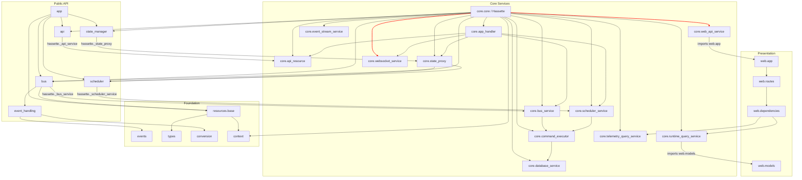

# Hassette Coupling and Dependency Audit

## Executive Summary

Hassette's architecture is well-layered for a framework of its scope. The Resource/Service hierarchy provides a consistent lifecycle model, and the event handling system (predicates, conditions, accessors, dependencies) is cleanly decoupled from the Bus. However, several coupling issues stand out:

1. **The `Hassette` class acts as a God Object**, exposing private service instances that are accessed directly by child resources, creating a hub-and-spoke coupling pattern where nearly every module depends on `Hassette` internals.
2. **User-facing resources (Bus, Scheduler, Api, StateManager) reach through `hassette._private` attributes** to bind to their backing services, breaking encapsulation.
3. **The `core` module imports `web.models`**, creating a reverse dependency from infrastructure to presentation layer.
4. **Global singleton via `context.py`** enables implicit coupling paths that bypass the explicit dependency graph.

Despite these issues, the codebase avoids true circular imports (using `TYPE_CHECKING` guards consistently) and maintains clean separation in the event handling module.

**Finding count**: 2 HIGH, 5 MEDIUM, 2 LOW

---

## Module Dependency Diagram



---

## Findings

### 1. Hassette God Object — Private Attribute Access Pattern

| | |
| --- | --- |
| **Severity** | HIGH |
| **Location** | `core/core.py` (Hassette class), accessed from `bus/bus.py:130`, `scheduler/scheduler.py:136`, `api/api.py:200`, `state_manager/state_manager.py:232`, `core/state_proxy.py:57-60`, `core/app_handler.py:83-99`, `core/api_resource.py:66,90` |

**Description**: The `Hassette` class stores ~15 service children as private attributes (`_bus_service`, `_scheduler_service`, `_api_service`, `_state_proxy`, `_websocket_service`, etc.). User-facing resources reach into these private attributes during their constructors:

- `Bus.__init__` reads `self.hassette._bus_service`
- `Scheduler.__init__` reads `self.hassette._scheduler_service`
- `Api.__init__` reads `self.hassette._api_service`
- `StateManager._state_proxy` reads `self.hassette._state_proxy`

Core services also access sibling private attributes during initialization:

- `StateProxy.on_initialize` waits on `self.hassette._websocket_service`, `_api_service`, `_bus_service`, `_scheduler_service`
- `AppHandler.after_initialize` waits on five private attributes
- `ApiResource._ws_conn` returns `self.hassette._websocket_service`

This creates a hub-and-spoke coupling where every resource implicitly depends on the construction order inside `Hassette.__init__`. Adding, removing, or reordering a service requires understanding every consumer.

**Why it matters**: This pattern makes it impossible to construct or test a Bus, Scheduler, or Api without a fully-wired Hassette instance. It also means that the "private" nature of these attributes is a fiction -- they are part of the de facto public contract.

**Recommendation**: Consider a service locator or explicit constructor injection pattern. Each resource could receive its backing service as a constructor argument via `add_child(Bus, bus_service=self._bus_service)` rather than fishing it out of the Hassette god object. Alternatively, promote the most-accessed services to public properties with proper documentation that they are framework-internal. The current naming convention (`_private` but accessed everywhere) is misleading.

---

### 2. Core Layer Imports Web Models (Reverse Dependency)

| | |
| --- | --- |
| **Severity** | HIGH |
| **Location** | `core/runtime_query_service.py:16-26`, `core/web_api_service.py:9` |

**Description**: `RuntimeQueryService` (a core service) imports response models from `web.models`:

```
from hassette.web.models import (
    AppInstanceResponse, AppManifestListResponse, AppManifestResponse,
    AppStatusChangedPayload, AppStatusResponse, ConnectivityPayload,
    StateChangedPayload, SystemStatusResponse, WsServiceStatusPayload,
)
```

`WebApiService` imports `from hassette.web.app import create_fastapi_app`.

This creates a dependency cycle between the `core` and `web` packages at the module level. Core services should not know about presentation-layer response shapes.

**Why it matters**: This prevents running the core framework without the web layer. It also means changes to API response models can force changes in core services.

**Recommendation**: Extract the shared data shapes into a neutral location (e.g., `core/telemetry_models.py` already exists as a good example). The web layer should own only the serialization adapters (Pydantic response models), while core owns the domain data structures. `RuntimeQueryService` should return domain objects that the web layer maps to response models.

---

### 3. Scheduler Imports Concrete Core Service Type

| | |
| --- | --- |
| **Severity** | MEDIUM |
| **Location** | `scheduler/scheduler.py:114` |

**Description**: The user-facing `Scheduler` resource has a hard runtime import of `from hassette.core.scheduler_service import SchedulerService`. This is not behind a `TYPE_CHECKING` guard -- it is a real runtime dependency from the public API layer into core internals.

Similarly, `Bus` imports `BusService` only under `TYPE_CHECKING` (line 103) but stores it as a runtime attribute (line 123), which is better but still represents tight coupling.

**Why it matters**: The public `Scheduler` cannot be used or understood without knowledge of `SchedulerService`. The import chain is: `scheduler.scheduler` -> `core.scheduler_service` -> `core.commands` -> `bus.listeners`, creating a deep transitive dependency.

**Recommendation**: Use a Protocol or ABC to define the contract that `SchedulerService` fulfills. The `Scheduler` would depend on the protocol, not the concrete class. Alternatively, move the import behind `TYPE_CHECKING` and use string annotations for the type hint (as `Bus` already does for `BusService`).

---

### 4. StateManager Couples Directly to StateProxy (Core Internal)

| | |
| --- | --- |
| **Severity** | MEDIUM |
| **Location** | `state_manager/state_manager.py:9`, `state_manager/state_manager.py:232` |

**Description**: `StateManager` imports `StateProxy` at the module level (`from hassette.core.state_proxy import StateProxy`) and accesses it via `self.hassette._state_proxy`. `DomainStates` (a public-facing collection class) takes a `StateProxy` instance directly in its constructor.

The `StateProxy` is a core internal that manages WebSocket reconnection, polling, and cache invalidation. Exposing it to the public-facing `StateManager` and `DomainStates` leaks these implementation details.

**Why it matters**: User code interacting with `DomainStates` gets an opaque dependency on `StateProxy` internals. Changes to how state caching works could ripple into the public API.

**Recommendation**: Define a read-only Protocol (`StateReader`) with methods `get_state(entity_id) -> dict | None`, `yield_domain_states(domain) -> Iterator`, `num_domain_states(domain) -> int`, and `__contains__`. `StateManager` and `DomainStates` would depend on this Protocol rather than the concrete `StateProxy`.

---

### 5. Global Singleton via context.py Enables Implicit Coupling

| | |
| --- | --- |
| **Severity** | MEDIUM |
| **Location** | `context.py`, used by `core/core.py:85-86`, `resources/base.py` (via cache property) |

**Description**: `context.py` manages global `ContextVar` instances for the `Hassette` instance and config. `Hassette.__init__` calls `context.set_global_hassette(self)`, making the instance available globally without explicit dependency passing.

While ContextVars are appropriate for async task propagation, the pattern enables any code anywhere to call `context.get_hassette()` and bypass the explicit dependency graph. This is used sparingly in production code (mainly `Resource.get_instance()`), but its existence creates a hidden coupling path.

**Why it matters**: Makes it harder to reason about which code depends on which services. In testing, global state requires careful reset (as seen in `test_utils/reset.py`).

**Recommendation**: This is a common pattern in framework code and is managed reasonably here. The main improvement would be to audit all call sites of `context.get_hassette()` and ensure they are limited to framework plumbing, not user-facing code paths. Document the singleton as framework-internal.

---

### 6. Resource Base Class Couples to Hassette Config and Cache

| | |
| --- | --- |
| **Severity** | MEDIUM |
| **Location** | `resources/base.py:164-173` (cache property), `resources/base.py:328` (cleanup) |

**Description**: The `Resource` base class has a `cache` property that directly accesses `self.hassette.config.data_dir` and `self.hassette.config.default_cache_size`. Every Resource in the system (whether it uses caching or not) carries this dependency.

Additionally, `cleanup()` accesses `self.hassette.config.resource_shutdown_timeout_seconds`. The base class makes assumptions about the config structure.

**Why it matters**: This means `Resource` cannot exist without a fully configured `Hassette` instance. It makes lightweight testing of individual resources harder and forces the config contract onto the base class.

**Recommendation**: Consider lazy injection of config values or moving the cache setup to a mixin that only caching-aware resources use. The timeout access in `cleanup()` could use a default with an optional override.

---

### 7. CommandExecutor Has Inline SQL (Persistence Leak)

| | |
| --- | --- |
| **Severity** | MEDIUM |
| **Location** | `core/command_executor.py:318-354`, `core/command_executor.py:381-414`, `core/command_executor.py:517-598` |

**Description**: `CommandExecutor` directly constructs and executes SQL strings, accessing `self.hassette.database_service.db` to run raw SQLite queries. It handles INSERT, ON CONFLICT, executemany, and commit operations directly.

This means the CommandExecutor is tightly coupled to both the database schema (table names, column names, conflict resolution) and the database implementation (aiosqlite API).

**Why it matters**: Any schema migration requires changes in `CommandExecutor`. The class mixes two concerns: command execution/telemetry and data persistence. This makes it harder to swap storage backends or test execution logic independently of the database.

**Recommendation**: Extract the persistence operations into a dedicated repository or data-access class (e.g., `TelemetryRepository`). The `CommandExecutor` would call `self.repository.persist_invocation(record)` rather than building SQL inline. This is consistent with the existing `DatabaseService` abstraction.

---

### 8. Event Handling Module is Well-Decoupled (Positive Finding)

| | |
| --- | --- |
| **Severity** | LOW (positive) |
| **Location** | `event_handling/` (predicates, conditions, accessors, dependencies) |

**Description**: The event handling module is the cleanest part of the architecture from a coupling perspective:

- **Predicates** depend only on `events.base`, `types`, and `const` -- no core or bus imports.
- **Conditions** are pure functions with no framework dependencies.
- **Accessors** depend only on `events` and `const`.
- **Dependencies** depend on `events`, `const`, `types`, and `conversion` -- no core imports.

The Bus imports predicates and accessors but the reverse never happens. This is a textbook dependency inversion.

**Why it matters**: This clean separation means the event handling DSL (`P`, `C`, `A`, `D`) can evolve independently of the bus implementation, and can be tested in isolation.

**Recommendation**: Maintain this pattern. It serves as a model for how other modules could be decoupled.

---

### 9. Listener Dataclass Bridges Bus and Core Layers

| | |
| --- | --- |
| **Severity** | LOW |
| **Location** | `bus/listeners.py`, referenced from `core/bus_service.py`, `core/commands.py` |

**Description**: The `Listener` dataclass lives in `bus/listeners.py` but is consumed by `core/bus_service.py` (routing and dispatch) and `core/commands.py` (InvokeHandler command). The `Listener.db_id` field is set by `BusService._register_then_add_route()`, meaning the core layer mutates a bus-layer object.

This is a minor crossing of module boundaries. The `Listener` effectively serves as a shared data structure between the bus and core layers.

**Why it matters**: The mutation of `Listener.db_id` from core code means the `Listener` class cannot be understood purely from the `bus/` package context. However, this is a pragmatic choice that avoids an unnecessary indirection layer.

**Recommendation**: Consider whether `db_id` should be tracked separately (e.g., in a mapping within `BusService`) rather than mutated on the `Listener` object. This is a minor concern and may not warrant immediate action.

---

## Dependency Depth Analysis

The longest import chains observed:

1. `web.routes.apps` -> `web.dependencies` -> `Hassette` (via `request.app.state`) -> `core.runtime_query_service` -> `web.models` **(circular at module level)**
2. `scheduler.scheduler` -> `core.scheduler_service` -> `core.commands` -> `bus.listeners` -> `bus.injection` -> `conversion`
3. `app.app` -> `bus` -> `event_handling.predicates` -> `events` -> `events.hass.raw`

Chain (1) is the most concerning because it creates a dependency cycle between `core` and `web`. Chains (2) and (3) are linear and represent reasonable layering depth for a framework.

---

## Summary Table

| # | Finding | Severity | Category |
| --- | --- | --- | --- |
| 1 | Hassette God Object -- private attribute access pattern | HIGH | God Object / Encapsulation |
| 2 | Core layer imports web.models (reverse dependency) | HIGH | Layer Violation |
| 3 | Scheduler imports concrete SchedulerService at runtime | MEDIUM | Tight Coupling |
| 4 | StateManager couples directly to StateProxy | MEDIUM | Abstraction Leak |
| 5 | Global singleton via context.py enables implicit coupling | MEDIUM | Implicit Coupling |
| 6 | Resource base class couples to config and cache | MEDIUM | Base Class Bloat |
| 7 | CommandExecutor has inline SQL | MEDIUM | Persistence Leak |
| 8 | Event handling module is well-decoupled (positive) | LOW | Clean Design |
| 9 | Listener bridges bus and core layers | LOW | Minor Boundary Crossing |
