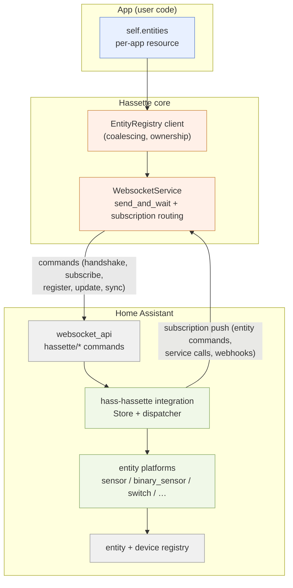

# Companion Integration Architecture (`epic:hacs`)

**Date:** 2026-07-07
**Status:** Decided — decisions recorded below were made with Jessica on 2026-07-07. Transport decision recorded in ADR-0004.
**Anchor issues:** #45 (custom integration), #46 (`@template` decorator), #594 comment on #45 (webhook dependency)

## Problem

Hassette connects to Home Assistant as an external WebSocket/REST client. That surface is
consumer-only. Four capabilities require code running inside HA's process:

1. **Real registry entities** — `sensor`, `binary_sensor`, `switch`, etc. with `unique_id`,
   device association, device class, and unit of measurement. `api.set_state()` entries are
   ephemeral state-machine writes that vanish on HA restart.
2. **Native services** — `hass.services.async_register()` has no WebSocket equivalent, so HA
   automations cannot call `hassette.reload_app` today.
3. **Device registry entries** — devices are created by integrations via `DeviceInfo`; no
   external API exists.
4. **Webhook registration** — `webhook.async_register()` is a Python API only (see the #594
   research comment on #45).

A companion HACS integration (domain `hassette`) closes all four gaps.

## Decisions (2026-07-07)

| # | Decision | Choice |
|---|---|---|
| D1 | Transport | Custom WS commands on hassette's existing HA connection; subscription push for HA→hassette callbacks (ADR-0004) |
| D2 | MQTT Discovery | Ruled out — hassette must not require an MQTT broker |
| D3 | Repo topology | Separate integration repo: **`hass-hassette`** |
| D4 | Protocol source of truth | Shared PyPI package **`hassette-protocol`** (stdlib-only; no pydantic) |
| D5 | Config flow | Single zero-config entry; instances self-identify at handshake |
| D6 | MVP scope (v0.1) | Read-only entities **and** command entities — the callback envelope ships in v0.1 |
| D7 | Framework services | v0.2 (`reload_app`, `start_app`, `stop_app`, trigger) |
| D8 | App-declared services | Deferred — naming/collision design is an open question |
| D9 | Webhook forwarding | Specced here, implemented v0.3+; #594 stays blocked until then |
| D10 | #46 `@template` Stage 1 | Skipped — `@template` ships only integration-backed, never ephemeral |

## Transport analysis

Three candidate shapes (plus MQTT, ruled out by D2):

**T1 — custom WS commands over hassette's existing connection** (the hass-node-red model).
The integration registers `hassette/*` commands via `websocket_api.async_register_command`.
Hassette calls them through `WebsocketService.send_and_wait`, which already provides message-id
correlation and retry. For the reverse direction, hassette opens a connection-scoped
subscription; the integration pushes `event_message` frames over it. Verified against
hass-node-red's `websocket.py`: handlers store cleanup callables in
`connection.subscriptions[msg_id]`, and HA invokes them automatically when the connection
closes — a free liveness signal.

- Auth rides the WS authentication hassette already performs. No new secrets, no pairing.
- Availability is structural: connection drop → subscription cleanup → integration marks that
  instance's entities unavailable. Reconnect → idempotent re-registration.
- Topology-agnostic: identical behavior for Docker, remote host, or the future HA add-on
  (`epic:ha-addon`). Nothing ever needs to reach hassette.
- Cost: `WebsocketService.dispatch` currently assumes every `type: "event"` frame is an HA
  event envelope; it needs a subscription-id routing table (prereq-02).

**T2 — integration registers plain HA services** (the ServEnts/domovoy model). Simpler HA-side
code, and service response values (HA 2023.7+) allow request/response. But there is no
callback channel (HA→hassette falls back to broadcast HA events), no disconnect signal
(stale entities remain "available" indefinitely), and no connect-time version handshake.
Adequate for write-only sensors; wrong foundation for switches, services, and webhooks.

**T3 — hassette hosts a server; the integration connects to it** (option 1 in #45). Strictly
more moving parts than T1 — network reachability configuration, a pairing secret in
`config_flow`, a second reconnect state machine — with no capability T1 lacks.

**Verdict: T1** (D1). A structural consequence worth naming: read-only platforms need only the
hassette→HA direction, while command entities, services, and webhooks all share one HA→hassette
callback envelope. The envelope is designed once (v0.1, per D6) and reused for every later
capability.

## Architecture overview



### Identity model

- **Instance identity (new):** hassette gains a config-level `instance_id` (default
  `"default"`). Today only per-app `instance_name` and the per-run DB `session_id` exist;
  neither is a stable cross-restart identity (prereq-01).
- **unique_id scheme:** `hassette_{instance_id}_{app_key}_{instance_name}_{key}`. Collisions
  are only possible within a single app instance and are raised locally at declaration time.
- **Device grouping:** one hub device per hassette instance (created at handshake), one device
  per app instance with `via_device` pointing at the hub. Entities attach to their app's
  device. This delivers #45's "all hassette entities grouped under a Hassette device with
  app-level sub-grouping" directly.
- **Entity naming:** suggested object id defaults to `hassette_{app_key}_{key}`
  (e.g. `sensor.hassette_climate_controller_comfort_index`); users rename freely in HA since
  identity lives in `unique_id`.

## Protocol design (v1)

All payload shapes, message-type constants, and coercion rules live in `hassette-protocol`.
Protocol version is a single integer; additive changes do not bump it.

### Commands (hassette → HA)

| Command | Payload (abridged) | Purpose |
|---|---|---|
| `hassette/handshake` | `protocol_version`, `hassette_version`, `instance_id`, `instance_name` | Version check; creates/claims the instance hub device. Response carries integration version + supported protocol range. |
| `hassette/subscribe` | — | Opens the callback channel. Integration stores cleanup in `connection.subscriptions`; cleanup marks the instance's entities unavailable. |
| `hassette/entity/register` | `device`, `entities: [...]` (batch) | Upsert entity definitions. Idempotent; definitions persisted in an HA `Store`. |
| `hassette/entity/update` | `updates: [{unique_id, state?, attributes?, available?}]` (batch) | State/attribute/availability push. |
| `hassette/entity/remove` | `unique_ids: [...]` | Explicit removal (app dropped an entity across reload). |
| `hassette/sync` | `unique_ids: [...]` (full set for instance) | Orphan sweep: integration removes registry entries owned by this instance that are absent from the set. Sent after startup settles. |
| `hassette/service/register` | *(v0.2)* service name, fields schema | Framework services first (D7). |
| `hassette/webhook/register` | *(v0.3)* webhook_id, local_only | Per the #594 design constraints recorded on #45. |

### Subscription pushes (HA → hassette)

One envelope, `{kind, ...}`:

- `{kind: "entity_command", unique_id, command, data}` — e.g. `turn_on`, `press`,
  `set_value`, `select_option`.
- `{kind: "service_call", service, data, context}` *(v0.2)*
- `{kind: "webhook", webhook_id, payload}` *(v0.3)*

### Command-entity semantics

Confirmed-by-default: the integration does **not** optimistically flip state on a command; it
forwards the command and waits for the resulting `entity/update`. `assumed_state=True` at
declaration opts into optimistic behavior. Handler dispatch on the hassette side goes through
the same invocation machinery as bus handlers, so command executions get telemetry, error
isolation, and web-UI visibility like every other handler.

### State coercion

HA states are strings (≤255 chars); attributes are JSON. Coercion (`bool` → `on`/`off` for
binary platforms, `float`/`int` → string, `Enum` → value, `None` → unavailable) is defined
once as pure functions in `hassette-protocol` and used by both sides.

## Lifecycle matrix

| Event | Behavior |
|---|---|
| Connection drop | Subscription cleanup fires in HA → all entities of that instance become unavailable. Hassette's existing reconnect loop re-runs handshake + registration on `HASSETTE_EVENT_WEBSOCKET_CONNECTED`. |
| HA restart | Integration loads definitions from `Store`, recreates entities as unavailable with `RestoreEntity` state. Hassette reconnects (existing retry loop) → handshake → re-register → available. |
| Hassette restart (clean) | `before_shutdown` best-effort marks entities unavailable; connection close guarantees it regardless. |
| App reload | App teardown sets its entities unavailable (not removed — reloads are routine; removal would churn HA's registry). Re-init re-registers. Entities dropped from code are removed by explicit `entity/remove` or the post-startup `sync` sweep. |
| App removed from config | `sync` sweep removes its entities and device. |
| Same `instance_id` reconnects while old connection lingers | Takeover: the newer handshake supersedes; the stale connection's cleanup is ignored for superseded instances. |
| Protocol version mismatch | Handshake fails closed: hassette logs an error, disables integration-backed features, and surfaces the status in the web UI; everything else runs normally. |

## `hassette-protocol` package

- **Contents:** message-type constants, protocol version, `TypedDict` payload shapes,
  `StrEnum`s, coercion functions, canonical JSON fixtures per message type.
- **Constraints:** pure Python, zero runtime dependencies, Python ≥3.11. No pydantic — HA
  pins its own pydantic and custom integrations must not import a conflicting one.
- **Validation layering:** the integration validates inbound commands with voluptuous
  (mandatory — `@websocket_command` takes voluptuous schemas); hassette validates inbound
  pushes with its own Pydantic models that reference the shared shapes. Both repos run
  contract tests against the package's fixtures, so drift fails CI on whichever side drifted.
- **Home:** its own repo, so releases version independently and both consumers pin it. The
  integration lists it in `manifest.json` `requirements`; hassette lists it in `pyproject.toml`.

## Hassette-side app API (sketch)

```python
class ClimateApp(App[ClimateConfig]):
    async def on_initialize(self):
        self.comfort = await self.entities.add_sensor(
            key="comfort_index",
            name="Comfort Index",
            unit_of_measurement="°F",
            device_class="temperature",
            state_class="measurement",
        )
        self.boost = await self.entities.add_switch(
            key="boost_mode",
            name="Boost Mode",
            on_command=self.enable_boost,
            off_command=self.disable_boost,
        )
        await self.comfort.set(72.4)
```

- `self.entities` is a per-app child resource (sibling of `self.bus` / `self.scheduler`),
  torn down with the app like every other child.
- Imperative API is the foundation. #46's `@template` decorator becomes sugar over it
  (declaration + scheduled refresh), following the #530 scheduler-decorator pattern, and per
  D10 ships only once this exists.
- State pushes for one instance serialize through a single queue; bursts coalesce naturally
  into batched `entity/update` frames (last write wins per entity within a flush).
- When the integration is absent or the handshake failed, `add_*` raises a specific
  exception at declaration time — no silent no-op entities.

## HA-side integration design

- **Repo `hass-hassette`**, domain `hassette`, single zero-config entry (D5). Instances appear
  dynamically as hub devices under that entry.
- Dynamic entity creation via dispatcher signals to pre-forwarded platforms (the pattern both
  hass-node-red and ServEnts use); `RestoreEntity` for state across HA restarts; definitions
  in an HA `Store` keyed by instance.
- v0.1 platforms: `sensor`, `binary_sensor`, `switch`, `button`, `number`, `select` — the
  four command platforms share the one callback envelope, so their marginal cost is small.
- All `hassette/*` commands use `@require_admin` — entity/service registration is powerful.
  Consequence: hassette's long-lived token must belong to an admin user. Document prominently.
- CI: `hassfest` validation, HACS action, `pytest-homeassistant-custom-component` suite,
  contract tests against `hassette-protocol` fixtures.

## Risks

- **Admin token requirement** — likely already true for most users, but it becomes a hard
  requirement. Docs + a clear handshake error message.
- **State-push storms** — a hot sensor loop could flood HA. Mitigated by per-instance
  batching; if real-world use demands it, add per-entity min-interval throttling later
  (observed-usage rule — don't build it speculatively).
- **HA recorder growth** — every entity update is recorded by HA. Users control this with
  HA's own `recorder` excludes; docs should mention it.
- **Registry churn on reload** — mitigated by unavailable-not-removed semantics (lifecycle
  matrix above).
- **Three-repo coordination** — protocol changes touch up to three repos. Mitigated by the
  additive-change rule (no version bump), contract tests, and the handshake failing closed.

## Testing strategy

- `hassette-protocol`: fixture round-trip tests.
- `hass-hassette`: `pytest-homeassistant-custom-component` unit tests + hassfest + HACS action.
- hassette: unit tests with faked command responses/pushes; **system tier** — install
  `hass-hassette` into the system-test HA container (hassette already runs real HA in Docker),
  giving true end-to-end coverage of register → entity in registry → command → handler →
  state confirmed. Same lever for the demo stack, which doubles as the visual-QA surface for
  any web-UI integration-status display.

## Staging

| Release | Scope |
|---|---|
| v0.1 | Handshake, subscribe, entity register/update/remove/sync; platforms sensor, binary_sensor, switch, button, number, select; availability + restore + orphan sweep; `self.entities` API; HACS-installable (custom repo). |
| v0.2 | Framework services: `hassette.reload_app`, `start_app`, `stop_app`, handler trigger (D7). |
| v0.3 | Webhook forwarding per the #594 constraints (D9); unblocks #594. |
| v0.4+ | #46 `@template` decorator (D10); HACS default-store submission; app-declared custom services once naming is designed (D8). |

## Open questions (deferred by decision)

- **App-declared service naming (D8):** services are flat under domain `hassette`; per-app
  namespacing (`hassette.{app_key}_{name}` vs. free naming + per-instance uniqueness
  validation) needs its own small design before v0.4.
- **Web UI surface:** an integration-status indicator (handshake state, protocol version,
  entity count) and per-app entity lists belong in the monitoring UI eventually; scope when
  v0.1 lands.

## Verify at implementation time

Facts below are stable HA patterns but must be checked against the current HA release when
each prereq starts:

- `websocket_api.async_register_command` / `@websocket_command` / `@require_admin` signatures
  and the `connection.subscriptions` cleanup contract.
- `RestoreEntity` and dynamic `async_add_entities` patterns; `Store` versioning/migration.
- `homeassistant.components.webhook.async_register` import path (the pre-2024.9
  `hass.components` path is deprecated — noted on #45).
- HACS submission requirements and `hacs.json` minimum-HA pin.
- HA service response values API (if used for anything beyond fire-and-forget in v0.2).
