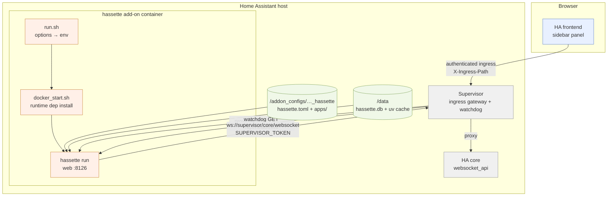

# Home Assistant Add-on Architecture (`epic:ha-addon`)

**Date:** 2026-07-07
**Status:** Decided — decisions recorded below were made with Jessica on 2026-07-07. Packaging decision recorded in ADR-0005.
**Anchor issues:** #71 (add-on umbrella), #616 (`hassette build` — decoupled by D6 below)

## Problem

Hassette ships as a Docker image users must compose themselves: pick a tag, mount `/config`,
`/data`, and `/apps`, paste a long-lived HA access token, and manage restarts. For the large
population running Home Assistant OS or Supervised, none of that is how software gets installed.
They add a repository URL to the add-on store, click Install, and expect:

1. **No token pasting** — the add-on system provides authenticated access to HA.
2. **A sidebar UI** — the monitoring dashboard embedded in the HA frontend, behind HA's login.
3. **Editable config in familiar places** — File Editor / Studio Code Server / Samba.
4. **Supervision** — auto-restart on failure, logs in the Supervisor viewer, backups.

Packaging hassette as an add-on closes all four. This brief records the architecture: what the
add-on system gives us for free, the two real engineering seams (ingress base-path support and
supervisor connection URLs), and the prereq breakdown.

**Terminology note:** HA 2026.2 renamed "Add-ons" to "Apps" in the UI. The Supervisor APIs,
schemas, and developer docs structure are unchanged; this brief uses "add-on" for the packaging
concept to avoid collision with hassette's own "apps" (user automations).

## Decisions (2026-07-07)

| # | Decision | Choice |
|---|---|---|
| D1 | Web UI exposure | Ingress primary (sidebar panel, supervisor-authenticated); optional host port in `config.yaml`, disabled by default |
| D2 | Repo topology | Separate repo **`hassette-addon`** (repository.yaml + one add-on folder) |
| D3 | Image strategy | Derived add-on image `FROM ghcr.io/nodejsmith/hassette:<version>-py3.14`; options translation lives in the add-on's run script |
| D4 | Options scope | Minimal, AppDaemon-style: `log_level` + dep-install toggle. Everything else stays in `hassette.toml` |
| D5 | Config home | `addon_config:rw` map — host `/addon_configs/<repo-id>_hassette/` holds `hassette.toml` + `apps/`, mounted at `/config` in-container (`<repo-id>` is hash-derived from the repository URL, not the repo name; shown in the add-on UI) |
| D6 | #616 `hassette build` | Decoupled from the epic — the supervisor owns the add-on image, so runtime dep install is the only path there; #616 remains a standalone-Docker improvement |
| D7 | Release channels | Stable only in v0.1; an edge add-on (tracking the `main` image tag) is a cheap later addition as a second folder in the same repo |

Technical decisions made in-session (recorded, not user-facing choices):

| # | Decision | Choice |
|---|---|---|
| T1 | Watchdog target | Existing `/api/health/live` — pure liveness (200 while the event loop serves, independent of HA connection), so supervisor restarts never fight hassette's own WS reconnect logic. Readiness (`/api/health/ready`, 503-capable) is deliberately **not** the watchdog target |
| T2 | Ingress port | `ingress_port: 8126` — hassette's existing web port; one server, one port, ingress proxies to it |
| T3 | Base-path mechanism | Per-request `<base href>` injection into `index.html` from the `X-Ingress-Path` header; frontend derives router base, API base, and WS URL from `document.baseURI`; Vite emits relative asset refs. Backend routes stay at `/api/...` unchanged (the supervisor strips the ingress prefix before forwarding) |
| T4 | Supervisor connection | New optional `api_url` / `ws_url` config overrides (general-purpose — also serves reverse-proxy users); the run script sets them to `http://supervisor/core/api` and `ws://supervisor/core/websocket` with `HASSETTE__TOKEN=$SUPERVISOR_TOKEN` |
| T5 | Ingress source guard | New `web_api.allowed_client_ips` allowlist config (default: allow all, today's behavior). The run script restricts to the ingress gateway (`172.30.32.2`) plus loopback when the host port is not mapped, and leaves it open when the user opts into the port |
| T6 | uv cache | `UV_CACHE_DIR=/data/uv_cache` in the add-on — `/data` persists across restarts, so runtime dep installs are warm after the first start |

## What the add-on system gives us for free

The container was shaped for this (the runtime dep-install design in
`design/specs/docker-dep-redesign/design.md` explicitly rejected build-time-only installs
"because the add-on system owns the image"). Grounded against the current image and code:

- **Paths line up exactly.** The image expects `HASSETTE__CONFIG_DIR=/config`,
  `HASSETTE__DATA_DIR=/data`, `HASSETTE__APP_DIR=/apps` (Dockerfile). The add-on `addon_config`
  map mounts at `/config` in-container, and `/data` is the add-on system's private persistent
  volume — included in HA backups, surviving restarts and updates. The telemetry DB already
  defaults to `<data_dir>/hassette.db` → `/data/hassette.db` with zero changes. Apps move under
  config (`HASSETTE__APP_DIR=/config/apps`) so users edit one directory.
- **Logs are already Supervisor-shaped.** Hassette writes no log files — stdout/stderr
  (`PYTHONUNBUFFERED=1`) plus SQLite persistence. The Supervisor log viewer criterion in #71
  needs no work.
- **Multi-arch matches.** CI publishes `linux/amd64,linux/arm64` to ghcr; the add-on spec
  supports exactly `amd64` and `aarch64` (32-bit was dropped). The `image:` key with the
  `{arch}` placeholder points at prebuilt images — no on-device builds.
- **Auth to HA disappears as a user concern.** `homeassistant_api: true` in `config.yaml` gives
  the container `http://supervisor/core/api` (REST) and `ws://supervisor/core/websocket` (WS)
  with `SUPERVISOR_TOKEN` as the credential. Users never create or paste a token.
- **Auth to the web UI disappears as a design gap** *(for the ingress path)*. Hassette's web
  API has no authentication (known audit gap,
  `design/audits/2026-03-25-comprehensive-audit/web-frontend.md`). Under ingress the supervisor
  authenticates the HA user **before** proxying, and hassette only has to refuse non-gateway
  clients (T5). The gap remains for the opt-in direct port (D1) — same trust model as today's
  Docker deployment, documented as such.
- **Supervision.** `boot: auto` restarts on host reboot; the watchdog URL (T1) restarts on
  hang; `startup: application` orders hassette after HA core is up.

## The two engineering seams

### Seam 1 — ingress base-path (the frontend is absolute-path throughout)

Under ingress the browser loads the SPA at `/api/hassio_ingress/<token>/`. Everything the
frontend emits today assumes it lives at `/`:

- Vite `base` defaults to `/` → built asset refs are `/assets/...`, `/fonts/...`
- `frontend/src/api/client.ts`: `BASE_URL = "/api"` (hardcoded)
- `frontend/src/api/endpoints.ts`: `WS_PATH = "/api/ws"`, connected via
  `location.host + WS_PATH`
- `wouter` history routing with absolute routes (`/apps`, `/handlers`, ...)
- `index.html`: absolute icon href

The fix does **not** touch backend route paths. The supervisor strips the ingress prefix before
forwarding, so the backend keeps serving `/api/...`, `/assets/...` as-is; it forwards the
external prefix in the `X-Ingress-Path` request header. The recipe (T3):

1. Backend serves `index.html` through a tiny per-request template step: inject
   `<base href="{X-Ingress-Path or ''}/">`.
2. Vite builds with relative asset refs so they resolve against the injected base on every
   route (not against the current SPA route).
3. Frontend derives everything from `document.baseURI`: `wouter`'s `<Router base=...>`, the
   REST base (`new URL("api/", document.baseURI)`), and the WS URL (same, with the ws/wss
   protocol swap).
4. Direct-port access injects an empty base and behaves exactly as today.

Ingress supports WebSockets and streaming natively, so `/api/ws` works through the proxy
unchanged. Full details and file list in prereq-01.

### Seam 2 — supervisor connection URLs don't follow hassette's URL pattern

Hassette builds its WS URL as `base_url + /api/websocket` (`src/hassette/utils/url_utils.py`).
The supervisor proxy endpoints are `http://supervisor/core/api` and
`ws://supervisor/core/websocket` — the WS path is **not** `<base>/api/websocket`, so
`base_url` alone can't express the pair. T4 adds optional `api_url` / `ws_url` overrides
(useful independently for reverse-proxy setups); when unset, both derive from `base_url` as
today. The run script sets both plus `HASSETTE__TOKEN=$SUPERVISOR_TOKEN`. The WS auth flow is
unchanged — the proxy accepts `SUPERVISOR_TOKEN` in the standard `auth` message. Details in
prereq-02.

## Add-on anatomy (the `hassette-addon` repo)

```
hassette-addon/
├── repository.yaml          # name, url, maintainer
└── hassette/
    ├── config.yaml          # manifest (below)
    ├── Dockerfile           # FROM ghcr.io/nodejsmith/hassette:<version>-py3.14 + run.sh
    ├── run.sh               # options.json + SUPERVISOR_TOKEN → HASSETTE__* env, exec entrypoint
    ├── DOCS.md              # in-store documentation tab
    ├── CHANGELOG.md
    ├── icon.png / logo.png
    └── translations/en.yaml # options UI labels
```

`config.yaml` sketch (spec-current as of Supervisor 2026.04 — no `build.yaml`, explicit `FROM`):

```yaml
name: Hassette
slug: hassette
version: "0.35.0"            # tracks hassette releases (prereq-05 automation)
url: https://github.com/NodeJSmith/hassette
arch: [aarch64, amd64]
image: ghcr.io/nodejsmith/hassette-addon-{arch}
init: false                  # image ships tini as PID 1
startup: application
boot: auto
homeassistant_api: true      # supervisor core proxy + SUPERVISOR_TOKEN
hassio_api: true             # run.sh queries addons/self/info for port-mapping state (T5)
ingress: true
ingress_port: 8126
panel_icon: mdi:robot
panel_title: Hassette
watchdog: http://[HOST]:[PORT:8126]/api/health/live
ports:
  8126/tcp: null             # optional direct access, disabled by default (D1)
ports_description:
  8126/tcp: Web UI/API without ingress (unauthenticated — leave disabled unless you need CLI access)
# no webui: key — with ingress enabled, the info page's "Open Web UI" button routes through
# ingress; a webui: URL would point at the default-unmapped host port and dangle
map:
  - type: addon_config
    read_only: false
options:
  log_level: INFO
  install_requirements: false
schema:
  log_level: list(DEBUG|INFO|WARNING|ERROR)?
  install_requirements: bool?
```

`run.sh` responsibilities (all glue lives here, main image untouched — D3):

1. Read `/data/options.json` (python is in the image; no bashio dependency).
2. Export: `HASSETTE__TOKEN=$SUPERVISOR_TOKEN`, `HASSETTE__API_URL=http://supervisor/core/api`,
   `HASSETTE__WS_URL=ws://supervisor/core/websocket`, `HASSETTE__APP_DIR=/config/apps`,
   `HASSETTE__WEB_API__PORT=8126` (pins the port the ingress proxy targets — env precedence
   forecloses a `hassette.toml` port change silently breaking ingress),
   `HASSETTE__LOGGING__LOG_LEVEL`, `HASSETTE__INSTALL_DEPS`, `UV_CACHE_DIR=/data/uv_cache`.
3. Seed `/config/hassette.toml` and `/config/apps/` with a commented starter on first run.
4. Query `http://supervisor/addons/self/info` — if the 8126 host port is unmapped, export the
   `web_api.allowed_client_ips` restriction (ingress gateway + loopback) (T5).
5. `exec /app/scripts/docker_start.sh` — the existing entrypoint chain (dep install →
   `hassette run`) runs unmodified.

### Architecture overview



## Startup, failure, and the watchdog

The container start sequence is `run.sh → docker_start.sh (dep install) → hassette run`. Two
interactions matter:

- **The install window.** With user deps, the web server is not listening for the 10–30+ s of
  runtime install; ingress shows a gateway error and the watchdog URL fails during that window.
  Mitigations: the warm uv cache on `/data` (T6) makes this a first-start-only cost, and the
  supervisor's watchdog tolerates startup (it acts on an add-on that *was* up). #615 (splash
  screen) remains the UX answer for the first-start gap and stays on this epic.
- **Crash loops.** `design/research/2026-06-16-telemetry-db-rollback-safety/research.md`
  flagged that an external restart policy converts a single fatal exit into a crash loop. The
  supervisor's watchdog is rate-limited — hardcoded to at most 10 restart attempts per
  30-minute window, after which it gives up and leaves the add-on stopped (no exponential
  backoff; see home-assistant discussion #743 and the supervisor's hardcoded throttle). That
  is the desired failure shape: bounded thrash, then visible failure. Liveness-only watchdog
  (T1) keeps "HA connection down" from ever counting as "hassette dead."

## Configuration mapping (D4, D5)

One config language: `hassette.toml` in `/addon_configs/<repo-id>_hassette/`, exactly the file
Docker users write. The options schema stays minimal because every removed option is a support
question avoided — and connection settings, the usual bulk of add-on options, are fully
automatic here (T4).

| Concern | Where it lives | Mechanism |
|---|---|---|
| HA URL + token | nowhere (automatic) | `SUPERVISOR_TOKEN` + proxy URLs via run.sh |
| Log level | options schema | `HASSETTE__LOGGING__LOG_LEVEL` |
| requirements.txt install | options schema | `HASSETTE__INSTALL_DEPS` |
| Apps, per-app config | `hassette.toml` `[hassette.apps]` | unchanged |
| App code + deps (`uv.lock`) | `/config/apps` (host: `addon_configs/.../apps`) | `HASSETTE__APP_DIR` |
| Web port | pinned (not user-settable) | `HASSETTE__WEB_API__PORT=8126` from run.sh — `ingress_port` is baked into the manifest, so the toml must not be able to move the server off it |
| Retention, everything else | `hassette.toml` | unchanged |

Note the precedence guarantee: pydantic-settings source order is init > env > dotenv > secrets
> TOML, so the supervisor-critical values run.sh sets via env (`api_url`, `ws_url`, `token`,
app dir, web port) cannot be overridden into a broken state from `hassette.toml`. DOCS.md
states plainly that the web port is fixed at 8126 inside the add-on.

## What this epic does NOT include

- **#616 `hassette build`** (D6) — supervisor-owned image means runtime install is the add-on
  path, which already exists and was designed for this. #616 stays open for standalone Docker
  users, off this epic.
- **Web UI authentication** — the direct-port path remains unauthenticated by design in v0.1
  (opt-in, documented). A real auth layer is the audit gap's follow-up, not add-on scope.
- **Edge channel** (D7) — deferred; a second folder in `hassette-addon` when wanted.
- **The companion integration** — independent. ADR-0004's transport carries over unchanged:
  hassette still connects *out* to HA's websocket API (now via the supervisor proxy), and the
  `hassette/*` custom commands ride that connection identically. Nothing ever connects to
  hassette, so the add-on's network posture doesn't affect `epic:hacs`.

## Prerequisites

| # | Prereq | Repo | Depends on |
|---|---|---|---|
| 01 | Ingress-ready SPA (base-path support) | hassette | — |
| 02 | Supervisor connection mode (`api_url`/`ws_url` overrides) | hassette | — |
| 03 | Ingress source guard (`web_api.allowed_client_ips`) | hassette | — |
| 04 | Add-on repo skeleton (manifest, Dockerfile, run.sh, docs) | hassette-addon | 01–03 shipped in a hassette release |
| 05 | Release automation (image build, version bump on hassette release) | both | 04 |
| 06 | Docs (installation page, add-on setup, update "not an add-on yet" claims) | hassette | 04 usable end-to-end |

01–03 are independent of each other and can land in any order; they are ordinary hassette PRs
with no add-on dependency. 04 is the first artifact in the new repo and consumes a released
image containing 01–03.

## Open questions (deferred, not blocking)

- **`system_packages`-style options** (apt packages at start, AppDaemon-style): deferred until
  someone needs a compiled dependency that has no wheel. Cheap to add to run.sh later.
- **Ingress + `hassette` CLI**: the CLI targets the web API over HTTP; through ingress it would
  need an HA token and the ingress URL. v0.1 answer: CLI users enable the optional port (D1) or
  exec into the container. A supervisor-aware CLI transport is a possible later nicety.
- **Backup hooks**: `/data` (DB) and `addon_config` are both included in HA backups by default;
  whether the DB should be excluded (`backup_exclude`) to shrink backups is a post-v0.1 tuning
  question.
