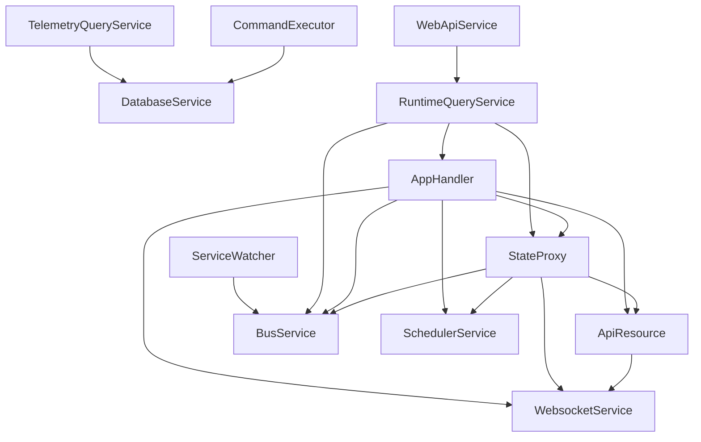

# Design: Resource Dependency Declaration and Initialization Ordering

**Date:** 2026-04-23
**Status:** draft
**Issue:** #69

## Problem

Hassette's service startup ordering is encoded in two disconnected mechanisms:

1. **`_phase_services` in `Hassette.__init__`** — a two-phase dict that ensures DatabaseService starts before everything else. This covers only the database-vs-everything split, not the fine-grained ordering between the other ~15 services.

2. **Manual `wait_for_ready()` calls inside service lifecycle hooks** — each service knows its own dependencies and waits for them imperatively in `on_initialize()` or `after_initialize()`. There is no central view of the dependency graph; it exists only as scattered `wait_for_ready()` calls across 7 files.

This creates several problems:

- **No cycle detection.** A circular dependency between services would deadlock at startup with no diagnostic — each service blocks waiting for the other. Today's graph happens to be acyclic, but there is no validation.
- **No central documentation.** Understanding the startup order requires reading every service's `on_initialize()` method and tracing the `wait_for_ready` calls. The `_phase_services` dict documents only the first split.
- **Duplicate dependency knowledge.** The test harness maintains its own `_DEPENDENCIES` dict and `_STARTUP_ORDER` list, which must be kept manually in sync with the real service code. They can (and do) drift.
- **Inconsistent patterns.** Some services wait for deps in `on_initialize()`, some in `after_initialize()`, and four (`WebApiService`, `BusService`, `SchedulerService`, `FileWatcherService`) wait for `Hassette.ready_event` in `before_initialize()`. Each service reinvents the same wait pattern.
- **No validation of declared deps.** If a service waits for a resource type that doesn't exist in `Hassette.children`, the wait hangs silently until timeout.

## Goals

- Services declare their dependencies via a `depends_on` class attribute — a list of Resource types
- The framework validates the dependency graph at construction time (cycle detection, missing types)
- Dependencies are automatically awaited before a service's `on_initialize()` runs
- All existing manual `wait_for_ready()` calls in lifecycle hooks are replaced by `depends_on` declarations
- The dependency graph is logged at startup for observability
- Shutdown ordering is derived from the dependency graph (reverse of initialization order)
- The test harness remains compatible without requiring structural changes

## Non-Goals

- Changing the fundamental startup sequence in `run_forever()` — database-first and session creation remain explicit Hassette-level orchestration
- Ordered serial startup (services continue to start concurrently; the auto-wait handles ordering)

## Out of Scope (Future Directions)

These are natural extensions of `depends_on` but are explicitly deferred from this PR to limit blast radius. The design must not block them.

- **Dependency injection of service instances** — once `depends_on` declares what a service needs, injecting those instances as attributes (instead of `self.hassette._service_name`) is the obvious next step. This PR establishes the declaration mechanism; DI builds on top of it.
- **App-to-app dependencies** — `depends_on` on `App` subclasses could enable AppDaemon-style `app_dependencies` (e.g., "don't initialize MyApp until HelperApp is ready"). The auto-wait mechanism is designed to work for any `Resource` subclass, including `App`, but the current instance lookup only searches `Hassette.children` — apps live under `AppHandler`. Extending the lookup to include app instances is deferred.

## User Scenarios

### Framework Developer: Adding a New Service

- **Goal:** Register a new service that depends on existing services
- **Context:** Adding a service to `Hassette.__init__` that needs BusService and DatabaseService ready before initialization

#### Declare dependencies and implement initialization

1. **Declare `depends_on` on the new service class**
   - Sees: Other services with `depends_on` declarations as examples
   - Decides: Which services must be ready before this one initializes
   - Then: Lists dependency types in `depends_on` ClassVar; implements `on_initialize()` without any manual `wait_for_ready()` calls

2. **Add the service to Hassette**
   - Sees: The `add_child()` calls in `Hassette.__init__`
   - Decides: Where in the child list to add it (position doesn't affect ordering — `depends_on` handles that)
   - Then: Calls `self.add_child(NewService)` and the framework handles the rest

3. **Cycle introduced accidentally**
   - Sees: `ValueError` at `Hassette.__init__` time with the cycle path printed
   - Decides: Which dependency to remove or refactor
   - Then: Fixes the cycle; startup proceeds

### Framework Developer: Debugging Startup Ordering

- **Goal:** Understand why a service isn't ready when expected
- **Context:** A new service times out during startup

1. **Check the startup log**
   - Sees: The dependency graph logged at INFO level during `__init__`, showing each service and what it depends on
   - Decides: Whether the expected dependency is declared
   - Then: Either adds the missing `depends_on` entry or investigates why the dependency itself isn't becoming ready

## Functional Requirements

1. `Resource` must expose a `depends_on: ClassVar[list[type[Resource]]]` attribute defaulting to `[]`
2. At `Hassette.__init__` time, the framework must compute a topological sort of all children's `depends_on` graphs and raise `ValueError` with a readable cycle path if a cycle exists
3. At `Hassette.__init__` time, the framework must validate that every type referenced in any child's `depends_on` list exists among `Hassette.children` (via `issubclass`); raise `ValueError` naming the declaring class and missing type if not
4. `Resource.initialize()` and `Service.initialize()` must call `_auto_wait_dependencies()` before dispatching to `before_initialize()`, making the auto-wait unbypassable by any subclass override — subclasses do not need to call `super().before_initialize()` for the auto-wait to function
5. The `wait_for_ready` call in auto-wait must use the same timeout and shutdown_event semantics as the existing `Hassette.wait_for_ready()` method
6. If auto-wait returns `False` (timeout or shutdown), the auto-wait must raise `RuntimeError` (timeout case) or call `self.mark_not_ready("shutdown during dependency wait")` and return (shutdown case) — not silently proceed with unready deps
7. The computed dependency graph must be logged at INFO level during `Hassette.__init__` for observability
8. Shutdown must proceed in reverse topological order — services that depend on others shut down first; services depended upon shut down last
9. Runtime `wait_for_ready()` calls (e.g., in `CommandExecutor.register_listener()`) are not replaced — `depends_on` governs initialization and shutdown ordering only
10. `depends_on` is scoped to Hassette-level direct children only — nested child resources (e.g., `AppHandler`'s child `Bus`) are not searched during the auto-wait lookup

## Edge Cases

1. **Service with no `depends_on`** — treated as a root node with no constraints. Starts immediately when `.start()` is called. The auto-wait in `before_initialize()` is a no-op.

2. **Diamond dependency and transitive deps** — A depends on B and C, both of which depend on D. D appears once in the topo sort. The auto-wait for A gathers B, C (not D — transitive deps are handled by B and C's own auto-waits). **Convention: list all services a class directly uses, even if some are transitively covered.** For example, `AppHandler` lists `[WebsocketService, ApiResource, BusService, SchedulerService, StateProxy]` because its `on_initialize()` and `after_initialize()` directly interact with all five — even though `StateProxy.depends_on` already covers four of them. This makes each service's declaration self-documenting: reading `depends_on` tells you what the service uses, not what the graph guarantees.

3. **`depends_on` references a type not in `Hassette.children`** — `ValueError` at `Hassette.__init__` time (FR3). This catches typos and missing `add_child()` calls before any async startup begins.

4. **`depends_on` references a base type when the child is a subclass** — the lookup uses `isinstance()`, so `depends_on = [Service]` matches a `DatabaseService` child. This is intentional for abstract dependency declarations.

5. **Multiple children match a declared dependency type** — the auto-wait waits for ALL matching instances. This handles cases where a base type has multiple concrete children (not currently the case, but correct behavior). A debug-level log is emitted when multiple matches are found.

6. **Self-dependency** — `depends_on = [SelfType]` is caught by cycle detection at `__init__` time (it's a length-1 cycle).

7. **Subclass `before_initialize()` overrides** — Since the auto-wait runs inside `Resource.initialize()` / `Service.initialize()` (both `@final`) before dispatching to `before_initialize()`, subclass overrides of `before_initialize()` do not affect the auto-wait. `WebApiService`, `BusService`, `SchedulerService`, and `FileWatcherService` all override `before_initialize()` without calling `super()` — this is harmless because the auto-wait has already completed by the time their override runs. The `WebApiService.ready_event.wait()` call can be removed since `depends_on = [RuntimeQueryService]` covers the actual dependency.

    **`ready_event.wait()` survivors:** `BusService`, `SchedulerService`, and `FileWatcherService` retain `await self.hassette.ready_event.wait()` in their `before_initialize()` overrides. This is a coordinator-level gate (set by `run_forever()` after Phase 2 start, signaling that all services have been `.start()`ed and the session exists), not a service-to-service dependency. It cannot be expressed via `depends_on` because it gates on a Hassette lifecycle event, not on another service's readiness. These calls are intentionally preserved and documented here to prevent future developers from removing them as "redundant now that `depends_on` handles ordering."

8. **Shutdown requested during auto-wait** — `wait_for_ready()` returns `False` when `shutdown_event` is set. The auto-wait checks `self.hassette.shutdown_event.is_set()` and calls `self.mark_not_ready("shutdown during dependency wait")` before returning — ensuring the service transitions cleanly out of STARTING status for diagnostic clarity.

9. **Test harness `_HassetteMock.wait_for_ready` returns `True` immediately** — the auto-wait calls `self.hassette.wait_for_ready()`, which in tests is the mock's no-op. However, the children lookup (`isinstance` check against `self.hassette.children`) must also succeed. Since `_HassetteMock` injects dependencies as `Mock()` objects not added via `add_child()`, the auto-wait must detect the mock harness and skip the children lookup. A `_skip_dependency_check: bool = False` flag on the hassette instance, set to `True` by `_HassetteMock`, provides this escape hatch — the `wait_for_ready` mock still runs (returning `True`), but the `isinstance` lookup is bypassed. Integration tests that need to validate ordering use the gate pattern with real `asyncio.Event` objects.

10. **`depends_on` on App and AppSync subclasses** — `depends_on` is a `ClassVar` on `Resource` and both `App` and `AppSync` inherit it, so app authors can syntactically declare `depends_on` on their subclasses. The auto-wait mechanism will run (it's in `Resource.initialize()`, before any lifecycle hook dispatch — including `AppSync`'s `@final` thread-routed hooks), but the instance lookup only searches `Hassette.children` — app instances are not Hassette children (they live under `AppHandler`). This means app-level `depends_on` referencing other apps will fail with `RuntimeError` at startup ("no matching child found"). Extending the lookup to include app instances is a future direction (see "Out of Scope" section). For now, app-level `depends_on` referencing framework services (e.g., `depends_on = [DatabaseService]`) would work correctly since those are in `Hassette.children`.

## Acceptance Criteria

- [ ] `Resource` has a `depends_on: ClassVar[list[type[Resource]]] = []` attribute
- [ ] `Hassette.__init__` validates the dependency graph: raises `ValueError` on cycle (with cycle path) and on missing dependency types
- [ ] `Hassette.__init__` logs the dependency graph at INFO level
- [ ] `Resource.initialize()` and `Service.initialize()` call `_auto_wait_dependencies()` before `before_initialize()` — auto-wait is unbypassable by subclass overrides
- [ ] Timeout during auto-wait raises `RuntimeError`; shutdown during auto-wait calls `mark_not_ready()` and returns
- [ ] `CommandExecutor.depends_on = [DatabaseService]` — manual `wait_for_ready` in `on_initialize()` removed
- [ ] `ApiResource.depends_on = [WebsocketService]` — manual `wait_for_ready` in `on_initialize()` removed
- [ ] `StateProxy.depends_on = [WebsocketService, ApiResource, BusService, SchedulerService]` — manual `wait_for_ready` in `on_initialize()` removed
- [ ] `AppHandler.depends_on = [WebsocketService, ApiResource, BusService, SchedulerService, StateProxy]` — manual `wait_for_ready` in `on_initialize()` and `after_initialize()` removed
- [ ] `RuntimeQueryService.depends_on = [BusService, StateProxy, AppHandler]` — manual `wait_for_ready` in `on_initialize()` removed
- [ ] `TelemetryQueryService.depends_on = [DatabaseService]` — manual `wait_for_ready` in `on_initialize()` removed
- [ ] `WebApiService.depends_on = [RuntimeQueryService]` — `ready_event.wait()` in `before_initialize()` removed; `wait_for_ready` in `on_initialize()` removed
- [ ] Runtime `wait_for_ready` calls in `CommandExecutor.register_listener()` and `register_job()` are preserved (not part of `depends_on` scope)
- [ ] `_phase_services` dict and `StartupPhase` enum removed from startup path (breaking change documented in commit message)
- [ ] Shutdown proceeds in reverse topological order
- [ ] Existing test suite passes, with required updates to `tests/integration/test_core.py` phase-specific tests (4 tests that import `StartupPhase` and access `_phase_services` must be rewritten)
- [ ] New unit tests for `topological_sort()` (chain, diamond, cycle, self-dep, empty, stable ordering)
- [ ] New unit tests for auto-wait logic (empty deps, found dep, missing dep, subclass match, multiple match, harness skip flag)
- [ ] New integration test validating startup ordering via gate pattern
- [ ] New integration test validating shutdown ordering (reverse of init order)

## Dependencies and Assumptions

- Assumes each service type appears at most once in `Hassette.children` (true today; the design handles multiple matches but doesn't require them)
- `Resource.initialize()` and `Service.initialize()` are both `@final` — adding `_auto_wait_dependencies()` before the lifecycle hooks is safe and unbypassable
- `_HassetteMock` must set `_skip_dependency_check = True` to bypass the children lookup in tests
- `Service.initialize()` calls `_auto_wait_dependencies()` before `before_initialize()` and before the serve task is spawned — the auto-wait blocks at the right point in the lifecycle

## Architecture

### Dependency Graph (Current State — Implicit)



This graph is currently encoded as scattered `wait_for_ready()` calls. After this change, it is declared via `depends_on` on each service class and validated at construction time.

### `depends_on` ClassVar on Resource

Add to `src/hassette/resources/base.py`, in the `Resource` class body alongside existing ClassVars (`role`, `source_tier`):

```python
depends_on: ClassVar[list[type["Resource"]]] = []
```

Services override this with their specific dependencies:

```python
class CommandExecutor(Resource):
    depends_on: ClassVar[list[type[Resource]]] = [DatabaseService]
```

### `topological_sort()` in `service_utils.py`

Add to `src/hassette/utils/service_utils.py` alongside the existing `wait_for_ready()` function.

Input: `list[type[Resource]]` — the set of resource types to sort.
Output: `list[type[Resource]]` — types in valid initialization order.
Raises: `ValueError` with a human-readable cycle path on cycle detection.

Implementation: iterative DFS with three-color marking (WHITE/GRAY/BLACK). Gray-to-gray edge detection identifies cycles. Produces a reverse-postorder traversal.

Why iterative DFS over Kahn's algorithm: Kahn's detects cycles but doesn't produce the cycle path — it only reports "cycle exists." Iterative DFS with an explicit `path` stack (parallel to the work stack) can reconstruct the exact cycle when a back edge is detected. Note: gray nodes alone are insufficient for path reconstruction in iterative DFS (unlike recursive DFS where the call stack serves this purpose) — the explicit path stack is required. The cycle path is critical for developer diagnostics.

### Auto-Wait in `Resource.initialize()` / `Service.initialize()`

The auto-wait runs inside the `@final` `initialize()` methods — before dispatching to `before_initialize()`. This makes it unbypassable by any subclass override, eliminating the entire class of "forgot to call `super().before_initialize()`" bugs.

In `Resource.initialize()` (and mirrored in `Service.initialize()`):

```python
@final
async def initialize(self) -> None:
    # ... existing preamble ...
    await self.handle_starting()

    try:
        try:
            await self._auto_wait_dependencies()  # <-- NEW: runs before any lifecycle hook
        except Exception as exc:
            await self.handle_failed(exc)
            raise
        await self._run_hooks([self.before_initialize, self.on_initialize, self.after_initialize])
        # ...
```

The `_auto_wait_dependencies()` method:

```python
async def _auto_wait_dependencies(self) -> None:
    if not self.depends_on:
        return
    if getattr(self.hassette, '_skip_dependency_check', False):
        return

    deps: list[Resource] = []
    for dep_type in self.depends_on:
        matches = [c for c in self.hassette.children if isinstance(c, dep_type)]
        if not matches:
            raise RuntimeError(
                f"{self.class_name} declares depends_on=[{dep_type.__name__}] "
                f"but no matching child found in Hassette"
            )
        deps.extend(matches)

    ready = await self.hassette.wait_for_ready(deps)
    if not ready:
        if self.hassette.shutdown_event.is_set():
            self.mark_not_ready("shutdown during dependency wait")
            return
        not_ready = [d.class_name for d in deps if not d.is_ready()]
        raise RuntimeError(
            f"{self.class_name} timed out waiting for dependencies: "
            f"{', '.join(not_ready)}"
        )
```

**Why `initialize()` and not `before_initialize()`:** Four existing services (`WebApiService`, `BusService`, `SchedulerService`, `FileWatcherService`) override `before_initialize()` without calling `super()`. Placing the auto-wait in `initialize()` (which is `@final`) makes it impossible for any subclass to skip the dependency check — no `super()` contract to enforce, no footgun to document.

**Why on `Resource` base and not `Service`:** Both `Resource.initialize()` and `Service.initialize()` are updated. The mechanism works for both types, and future plain `Resource` subclasses (including `App` subclasses) can use `depends_on` too.

**Harness escape hatch:** `_skip_dependency_check` is checked before the children lookup. `_HassetteMock` sets this to `True`, allowing the auto-wait to be bypassed entirely in tests. The mock's `wait_for_ready` (which returns `True` immediately) is never reached — the check exits before that. This is correct because the harness controls lifecycle explicitly.

### Graph Validation in `Hassette.__init__`

After all `add_child()` calls, validate the dependency graph:

```python
from hassette.utils.service_utils import topological_sort

# Preserve insertion order (deterministic); deduplicate via dict.fromkeys
all_types = list(dict.fromkeys(type(c) for c in self.children))

# Validate: every depends_on reference must exist among children
for child_type in all_types:
    for dep_type in child_type.depends_on:
        if not any(issubclass(t, dep_type) for t in all_types):
            raise ValueError(
                f"{child_type.__name__} declares depends_on=[{dep_type.__name__}] "
                f"but no matching child type found in Hassette"
            )

# Validate: no cycles; store result for shutdown ordering
self._init_order = topological_sort(all_types)  # raises ValueError on cycle
```

Log the graph at INFO level:

```
Resource dependency graph:
  CommandExecutor -> [DatabaseService]
  ApiResource -> [WebsocketService]
  StateProxy -> [WebsocketService, ApiResource, BusService, SchedulerService]
  ...
```

### Startup Sequence Changes in `run_forever()`

The fundamental two-phase structure is preserved because session creation must happen between database readiness and other service startup — this is a Hassette-level orchestration concern, not a service dependency:

```python
# Phase 1: Database (unchanged)
self._database_service.start()
await self.wait_for_ready([self.database_service], timeout=...)
await self._session_manager.mark_orphaned_sessions()
await self._session_manager.create_session()

# Phase 2: Everything else (simplified)
for child in self.children:
    if child is not self._database_service:
        child.start()

# ready_event and wait_for_ready(all) — unchanged
self.ready_event.set()
started = await self.wait_for_ready(list(self.children), timeout=...)
```

**What changes:** `_phase_services` dict and `StartupPhase` enum are removed. The database-first logic becomes a direct conditional instead of a dictionary lookup. The validation block that checks all children are assigned to exactly one phase is no longer needed.

**What doesn't change:** Services still start concurrently in Phase 2. The auto-wait in `initialize()` handles ordering within that concurrent start. The global `wait_for_ready(all_children)` timeout catches any service that fails to become ready.

### Shutdown Ordering

Shutdown proceeds in reverse topological order — the reverse of `self._init_order` computed at `__init__` time. Services that depend on others shut down first; services depended upon (like `DatabaseService`) shut down last.

The existing `_finalize_shutdown()` uses `asyncio.gather` for concurrent shutdown, which cannot guarantee completion order. Instead of replacing the gather, override `_ordered_children_for_shutdown()` (not `@final`) on `Hassette` to return instances in reverse topo order:

```python
def _ordered_children_for_shutdown(self) -> list[Resource]:
    type_to_instance = {type(c): c for c in self.children}
    return [type_to_instance[t] for t in reversed(self._init_order) if t in type_to_instance]
```

This feeds the existing `_finalize_shutdown()` machinery (which iterates the list and calls `shutdown()` on each child, with `asyncio.gather(..., return_exceptions=True)` for error isolation). The `isinstance`-based lookup used elsewhere is not needed here — `_init_order` contains exact types from `type(c)`, so direct dict lookup is correct.

The existing `Hassette.on_shutdown()` pre-sequence (`CommandExecutor` before `DatabaseService`) becomes redundant once the graph is correct — `CommandExecutor.depends_on = [DatabaseService]` produces the same ordering. Remove the explicit pre-sequence and let the graph handle it.

**Timeout interaction:** The existing per-resource shutdown timeout is unchanged. The graph ordering only affects the sequence, not the timeout budget.

### Service Migrations

Each migration follows the same pattern:

1. Add `depends_on: ClassVar[list[type[Resource]]] = [...]` to the class body
2. Remove `await self.hassette.wait_for_ready(...)` from `on_initialize()` / `after_initialize()`
3. Add required imports (`ClassVar` from `typing`, dependency types)

| Service | `depends_on` | Removed from | Notes |
|---------|-------------|--------------|-------|
| CommandExecutor | `[DatabaseService]` | `on_initialize()` | Keep runtime waits in `register_listener()` / `register_job()` |
| ApiResource | `[WebsocketService]` | `on_initialize()` | |
| StateProxy | `[WebsocketService, ApiResource, BusService, SchedulerService]` | `on_initialize()` | 4 deps, was the largest wait call |
| AppHandler | `[WebsocketService, ApiResource, BusService, SchedulerService, StateProxy]` | `on_initialize()` + `after_initialize()` | `after_initialize()` had a separate 5-dep wait with a warning log on failure; the warning is no longer needed since auto-wait raises on timeout |
| RuntimeQueryService | `[BusService, StateProxy, AppHandler]` | `on_initialize()` | `run_web_api` early-return preserved in `on_initialize()` |
| TelemetryQueryService | `[DatabaseService]` | `on_initialize()` | WAL mode validation stays after the wait is removed |
| WebApiService | `[RuntimeQueryService]` | `before_initialize()` + `on_initialize()` | Remove `ready_event.wait()` from `before_initialize()`; no `super()` fix needed (auto-wait runs in `initialize()`) |
| ServiceWatcher | `[BusService]` | _(none — no existing wait)_ | Subscribes to bus events in `on_initialize()`; needs BusService ready |

**Services not in the migration table:**

- **`EventStreamService`** — has a *constructor-time* dependency: `BusService.__init__` receives `EventStreamService.receive_stream` at `Hassette.__init__` time. This is a structural ordering constraint enforced by child registration order (`add_child(EventStreamService)` before `add_child(BusService)`), not by runtime readiness. `depends_on` cannot express constructor-time dependencies. This ordering is correct by construction and documented here.
- **`SessionManager`**, **`WebUiWatcherService`** — no runtime service dependencies; included in the topo sort as root nodes.

### AppHandler `after_initialize()` Simplification

Current code:

```python
async def after_initialize(self) -> None:
    if not await self.hassette.wait_for_ready(
        [ws, api, bus, scheduler, state_proxy]
    ):
        self.logger.warning("Dependencies never became ready; skipping app startup")
        return
    self.task_bucket.spawn(self.lifecycle.bootstrap_apps())
```

With `depends_on`, all five deps are guaranteed ready by `before_initialize()`. The `after_initialize()` simplifies to:

```python
async def after_initialize(self) -> None:
    self.logger.debug("Scheduling app initialization")
    self.task_bucket.spawn(self.lifecycle.bootstrap_apps())
```

The warning log is no longer needed because auto-wait raises `RuntimeError` on timeout instead of returning `False`.

### `run_web_api` Config — Unchanged

`RuntimeQueryService` and `TelemetryQueryService` have early-return guards for `config.run_web_api=False` in `on_initialize()`. These are preserved as-is. The auto-wait runs in `initialize()` before `on_initialize()`, so both services will wait for their declared deps even when `run_web_api=False`. This is acceptable: the auto-wait is event-driven and returns immediately if deps are already ready, which they will be in any normal startup. Removing the `run_web_api` config option is tracked as a separate follow-up PR to avoid coupling a config migration with this structural refactor.

### Harness Compatibility

The test harness (`HassetteHarness`) requires one small change:

- **`_HassetteMock._skip_dependency_check = True`** — set in `_HassetteMock.__init__`. This causes `_auto_wait_dependencies()` to return immediately, bypassing the `isinstance` children lookup that would fail against mock objects. The mock's `wait_for_ready` is never reached.
- **`_DEPENDENCIES` dict** stays as-is for the harness's own startup ordering. A pytest test (`tests/unit/test_harness_dependency_consistency.py`) validates that harness `_DEPENDENCIES` entries are consistent with real service `depends_on` ClassVars, preventing silent drift.
- **`_STARTUP_ORDER` list** stays as-is.
- **Minimal structural impact** — only the `_skip_dependency_check` flag is added to `_HassetteMock`.

### `StartupPhase` Removal

`StartupPhase` is defined in `src/hassette/types/enums.py` and referenced only in:
- `src/hassette/types/__init__.py` (import and `__all__` export)
- `src/hassette/core/core.py` (import and `_phase_services` dict)

Since it's exported in the public `types` module, removing it is a breaking change. However, the project is pre-1.0, `StartupPhase` is an internal framework enum with no user-facing purpose, and there are no known external consumers. The enum is removed from `enums.py`, `__init__.py`, and `core.py`. The commit message includes a `BREAKING CHANGE:` footer and a CHANGELOG entry documents the removal.

## Alternatives Considered

### Topo-sorted serial startup (start services one at a time in dependency order)

Would guarantee deps are ready before dependents start, eliminating the need for `wait_for_ready` entirely. But `Service.initialize()` spawns a background serve task and returns — services are designed for concurrent startup. Serial startup would be slower and fight the existing architecture.

### Auto-wait in `before_initialize()` instead of `initialize()`

Would be the natural lifecycle hook for pre-initialization work. But four existing services (`WebApiService`, `BusService`, `SchedulerService`, `FileWatcherService`) override `before_initialize()` without calling `super()`. Placing the auto-wait there would require either (a) fixing all four to call `super()` and documenting a contract that's easy to forget, or (b) accepting that the auto-wait is silently skippable. Placing it in `initialize()` (which is `@final`) eliminates the entire class of footgun.

### Auto-wait in `on_initialize()` instead of `initialize()`

Would keep `initialize()` untouched. But `on_initialize()` is the hook where services do their actual setup work — injecting a wait at the top is less clean. Also, services might call `self.bus.on()` in `on_initialize()`, which could race with the wait if placed after other setup code.

### `__init_subclass__` guard to block `depends_on` on App subclasses

Could use `__init_subclass__` on `App` to raise `TypeError` if `depends_on` is declared non-empty. This would enforce the "apps don't need `depends_on`" stance. But app-to-app dependencies are a planned future direction (see "Out of Scope"), so blocking the declaration would require removing the guard later. Instead, `depends_on` on App subclasses is allowed — it works for framework service dependencies (which are in `Hassette.children`) and will be extended for app-to-app dependencies in the future.

### Derive harness ordering from `depends_on` at runtime

The harness could read `depends_on` from real service classes and derive its `_DEPENDENCIES` and `_STARTUP_ORDER` automatically. But the harness creates a different set of mock resources (e.g., `api_mock` instead of `ApiResource`), so the mapping would be fragile. Keeping the harness's own ordering is simpler and more explicit.

### Remove `ready_event` entirely

`ready_event` is set after Phase 2 start but before all services are ready. With `depends_on`, no service needs to wait for `ready_event` — they wait for specific deps instead. However, `ready_event` may be used by user code or external integrations. Keep it for now; removal is a separate concern.

## Test Strategy

### Unit Tests

**`tests/unit/test_topological_sort.py`** — algorithm correctness:
- Linear chain `A → B → C` returns `[C, B, A]` (deps before dependents)
- Diamond `A → {B, C} → D` deduplicates D, returns valid order
- Empty list returns empty
- Cycle `A → B → A` raises `ValueError` with readable path including both nodes
- Self-dependency `A → A` raises `ValueError`
- Disconnected components (nodes with no deps) are included in output
- Stable ordering for nodes at the same depth

**`tests/unit/test_resource_depends_on.py`** — auto-wait logic:
- `depends_on = []` — `_auto_wait_dependencies()` completes without calling `wait_for_ready`
- `depends_on = [SomeDep]` — calls `hassette.wait_for_ready` with correct instance
- `depends_on` references missing type — raises `RuntimeError` with actionable message
- Subclass matching — `depends_on = [BaseType]` finds `ConcreteSubclass` child
- Multiple matches — all matching instances are waited on
- Timeout — raises `RuntimeError` when `wait_for_ready` returns `False` and shutdown not set
- Shutdown — returns silently when `wait_for_ready` returns `False` and shutdown is set

**`tests/unit/test_harness_dependency_consistency.py`** — drift prevention:
- Requires a `_COMPONENT_CLASS_MAP: dict[str, type[Resource]]` constant in `harness.py` mapping harness string names (e.g., `"bus"` → `BusService`, `"api_mock"` → `ApiResource`) to real service classes
- For each entry in harness `_DEPENDENCIES`, verify the corresponding real service class has a matching `depends_on` declaration
- Note: the test is one-directional by design — harness `_DEPENDENCIES` is an intentional coarser subset of real `depends_on` (e.g., harness doesn't mock WebsocketService or SchedulerService)
- Fails immediately when `depends_on` is updated without updating the harness

### Integration Tests

**`tests/integration/test_resource_deps.py`** — ordering enforcement:
- Use `asyncio.Event` gate pattern to simulate a dependency that blocks, then unblocks
- Verify that a service with `depends_on = [GatedService]` does not proceed to `on_initialize()` until the gate is released
- Verify that a service without `depends_on` proceeds immediately
- Verify that `Hassette.__init__` raises `ValueError` when a cycle is introduced
- Verify that `Hassette.__init__` raises `ValueError` when `depends_on` references a missing type
- Verify shutdown proceeds in reverse topological order (dependents shut down before their dependencies)

### Existing Tests

All existing tests must pass. Four tests in `tests/integration/test_core.py` that directly import `StartupPhase` and access `_phase_services` must be rewritten to assert the new invariant (database starts first via direct conditional, topological sort completes without raising). The auto-wait is a no-op in the test harness (`_skip_dependency_check = True`), so other existing test behavior is preserved.

## Documentation Updates

- **`docs/pages/core-concepts/index.md`** — add "Service Dependency Graph" section explaining `depends_on`, how it controls initialization order, what happens on cycle detection, and a mermaid diagram of the framework's dependency graph
- **Docstring on `Resource.depends_on`** — one-line description with usage example

No frontend changes — this feature adds no new database fields, API endpoints, or UI elements.

## Impact

**Files modified:**
- `src/hassette/resources/base.py` — add `depends_on` ClassVar, `_auto_wait_dependencies()`, call from `Resource.initialize()` and `Service.initialize()`
- `src/hassette/utils/service_utils.py` — add `topological_sort()` function
- `src/hassette/utils/__init__.py` — export `topological_sort`
- `src/hassette/core/core.py` — add graph validation + missing-type check, store `_init_order`, remove `_phase_services`/`StartupPhase`, simplify Phase 2 startup, use reverse topo order for shutdown
- `src/hassette/core/command_executor.py` — add `depends_on`, remove `wait_for_ready` from `on_initialize()`
- `src/hassette/core/api_resource.py` — add `depends_on`, remove `wait_for_ready` from `on_initialize()`
- `src/hassette/core/state_proxy.py` — add `depends_on`, remove `wait_for_ready` from `on_initialize()`
- `src/hassette/core/app_handler.py` — add `depends_on`, remove both `wait_for_ready` calls, simplify `after_initialize()`
- `src/hassette/core/runtime_query_service.py` — add `depends_on`, remove `wait_for_ready` from `on_initialize()`
- `src/hassette/core/telemetry_query_service.py` — add `depends_on`, remove `wait_for_ready` from `on_initialize()`
- `src/hassette/core/web_api_service.py` — add `depends_on`, remove `ready_event.wait()` from `before_initialize()`, remove `wait_for_ready` from `on_initialize()`
- `src/hassette/types/enums.py` — remove `StartupPhase` enum
- `src/hassette/types/__init__.py` — remove `StartupPhase` from imports and `__all__`
- `src/hassette/core/service_watcher.py` — add `depends_on = [BusService]`
- `src/hassette/test_utils/harness.py` — add `_skip_dependency_check = True` to `_HassetteMock`, add `_COMPONENT_CLASS_MAP`
- `tests/integration/test_core.py` — rewrite 4 tests that reference `StartupPhase` / `_phase_services`
- `docs/pages/core-concepts/index.md` — add dependency graph section

**New files:**
- `tests/unit/test_topological_sort.py`
- `tests/unit/test_resource_depends_on.py`
- `tests/unit/test_harness_dependency_consistency.py`
- `tests/integration/test_resource_deps.py`

**Blast radius:** `Resource.initialize()` and `Service.initialize()` are the highest-risk changes — adding `_auto_wait_dependencies()` before the lifecycle hook dispatch affects every Resource and Service subclass. Mitigation: the auto-wait is a no-op when `depends_on` is empty (which it is by default), and the harness skips it entirely via `_skip_dependency_check`.

**Breaking changes:** `StartupPhase` is removed from the public `types` module. The project is pre-1.0 with no known external consumers. Documented via `BREAKING CHANGE:` footer in the commit message.

## Timeout Interaction

The auto-wait timeout and the outer `wait_for_ready(all_children)` timeout in `run_forever()` both use `startup_timeout_seconds`. In the slow-dependency case, the sequence is:

1. Auto-wait blocks for up to `startup_timeout_seconds`
2. If timeout, `_auto_wait_dependencies()` raises `RuntimeError`
3. The try/except wrapping the auto-wait call in `initialize()` catches the exception and calls `handle_failed(exc)`, transitioning the service to FAILED status
4. The outer `wait_for_ready(all_children)` detects the FAILED service (it never called `mark_ready()`) and returns `False` immediately — it does not re-wait the full timeout

Note: `_auto_wait_dependencies()` runs *before* `_run_hooks()`, so it has its own try/except that calls `handle_failed()` — it does not rely on `_run_hooks`'s error handling.

So the worst-case startup failure window is `startup_timeout_seconds` + a small constant (the outer wait's detection loop), not `2 × startup_timeout_seconds`.

## Restart Behavior

`Resource.restart()` calls `shutdown()` then `initialize()`. After this PR, `initialize()` runs `_auto_wait_dependencies()` before any hooks. Under degraded operation (e.g., HA disconnected), `ServiceWatcher` may restart a failed service whose deps are themselves in FAILED or STARTING state. Each restart attempt blocks for up to `startup_timeout_seconds` before timing out. This is the intended behavior — the auto-wait uses the same timeout for both startup and restart, and the `ServiceWatcher` respects its own retry backoff independently. A future optimization could thread a shorter timeout into `_auto_wait_dependencies()` for the restart path.

## Shutdown Detection Scope

The auto-wait checks `self.hassette.shutdown_event` (global) to detect shutdown during dependency waiting. It does not check `self.shutdown_event` (per-resource). If external code calls `resource.request_shutdown()` while `_auto_wait_dependencies()` is blocking, the auto-wait will not detect it and will continue blocking until timeout or global shutdown. This is acceptable — `ServiceWatcher.restart()` calls `shutdown()` before `initialize()`, so the per-resource event is cleared at the start of `initialize()`. Per-resource shutdown during initialization is not a supported use case.

## Open Questions

None — all design decisions resolved.
