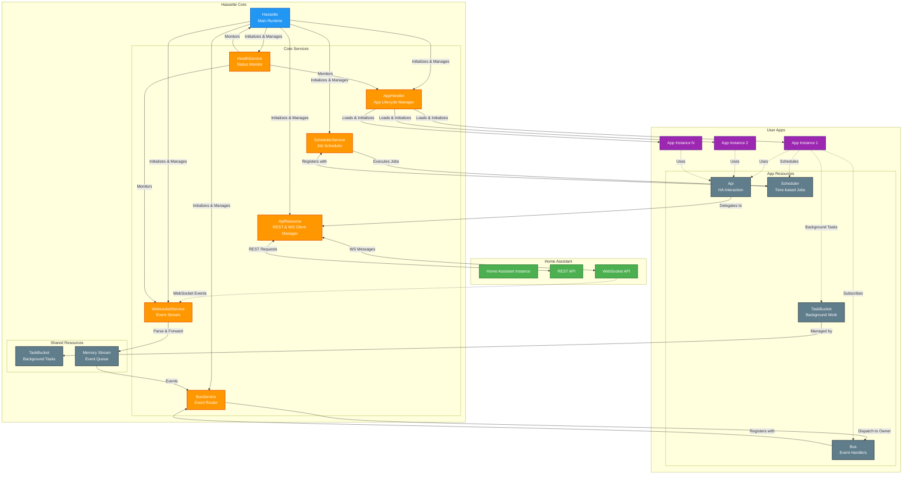

# Hassette Architecture Overview

This diagram provides a high-level overview of how Hassette components fit together.

## Component Descriptions

### Home Assistant
- **Home Assistant Instance**: The external Home Assistant server that Hassette connects to
- **REST API**: HTTP endpoints for querying states, calling services, etc.
- **WebSocket API**: Real-time event stream for state changes and system events

### Hassette Core
- **Hassette**: Main runtime that initializes and coordinates all services and resources
- **WebsocketService**: Maintains WebSocket connection to Home Assistant, receives all events
- **ApiResource**: Manages HTTP client and WebSocket for API calls (shared by all apps)
- **BusService**: Routes incoming events to appropriate app handlers based on subscriptions
- **SchedulerService**: Executes time-based and cron-style jobs for all apps
- **AppHandler**: Discovers, loads, and manages the lifecycle of user apps
- **HealthService**: Monitors system health and service status
- **Memory Stream**: Internal queue for passing events from WebSocket to BusService
- **TaskBucket**: Manages background tasks with proper lifecycle and cleanup

### User Apps
- **App Instances**: User-defined automation apps (e.g., lighting controller, notification handler)
- **Api**: Per-app interface for calling Home Assistant services, querying states, etc.
- **Bus**: Per-app event bus for subscribing to state changes and other events
- **Scheduler**: Per-app scheduler for time-based automations
- **TaskBucket**: Per-app background task manager

## Data Flow

### Event Flow (Home Assistant → Apps)
1. Home Assistant emits an event (e.g., light state change)
2. WebsocketService receives the event via WebSocket
3. Event is parsed and sent to Memory Stream
4. BusService reads from stream and routes to subscribed apps
5. App's Bus resource invokes registered handler functions

### API Flow (Apps → Home Assistant)
1. App calls method on its Api resource (e.g., `turn_on_light()`)
2. Api delegates to shared ApiResource
3. ApiResource sends REST request or WebSocket message
4. Home Assistant processes the request
5. Response returned to app

### Scheduling Flow
1. App registers job with its Scheduler resource (e.g., "run daily at 6 AM")
2. Scheduler registers with shared SchedulerService
3. SchedulerService executes job at scheduled time
4. Job runs in app's context with proper error handling

## Key Design Principles

1. **Async-First**: All I/O operations are async for efficient concurrency
2. **Resource Hierarchy**: Services and resources form a tree with clear ownership
3. **Event-Driven**: Apps react to Home Assistant events via the event bus
4. **Type Safety**: Strong typing throughout with Pydantic models and TypeVars
5. **Isolation**: Each app has its own resource instances for clean separation
6. **Shared Infrastructure**: Common services (WebSocket, HTTP client) are shared for efficiency
