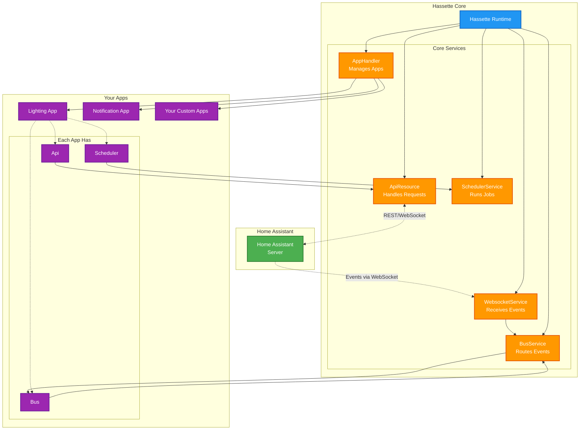

# Hassette Architecture

A high-level overview of how Hassette connects your apps to Home Assistant.

## How It Works

### Event Flow (Home Assistant → Your Apps)
1. **Home Assistant** emits events (state changes, service calls, etc.)
2. **WebsocketService** maintains connection and receives all events
3. **BusService** routes events to apps that subscribed to them
4. Your app's **Bus** resource delivers events to your handler functions

### API Flow (Your Apps → Home Assistant)
1. Your app calls methods on its **Api** resource (turn on lights, get states, etc.)
2. **ApiResource** sends the request to Home Assistant
3. Response comes back to your app

### Scheduling
1. Your app schedules jobs via its **Scheduler** resource
2. **SchedulerService** executes jobs at the right time
3. Your scheduled function runs

### App Management
- **AppHandler** discovers, loads, and initializes your apps from config
- Each app gets its own **Api**, **Bus**, and **Scheduler** instances
- Apps are isolated from each other but share the core infrastructure

## Key Concepts

- **Hassette Runtime**: Coordinates everything and manages the lifecycle
- **Core Services**: Shared infrastructure (WebSocket, API client, event routing, scheduling)
- **Your Apps**: Where you write automation logic using simple, typed APIs
- **App Resources**: Each app has dedicated Api, Bus, and Scheduler for clean separation
