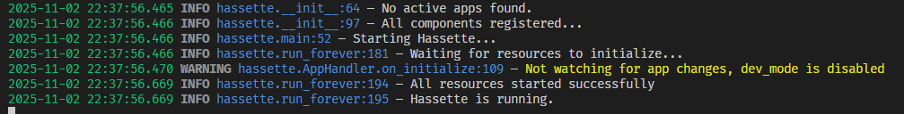
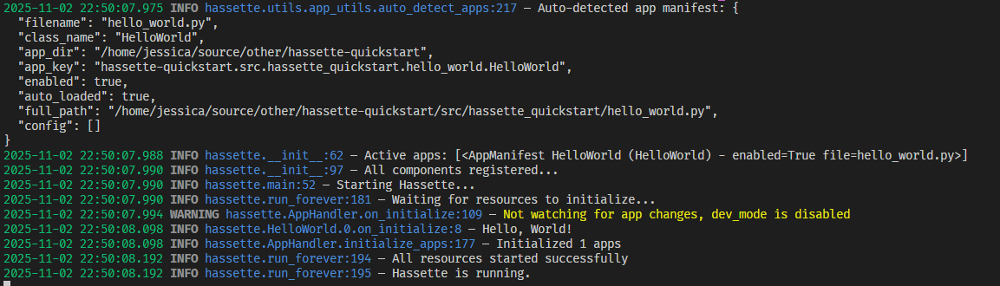
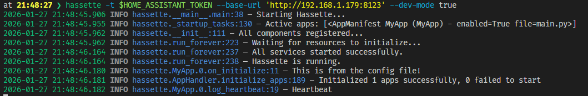

Getting Started
===============

This guide will help you set up Hassette with a simple app in a local environment. A Docker compose guide is coming soon.

.. note::

    There is a Docker Compose `example file in the meantime <https://github.com/NodeJSmith/hassette/blob/main/examples/docker-compose.yml>`_ you can use as a starting point.

Prerequisites
-------------
- A running Home Assistant instance with WebSocket API access
- A long-lived access token from your HA profile
- `uv <https://docs.astral.sh/uv/>`_ installed

Overview
--------

Hassette requires very little to get started: a Home Assistant URL and an access token. You will probably also want an app (it won't do much without one).

.. tip::
   **Should I create a package?**

   If you plan to import your apps from other files or use `isinstance` checks between apps, create a proper Python package with `__init__.py` files. This guide shows the package approach, but you can also just create `.py` files in a directory if your needs are simpler.

1) Create a directory and package for your apps

``uv`` is what I use so that is what I'm showing in the example - if you have your own preferences for project structure, feel free to adapt accordingly.

.. code-block:: bash

    mkdir hassette_apps # create a directory for your apps
    cd hassette_apps

    uv init --lib # create a package named 'hassette_apps' with __init__.py and a pyproject.toml

    uv add hassette

2) Test Connectivity

Let's just confirm that we can connect to Home Assistant and everything is working before we create an app.

.. code-block:: bash

    uvx hassette --base-url 'http://localhost:8123' -t 'YOUR_LONG_LIVED_ACCESS_TOKEN' --app-dir .

You should see logs indicating that Hassette has connected to Home Assistant successfully.

.. note::

   **Security Tip**: Never commit your access token to version control. In the next steps, we'll show you how to use configuration files and environment variables to keep tokens secure.

3) Create Your First App

An app in Hassette is a Python class that inherits from :class:`~hassette.app.app.App`. Apps are generic on a configuration type, which allows you to have typed configuration for your app. When you
create an app you should also define an :class:`~hassette.app.app_config.AppConfig` subclass to represent your app's configuration and use this as the generic parameter for your app class.

.. note::

    Apps have a grandparent class named :class:`~hassette.resources.base.Resource` that provides lifecycle hooks for initialization and shutdown. The primary hook is
    :meth:`~hassette.resources.base.Resource.on_initialize`, which is called when the app starts up. This is generally where you will set up event listeners, schedule tasks, and perform any other startup logic.

    This will be called whenever an app is loaded or reloaded (e.g. via hot-reloading). There is also an :meth:`~hassette.resources.base.Resource.on_shutdown` hook for cleanup logic - you shouldn't need to do much here,
    as all subscriptions and scheduled jobs will be registered with your task's :class:`~hassette.task_bucket.TaskBucket` and clean up automatically on shutdown.

Create a file named ``hello_world.py`` in your project directory:

.. code-block:: bash

    touch src/hassette_apps/hello_world.py

Then add the following code to it:

.. code-block:: python

    from hassette import App, AppConfig

    class HelloWorldConfig(AppConfig):
        greeting: str = "Hello, World!"

    class HelloWorld(App[HelloWorldConfig]):
        async def on_initialize(self) -> None:
            self.logger.info(self.app_config.greeting)

This app defines a configuration class ``HelloWorldConfig`` with a single field ``greeting``, which defaults to "Hello, World!". The app class ``HelloWorld`` inherits from ``App`` with the config type specified.
In the ``on_initialize`` method, it logs the greeting from the configuration.

You don't need to do anything else at this point - Hassette automatically discovers apps in the specified app directory (or it's children) (this is configurable via :attr:`HassetteConfig.auto_detect_apps <hassette.config.core.HassetteConfig.auto_detect_apps>`).

4) Run Hassette

Now you can run Hassette again to see your app in action:

.. code-block:: bash

    uvx hassette --base-url 'http://localhost:8123' -t 'YOUR_LONG_LIVED_ACCESS_TOKEN' --app-dir .

You should see logs indicating that your app has started and the greeting message has been logged.

Configuration - Make things easy on yourself
------------------------------------------------

We've been doing things the hard way so far, to show how things work under the hood. But generally you are going to want a configuration file to make things easier.

Configuration files are TOML files that specify global Hassette settings as well as app-specific settings. By default, Hassette looks for a file named ``hassette.toml``
in the current working directory, but you can specify a different path with the ``--config-file`` (or ``-c``) command-line argument.

Create a file named ``hassette.toml`` in your project directory with the following content:

.. code-block:: toml

    [hassette]
    base_url = "http://localhost:8123"
    app_dir = "src/hassette_apps"

    [apps.hello_world]
    filename = "hello_world.py"
    class_name = "HelloWorld"
    enabled = true

    [[apps.hello_world.config]]
    greeting = "Hello from Hassette!"

If you run Hassette again, with no arguments, you should see the greeting from the config file logged instead of the default. If your ``hassette.toml`` is in a different location, use the ``-c`` argument to specify its path.

.. code-block:: bash

    uvx hassette

    # or

    uvx hassette -c ./path/to/your/hassette.toml

You should see logs indicating that your app has started and the greeting message from the config file has been logged.

What's Next?
-------------

Now that you have Hassette running with your first app, here are logical next steps:

**🏗️ Build Real Automations**

- :doc:`Event handling patterns <../bus/index>` - React to state changes, service calls, and custom events
- :doc:`Scheduling tasks <../scheduler/index>` - Run code on intervals, cron schedules, or delays
- :doc:`API usage <../api/index>` - Call services, query states, and interact with Home Assistant

**⚙️ Configure Your Setup**

- :doc:`Configuration options <../configuration/index>` - Environment variables, secrets, and TOML settings
- :doc:`App patterns <../apps/index>` - Multi-instance apps, typed configuration, and lifecycle hooks

**📚 Learn More**

- :doc:`Why Hassette? <../why-hassette>` - The story and philosophy behind the framework
- :doc:`vs AppDaemon <../comparisons/index>` - Migration guide if you're coming from AppDaemon

**🔧 Development Workflow**

- File watching and hot-reloading (already working!)
- :doc:`Testing your apps <../testing/index>` *(coming soon)*
- :doc:`Debugging tips <../debugging/index>` *(coming soon)*

**Need Help?**

- `GitHub Issues <https://github.com/yourusername/hassette/issues>`_ for bugs and feature requests
- `Discussions <https://github.com/yourusername/hassette/discussions>`_ for questions and community support
