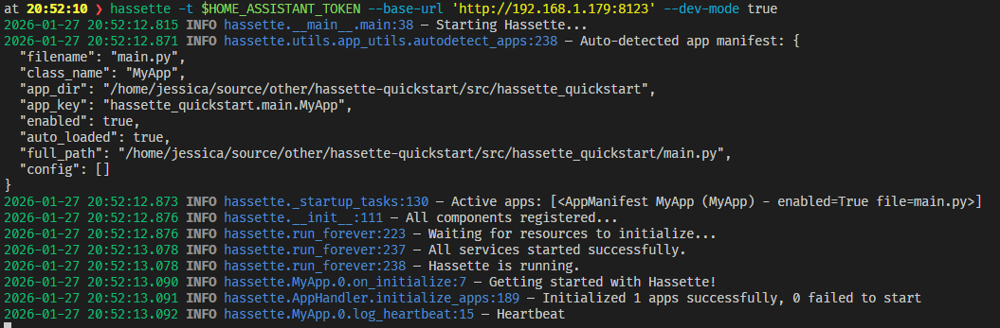

{.hero}

# Hassette

A simple, modern, async-first Python framework for building Home Assistant automations.

## What is Hassette?

Hassette is a framework that helps you write Home Assistant automations in Python. Instead of using the HA user interface or writing YAML, you create "apps" as Python classes that respond to Home Assistant events, call services, and manage state.

If you're familiar with the Python ecosystem, consider it like a marriage between AppDaemon and FastAPI - HA automations built on modern async Python, Pydantic models, and type safety.

**Key features**

- **Type safe** – full type annotations and IDE support.
- **Async-first** – built for modern Python with async/await throughout.
- **Simple & focused** – just Home Assistant automations, no complexity creep.
- **Developer experience** – clear errors, solid logging, hot reloading.

Built by a fellow HA geek frustrated with the existing Python automation experience. Read more about [why Hassette exists](pages/why-hassette.md).

## Quickstart

Get running with Hassette in just a few steps.

1. **Create your first app**

    ```python
    --8<-- "pages/getting-started/first_app.py"
    ```

2. **Run Hassette**

    ```bash
    uv run hassette -t $HOME_ASSISTANT_TOKEN \
      --base-url 'http://127.0.0.1:8123' \
      --app-dir .
    ```

3. **Watch it work**

    

## Next Steps

Ready to build something more complex? Explore the rest of the docs:

- Follow the [getting started guide](pages/getting-started/index.md) for local development.
- Deploy with [Docker Compose](pages/getting-started/docker.md) for production.
- Dive into [core app patterns](pages/core-concepts/apps/index.md).
- Learn more about the [typed API surface](pages/core-concepts/api/index.md).
- See how Hassette stacks up in the [AppDaemon comparison](pages/appdaemon-comparison.md).
