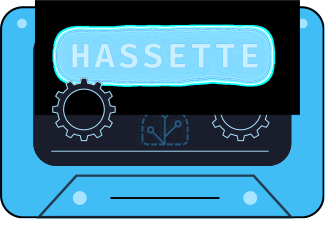

{.hero}

# Hassette

A simple, modern, async-first Python framework for building Home Assistant automations.

## What is Hassette?

Hassette is a framework that helps you write Home Assistant automations in Python. Instead of using the HA user interface or writing YAML, you create "apps" as Python classes that respond to Home Assistant events, call services, and manage state.

If you're familiar with the Python ecosystem, consider it like a marriage between AppDaemon and FastAPI — HA automations built on modern async Python, Pydantic models, and type safety.

## Why Hassette?

- **Write automations as code**: Build “apps” as Python classes that subscribe to events, call services, and manage state.
- **Async-first**: Use async where it matters; sync apps are supported too.
- **Type-safe configuration**: Pydantic models give validation, defaults, and IDE help.
- **Dependency injection**: Clean handler signatures that focus on the data you need.
- **Great DX**: Clear logs, fast iteration, and hot reloading during development.

## See it in action

#### Autocomplete + type annotations

Type annotations and Pydantic models give you IDE autocomplete and inline docs for Home Assistant entities, services, and more.

<video controls autoplay muted loop playsinline style="width: 100%; max-width: 1100px; border-radius: 10px;">
    <source src="./_static/autocomplete.webm" type="video/webm">
    <source src="./_static/autocomplete.mp4" type="video/mp4">
    Your browser does not support the video tag.
</video>

#### Filtered event handling

Fluent APIs let you easily subscribe to only the events you care about.

<video controls autoplay muted loop playsinline style="width: 100%; max-width: 1100px; border-radius: 10px;">
    <source src="./_static/filtered_events.webm" type="video/webm">
    <source src="./_static/filtered_events.mp4" type="video/mp4">
    Your browser does not support the video tag.
</video>

## What you can build

- Event-driven automations (state changes, events, scheduled jobs)
- Multi-instance apps with separate configs (e.g., "upstairs" and "downstairs")
- Typed, validated configuration for safer refactors
- Cleaner integrations with Home Assistant services and entities

## Next steps

- Local setup: [First Run](pages/getting-started/first-run.md)
- Production: [Docker Deployment](pages/getting-started/docker/index.md)
- Architecture overview: [Core Concepts](pages/core-concepts/index.md)
- Full configuration: [Configuration Overview](pages/core-concepts/configuration/index.md)
- Migration: [AppDaemon Comparison](pages/appdaemon-comparison.md)
