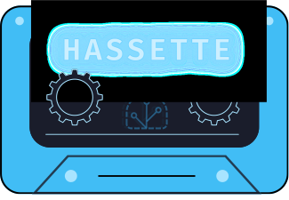
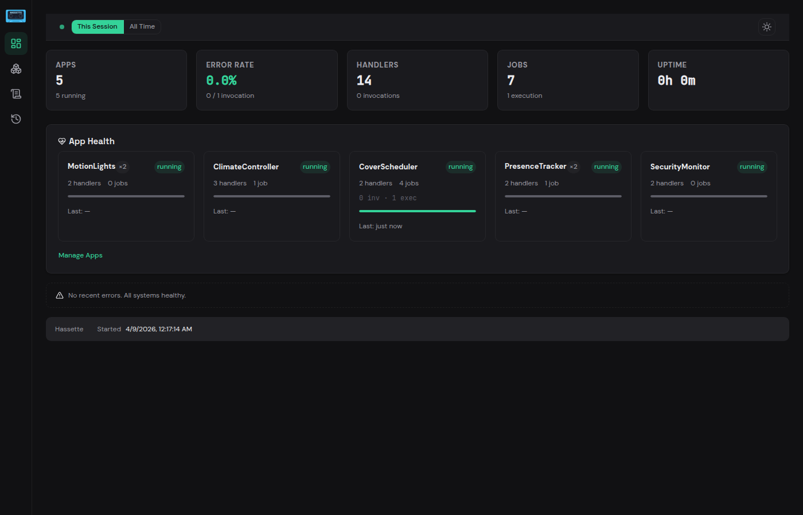

{.hero}

# Hassette

> An async-first Python framework for writing Home Assistant automations as code — with type safety, dependency injection, and a built-in test harness.

## What is Hassette?

Hassette lets you write Home Assistant automations as Python classes instead of YAML. Each automation is an **app**: a Python class that subscribes to events, calls services, schedules tasks, and manages persistent state.

If you know Python, think of it as FastAPI-style dependency injection for Home Assistant events — handlers declare the data they need, and Hassette extracts it automatically from the event stream.

**Who it's for:** Python developers who have outgrown YAML automations — automations with complex logic, shared state, unit tests, or a need for type safety. Not sure if Hassette is right for you? See [Is Hassette Right for You?](pages/getting-started/hassette-vs-ha-yaml.md)

## Why Hassette?

- **Write automations as code** — Python classes with full access to the language: loops, functions, libraries, modules.
- **Async-first** — built on `asyncio`; sync apps are supported too.
- **Type-safe configuration** — Pydantic models give validation, defaults, and IDE autocomplete for every app's settings.
- **Dependency injection** — handlers declare the fields they need; Hassette extracts them from the event automatically.
- **App cache** — built-in disk-backed cache for storing data across restarts, with rate-limiting and TTL support.
- **Built-in test harness** — unit-test automations with `AppTestHarness`, event simulation, and time control.
- **Great DX** — clear structured logs, fast iteration, and hot reloading during development.

## See it in action

#### Autocomplete + type annotations

Type annotations and Pydantic models give you IDE autocomplete and inline docs for Home Assistant entities, services, and more.

<video controls autoplay muted loop playsinline style="width: 100%; max-width: 1100px; border-radius: 10px;">
    <source src="./_static/autocomplete.webm" type="video/webm">
    <source src="./_static/autocomplete.mp4" type="video/mp4">
    Your browser does not support the video tag.
</video>

#### Event handling made simple

Dependency injection extracts the data you need automatically - just declare it in your handler parameters.

Filter events with built-in predicates and conditions for clean, readable code.

<video controls autoplay muted loop playsinline style="width: 100%; max-width: 1100px; border-radius: 10px;">
    <source src="./_static/filtered_events.webm" type="video/webm">
    <source src="./_static/filtered_events.mp4" type="video/mp4">
    Your browser does not support the video tag.
</video>


#### Web UI

Monitor and manage your automations from the browser — view a live KPI overview, manage apps, stream logs with filtering, and browse session history with telemetry. Enabled by default, no extra setup needed.



See the [Web UI docs](pages/web-ui/index.md) for a full tour.

## What you can build

- Event-driven automations (state changes, events, scheduled jobs)
- Multi-instance apps with separate configs (e.g., "upstairs" and "downstairs")
- Smart notification systems with rate-limiting to avoid spam
- Apps that cache external API calls or remember state between restarts
- Typed, validated configuration for safer refactors
- Cleaner integrations with Home Assistant services and entities

## Quick start

```bash
--8<-- "pages/getting-started/snippets/install.sh"
```

Then follow the [Local Setup guide](pages/getting-started/index.md) — you'll have a running app in about 30 minutes.

## Next steps

- **Is Hassette right for you?** [Is Hassette Right for You?](pages/getting-started/hassette-vs-ha-yaml.md)
- **Local setup:** [Local Setup](pages/getting-started/index.md)
- **Production:** [Docker Deployment](pages/getting-started/docker/index.md)
- **Architecture overview:** [Core Concepts](pages/core-concepts/index.md)
- **Full configuration:** [Configuration Overview](pages/core-concepts/configuration/index.md)
- **Migrating from AppDaemon?** [Migration Guide](pages/migration/index.md)
