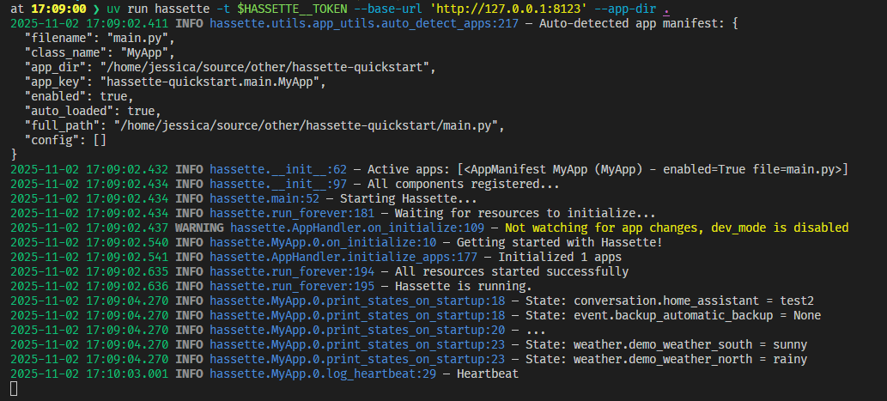

Hassette
========

A simple, modern, async-first Python framework for building Home Assistant automations.

Why Hassette?
-------------

Hassette is designed for developers who want to write Home Assistant automations in Python with modern tooling and type safety.

**Key Features:**

- **Type Safe**: Full type annotations and IDE support - no more guessing what fields are available
- **Async-First**: Built for modern Python with async/await throughout
- **Simple & Focused**: Just Home Assistant automations - no complexity creep
- **Developer Experience**: Clear error messages, proper logging, hot-reloading

Built by a fellow HA geek frustrated with AppDaemon's limitations. Read more about :doc:`why Hassette exists <why-hassette>`.

Getting Started
===============

Get running with Hassette in a few lines of code:

**1. Create your first app:**

.. include:: ./getting-started/first_app.py
   :literal:

**2. Run Hassette:**

.. code-block:: bash

    uvx hassette -t $HOME_ASSISTANT_TOKEN --base-url 'http://192.168.1.179:8123' --app-dir .

**3. Hassette will auto-detect your app and start it:**

**4: Learn more**

    This is just the tip of the iceberg. Dig into the documentation to learn about :doc:`Apps <apps/index>`, Hassette's :doc:`configuration <configuration/index>` and more.
    Check out the :doc:`getting started guide <getting-started/index>` for a more detailed walkthrough or dig into the internals with the :doc:`code reference <code-reference/index>`.

Learn More
-------------

.. toctree::
  :maxdepth: 1

  configuration/index
  apps/index
  api/index
  bus/index
  scheduler/index
  comparisons/index
  code-reference/index
