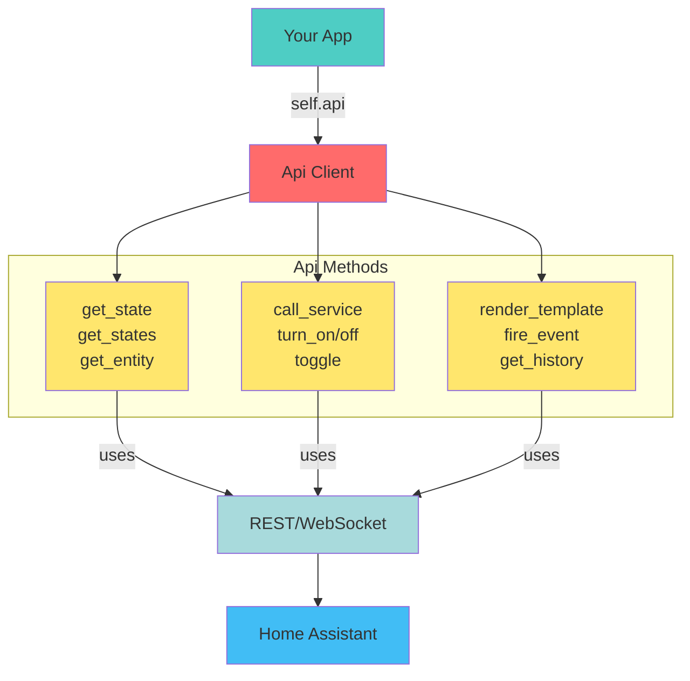

# Api

Async-first API for REST and WebSocket interactions. The service wraps Home Assistant's HTTP and
WebSocket endpoints with typed models so your apps can query and mutate data without hand-building
requests. All calls run on Hassette's asyncio loop and share the same authentication/session that the
framework manages for you.



## Key capabilities

- Retrieve states and entities as rich Pydantic models (with raw variants available when needed) using
  [`get_states`][hassette.api.api.Api.get_states], [`get_state`][hassette.api.api.Api.get_state],
  [`get_entity`][hassette.api.api.Api.get_entity], and more.
- Call services with convenience helpers for on/off/toggle as well as the generic
  [`call_service`][hassette.api.api.Api.call_service] method.
- Fire custom events, fetch history/logbook records, interact with calendars, render templates, and
  download camera stills.
- Drop down to low-level [`rest_request`][hassette.api.api.Api.rest_request] or [`ws_send_and_wait`][hassette.api.api.Api.ws_send_and_wait] helpers when you need direct API
  access.

!!! caution "Entity vs State terminology"
    Hassette uses different terminology than Home Assistant and AppDaemon, in an attempt to reduce confusion regarding states and entities.

    A [`State`][hassette.models.states.base.BaseState], such as what is returned by *get_state()*, is an object representing the current status of an entity, including its attributes and metadata.

    A [`StateValue`][hassette.models.states.base.StateValueT], such as what is returned by *get_state_value()*, is the actual value of the state, e.g., `"on"`, `"off"`, `23.5`, etc.

    An [`Entity`][hassette.models.entities.base.BaseEntity], such as what is returned by *get_entity()*, is a richer object that includes the state and methods to interact with the entity, such as calling services on it.

!!! note
    Most API methods will return a typed model. For example, `get_state` expects an entity ID and a state model type, and returns an instance of that model.

    ```python linenums="5"
    --8<-- "pages/core-concepts/api/typed_state_example.py:5:7"
    ```

    These methods will have a `raw` variant that returns untyped data (`dict` or `Any`) if you prefer that style.

    ```python linenums="6"
    --8<-- "pages/core-concepts/api/raw_state_example.py:6:8"
    ```

    An exception to this is `get_state_value`, which does not accept a model and always returns a raw string from Home Assistant. You can use `get_state_value_typed` if you want a typed return value.

## States

`get_states` and `get_state` convert raw dictionaries into the appropriate
[`BaseState`][hassette.models.states.base.BaseState] subclasses. Pass the state model you expect to `get_state`
so you receive the fully typed object. If you just need the primary value, `get_state_value` returns
the raw Home Assistant string, while `get_state_value_typed` will coerce into your Pydantic model's
`state` field.

```python linenums="6"
--8<-- "pages/core-concepts/api/states_example.py:6:16"
```

## Entities

Entities ([`hassette.models.entities`][hassette.models.entities]) wrap a state plus helper methods. `get_entity` performs a
runtime check to be sure you requested the right entity model and returns `None` if you use
`get_entity_or_none` and the entity is missing.

```python linenums="7"
--8<-- "pages/core-concepts/api/entities_example.py:7:14"
```

!!! note
    Entities are on the roadmap but not fully implemented yet, currently there is only `BaseEntity` and `LightEntity`.

## Service helpers

[`call_service`][hassette.api.api.Api.call_service] is the lowest-level abstraction for invoking Home Assistant services. Pass
`domain`/`service` along with a `target` dict or additional service data. Convenience wrappers
turn_on/turn_off/toggle simply forward to `call_service` and request a response context so you can
inspect the HA `HassContext`.

```python linenums="5"
--8<-- "pages/core-concepts/api/service_helpers_example.py:5:17"
```

!!! note
    Typed service calls are a high priority, but not yet implemented. Most detailed services (e.g. light.turn_on) will be
    implemented in Entity classes to avoid having hundreds of overloads on the Api class.

## History and logbook

History endpoints accept Whenever date objects or plain strings. `get_history` returns normalized [`HistoryEntry`][hassette.models.history.HistoryEntry]
instances; `get_histories` returns a mapping of entity IDs to entry lists when you need to fetch
multiple entities at once.

```python linenums="6"
--8<-- "pages/core-concepts/api/history_example.py:6:11"
```

## Templates, calendars, and other REST endpoints

Use the provided helpers instead of building raw URLs:

- [`render_template`][hassette.api.api.Api.render_template] renders Jinja templates.
- [`get_camera_image`][hassette.api.api.Api.get_camera_image] streams the latest still (or a specific timestamp).
- [`set_state`][hassette.api.api.Api.set_state] writes synthetic states (handy for helpers or sensors you manage).
- [`get_calendars`][hassette.api.api.Api.get_calendars] / [`get_calendar_events`][hassette.api.api.Api.get_calendar_events] expose HA calendar data.

Each helper handles serialization and retries for you.

## Low-level access

If you need an endpoint Hassette does not wrap yet, `rest_request` and `ws_send_and_wait` provide
direct access to the authenticated `aiohttp` session and WebSocket connection. They include retry
logic and raise Hassette-specific exceptions like [`EntityNotFoundError`][hassette.exceptions.EntityNotFoundError] and
[`InvalidAuthError`][hassette.exceptions.InvalidAuthError] so you can handle failures consistently.

```python linenums="5"
--8<-- "pages/core-concepts/api/low_level_example.py:5:9"
```

## Sync facade

`self.api.sync` mirrors the async API with blocking calls for synchronous code. Do not call from
within an event loop - it's intended for `AppSync` subclasses or transitional code paths (for
example, libraries that expect synchronous hooks).

```python linenums="6"
--8<-- "pages/core-concepts/api/sync_facade_example.py:6:7"
```

## Typing status

- Many models and read operations are strongly typed.
- Service calls are not fully typed yet; finishing this is a high priority. For now, `call_service`
  accepts `**data` and performs string normalization for REST parameters.

## See Also

- [Core Concepts](../index.md) — back to the core concepts overview
- [Apps](../apps/index.md) — more on app anatomy, lifecycle, and capabilities
- [Scheduler](../scheduler/index.md) — more on scheduling jobs and intervals
- [Bus](../bus/index.md) — more on subscribing to and handling events
- [Configuration](../configuration/index.md) — Hassette and app configuration
