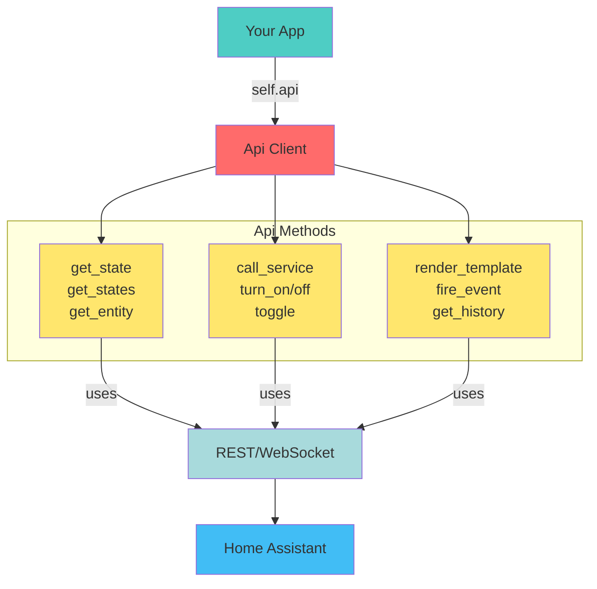

# Api

Async-first API for REST and WebSocket interactions. The service wraps Home Assistant's HTTP and
WebSocket endpoints with typed models so your apps can query and mutate data without hand-building
requests. All calls run on Hassette's asyncio loop and share the same authentication/session that the
framework manages for you.



## Key capabilities

- Retrieve states and entities as rich Pydantic models (with raw variants available when needed) using
  [`get_states`][hassette.api.api.Api.get_states], [`get_state`][hassette.api.api.Api.get_state],
  [`get_entity`][hassette.api.api.Api.get_entity], and more.
- Call services with convenience helpers for on/off/toggle as well as the generic
  [`call_service`][hassette.api.api.Api.call_service] method.
- Fire custom events, fetch history/logbook records, interact with calendars, render templates, and
  download camera stills.
- Drop down to low-level [`rest_request`][hassette.api.api.Api.rest_request] or [`ws_send_and_wait`][hassette.api.api.Api.ws_send_and_wait] helpers when you need direct API
  access.

!!! caution "Entity vs State terminology"
    Hassette uses different terminology than Home Assistant and AppDaemon, in an attempt to reduce confusion regarding states and entities.

    A [`State`][hassette.models.states.base.BaseState], such as what is returned by *get_state()*, is an object representing the current status of an entity, including its attributes and metadata.

    A [`StateValue`][hassette.models.states.base.StateValueT], such as what is returned by *get_state_value()*, is the actual value of the state, e.g., `"on"`, `"off"`, `23.5`, etc.

    An [`Entity`][hassette.models.entities.base.BaseEntity], such as what is returned by *get_entity()*, is a richer object that includes the state and methods to interact with the entity, such as calling services on it.

!!! note
    Most API methods will return a typed model. For example, `get_state` expects an entity ID and a state model type, and returns an instance of that model.

    ```python linenums="5"
    --8<-- "pages/core-concepts/api/typed_state_example.py:5:7"
    ```

    These methods will have a `raw` variant that returns untyped data (`dict` or `Any`) if you prefer that style.

    ```python linenums="6"
    --8<-- "pages/core-concepts/api/raw_state_example.py:6:8"
    ```

    An exception to this is `get_state_value`, which does not accept a model and always returns a raw string from Home Assistant. You can use `get_state_value_typed` if you want a typed return value.

## States

`get_states` and `get_state` convert raw dictionaries into the appropriate
[`BaseState`][hassette.models.states.base.BaseState] subclasses. Pass the state model you expect to `get_state`
so you receive the fully typed object. If you just need the primary value, `get_state_value` returns
the raw Home Assistant string, while `get_state_value_typed` will coerce into your Pydantic model's
`state` field.

```python linenums="6"
--8<-- "pages/core-concepts/api/states_example.py:6:16"
```

## Entities

Entities ([`hassette.models.entities`][hassette.models.entities]) wrap a state plus helper methods. `get_entity` performs a
runtime check to be sure you requested the right entity model and returns `None` if you use
`get_entity_or_none` and the entity is missing.

```python linenums="7"
--8<-- "pages/core-concepts/api/entities_example.py:7:14"
```

!!! note
    Entities are on the roadmap but not fully implemented yet, currently there is only `BaseEntity` and `LightEntity`.

## Service helpers

[`call_service`][hassette.api.api.Api.call_service] is the lowest-level abstraction for invoking Home Assistant services. Pass
`domain`/`service` along with a `target` dict or additional service data. Convenience wrappers
turn_on/turn_off/toggle simply forward to `call_service` and request a response context so you can
inspect the HA `HassContext`.

```python linenums="5"
--8<-- "pages/core-concepts/api/service_helpers_example.py:5:17"
```

!!! note
    Typed service calls are a high priority, but not yet implemented. Most detailed services (e.g. light.turn_on) will be
    implemented in Entity classes to avoid having hundreds of overloads on the Api class.

## History and logbook

History endpoints accept Whenever date objects or plain strings. `get_history` returns normalized [`HistoryEntry`][hassette.models.history.HistoryEntry]
instances; `get_histories` returns a mapping of entity IDs to entry lists when you need to fetch
multiple entities at once.

```python linenums="6"
--8<-- "pages/core-concepts/api/history_example.py:6:11"
```

## Templates, calendars, and other REST endpoints

Use the provided helpers instead of building raw URLs:

- [`render_template`][hassette.api.api.Api.render_template] renders Jinja templates.
- [`get_camera_image`][hassette.api.api.Api.get_camera_image] streams the latest still (or a specific timestamp).
- [`set_state`][hassette.api.api.Api.set_state] writes synthetic states (handy for helpers or sensors you manage).
- [`get_calendars`][hassette.api.api.Api.get_calendars] / [`get_calendar_events`][hassette.api.api.Api.get_calendar_events] expose HA calendar data.

Each helper handles serialization and retries for you.

## Low-level access

If you need an endpoint Hassette does not wrap yet, `rest_request` and `ws_send_and_wait` provide
direct access to the authenticated `aiohttp` session and WebSocket connection. They include retry
logic and raise Hassette-specific exceptions like [`EntityNotFoundError`][hassette.exceptions.EntityNotFoundError] and
[`InvalidAuthError`][hassette.exceptions.InvalidAuthError] so you can handle failures consistently.

```python linenums="5"
--8<-- "pages/core-concepts/api/low_level_example.py:5:9"
```

## Sync facade

`self.api.sync` mirrors the async API with blocking calls for synchronous code. Do not call from
within an event loop - it's intended for `AppSync` subclasses or transitional code paths (for
example, libraries that expect synchronous hooks).

```python linenums="6"
--8<-- "pages/core-concepts/api/sync_facade_example.py:6:7"
```

## Common Patterns

### Getting Multiple States Efficiently

Fetch all states once and filter locally instead of making multiple API calls:

```python
async def on_initialize(self):
    # Get all states in one call
    all_states = await self.api.get_states()

    # Filter to what you need
    lights = [s for s in all_states if s.domain == "light"]
    low_battery = [s for s in all_states
                   if hasattr(s.attributes, "battery_level")
                   and s.attributes.battery_level < 20]

    self.logger.info(f"Found {len(lights)} lights, {len(low_battery)} low batteries")
```

### Checking Entity Availability

Before calling services, check if an entity is available:

```python
from hassette.models import states

async def turn_on_if_available(self, entity_id: str):
    state = await self.api.get_state(entity_id, states.LightState)

    if state.is_unavailable:
        self.logger.warning(f"{entity_id} is unavailable")
        return

    await self.api.turn_on(entity_id)
```

### Calling Services with Complex Data

Use `call_service` for services that need structured data:

```python
async def send_notification(self, message: str, **options):
    await self.api.call_service(
        "notify",
        "mobile_app_phone",
        message=message,
        title=options.get("title", "Hassette"),
        data={
            "priority": "high",
            "ttl": 0,
            "channel": "alerts",
            "actions": [
                {"action": "dismiss", "title": "Dismiss"},
                {"action": "view", "title": "View Details"}
            ]
        }
    )
```

### Using Templates for Dynamic Values

Render Jinja templates to get computed values:

```python
async def get_friendly_time(self):
    # Use HA's template engine for relative times
    template = "{{ relative_time(states.sun.sun.last_changed) }}"
    result = await self.api.render_template(template)
    return result  # e.g., "2 hours ago"

async def get_battery_average(self):
    # Calculate average across all battery sensors
    template = """
    
    {{ (batteries | sum / batteries | length) | round(1) }}
    """
    result = await self.api.render_template(template)
    return float(result)
```

### Handling State Changes Reactively

Combine API calls with bus events for responsive automations:

```python
async def on_initialize(self):
    # Listen for motion
    self.bus.on_state_change(
        "binary_sensor.motion",
        handler=self.on_motion,
        changed_to="on"
    )

async def on_motion(self, event):
    # Check if we should turn on lights
    sun = await self.api.get_state("sun.sun", states.SunState)

    if sun.value == "below_horizon":
        await self.api.turn_on("light.hallway", brightness=128)
```

## Working with State Attributes

All state models expose attributes as typed Pydantic models:

```python
from hassette.models import states

async def check_climate(self):
    climate = await self.api.get_state("climate.living_room", states.ClimateState)

    # Access typed attributes
    current_temp = climate.attributes.current_temperature  # float
    target_temp = climate.attributes.temperature  # float | None
    hvac_mode = climate.attributes.hvac_mode  # str

    if current_temp and target_temp:
        diff = abs(current_temp - target_temp)
        if diff > 2:
            self.logger.warning(f"Temperature off by {diff}°")
```

### Common Attributes to Check

| Attribute             | Found On               | Type            | Use Case                          |
| --------------------- | ---------------------- | --------------- | --------------------------------- |
| `battery_level`       | Many devices           | `int | None`   | Monitor device health             |
| `brightness`          | Lights                 | `int | None`   | Check/set light intensity (0-255) |
| `temperature`         | Climate                | `float | None` | Target temperature                |
| `current_temperature` | Climate                | `float | None` | Actual temperature                |
| `media_title`         | Media players          | `str | None`   | What's playing                    |
| `friendly_name`       | All entities           | `str`           | Display name                      |
| `device_class`        | Sensors/binary sensors | `str | None`   | Type classification               |

## Error Handling

The API raises specific exceptions you can catch:

```python
from hassette.exceptions import EntityNotFoundError, InvalidAuthError, HomeAssistantError

async def safe_state_check(self, entity_id: str):
    try:
        state = await self.api.get_state(entity_id, states.SensorState)
        return state.value
    except EntityNotFoundError:
        self.logger.error(f"Entity {entity_id} not found")
        return None
    except InvalidAuthError:
        self.logger.critical("Authentication failed - check token")
        raise
    except HomeAssistantError as e:
        self.logger.error(f"HA API error: {e}")
        return None
```

### Retry Behavior

The API automatically retries failed requests with exponential backoff:

- **Default retries**: 5 attempts
- **Backoff**: Exponential with jitter
- **Retryable errors**: Network issues, 5xx responses
- **Non-retryable**: 404 (EntityNotFoundError), 401/403 (InvalidAuthError)

## Performance Tips

### Batch State Queries

```python
# SLOW: Multiple API calls
for entity_id in ["light.1", "light.2", "light.3"]:
    state = await self.api.get_state(entity_id, states.LightState)
    # process state

# FAST: One API call
all_states = await self.api.get_states()
lights = [s for s in all_states if s.entity_id in {"light.1", "light.2", "light.3"}]
for light in lights:
    # process state
```

### Cache States When Appropriate

```python
async def on_initialize(self):
    # Cache states that don't change often
    self.config_entities = await self.api.get_states()

    # Refresh every 5 minutes
    self.scheduler.run_every(self.refresh_cache, interval=300)

async def refresh_cache(self):
    self.config_entities = await self.api.get_states()
```

### Use State Cache (Coming Soon)

!!! info "Roadmap"
    A built-in state cache similar to AppDaemon's is planned. This will automatically maintain
    an up-to-date local copy of all entity states, eliminating most API calls for reads.

## History and Time-Based Queries

### Getting Historical Data

```python
async def analyze_energy_usage(self):
    # Get last 24 hours of data
    start = self.now().subtract(hours=24)
    end = self.now()

    history = await self.api.get_history(
        "sensor.energy_consumption",
        start=start,
        end=end
    )

    # Process the history entries
    total = sum(float(entry.state) for entry in history if entry.state.isnumeric())
    self.logger.info(f"24hr energy usage: {total} kWh")
```

### Using Logbook for Event Tracking

```python
async def get_recent_automations(self):
    start = self.now().subtract(hours=1)

    # Get logbook entries
    entries = await self.api.get_logbook(start=start)

    # Filter to automation triggers
    automation_runs = [
        e for e in entries
        if e.entity_id and e.entity_id.startswith("automation.")
    ]

    return automation_runs
```

## Troubleshooting

### Entity Not Found

If you get `EntityNotFoundError`:

1. **Verify the entity exists** in Home Assistant
2. **Check spelling** - entity IDs are case-sensitive
3. **Ensure entity is available** - some entities disappear when offline

```python
# Check if entity exists first
all_states = await self.api.get_states()
if not any(s.entity_id == "light.typo" for s in all_states):
    self.logger.error("Entity doesn't exist")
```

### Service Call Not Working

If a service call seems to fail silently:

1. **Check the response** - service calls return a context you can inspect
2. **Verify service exists** - service names are `domain.service`
3. **Check required parameters** - some services need specific data

```python
# Get response context
response = await self.api.call_service(
    "light", "turn_on",
    target={"entity_id": "light.office"},
    brightness=255
)
self.logger.debug(f"Service response: {response}")
```

### Template Rendering Fails

If `render_template` returns unexpected results:

1. **Test in Home Assistant** Developer Tools → Template
2. **Check for syntax errors** in the Jinja template
3. **Verify entity/state existence** in the template

```python
# Add error handling
try:
    result = await self.api.render_template("{{ states('sensor.bad') }}")
except HomeAssistantError as e:
    self.logger.error(f"Template error: {e}")
```

## Quick Reference

| Task                   | Method                                      | Returns              |
| ---------------------- | ------------------------------------------- | -------------------- |
| Get all states         | `get_states()`                              | `list[BaseState]`    |
| Get single state       | `get_state(entity_id, model)`               | `StateT`             |
| Get state value only   | `get_state_value(entity_id)`                | `str`                |
| Check if entity exists | `get_state_or_none(entity_id, model)`       | `StateT | None`     |
| Call any service       | `call_service(domain, service, **data)`     | `ServiceResponse`    |
| Turn on entity         | `turn_on(entity_id, **data)`                | `ServiceResponse`    |
| Turn off entity        | `turn_off(entity_id, **data)`               | `ServiceResponse`    |
| Toggle entity          | `toggle(entity_id)`                         | `ServiceResponse`    |
| Render template        | `render_template(template)`                 | `str`                |
| Get history            | `get_history(entity_id, start, end)`        | `list[HistoryEntry]` |
| Fire event             | `fire_event(event_type, **data)`            | `None`               |
| Set state              | `set_state(entity_id, state, **attributes)` | `State`              |

## See Also

- [Core Concepts](../index.md) — back to the core concepts overview
- [Apps](../apps/index.md) — more on app anatomy, lifecycle, and capabilities
- [Scheduler](../scheduler/index.md) — more on scheduling jobs and intervals
- [Bus](../bus/index.md) — more on subscribing to and handling events
- [Configuration](../configuration/index.md) — Hassette and app configuration
