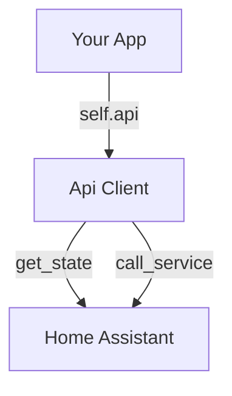

# API Overview

The `Api` resource allows your apps to interact with Home Assistant. It wraps the REST and WebSocket APIs with typed interfaces.



## Usage

The API is pre-configured and available as `self.api`.

```python
async def on_initialize(self):
    try:
        state = await self.api.get_state("sun.sun")
        self.logger.info(f"Sun is {state.value}")
    except HassetteError as e:
        self.logger.error(f"HA API error: {e}")
        return None # Handling
```

## Error Handling

The API raises typed exceptions for common failures:

- [`EntityNotFoundError`][hassette.exceptions.EntityNotFoundError]: Entity does not exist.
- [`InvalidAuthError`][hassette.exceptions.InvalidAuthError]: Authentication failed.
- [`HassetteError`][hassette.exceptions.HassetteError]: Generic upstream error.

Requests are automatically retried for network errors.

## Synchronous Usage

If you are writing a synchronous app, use `self.api.sync` to access blocking versions of all methods.

```python
def on_initialize(self):
    # Note .sync property!
    self.api.sync.turn_on("light.office")
```

## Next Steps

- **[Entities & States](entities.md)**: Retrieving state data.
- **[Services](services.md)**: Controlling devices.
- **[Utilities](utilities.md)**: History, templates, and more.
