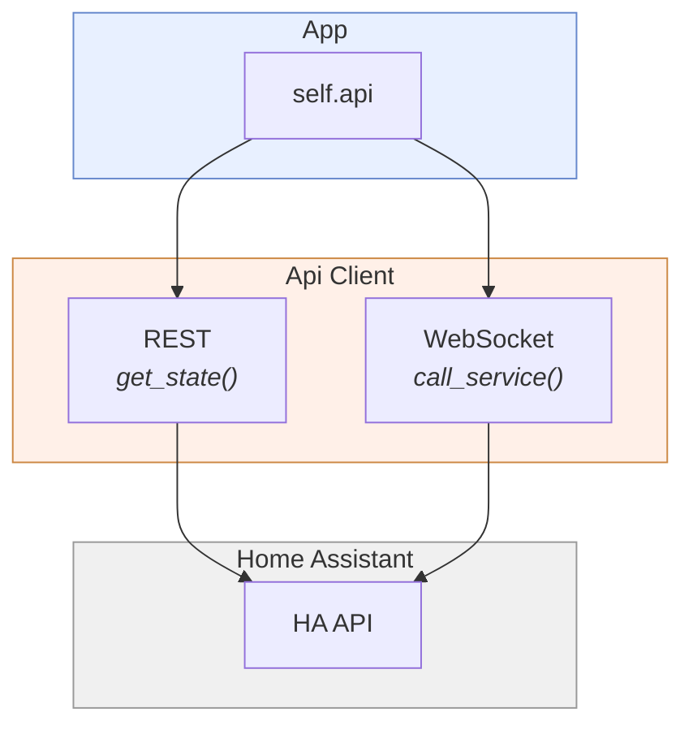

# API

`self.api` sends commands to Home Assistant and retrieves data from it. It wraps the REST and WebSocket APIs with automatic authentication, retries, and type conversion. Every [`App`](../apps/index.md) instance has one.


```mermaid
flowchart TD
    subgraph app["App"]
        APP["self.api"]
    end

    subgraph framework["Api Client"]
        REST["REST<br/><i>get_state()</i>"]
        WS["WebSocket<br/><i>call_service()</i>"]
    end

    subgraph ha["Home Assistant"]
        HA["HA API"]
    end

    APP --> REST & WS
    REST & WS --> HA

    style app fill:#e8f0ff,stroke:#6688cc
    style framework fill:#fff0e8,stroke:#cc8844
    style ha fill:#f0f0f0,stroke:#999
```

## Quick Example

The two most common operations are reading state and calling a service.

```python
--8<-- "pages/core-concepts/api/snippets/api_overview_usage.py"
```

`get_state()` fetches the entity from Home Assistant over the network. It returns a typed state object. `call_service()` sends a service call via WebSocket.

## API vs `StateManager`

[`self.states`](../states/index.md) covers most state-reading needs. It returns typed state objects from a local cache, with no network call and no `await`.

| | `self.states` | `self.api` |
|---|---|---|
| Access pattern | Synchronous | `async` / `await` |
| Data source | Local cache, updated from HA events | Direct from Home Assistant |
| Latency | Instant | Network round-trip |
| Best for | Reading state in handlers | Writes, fresh data, helpers |

`self.states` is faster and simpler for reads. `self.api` is the right choice when fresh-from-HA data is needed, or for any write operation: service calls, `set_state()`, helper management.

## Error Handling

[Api][hassette.api.api.Api] raises typed exceptions for common failures.

- [`EntityNotFoundError`][hassette.exceptions.EntityNotFoundError] if the entity does not exist in Home Assistant.
- [`InvalidAuthError`][hassette.exceptions.InvalidAuthError] if authentication failed (invalid or expired token).
- [`HassetteError`][hassette.exceptions.HassetteError] for any other upstream error from Home Assistant.

Network errors are retried automatically. Catching [`HassetteError`][hassette.exceptions.HassetteError] handles all API failures in one place.

## Synchronous Usage

??? note "`AppSync` and self.api.sync"
    Apps that subclass [`AppSync`][hassette.app.app.`AppSync`] override `on_initialize_sync` instead of `on_initialize`. Hassette runs the sync method in a thread. `self.api.sync` provides blocking versions of all async API methods.

    ```python
    --8<-- "pages/core-concepts/api/snippets/api_sync_usage.py"
    ```

    !!! warning
        `self.api.sync` is only safe to call from outside the event loop, specifically from `AppSync` lifecycle methods (`on_initialize_sync`, `on_shutdown_sync`). Calling it from inside an `async def` method deadlocks.

## Next Steps

- [Entities & States](entities.md) covers reading state data from Home Assistant.
- [Services](services.md) covers calling Home Assistant services.
- [Managing Helpers](managing-helpers.md) covers creating and managing input helpers (booleans, counters, timers, and more).
- [Utilities](utilities.md) covers history, logbook, templates, and calendars.
