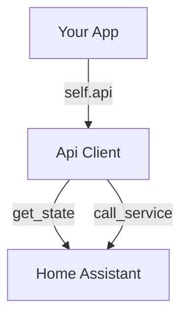

# API Overview

The `Api` resource lets your apps interact with Home Assistant. It wraps the REST and WebSocket APIs with typed Python interfaces and handles authentication, retries, and type conversion automatically.


```mermaid
graph TB
    APP[Your App] --> |self.api| API[Api Client]
    API --> |get_state| HA[Home Assistant]
    API --> |call_service| HA
```

## Usage

`self.api` is pre-configured and ready to use in any app:

```python
--8<-- "pages/core-concepts/api/snippets/api_overview_usage.py"
```

## Error Handling

The API raises typed exceptions for common failures:

- [`EntityNotFoundError`][hassette.exceptions.EntityNotFoundError] — entity does not exist in Home Assistant
- [`InvalidAuthError`][hassette.exceptions.InvalidAuthError] — authentication failed; check your token
- [`HassetteError`][hassette.exceptions.HassetteError] — generic upstream error

Network errors are automatically retried. Catch `HassetteError` to handle all API failures in one place.

## Synchronous Usage

If you are writing a synchronous app, subclass `AppSync` and override `on_initialize_sync` instead of `on_initialize`. Hassette runs your sync method in a thread, where `self.api.sync` provides blocking versions of all API methods:

!!! note
    `self.api.sync` is only safe to call from **outside the event loop** — specifically from `AppSync` lifecycle methods (`on_initialize_sync`, `on_shutdown_sync`). Calling it from inside an `async def` method will deadlock.

```python
--8<-- "pages/core-concepts/api/snippets/api_sync_usage.py"
```

## API vs. StateManager

The API fetches state directly from Home Assistant over the network. For reading entity state in most situations, prefer `self.states` — it provides instant synchronous access from a local cache with no network overhead:

- `self.states.light["kitchen"]` — domain-specific typed access, no `await`
- `self.states.get("light.kitchen")` — direct lookup by entity ID, no `await`

Use `self.api` when you specifically need guaranteed fresh data directly from Home Assistant.

## Next Steps

- **[Entities & States](entities.md)** — retrieve state data from Home Assistant
- **[Services](services.md)** — invoke Home Assistant services
- **[Utilities](utilities.md)** — history, logbook, templates, and more
