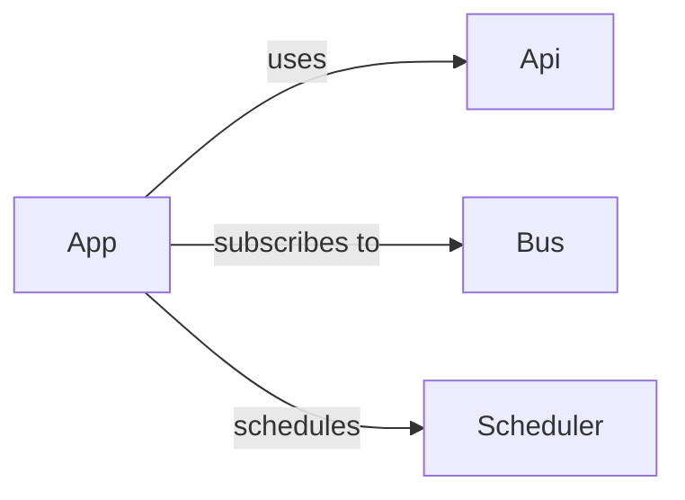

# Apps Overview

Apps are the heart of Hassette - the logic *you* write to respond to events and manipulate resources. Each app encapsulates its own behavior, configuration, and internal state.

Apps can be **asynchronous** (preferred) or **synchronous**. Sync apps are automatically run in threads to prevent blocking the event loop.

## Structure



## Defining an App

Every app is a Python class that inherits from [`App`][hassette.app.app.App].

```python title="example_app.py"
--8<-- "pages/core-concepts/apps/snippets/example_app.py"
```

## Core Capabilities

Each app receives pre-configured helpers:

- **[`self.api`](../api/index.md)** - Interact with Home Assistant.
- **[`self.bus`](../bus/index.md)** - Subscribe to events.
- **[`self.scheduler`](../scheduler/index.md)** - Schedule jobs.
- **[`self.states`](../states/index.md)** - Access entity states.
- **`self.logger`** - Dedicated logger instance.
- **[`self.app_config`](configuration.md)** - Typed configuration.

## Next Steps

- **[Lifecycle](lifecycle.md)**: Understand `on_initialize` and `on_shutdown`.
- **[Configuration](configuration.md)**: Learn how to use typed configuration and secrets.
