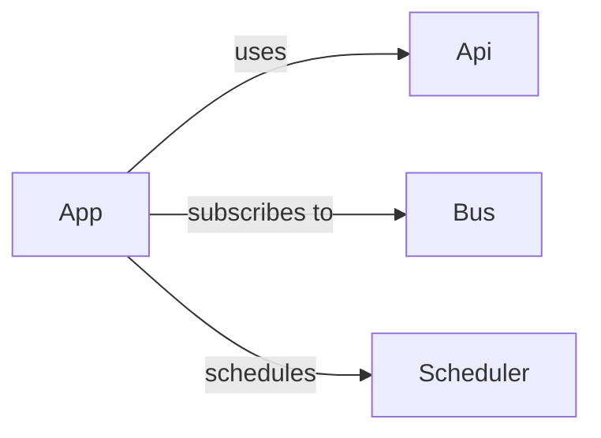

# Apps

Apps are the heart of Hassette - the logic *you* write to respond to events and manipulate resources.
Each app encapsulates its own behavior, configuration, and internal state, interacting with Home Assistant through a rich, typed API.

Apps can be **asynchronous** or **synchronous**, depending on your needs.
Async apps are preferred for most use cases since they integrate directly with Hassette's event loop and can run multiple tasks concurrently.
Sync apps are supported for compatibility with legacy code or blocking libraries - they're automatically run in a background thread using `asyncio.to_thread()` so they never block the event loop.

## App Structure



## Defining an App

Every app is a Python class that inherits from [`App`][hassette.app.app.App] (for async apps)
or [`AppSync`][hassette.app.app.AppSync] (for sync apps).

Each app may also define a Pydantic configuration model inheriting from [`AppConfig`][hassette.app.app_config.AppConfig],
which parses and validates its configuration.

```python title="example_app.py"
--8<-- "pages/core-concepts/apps/example_app.py"
```

This small class is all you need to create a working Hassette app.

## Core Capabilities

Each app automatically receives several built-in helpers - interfaces to core services that make automation easy and expressive:

- `self.api` - Typed async interface to Home Assistant's REST and WebSocket APIs.
  See [API](../api/index.md).

- `self.bus` - Subscribe to and handle events.
  See [Bus](../bus/index.md).

- `self.scheduler` - Schedule jobs to run on intervals or cron-like expressions.
  See [Scheduler](../scheduler/index.md).

- `self.logger` - Standard [logging.Logger][logging.Logger] instance preconfigured for your app.

- `self.app_config` - Parsed configuration model for this app instance, typed to your subclass of `AppConfig`.

Additional attributes like `self.instance_name` and `self.index` are available for logging and introspection.

## Lifecycle

Every app follows a structured lifecycle with clear startup and shutdown phases.
Hassette ensures that all services (API, Bus, Scheduler, etc.) are ready before your app's initialization hooks are called,
and it cleans up all resources automatically on shutdown.

### Initialization

During startup, Hassette calls [initialize()][hassette.resources.base.Resource.initialize] which transitions the app through `STARTING → RUNNING` and invokes the following hooks in order:

1. [`before_initialize`][hassette.resources.base.Resource.before_initialize]
2. [`on_initialize`][hassette.resources.base.Resource.on_initialize]
3. [`after_initialize`][hassette.resources.base.Resource.after_initialize]

Use these to register event handlers, schedule jobs, or perform any startup logic. You do not need to worry about calling `super()` in these hooks.

### Shutdown

When shutting down or reloading, Hassette calls [shutdown()][hassette.resources.base.Resource.shutdown] which transitions the app through `STOPPING → STOPPED`
and calls the shutdown hooks in order:

1. [`before_shutdown`][hassette.resources.base.Resource.before_shutdown]
2. [`on_shutdown`][hassette.resources.base.Resource.on_shutdown]
3. [`after_shutdown`][hassette.resources.base.Resource.after_shutdown]

Afterward, the [cleanup][hassette.resources.base.Resource.cleanup] method runs automatically, canceling all subscriptions, jobs, and active tasks.
If your app allocates its own resources (files, network sockets, etc.), clean them up in `on_shutdown` or `after_shutdown`.

!!! warning
    You cannot override `initialize`, `shutdown`, or `cleanup` directly - use the lifecycle hooks instead.
    Attempting to override these will raise a [`CannotOverrideFinalError`][hassette.exceptions.CannotOverrideFinalError].

## App Configuration

Each app can define a Pydantic configuration model (subclassing [`AppConfig`][hassette.app.app_config.AppConfig]) to parse and validate its configuration.
These config classes are used when parsing TOML configuration files and can include default values, field constraints,
and environment variable support.

The base `AppConfig` includes two optional fields:

- `instance_name: str | None` - Used for logging and identification.
- `log_level: str | None` - Optional log-level override; defaults to the global setting.

Because `App` is generic on the config type, specifying it allows IDEs and type checkers to infer the correct type automatically.

```python title="typed_config_example.py"
--8<-- "pages/core-concepts/apps/typed_config_example.py"
```

```toml title="typed_config_toml.toml"
--8<-- "pages/core-concepts/apps/typed_config_toml.toml"
```

## App Secrets

Because `AppConfig` inherits from [`pydantic_settings.BaseSettings`][pydantic_settings.BaseSettings],
you can load secrets from environment variables or `.env` files.

By default, environment variables follow Hassette's nested naming convention:

```
HASSETTE__APPS__MY_APP__CONFIG__REQUIRED_SECRET
```

You can simplify this by defining an `env_prefix` in your config class:

```python
from hassette import AppConfig
from pydantic_settings import SettingsConfigDict

class MyAppConfig(AppConfig):
    model_config = SettingsConfigDict(env_prefix="MYAPP_")
    required_secret: str
```

Then the same field can be set with:

```bash
export MYAPP_REQUIRED_SECRET="s3cr3t"
```

## See Also

- [Core Concepts](../index.md) - back to the core concepts overview
- [Scheduler](../scheduler/index.md) - more on scheduling jobs and intervals
- [Bus](../bus/index.md) - more on subscribing to and handling events
- [API](../api/index.md) - more on interacting with Home Assistant's APIs
- [Configuration](../configuration/index.md) - Hassette and app configuration
