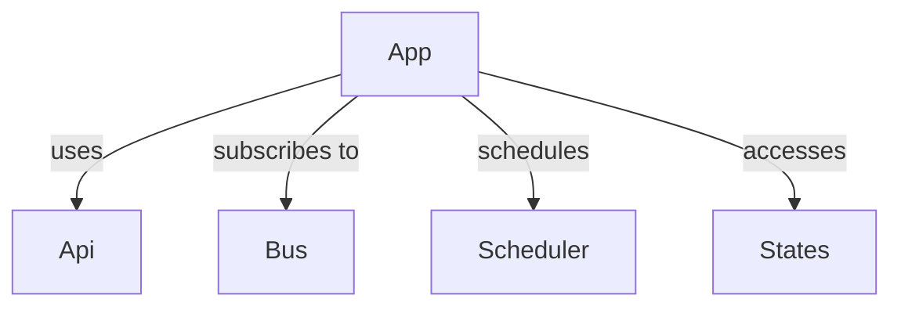

# Apps Overview

Apps are the heart of Hassette - the logic *you* write to respond to events and manipulate resources. Each app encapsulates its own behavior, configuration, and internal state.

Apps can be **asynchronous** (preferred) or **synchronous**. Sync apps are automatically run in threads to prevent blocking the event loop.

## Structure



## Defining an App

Every app is a Python class that inherits from [`App`][hassette.app.app.App] or [`AppSync`][hassette.app.app.AppSync].

```python title="example_app.py"
--8<-- "pages/core-concepts/apps/snippets/example_app.py"
```

## Core Capabilities

Each app receives pre-configured helpers:

- **[`self.api`](../api/index.md)** - Interact with Home Assistant.
- **[`self.bus`](../bus/index.md)** - Subscribe to events.
- **[`self.scheduler`](../scheduler/index.md)** - Schedule jobs.
- **[`self.states`](../states/index.md)** - Access entity states.
- **[`self.cache`](../persistent-storage.md)** - Persistent disk-based storage.
- **`self.logger`** - Dedicated logger instance.
- **[`self.app_config`](configuration.md)** - Typed configuration.

## Common Use Cases

### Reacting to Events

Subscribe to events using [`self.bus`](../bus/index.md) to react to changes in Home Assistant.

```python
self.on_change_listener = self.bus.on_state_change(self.app_config.light, handler=self.on_change)
```

### Run Recurring Jobs

Use [`self.scheduler`](../scheduler/index.md) to schedule recurring tasks.

```python
self.scheduler.run_hourly(self.log_status, minute=15)
```

### Check Entity States

Use [`self.states`](../states/index.md) to check the current state of entities.

```python
current_state = self.states.light[self.app_config.light].value
self.logger.info("Current state of %s: %s", self.app_config.light, current_state)
```

### Call Services

Use [`self.api`](../api/index.md) to call Home Assistant services.

```python
await self.api.call_service("light", "turn_on", entity_id=self.app_config.light)
```

### Persist Data Between Restarts

Use [`self.cache`](../persistent-storage.md) to store data that should survive app restarts.

```python
# Load counter from cache, defaulting to 0
self.counter = self.cache.get("counter", 0)

# Increment and save back
self.counter += 1
self.cache["counter"] = self.counter
```

## Next Steps

- **[Lifecycle](lifecycle.md)**: Understand `on_initialize` and `on_shutdown`.
- **[Configuration](configuration.md)**: Learn how to use typed configuration and secrets.
