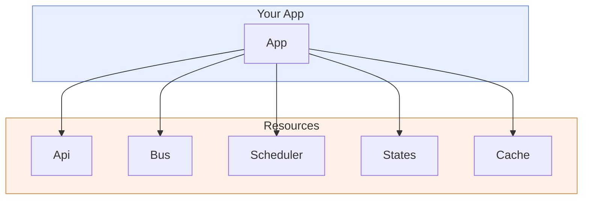

# Apps Overview

Apps are the code you write to respond to events and control your home. Each app has its own behavior, configuration, and internal state.

Apps can be **asynchronous** (preferred) or **synchronous**. Sync apps are automatically run in threads to prevent blocking the event loop.

## Structure


```mermaid
flowchart TD
    subgraph app["Your App"]
        A["App"]
    end

    subgraph resources["Resources"]
        direction LR
        Api
        Bus
        Scheduler
        States
        Cache
    end

    A --> Api & Bus & Scheduler & States & Cache

    style app fill:#e8f0ff,stroke:#6688cc
    style resources fill:#fff0e8,stroke:#cc8844
```

## Defining an App

Every app is a Python class that inherits from [`App`][hassette.app.app.App] or [`AppSync`][hassette.app.app.AppSync].

```python title="example_app.py"
--8<-- "pages/core-concepts/apps/snippets/example_app.py"
```

!!! info "What's `D.StateNew[states.LightState]`?"
    That annotation is [dependency injection](../bus/handlers.md) — you declare what data you need, and Hassette extracts and types it from the event automatically. The [Writing Handlers](../bus/handlers.md) page covers how it works. For now, just notice the pattern.

## Dates and Times

Hassette uses the [`whenever`](https://whenever.readthedocs.io/en/latest/) library for timezone-aware date/time handling instead of Python's stdlib `datetime`. Python's `datetime` has a mutable API and makes it easy to accidentally create "naive" (timezone-unaware) objects — a common source of bugs in time-sensitive automations. `whenever` is always timezone-aware and immutable, so incorrect comparisons between naive and aware times become type errors rather than silent failures. Every app provides `self.now()`, which returns a `ZonedDateTime` in your system timezone.

```python
--8<-- "pages/core-concepts/apps/snippets/apps_whenever_dates.py:imports"
```

```python
--8<-- "pages/core-concepts/apps/snippets/apps_whenever_dates.py:usage"
```

You'll see `ZonedDateTime` in scheduler parameters, persistent storage examples, and custom state definitions. If you're familiar with `datetime.datetime`, the API is similar but always timezone-aware.

## Core Capabilities

Each app receives pre-configured helpers:

- **[`self.api`](../api/index.md)** - Interact with Home Assistant.
- **[`self.bus`](../bus/index.md)** - Subscribe to events.
- **[`self.scheduler`](../scheduler/index.md)** - Schedule jobs.
- **[`self.states`](../states/index.md)** - Access entity states.
- **[`self.cache`](../cache/index.md)** - Persistent disk-based storage.
- **`self.logger`** - Dedicated logger instance.
- **[`self.app_config`](configuration.md)** - Typed configuration.
- **[`self.task_bucket`](task-bucket.md)** - Spawn background tasks and offload blocking work to a thread pool.

## Common Use Cases

### Reacting to Events

Subscribe to events using [`self.bus`](../bus/index.md) to react to changes in Home Assistant.

```python
--8<-- "pages/core-concepts/apps/snippets/apps_subscribe_state_change.py:subscribe_state_change"
```

### Run Recurring Jobs

Use [`self.scheduler`](../scheduler/index.md) to schedule recurring tasks.

```python
--8<-- "pages/core-concepts/apps/snippets/apps_run_hourly.py:run_hourly"
```

### Check Entity States

Use [`self.states`](../states/index.md) to check the current state of entities.

```python
--8<-- "pages/core-concepts/apps/snippets/apps_check_state.py:check_state"
```

### Call Services

Use [`self.api`](../api/index.md) to call Home Assistant services.

```python
--8<-- "pages/core-concepts/apps/snippets/apps_call_service.py:call_service"
```

!!! warning "Forgetting `await` on API calls"
    Every `self.api.*` method is a coroutine — it **must** be awaited. Writing `self.api.call_service(...)` without `await` returns a coroutine object and silently does nothing: no error is raised, no service is called, and no log message appears. If an API call seems to have no effect, check that you haven't dropped the `await`.

### Persist Data Between Restarts

Use [`self.cache`](../cache/index.md) to store data that should survive app restarts.

```python
--8<-- "pages/core-concepts/apps/snippets/apps_cache_counter.py:cache_counter"
```

### Run Background Tasks and Blocking Code

Use [`self.task_bucket`](task-bucket.md) to spawn fire-and-forget coroutines or offload blocking calls to a thread pool. All tracked tasks are cancelled automatically on shutdown.

```python
--8<-- "pages/core-concepts/apps/snippets/apps_task_bucket.py:spawn"
```

See the [Task Bucket](task-bucket.md) page for the full API: `spawn()`, `run_in_thread()`, `make_async_adapter()`, and cross-thread communication.

## Restricting to a Single App During Development

The `@only_app` decorator prevents multiple instances of the same app class from running. Apply it during development or testing when you want to isolate one app without editing your configuration files:

```python
--8<-- "pages/core-concepts/apps/snippets/apps_only_app.py"
```

If more than one class in your project is decorated with `@only_app`, Hassette raises an error at startup. Remove the decorator before deploying.

## Broadcasting Events Between Apps

`Bus.emit` broadcasts an event to all apps subscribed to a given topic. The event stays in-process — it never reaches Home Assistant. All apps that called `self.bus.on(topic=...)` for that topic receive it.

This is the on/emit symmetry: subscribe with `self.bus.on`, broadcast with `self.bus.emit`. Both live on the same `Bus` instance.

```python
--8<-- "pages/core-concepts/apps/snippets/apps_send_event.py:sender"
```

The receiving app subscribes to the same topic and extracts the typed data via `D.EventData[T]` — a [dependency injection](../bus/dependency-injection.md) annotation that Hassette resolves from the event envelope automatically.

```python
--8<-- "pages/core-concepts/apps/snippets/apps_send_event.py:receiver"
```

Broadcast is local and ephemeral — events are not persisted across restarts and do not leave the framework process.

!!! note "Self-delivery"
    An app that both subscribes to and emits on the same topic receives its own event. To filter self-emitted events, include a `source` field on the emitted dataclass (as `LightsSyncedData` does above) and guard in the handler: `if data.source == self.instance_name: return`.

## Synchronous Apps

??? note "AppSync — for blocking code"
    [`AppSync`][hassette.app.app.AppSync] is a subclass of `App` for automations that must call blocking (non-async) libraries. Instead of overriding `on_initialize` and `on_shutdown`, you override their `_sync`-suffixed counterparts (`on_initialize_sync`, `on_shutdown_sync`, etc.). Hassette runs these methods in a thread pool so they do not block the event loop.

    The bus, scheduler, and API are async. From a `_sync` hook, reach their synchronous facades through `.sync` — `self.bus.sync`, `self.scheduler.sync`, and `self.api.sync`. Each facade method blocks until the underlying async call completes. Calling one from inside the event loop raises `RuntimeError` instead of deadlocking.

    ```python
    from hassette import AppSync

    class MyApp(AppSync[MyConfig]):
        def on_initialize_sync(self) -> None:
            # registration runs through the .sync facades from sync code
            self.bus.sync.on_state_change("light.kitchen", handler=self.on_change, name="kitchen")
            self.scheduler.sync.run_in(self.cleanup, 60, name="cleanup")
            self.api.sync.call_service("light", "turn_on", target={"entity_id": "light.kitchen"})

        def on_change(self, event) -> None:
            ...

        def cleanup(self) -> None:
            ...

        def on_shutdown_sync(self) -> None:
            ...
    ```

    Prefer async `App` whenever possible. Use `AppSync` only when a third-party library provides no async interface and wrapping it yourself is impractical.

## Next Steps

- **[Lifecycle](lifecycle.md)**: Understand `on_initialize` and `on_shutdown`.
- **[Configuration](configuration.md)**: Learn how to use typed configuration and secrets.
