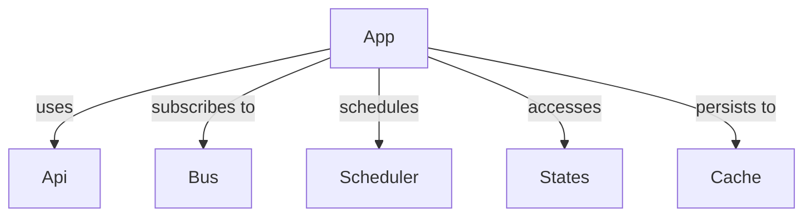

# Apps Overview

Apps are the heart of Hassette - the logic *you* write to respond to events and manipulate resources. Each app encapsulates its own behavior, configuration, and internal state.

Apps can be **asynchronous** (preferred) or **synchronous**. Sync apps are automatically run in threads to prevent blocking the event loop.

## Structure


```mermaid
graph TB
    A[App] -->|uses| Api
    A -->|subscribes to| Bus
    A -->|schedules| Scheduler
    A -->|accesses| States
    A -->|persists to| Cache
```

## Defining an App

Every app is a Python class that inherits from [`App`][hassette.app.app.App] or [`AppSync`][hassette.app.app.AppSync].

```python title="example_app.py"
--8<-- "pages/core-concepts/apps/snippets/example_app.py"
```

!!! info "Don't worry about `D` and `states` yet"
    The `D.StateNew[states.LightState]` annotation is Hassette's [dependency injection](../bus/handlers.md) system — it automatically extracts and types the new state from the event. You'll learn how it works in the [Writing Handlers](../bus/handlers.md) section. For now, just notice the pattern: declare what data you need, and Hassette provides it.

## Dates and Times

Hassette uses the [`whenever`](https://whenever.readthedocs.io) library for timezone-aware date/time handling instead of Python's stdlib `datetime`. Every app provides `self.now()`, which returns a `ZonedDateTime` in your system timezone.

```python
--8<-- "pages/core-concepts/apps/snippets/apps_whenever_dates.py:imports"
```

```python
--8<-- "pages/core-concepts/apps/snippets/apps_whenever_dates.py:usage"
```

You'll see `ZonedDateTime` in scheduler parameters, persistent storage examples, and custom state definitions. If you're familiar with `datetime.datetime`, the API is similar but always timezone-aware.

## Core Capabilities

Each app receives pre-configured helpers:

- **[`self.api`](../api/index.md)** - Interact with Home Assistant.
- **[`self.bus`](../bus/index.md)** - Subscribe to events.
- **[`self.scheduler`](../scheduler/index.md)** - Schedule jobs.
- **[`self.states`](../states/index.md)** - Access entity states.
- **[`self.cache`](../cache/index.md)** - Persistent disk-based storage.
- **`self.logger`** - Dedicated logger instance.
- **[`self.app_config`](configuration.md)** - Typed configuration.

## Common Use Cases

### Reacting to Events

Subscribe to events using [`self.bus`](../bus/index.md) to react to changes in Home Assistant.

```python
--8<-- "pages/core-concepts/apps/snippets/apps_subscribe_state_change.py:subscribe_state_change"
```

### Run Recurring Jobs

Use [`self.scheduler`](../scheduler/index.md) to schedule recurring tasks.

```python
--8<-- "pages/core-concepts/apps/snippets/apps_run_hourly.py:run_hourly"
```

### Check Entity States

Use [`self.states`](../states/index.md) to check the current state of entities.

```python
--8<-- "pages/core-concepts/apps/snippets/apps_check_state.py:check_state"
```

### Call Services

Use [`self.api`](../api/index.md) to call Home Assistant services.

```python
--8<-- "pages/core-concepts/apps/snippets/apps_call_service.py:call_service"
```

### Persist Data Between Restarts

Use [`self.cache`](../cache/index.md) to store data that should survive app restarts.

```python
--8<-- "pages/core-concepts/apps/snippets/apps_cache_counter.py:cache_counter"
```

### Run Blocking Code

If you need to call a synchronous library (e.g., a database driver or CPU-bound computation) from an async app, use `self.task_bucket.run_in_thread()` to offload it to a thread pool:

```python
--8<-- "pages/core-concepts/apps/snippets/apps_run_in_thread.py:run_in_thread"
```

For callbacks that may be sync or async, `self.task_bucket.make_async_adapter(fn)` normalizes any callable into an async callable — sync functions are automatically wrapped in `run_in_thread`.

## Next Steps

- **[Lifecycle](lifecycle.md)**: Understand `on_initialize` and `on_shutdown`.
- **[Configuration](configuration.md)**: Learn how to use typed configuration and secrets.
