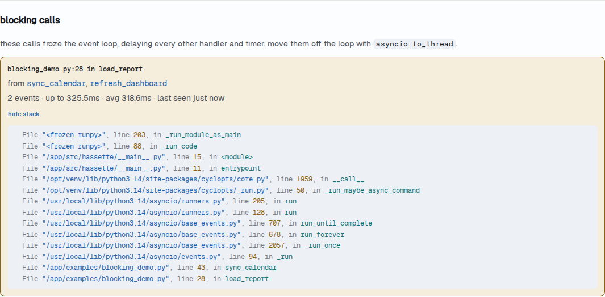

# Blocking-IO Detection

Hassette monitors the shared asyncio event loop for blocking I/O calls that stall it. When an app handler performs synchronous file, network, or sleep operations directly on the loop thread, every other handler and timer waits — detection surfaces that problem so it can be fixed.

## How It Works

Detection runs on two independent tiers.

**Tier 1 — loop-responsiveness watchdog.** A daemon thread measures how long the event loop goes without responding to a heartbeat tick. When the gap exceeds `blocking_io.lag_threshold_seconds` (default 100ms), Hassette emits a [`HassetteBlockingIOWarning`][hassette.exceptions.HassetteBlockingIOWarning] naming the app and execution that owned the loop at the time, and records a row in the `blocking_events` telemetry table.

**Tier 2 — call-site interception.** Hassette patches the known blocking primitives — `time.sleep`, `builtins.open`, `os.listdir`, `os.scandir`, `os.walk`, `glob.glob`, and blocking socket methods — to fire a warning and DB row at the exact call site. Tier 2 is on by default in `dev_mode` and off by default in production. To enable it in production, set `allow_deep_detection_in_prod = true` (or `deep_detection_enabled = true`); an explicit `deep_detection_enabled = false` keeps it off in any mode.

Both tiers share the same thread-id gate: calls that originate on a worker thread (via `asyncio.to_thread` or `run_in_executor`) pass through without triggering detection. Only calls on the event loop thread itself are flagged.

## The Warning

Both tiers emit a [`HassetteBlockingIOWarning`][hassette.exceptions.HassetteBlockingIOWarning], a `RuntimeWarning` subclass. The message names the primitive intercepted (Tier 2), the owning app, and the call site:

```text
HassetteBlockingIOWarning: Blocking I/O detected on the event loop
(Tier 2 — call-site interception) — primitive: time.sleep,
app: sensor_app, call site: sensor_app.py:42
```

The warning integrates with standard Python filter machinery: `filterwarnings("error")`, `-W error`, and `pytest.warns` all work as expected.

Tier 2 emits this warning *before* the blocking call runs. On its own the call still proceeds — the warning is informational. Escalating the warning to an error turns Tier 2 into an interceptor: with `filterwarnings("error", category=HassetteBlockingIOWarning)` active, the emit raises, and the blocking call never runs. Adding that filter to a pytest config or to application startup is the recommended way to make blocking I/O fail fast during development and CI. Tier 1 never raises — it reports a stall after the fact, regardless of the filter.

## Finding Blocking Calls

Every detection is also recorded in the telemetry database. The web UI and CLI read those records back, so a blocking call stays findable long after its warning scrolled out of the logs.

**On the app's overview.** When an app blocked the loop in the selected time window, its Overview tab shows a **blocking calls** section with one entry per line of app code to fix:



Each entry shows:

- **The call site**: the innermost line of app code on the stack, such as `calendar_service.py:98 in get_calendar_events`, with the path relative to the app directory.
- **What it calls**: the library function it called into, such as `gcsa/_services/events_service.py get_events`, or for Tier 2, the intercepted primitive such as `time.sleep`.
- **Every handler and job that reached it**, linked to its detail page. Two handlers that call the same blocking helper produce one entry, because there's one line to fix.
- **How often and how badly**: the event count, the longest and average stall, and when it last happened.
- **A show stack toggle** that expands the most recent event's full stack, with absolute paths.

Two other labels can appear in place of a call site. "Detected inside `<package>`" means Tier 2 caught the call inside a library, so the library line isn't presented as the place to fix. The handler that called into the library is further up the stack. "Call site not captured" means no stack was recorded for those events, because `capture_stack_on_block` is off or the events were recorded by an older Hassette version that didn't store stacks in this form. Those events are grouped per handler instead.

**On the apps list.** An app that blocked the loop shows an amber **N blocking** badge next to its status. The badge links to the app's overview.

**On the diagnostics page.** Stalls that Hassette couldn't pin on an app appear in a [loop stalls panel](../web-ui/diagnostics.md#loop-stalls). These are never credited to an app, even when the stack contains app code.

**From the CLI.** [`hassette blocking`](../cli/commands.md#hassette-blocking) lists the same findings for every app, plus the unattributed stalls. `--app` narrows it to one app.

### What an empty list means

Detection is best-effort. A row can be dropped when the database write queue is full, and the default time window starts at the last restart. So no listed blocking calls doesn't certify an app clean.

The entry's last-seen time is the check for a fix: if it stops advancing while the handler keeps running, the fix worked. Reloading an app in place doesn't reset the time window; a restart does.

## Fixing a Detected Call

Move the blocking work off the loop thread. `asyncio.to_thread` is the standard path for CPU-bound or I/O-bound synchronous helpers:

```python
--8<-- "pages/core-concepts/blocking-io-detection/snippets/async_fix.py"
```

The `_write_reading` method runs on a thread pool worker. The loop thread stays free while the write completes.

For third-party libraries that only expose a synchronous API, `asyncio.to_thread` is still the right wrapper — call the synchronous function from within the thread, not from the handler directly.

## Suppressing Detection for a Specific App

When migrating existing code or working with a library that has no async equivalent, set `blocking_io_behavior = "ignore"` on the app's `AppConfig`:

```python
--8<-- "pages/core-concepts/blocking-io-detection/snippets/ignore_behavior.py"
```

`"ignore"` suppresses both the warning and the `blocking_events` DB row for that app. It does not affect other apps. Remove the override once the migration is complete.

## Configuration

Tier 1 and Tier 2 are tuned in `[hassette.blocking_io]`. The global behavior default lives at `blocking_io.behavior`. Per-app overrides live on each app's config class or in `hassette.toml` under `[hassette.apps.<key>]`.

See [Global Settings](configuration/index.md#blocking-io-detection) for the full field reference.

## Synchronous Handlers Are Never Flagged

A handler written as a plain (non-`async`) function runs on a worker thread — Hassette adapts it to run off the loop automatically. Blocking I/O inside such a handler is fine: it stalls a worker thread, not the loop. The thread-id gate excludes every worker-thread call from both tiers, so synchronous handlers never trip detection no matter what they do.

## Next Steps

- [Configuration reference](configuration/index.md#blocking-io-detection): all `[hassette.blocking_io]` fields
- [App Configuration](apps/configuration.md#developer-settings): per-app `blocking_io_behavior` override
- [Database & Telemetry](database-telemetry.md): querying the `blocking_events` table
