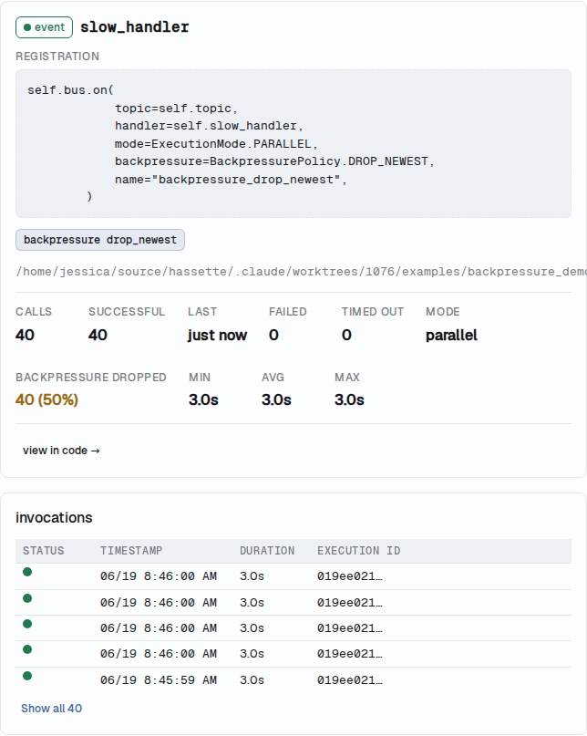

# Backpressure Policy

The `backpressure` parameter controls what a listener does when the bus
dispatch semaphore is saturated — when all concurrent dispatch slots are in
use. Two policies are available: `"block"` and `"drop_newest"`.

```python
--8<-- "pages/core-concepts/bus/snippets/backpressure_drop.py:drop_newest_basic"
```

All four bus registration methods — `on_state_change`, `on_attribute_change`,
`on_call_service`, and `on()` — accept `backpressure=`.

## The Two Policies

### `block` — wait for a slot (default)

`block` is the default for all listeners. When the semaphore is saturated,
the dispatch loop waits until a slot opens, then runs the handler. No events
are lost; the cost is latency.

Omitting `backpressure=` is identical to passing `backpressure="block"`.
Existing listeners see no behavior change.

```python
--8<-- "pages/core-concepts/bus/snippets/backpressure_drop.py:block_explicit"
```

`block` is the right policy for handlers that must not miss events — smoke
alarms, audit logs, or any handler where a dropped event leaves the system
in an incorrect state.

### `drop_newest` — skip if saturated

`drop_newest` skips the event immediately when the semaphore is saturated.
No dispatch slot is acquired, no handler task is spawned, and one drop is
recorded on the listener. The dispatch loop continues to the next listener
without waiting.

```python
--8<-- "pages/core-concepts/bus/snippets/backpressure_drop.py:drop_newest_basic"
```

`drop_newest` is the right policy for high-frequency, low-value sensors where
missing one reading is acceptable — a power meter updating every 250 ms, a
temperature sensor that bursts readings during a storm. Under normal load,
every event dispatches; the drop only fires when the bus is already saturated.

## What "Saturated" Means

The dispatch semaphore is **global** — shared by all listeners across all
apps. `drop_newest` does not drop when *this listener alone* is busy. It drops
when the *whole bus* has no free slots.

The slot count is set by `lifecycle.max_concurrent_dispatches` (default 50).
The bus is saturated when that many handlers are in flight at once.

This is different from `throttle` and `debounce`, which are per-listener rate
controls that operate inside the handler invoker. `backpressure` acts at the
acquire gate, before any handler runs.

## Non-Obvious Properties

### Starvation under sustained load

A `drop_newest` listener may not run at all while the bus stays saturated.
Every event it receives during a saturation period is dropped. The listener
resumes only once the semaphore clears.

Use `block` for handlers that must run at least once, even under load.

### Fan-out order affects which listener drops

Within a single event, the bus fans out to all matching listeners in sequence.
Each `drop_newest` listener checks the semaphore at the moment it is reached
in that sequence. A `block` listener earlier in the fan-out may take the last
slot; a `drop_newest` listener reached afterward then sees the semaphore
locked and drops.

The effective contract is: "drop if no free slot at the instant this listener
is reached." Which listener drops within one event depends on dispatch order:
matching listeners run in priority order (highest first), then in registration
order for equal priorities.

### Signal type: latency vs. silent loss

`block` converts bus saturation into **latency** — the operator sees the
dispatch queue grow and can react. `drop_newest` converts it into **silent
loss** visible only as a rising drop count.

A non-zero drop count in the [monitoring UI](../../web-ui/index.md) means the bus was saturated when
that listener's events arrived. Addressing the root cause — raising
`lifecycle.max_concurrent_dispatches`, speeding up slow handlers, or reducing
event volume — is preferable to accepting permanent drop rates.

### Drop counts are live-only

The drop count resets to zero on every app reload and process restart. The
configured *policy* is persisted to the database (the `listeners` table holds
a `backpressure` column), but the *count* is not. The monitoring UI's Handlers
tab shows the count for the current process lifetime only.

## Observability

The monitoring UI's Handlers tab shows a **Backpressure Dropped** cell for any
listener with a non-zero drop count. The cell pairs the raw count with a rate —
drops as a fraction of total activity — so a chronically-dropping listener is
visually distinct from one that dropped a single event under a brief spike.



The `backpressure_dropped_count` field is also available on the listener
summary returned by the web API. A zero drop count at all policy types means
the bus has remained below saturation since the last restart.

## Composition

### With `mode`

`backpressure` and [`mode`](execution-modes.md) operate at different points in
the dispatch pipeline and do not conflict.

- `backpressure` gates at the **semaphore acquire** — before any task is
  spawned.
- `mode` governs **handler overlap** — what happens when a started invocation
  is still running when the next trigger arrives.

Both can be active at the same time:

```python
--8<-- "pages/core-concepts/bus/snippets/backpressure_drop.py:drop_newest_single"
```

A `drop_newest` listener that passes the semaphore gate still has its overlap
handled by `mode`. If the handler is still running when the next event arrives
(and that event clears the gate), `single` drops the re-fire.

### With `debounce` and `throttle`

`debounce` and `throttle` are per-listener rate controls that fire inside the
invoker — downstream of the semaphore gate. A debounced event that clears the
gate then waits the debounce window before dispatching; a saturated gate drops
it before debounce ever runs.

The two mechanisms are independent and do not interfere.

## See Also

- [Execution Modes](execution-modes.md): `mode=` — handler overlap behavior
- [Subscription Methods](methods.md): full parameter reference, including
  `debounce`, `throttle`, `timeout`, and `if_exists`
- [Debug a Failing Handler](../../web-ui/debug-handler.md): monitoring UI
  Handlers tab where drop counts appear
