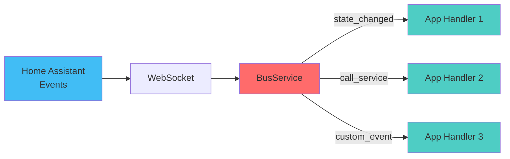

# Bus

The event bus connects your apps to Home Assistant and to Hassette
itself. It delivers events such as state changes, service calls, or
framework updates to any app that subscribes.

Apps register event handlers through `self.bus`, which is created
automatically at app instantiation.



## Overview

You can register handlers for any [Home Assistant
event](https://www.home-assistant.io/docs/configuration/events/) or
internal Hassette framework event using the event bus.

Handlers can be **async or sync**, functions or methods — no special
signature is required. If your handler needs to receive the event
object, name its first (non-`self`) parameter `event`. The name, not the
type, is what Hassette uses to decide whether to pass it.

Example:

```python
async def on_motion(self, event):
    self.logger.info("Motion detected from %s", event.payload.data["entity_id"])
```

If your handler doesn't need the event object, omit the parameter:

```python
async def on_heartbeat(self) -> None:
    self.logger.info("Heartbeat received")
```

Handlers can also accept extra `args` or `kwargs` that you provide when
subscribing.

## Event Model

Every event you receive from the bus is an [`Event`][hassette.events.base.Event]
dataclass with two main fields:

- `topic` — a string identifier describing what happened, such as
  `hass.event.state_changed` or `hassette.event.service_status`.
- `payload` — a typed wrapper containing the event data.

Home Assistant events use the format `hass.event.<event_type>` (e.g.,
`hass.event.state_changed` or `hass.event.call_service`). Hassette
framework events use `hassette.event.<event_type>` for internal events
like service status changes or file-watching updates.

Example:

```python
--8<-- "pages/core-concepts/bus/working_with_event_data_example.py"
```

## Basic Subscriptions

These helper methods cover the majority of use cases:

- `on_state_change` — listen for entity state changes
- `on_attribute_change` — listen for changes to a specific attribute
- `on_call_service` — listen for service calls
- `on` — subscribe directly to any event topic

Each method returns a [`Subscription`][hassette.bus.listeners.Subscription] handle,
which you can keep to unsubscribe later.

```python
--8<-- "pages/core-concepts/bus/basic_subscriptions_example.py"
```

Unsubscribing:

```python
sub = self.bus.on_state_change("binary_sensor.motion", handler=self.on_motion)
sub.unsubscribe()
```

Hassette automatically cleans up all subscriptions during app shutdown,
so manual unsubscription is only needed for temporary listeners.


## Matching Multiple Entities

Most subscription methods accept glob patterns for entity IDs, domains, services, etc.

!!! warning "Limitation"
    Glob patterns work for entity IDs, domains, and services, but **not** for attribute names.

```python
# any light
self.bus.on_state_change("light.*", handler=self.on_any_light)

# sensors starting with "bedroom_"
self.bus.on_state_change("sensor.bedroom_*", handler=self.on_bedroom_sensor)

# temperature attribute changes on any climate entity
self.bus.on_attribute_change("climate.*", "temperature", handler=self.on_temp_change)

# living room lights being turned on
self.bus.on_call_service(domain="light", service="turn_on",
                         where={"entity_id": "light.living_room_*"},
                         handler=self.on_living_room_lights)

# living room lights being turned on or off
self.bus.on_call_service(domain="light", service="turn_*",
                         where={"entity_id": "light.living_room_*"},
                         handler=self.on_living_room_lights)
```

For more complex patterns, use `self.bus.on(...)` with predicate-based
filters.


## Working with Event Data

Each event's `payload.data` contains the actual content.

- **State changes** → `entity_id`, `old_state`, `new_state` (both state
  objects are typed Pydantic models inheriting from
  [`BaseState`][hassette.models.states.base.BaseState])

  Common properties:

  - `.value` - the state value (e.g., `"on"`)
  - `.attributes` - a Pydantic model of all attributes
  - `.domain` and `.entity_id` - convenience accessors
  - `.last_changed` / `.last_updated` - timestamps

- **Service calls** → [`CallServicePayload`][hassette.events.hass.hass.CallServicePayload]
  with `domain`, `service`, and `service_data` fields.

!!! note "Coming Soon"
    More detailed guides on working with events, state objects, and service calls
    are coming soon!

## Advanced Subscriptions

For more complex scenarios, subscribe directly to any topic:

```python
--8<-- "pages/core-concepts/bus/advanced_subscriptions_example.py"
```

### Passing Arguments

You can pass additional arguments to your handler using `args` and
`kwargs`:

```python
--8<-- "pages/core-concepts/bus/passing_arguments_example.py"
```

### Filtering with Predicates

Predicates provide fine-grained control over which events trigger your
handlers. You can provide one or more predicates to the `where` parameter
of any subscription method - these are applied as logical AND conditions.

If you need to apply OR logic, combine multiple predicates using
`P.AnyOf(...)`.

```python
from datetime import datetime

from hassette import predicates as P

self.bus.on_state_change(
    "binary_sensor.front_door",
    handler=self.on_door_open,
    changed_to="on",
    where=[
        P.Not(P.StateFrom("unknown")),
        P.AttrTo("battery_level", lambda x: x and x > 20)
    ]
)

# Logical operators
self.bus.on_state_change(
    "media_player.living_room",
    handler=self.on_media_change,
    where=P.StateTo(P.IsIn(["playing", "paused"]))
)

# AnyOf example
self.bus.on_call_service(
    domain="light",
    service="turn_on",
    where=P.AnyOf(
        P.ServiceDataWhere.from_kwargs(brightness=lambda b: b and b > 200),
        P.ServiceDataWhere.from_kwargs(color_name="red"),
    ),
    handler=self.on_bright_or_red_light,
)
```

See [`hassette.bus.predicates`][hassette.bus.predicates] for the full list of built-ins.

!!! note "Coming Soon"
    Predicates, conditions, and accessors can do a lot, and this documentation
    doesn't yet cover enough details. An advanced guide is coming soon!

## Rate Control

To handle noisy sensors or rate-limit handlers, use `debounce` or
`throttle`:

```python
# Debounce: trigger after 2 seconds of silence
self.bus.on_state_change("binary_sensor.motion", handler=self.on_settled, debounce=2.0)

# Throttle: call at most once every 5 seconds
self.bus.on_state_change("sensor.temperature", handler=self.on_temp_log, throttle=5.0)

# One-time subscription
self.bus.on_component_loaded("hue", handler=self.on_hue_ready, once=True)
```

## Filtering Service Calls

`on_call_service` supports both dictionary and predicate-based
filtering.

### Dictionary filtering

```python
from hassette.const import ANY_VALUE

# Literal match
self.bus.on_call_service(
    domain="light",
    service="turn_on",
    where={"entity_id": "light.living_room", "brightness": 255},
    handler=self.on_bright_living_room,
)

# Require key presence (any value)
self.bus.on_call_service(
    domain="light",
    service="turn_on",
    where={"brightness": ANY_VALUE},
    handler=self.on_brightness_set,
)

# Glob patterns (auto-detected)
self.bus.on_call_service(
    domain="light",
    where={"entity_id": "light.bedroom_*"},
    handler=self.on_bedroom_lights,
)

# Callable conditions
self.bus.on_call_service(
    domain="light",
    service="turn_on",
    where={"brightness": lambda v: v and v > 200},
    handler=self.on_bright_lights,
)
```

### Predicate filtering

You can also use `P.ServiceDataWhere` and other predicates for more complex
filtering:

```python
from hassette import predicates as P

self.bus.on_call_service(
    domain="notify",
    where=P.ServiceDataWhere.from_kwargs(
        message=lambda msg: "urgent" in msg.lower(),
        title=P.Not(P.StartsWith("DEBUG")),
    ),
    handler=self.on_urgent_notification,
)
```

!!! tip "Pattern Matching Tips"
    - Use `*` for wildcard matching: `light.*`, `sensor.bedroom_*`
    - Works in `entity_id`, `domain`, and `service` parameters
    - Combine with `where` for complex filtering
    - Does **not** work for attribute names

## See Also

- [Core concepts](../index.md) — back to the core concepts overview.
- [Apps](../apps/index.md) — more on app anatomy, lifecycle, and capabilities.
- [Scheduler](../scheduler/index.md) — more on scheduling jobs and intervals.
- [API](../api/index.md) — more on interacting with Home Assistant's APIs.
- [Configuration](../configuration/index.md) — Hassette and app configuration.
