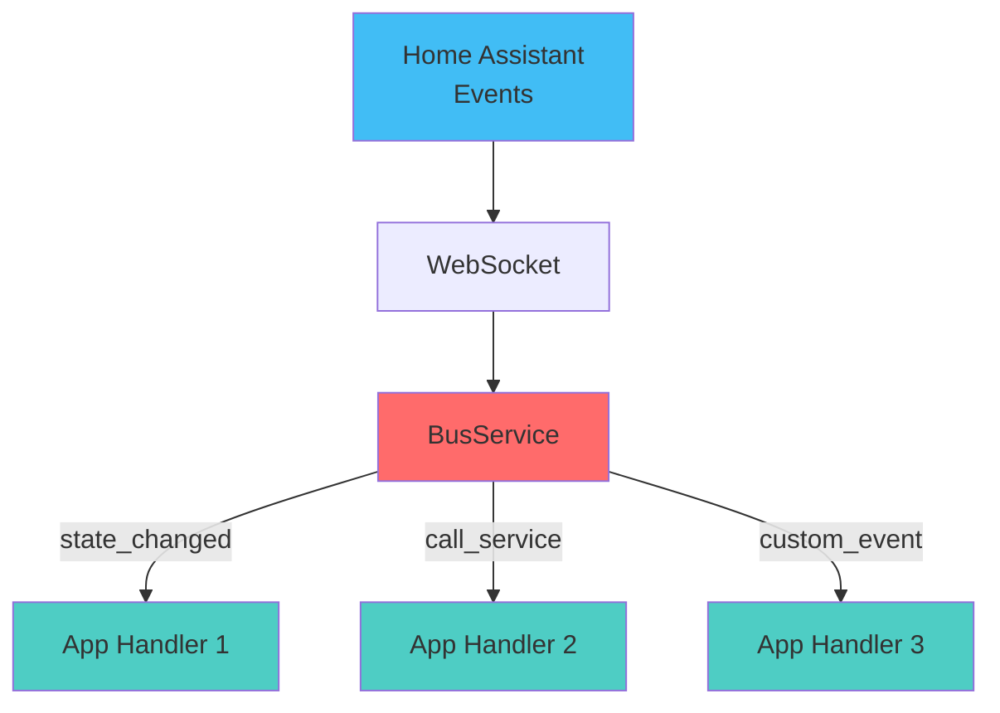

# Bus Overview

The event bus connect your apps to Home Assistant and to Hassette itself. It delivers events such as state changes, service calls, or framework updates to any app that subscribes.

Apps register event handlers through `self.bus`, which is created automatically at app instantiation.



## Subscribing to Events

The `Bus` provides helper methods for common subscriptions. Each returns a [`Subscription`][hassette.bus.listeners.Subscription] handle.

### Common Methods

- `on_state_change` - Listen for entity state changes.
- `on_attribute_change` - Listen for changes to a specific attribute.
- `on_call_service` - Listen for service calls.
- `on` - Generic subscription to any topic.

### Example

```python
async def on_initialize(self):
    # Subscribe to state changes
    sub = self.bus.on_state_change(
        "binary_sensor.motion",
        handler=self.on_motion,
        changed_to="on"
    )

# Subscriptions are cleaned up automatically on shutdown!
# But you can unsubscribe manually if needed:
# sub.cancel()
```

## Matching Multiple Entities

Most methods accept glob patterns for `entity_id`, `domain`, and `service`.

```python
# Any light
self.bus.on_state_change("light.*", handler=self.on_any_light)

# Sensors in bedroom
self.bus.on_state_change("sensor.bedroom_*", handler=self.on_bedroom_sensor)

# Specific service calls
self.bus.on_call_service(
    domain="light",
    service="turn_*",
    handler=self.on_light_service
)
```

!!! warning "Limitation"
    Glob patterns work for identifiers but **not** for attribute names or complex data values. For that, use [Predicates](filtering.md).

## Rate Control

You can rate-limit your handlers directly in the subscription call to handle noisy events.

```python
# Debounce: Wait for 2s of silence before calling
self.bus.on_state_change(
    "binary_sensor.motion",
    handler=self.on_settled,
    debounce=2.0
)

# Throttle: Call at most once every 5s
self.bus.on_state_change(
    "sensor.temperature",
    handler=self.on_temp_log,
    throttle=5.0
)

# Once: Unsubscribe automatically after first trigger
self.bus.on_component_loaded(
    "hue",
    handler=self.on_hue_ready,
    once=True
)
```

## Next Steps

- **[Writing Handlers](handlers.md)**: Learn how to write handlers using Dependency Injection to extract clean data.
- **[Filtering & Predicates](filtering.md)**: Learn how to filter events efficiently using predicates.
