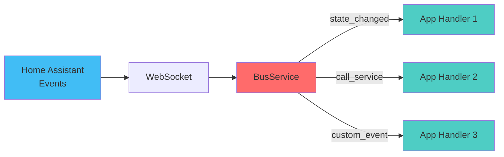

# Bus

The event bus connects your apps to Home Assistant and to Hassette
itself. It delivers events such as state changes, service calls, or
framework updates to any app that subscribes.

Apps register event handlers through `self.bus`, which is created
automatically at app instantiation.



## Overview

You can register handlers for any [Home Assistant
event](https://www.home-assistant.io/docs/configuration/events/) or
internal Hassette framework event using the event bus.

Handlers receive parameters through **dependency injection** (DI), which allows you to
specify exactly what data you need extracted from events. Along with dependency-injected parameters,
handlers can also accept arbitrary kwargs.

## Dependency Injection for Handlers

Hassette uses type annotations with the
[Annotated][typing.Annotated]
type combined with dependency markers from [dependencies][hassette.dependencies]
to automatically extract and inject event data into your handler parameters.

### Basic Patterns

**Option 1: Receive the full event** (simplest):

```python
from hassette.events import StateChangeEvent

async def on_motion(self, event: StateChangeEvent):
    entity_id = event.payload.data.entity_id
    new_value = event.payload.data.new_state_value
    self.logger.info("Motion: %s -> %s", entity_id, new_value)
```

**Option 2: Extract specific data** (recommended):

```python
from typing import Annotated
from hassette import dependencies as D
from hassette import states

async def on_motion(
    self,
    new_state: Annotated[states.BinarySensorState, D.StateNew],
    entity_id: Annotated[str, D.EntityId],
):
    friendly_name = new_state.attributes.friendly_name or entity_id
    self.logger.info("Motion detected: %s", friendly_name)
```

**Option 3: No event data needed**:

```python
async def on_heartbeat(self) -> None:
    self.logger.info("Heartbeat received")
```

### Available Dependencies

Import these from `hassette.dependencies` (commonly aliased as `D`):

#### State Extractors

- **`StateNew`** - Extract the new state object from a state change event
- **`StateOld`** - Extract the old state object (may be None for initial states)
- **`StateOldAndNew`** - Extract both states as a tuple `(old, new)`

```python
from typing import Annotated
from hassette import dependencies as D, states

async def on_light_change(
    self,
    new_state: Annotated[states.LightState, D.StateNew],
    old_state: Annotated[states.LightState | None, D.StateOld],
):
    if old_state and old_state.value != new_state.value:
        self.logger.info("Light %s: %s -> %s",
                        new_state.entity_id,
                        old_state.value,
                        new_state.value)
```

#### Attribute Extractors

- **`AttrNew("attribute_name")`** - Extract an attribute from the new state
- **`AttrOld("attribute_name")`** - Extract an attribute from the old state
- **`AttrOldAndNew("attribute_name")`** - Extract attribute from both states as tuple

```python
async def on_battery_change(
    self,
    battery_level: Annotated[int | None, D.AttrNew("battery_level")],
    entity_id: Annotated[str, D.EntityId],
):
    if battery_level is not None and battery_level < 20:
        self.logger.warning("%s battery low: %d%%", entity_id, battery_level)
```

!!! tip "Missing Attributes"
    If an attribute doesn't exist, the extractor returns `MISSING_VALUE` (a falsy sentinel).
    Always check for `None` or use `is not MISSING_VALUE` if you need to distinguish
    between missing and `None`.

#### Value Extractors

- **`StateValueNew`** - Extract just the state value string (e.g., "on", "off")
- **`StateValueOld`** - Extract the old state value string

```python
async def on_state_change(
    self,
    old_value: Annotated[str, D.StateValueOld],
    new_value: Annotated[str, D.StateValueNew],
):
    if old_value != new_value:
        self.logger.info("State changed: %s -> %s", old_value, new_value)
```

#### Identity Extractors

- **`EntityId`** - Extract the entity ID from any event
- **`Domain`** - Extract the domain (e.g., "light", "sensor")
- **`Service`** - Extract the service name from service call events

```python
from hassette.events import CallServiceEvent
from hassette import dependencies as D

async def on_service_call(
    self,
    domain: Annotated[str, D.Domain],
    service: Annotated[str, D.Service],
    entity_id: Annotated[str, D.EntityId],
):
    self.logger.info("Service called: %s.%s on %s", domain, service, entity_id)
```

#### Other Extractors

- **`ServiceData`** - Extract the service_data dict from service calls
- **`EventContext`** - Extract the Home Assistant event context

```python
async def on_light_service(
    self,
    service_data: Annotated[dict, D.ServiceData],
):
    brightness = service_data.get("brightness")
    if brightness and brightness > 200:
        self.logger.info("Bright light requested: %d", brightness)
```

### Combining Multiple Dependencies

You can extract multiple pieces of data in a single handler:

```python
async def on_climate_change(
    self,
    new_state: Annotated[states.ClimateState, D.StateNew],
    old_temp: Annotated[float | None, D.AttrOld("current_temperature")],
    new_temp: Annotated[float | None, D.AttrNew("current_temperature")],
    entity_id: Annotated[str, D.EntityId],
):
    if old_temp and new_temp and abs(new_temp - old_temp) > 2:
        friendly_name = new_state.attributes.friendly_name or entity_id
        self.logger.warning("%s temperature jumped from %.1f to %.1f",
                          friendly_name, old_temp, new_temp)
```

### Mixing DI with kwargs

You can combine dependency injection with custom kwargs:

```python
async def on_initialize(self):
    self.bus.on_state_change(
        "sensor.temperature",
        handler=self.on_temp_change,
        threshold=25.0,  # Custom kwarg
    )

async def on_temp_change(
    self,
    new_temp: Annotated[float, D.AttrNew("temperature")],
    threshold: float,  # From kwargs
):
    if new_temp > threshold:
        self.logger.warning("Temperature %.1f exceeds threshold %.1f",
                          new_temp, threshold)
```

### Restrictions

!!! warning "Handler Signature Rules"
    Handlers **cannot** use:

    - Positional-only parameters (parameters before `/`)
    - Variadic positional arguments (`*args`)

    These restrictions ensure unambiguous parameter injection.

!!! info "Type Annotations Required"
    All parameters using dependency injection must have type annotations.
    Hassette uses these annotations to determine what to extract from events.

### Custom Extractors

Extractors only need to be a callable that accepts an `Event` and returns the desired value. This means that you can create your own extractors as needed, use accessors from `hassette.bus.accessors`, or any other callable.

You can also create custom dependency extractors by subclassing
[`Depends`][hassette.dependencies.classes.Depends]:

```python
from hassette.dependencies.classes import Depends
from hassette.events import Event

class CustomExtractor(Depends):
    def __call__(self, event: Event) -> str:
        # Your custom extraction logic
        return f"custom_{event.topic}"

# Use in handler
async def on_event(
    self,
    custom_value: Annotated[str, CustomExtractor()],
):
    self.logger.info("Custom: %s", custom_value)
```

## Event Model

Every event you receive from the bus is an [`Event`][hassette.events.base.Event]
dataclass with two main fields:

- `topic` — a string identifier describing what happened, such as
  `hass.event.state_changed` or `hassette.event.service_status`.
- `payload` — a typed wrapper containing the event data.

Home Assistant events use the format `hass.event.<event_type>` (e.g.,
`hass.event.state_changed` or `hass.event.call_service`). Hassette
framework events use `hassette.event.<event_type>` for internal events
like service status changes or file-watching updates.

Example:

```python
--8<-- "pages/core-concepts/bus/working_with_event_data_example.py"
```

## Basic Subscriptions

These helper methods cover the majority of use cases:

- `on_state_change` — listen for entity state changes
- `on_attribute_change` — listen for changes to a specific attribute
- `on_call_service` — listen for service calls
- `on` — subscribe directly to any event topic

Each method returns a [`Subscription`][hassette.bus.listeners.Subscription] handle,
which you can keep to unsubscribe later.

```python
--8<-- "pages/core-concepts/bus/basic_subscriptions_example.py"
```

Unsubscribing:

```python
sub = self.bus.on_state_change("binary_sensor.motion", handler=self.on_motion)
sub.unsubscribe()
```

Hassette automatically cleans up all subscriptions during app shutdown,
so manual unsubscription is only needed for temporary listeners.


## Matching Multiple Entities

Most subscription methods accept glob patterns for entity IDs, domains, services, etc.

!!! warning "Limitation"
    Glob patterns work for entity IDs, domains, and services, but **not** for attribute names.

```python
# any light
self.bus.on_state_change("light.*", handler=self.on_any_light)

# sensors starting with "bedroom_"
self.bus.on_state_change("sensor.bedroom_*", handler=self.on_bedroom_sensor)

# temperature attribute changes on any climate entity
self.bus.on_attribute_change("climate.*", "temperature", handler=self.on_temp_change)

# living room lights being turned on
self.bus.on_call_service(domain="light", service="turn_on",
                         where={"entity_id": "light.living_room_*"},
                         handler=self.on_living_room_lights)

# living room lights being turned on or off
self.bus.on_call_service(domain="light", service="turn_*",
                         where={"entity_id": "light.living_room_*"},
                         handler=self.on_living_room_lights)
```

For more complex patterns, use `self.bus.on(...)` with predicate-based
filters.


## Working with Event Data

Each event's `payload.data` contains the actual content.

- **State changes** → `entity_id`, `old_state`, `new_state` (both state
  objects are typed Pydantic models inheriting from
  [`BaseState`][hassette.models.states.base.BaseState])

  Common properties:

  - `.value` - the state value (e.g., `"on"`)
  - `.attributes` - a Pydantic model of all attributes
  - `.domain` and `.entity_id` - convenience accessors
  - `.last_changed` / `.last_updated` - timestamps

- **Service calls** → [`CallServicePayload`][hassette.events.hass.hass.CallServicePayload]
  with `domain`, `service`, and `service_data` fields.

!!! note "Coming Soon"
    More detailed guides on working with events, state objects, and service calls
    are coming soon!

## Advanced Subscriptions

For more complex scenarios, subscribe directly to any topic:

```python
--8<-- "pages/core-concepts/bus/advanced_subscriptions_example.py"
```

### Passing Arguments

You can pass additional arguments to your handler using `args` and
`kwargs`:

```python
--8<-- "pages/core-concepts/bus/passing_arguments_example.py"
```

### Filtering with Predicates

Predicates provide fine-grained control over which events trigger your
handlers. You can provide one or more predicates to the `where` parameter
of any subscription method - these are applied as logical AND conditions.

If you need to apply OR logic, combine multiple predicates using
`P.AnyOf(...)`.

```python
from datetime import datetime

from hassette import predicates as P

self.bus.on_state_change(
    "binary_sensor.front_door",
    handler=self.on_door_open,
    changed_to="on",
    where=[
        P.Not(P.StateFrom("unknown")),
        P.AttrTo("battery_level", lambda x: x and x > 20)
    ]
)

# Logical operators
self.bus.on_state_change(
    "media_player.living_room",
    handler=self.on_media_change,
    where=P.StateTo(P.IsIn(["playing", "paused"]))
)

# AnyOf example
self.bus.on_call_service(
    domain="light",
    service="turn_on",
    where=P.AnyOf(
        P.ServiceDataWhere.from_kwargs(brightness=lambda b: b and b > 200),
        P.ServiceDataWhere.from_kwargs(color_name="red"),
    ),
    handler=self.on_bright_or_red_light,
)
```

See [`hassette.bus.predicates`][hassette.bus.predicates] for the full list of built-ins.

!!! note "Coming Soon"
    Predicates, conditions, and accessors can do a lot, and this documentation
    doesn't yet cover enough details. An advanced guide is coming soon!

## Rate Control

To handle noisy sensors or rate-limit handlers, use `debounce` or
`throttle`:

```python
# Debounce: trigger after 2 seconds of silence
self.bus.on_state_change("binary_sensor.motion", handler=self.on_settled, debounce=2.0)

# Throttle: call at most once every 5 seconds
self.bus.on_state_change("sensor.temperature", handler=self.on_temp_log, throttle=5.0)

# One-time subscription
self.bus.on_component_loaded("hue", handler=self.on_hue_ready, once=True)
```

## Filtering Service Calls

`on_call_service` supports both dictionary and predicate-based
filtering.

### Dictionary filtering

```python
from hassette.const import ANY_VALUE

# Literal match
self.bus.on_call_service(
    domain="light",
    service="turn_on",
    where={"entity_id": "light.living_room", "brightness": 255},
    handler=self.on_bright_living_room,
)

# Require key presence (any value)
self.bus.on_call_service(
    domain="light",
    service="turn_on",
    where={"brightness": ANY_VALUE},
    handler=self.on_brightness_set,
)

# Glob patterns (auto-detected)
self.bus.on_call_service(
    domain="light",
    where={"entity_id": "light.bedroom_*"},
    handler=self.on_bedroom_lights,
)

# Callable conditions
self.bus.on_call_service(
    domain="light",
    service="turn_on",
    where={"brightness": lambda v: v and v > 200},
    handler=self.on_bright_lights,
)
```

### Predicate filtering

You can also use `P.ServiceDataWhere` and other predicates for more complex
filtering:

```python
from hassette import predicates as P

self.bus.on_call_service(
    domain="notify",
    where=P.ServiceDataWhere.from_kwargs(
        message=lambda msg: "urgent" in msg.lower(),
        title=P.Not(P.StartsWith("DEBUG")),
    ),
    handler=self.on_urgent_notification,
)
```

!!! tip "Pattern Matching Tips"
    - Use `*` for wildcard matching: `light.*`, `sensor.bedroom_*`
    - Works in `entity_id`, `domain`, and `service` parameters
    - Combine with `where` for complex filtering
    - Does **not** work for attribute names

## See Also

- [Core concepts](../index.md) — back to the core concepts overview.
- [Apps](../apps/index.md) — more on app anatomy, lifecycle, and capabilities.
- [Scheduler](../scheduler/index.md) — more on scheduling jobs and intervals.
- [API](../api/index.md) — more on interacting with Home Assistant's APIs.
- [Configuration](../configuration/index.md) — Hassette and app configuration.
