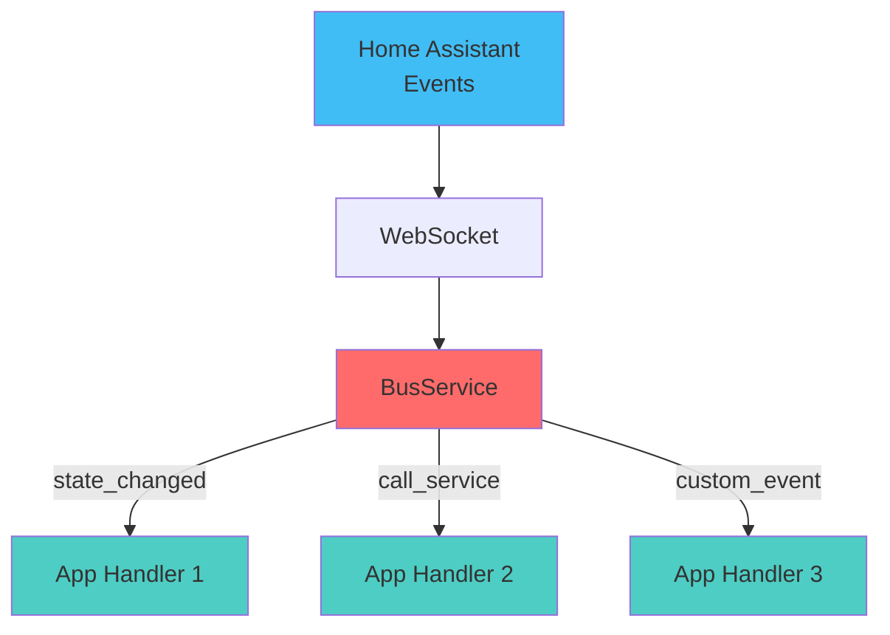

# Bus Overview

The event bus connects your apps to Home Assistant and to Hassette itself. It delivers events such as state changes, service calls, or framework updates to any app that subscribes.

Apps register event handlers through `self.bus`, which is created automatically at app instantiation.


```mermaid
graph TB
    HA[Home Assistant<br/>Events] --> WS[WebSocket]
    WS --> BUS[BusService]
    BUS --> |state_changed| APP1[App Handler 1]
    BUS --> |call_service| APP2[App Handler 2]
    BUS --> |custom_event| APP3[App Handler 3]

    style HA fill:#41bdf5
    style BUS fill:#ff6b6b
    style APP1 fill:#4ecdc4
    style APP2 fill:#4ecdc4
    style APP3 fill:#4ecdc4
```

## Subscribing to Events

The `Bus` provides helper methods for common subscriptions. Each returns a [`Subscription`][hassette.bus.listeners.Subscription] handle.

### Common Methods

- `on_state_change` - Listen for entity state changes.
- `on_attribute_change` - Listen for changes to a specific attribute.
- `on_call_service` - Listen for service calls.
- `on` - Generic subscription to any topic.
- `on_component_loaded` - Listen for Home Assistant component load events.

### Example

```python
--8<-- "pages/core-concepts/bus/snippets/bus_subscribe_state_change.py:subscribe"
```

## Matching Multiple Entities

Most methods accept glob patterns for `entity_id`, `domain`, and `service`.

```python
--8<-- "pages/core-concepts/bus/snippets/bus_glob_patterns.py:glob_patterns"
```

!!! warning "Limitation"
    Glob patterns work for identifiers but **not** for attribute names or complex data values. For that, use [Predicates](filtering.md).

## Rate Control

You can rate-limit your handlers directly in the subscription call to handle noisy events.

```python
--8<-- "pages/core-concepts/bus/snippets/bus_rate_control.py:rate_control"
```

Both `debounce` and `throttle` must be positive; zero or negative values raise `ValueError` at registration. Specifying both `debounce` and `throttle` together also raises `ValueError` — only one rate-limiting strategy may be active at a time. Combining `once=True` with either also raises `ValueError`.

## Immediate Fire

Pass `immediate=True` to fire your handler right at registration time if the entity already matches your predicates. The handler receives a synthetic event with `old_state=None` and `new_state=<current state>`. Without `immediate=True`, the handler only fires on the next change.

```python
--8<-- "pages/core-concepts/bus/snippets/bus_immediate_fire.py:immediate_fire"
```

`immediate=True` composes with `once=True`: the immediate fire counts as the single invocation, so the subscription is automatically cancelled afterward if the entity already matches. It also composes with `debounce` and `throttle` — the immediate fire passes through rate limiting the same way a live event does.

!!! warning "Glob patterns not supported"
    `immediate=True` cannot be combined with glob entity patterns (for example, `"light.*"`). Hassette cannot determine which entity to read state from when the pattern matches multiple entities. A `ValueError` is raised at registration.

## Duration Hold

Pass `duration=N` (seconds) to delay your handler until the entity has remained in the matching state for N continuous seconds. If the entity leaves the matching state before the duration elapses, the timer is cancelled and the handler does not fire.

```python
--8<-- "pages/core-concepts/bus/snippets/bus_duration_hold.py:duration_hold"
```

`duration` composes with `once=True`: the handler fires at most once after the duration gate passes. It also composes with `immediate=True` for restart resilience: when the app starts and the entity is already in the target state, Hassette consults `last_changed` to compute how long it has already been there. If that elapsed time exceeds `duration`, the handler fires immediately. If not, a timer starts for the remaining time.

**Validation rules:**

- `duration` must be a positive number; zero or negative raises `ValueError`.
- `duration` cannot be combined with `debounce` or `throttle` — raises `ValueError`. Use duration for the "held for N seconds" pattern; use debounce for the "settled after N seconds of silence" pattern. They are different behaviors that cannot be composed.
- Glob entity patterns are not supported with `duration` — raises `ValueError`.

## Timeouts

All subscription methods (`on`, `on_state_change`, `on_attribute_change`, `on_call_service`, `on_component_loaded`) accept `timeout` and `timeout_disabled` parameters to control per-listener execution timeouts.

| Parameter | Type | Default | Description |
|-----------|------|---------|-------------|
| `timeout` | `float \| None` | `None` | Per-listener timeout in seconds. `None` uses the global `event_handler_timeout_seconds` default. A positive `float` overrides it. |
| `timeout_disabled` | `bool` | `False` | When `True`, disables timeout enforcement for this listener regardless of the global default. |

```python
# Override the global timeout for a slow handler
self.bus.on_state_change(
    "sensor.weather",
    handler=self.fetch_forecast,
    timeout=30.0,  # 30 seconds instead of the global default
)

# Disable timeout for a handler that legitimately runs long
self.bus.on_state_change(
    "input_boolean.run_backup",
    handler=self.run_full_backup,
    timeout_disabled=True,
)
```

See [Timeouts](../configuration/global.md#timeouts) for global configuration and override semantics.

## Handler Exceptions

If a handler raises an exception, Hassette catches it, logs it at `ERROR` level with the full traceback, and records the failure in the telemetry database. The exception does not propagate — the app keeps running, and the next event dispatches as normal. Other handlers for the same event are not affected.

This is the same behavior as scheduled jobs: unhandled exceptions are logged to error but do not crash anything.

??? info "Registration Identity"
    All subscription methods accept an optional `name=` parameter that sets a stable natural key for the listener:

    ```python
    --8<-- "pages/core-concepts/bus/snippets/bus_registration_identity.py:registration_identity"
    ```

    Without `name=`, Hassette derives a natural key from the handler function name, topic, and predicate signature. If two subscriptions share the same derived key — for example, two calls to `on_state_change` for the same entity with the same handler — registering the second one raises a `ValueError`:

    ```
    ValueError: Duplicate listener registration detected for handler 'on_motion'
    on topic 'hass.event.state_changed.binary_sensor.motion' (key='on_motion'). Add name= to disambiguate if intentional.
    ```

    The `name=` parameter resolves this: it replaces the derived key with your explicit value, making each registration distinct.

    !!! note "Persistence"
        Listener and job names survive restarts. When Hassette starts, existing registrations are matched by their natural key and updated in place rather than re-inserted. See [Registration Persistence](../database-telemetry.md#registration-persistence) for details.

## Next Steps

- **[Writing Handlers](handlers.md)**: Learn how to write handlers using Dependency Injection to extract clean data.
- **[Filtering & Predicates](filtering.md)**: Learn how to filter events efficiently using predicates.
