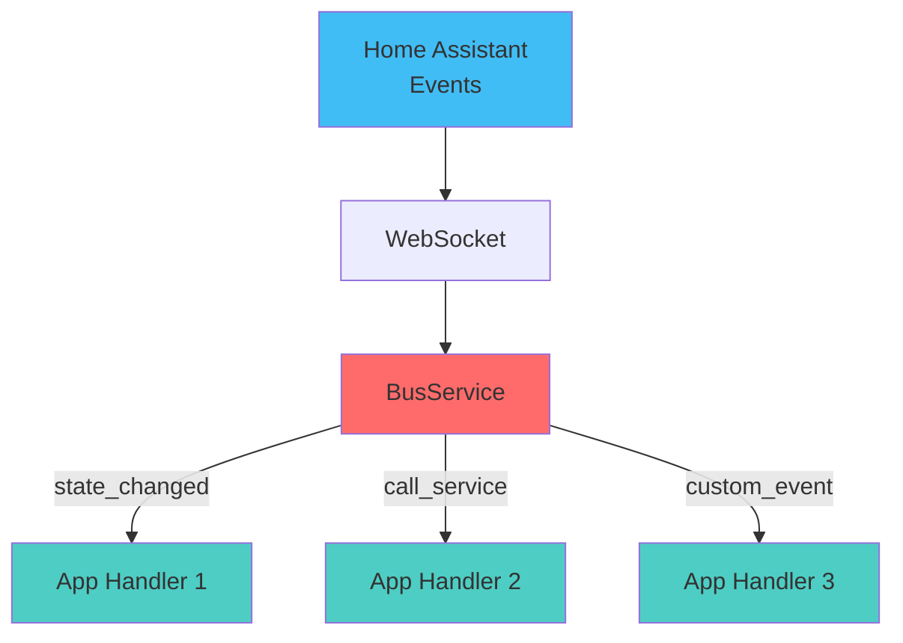

# Bus Overview

The event bus connects your apps to Home Assistant and to Hassette itself. It delivers events such as state changes, service calls, or framework updates to any app that subscribes.

Apps register event handlers through `self.bus`, which is created automatically at app instantiation.


```mermaid
graph TB
    HA[Home Assistant<br/>Events] --> WS[WebSocket]
    WS --> BUS[BusService]
    BUS --> |state_changed| APP1[App Handler 1]
    BUS --> |call_service| APP2[App Handler 2]
    BUS --> |custom_event| APP3[App Handler 3]

    style HA fill:#41bdf5
    style BUS fill:#ff6b6b
    style APP1 fill:#4ecdc4
    style APP2 fill:#4ecdc4
    style APP3 fill:#4ecdc4
```

## Subscribing to Events

The `Bus` provides helper methods for common subscriptions. Each returns a [`Subscription`][hassette.bus.listeners.Subscription] handle.

### Common Methods

- `on_state_change` - Listen for entity state changes.
- `on_attribute_change` - Listen for changes to a specific attribute.
- `on_call_service` - Listen for service calls.
- `on` - Generic subscription to any topic.
- `on_component_loaded` - Listen for Home Assistant component load events.

### Example

```python
async def on_initialize(self):
    # Subscribe to state changes
    sub = self.bus.on_state_change(
        "binary_sensor.motion",
        handler=self.on_motion,
        changed_to="on"
    )

# Subscriptions are cleaned up automatically on shutdown!
# But you can unsubscribe manually if needed:
# sub.cancel()
```

## Matching Multiple Entities

Most methods accept glob patterns for `entity_id`, `domain`, and `service`.

```python
# Any light
self.bus.on_state_change("light.*", handler=self.on_any_light)

# Sensors in bedroom
self.bus.on_state_change("sensor.bedroom_*", handler=self.on_bedroom_sensor)

# Specific service calls
self.bus.on_call_service(
    domain="light",
    service="turn_*",
    handler=self.on_light_service
)
```

!!! warning "Limitation"
    Glob patterns work for identifiers but **not** for attribute names or complex data values. For that, use [Predicates](filtering.md).

## Rate Control

You can rate-limit your handlers directly in the subscription call to handle noisy events.

```python
# Debounce: Wait for 2s of silence before calling
self.bus.on_state_change(
    "binary_sensor.motion",
    handler=self.on_settled,
    debounce=2.0
)

# Throttle: Call at most once every 5s
self.bus.on_state_change(
    "sensor.temperature",
    handler=self.on_temp_log,
    throttle=5.0
)

# Once: Unsubscribe automatically after first trigger
self.bus.on_component_loaded(
    "hue",
    handler=self.on_hue_ready,
    once=True
)
```

Both `debounce` and `throttle` must be positive; zero or negative values raise `ValueError` at registration. Specifying both `debounce` and `throttle` together also raises `ValueError` — only one rate-limiting strategy may be active at a time. Combining `once=True` with either also raises `ValueError`.

## Registration Identity

All subscription methods accept an optional `name=` parameter that sets a stable natural key for the listener:

```python
async def on_initialize(self):
    self.bus.on_state_change(
        "binary_sensor.motion",
        handler=self.on_motion,
        name="motion_sensor_main",
    )

    self.bus.on_state_change(
        "binary_sensor.motion",
        handler=self.on_motion_log,
        name="motion_sensor_log",
    )
```

Without `name=`, Hassette derives a natural key from the handler function name, topic, and predicate signature. If two subscriptions share the same derived key — for example, two calls to `on_state_change` for the same entity with the same handler — registering the second one raises a `ValueError`:

```
ValueError: Duplicate listener registration detected for handler 'on_motion'
on topic 'hass.event.state_changed.binary_sensor.motion' (key='on_motion'). Add name= to disambiguate if intentional.
```

The `name=` parameter resolves this: it replaces the derived key with your explicit value, making each registration distinct.

!!! note "Persistence"
    Listener and job names survive restarts. When Hassette starts, existing registrations are matched by their natural key and updated in place rather than re-inserted. See [Registration Persistence](../database-telemetry.md#registration-persistence) for details.

## Next Steps

- **[Writing Handlers](handlers.md)**: Learn how to write handlers using Dependency Injection to extract clean data.
- **[Filtering & Predicates](filtering.md)**: Learn how to filter events efficiently using predicates.
