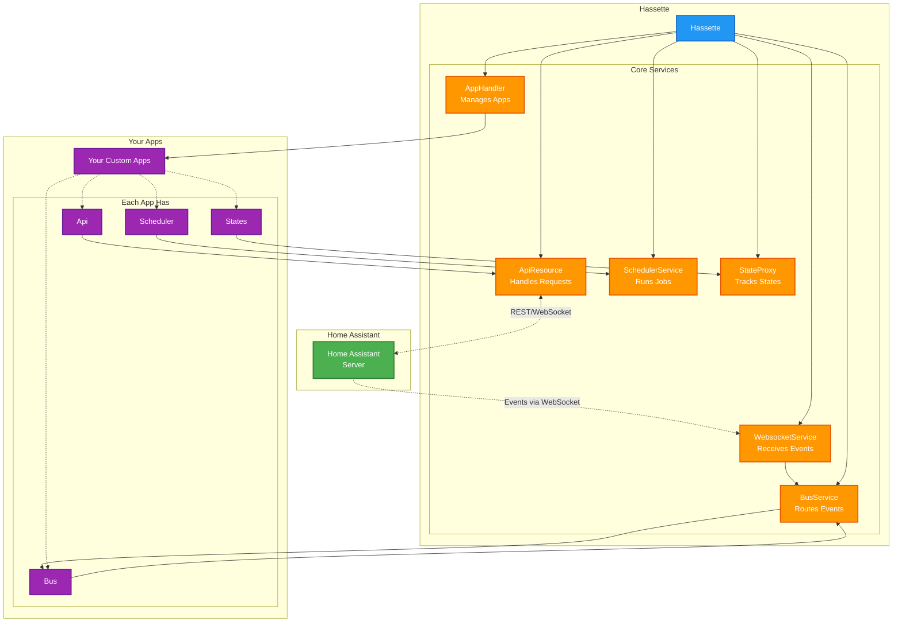

# Core Concepts

Hassette has a lot of moving parts, but at its core it’s simple: everything revolves around **apps**, **events**, and **resources**.

- **Apps** are what you write. They respond to events and manipulate resources.
- **Events** describe what happened—state changes, service calls, lifecycle transitions, or scheduled triggers.
- **Resources** are everything else: API clients, the event bus, the scheduler, etc.

## Hassette Architecture

At runtime the `Hassette` class is the entry point. It receives a `HassetteConfig` instance that defines where to find Home Assistant, your apps, and related configuration. From there it starts the core services:

- `WebsocketService` – maintains the WebSocket connection and dispatches events.
- `ApiResource` – typed interface to Home Assistant’s REST and WebSocket APIs.
- `BusService` – routes events from the socket to subscribed apps.
- `SchedulerService` – runs scheduled jobs.
- `AppHandler` – discovers, loads, and initializes your apps.
- `StateProxy` - tracks state changes and provides a consistent view of Home Assistant states.

Each app is loaded through `AppHandler` and receives its own lightweight handles:

- `Api` – wrapper around `ApiResource` for making API calls.
- `Bus` – subscribe to and handle events.
- `Scheduler` – schedule and manage jobs.
- `States` – access and manage Home Assistant entity states.

### Diagram

Learn more about writing apps in the [apps](apps/index.md) section.

## See Also

- [Apps](apps/index.md) – how apps fit into the overall architecture.
- [Bus](bus/index.md) – subscribing to and handling events.
- [Scheduler](scheduler/index.md) – scheduling jobs and intervals.
- [API](api/index.md) – interacting with Home Assistant.
- [States](states/index.md) – working with state models.
- [Configuration](configuration/index.md) – Hassette and app configuration.

## Advanced Topics

For deeper dives into advanced features:

- [Dependency Injection](../advanced/dependency-injection.md) – automatic event data extraction and type conversion.
- [Type Registry](../advanced/type-registry.md) – automatic value type conversion system.
- [State Registry](../advanced/state-registry.md) – domain to state model mapping.
- [Custom States](../advanced/custom-states.md) – defining your own state classes.
- [Value Converters](../advanced/value-converters.md) – complete reference of built-in type converters.
