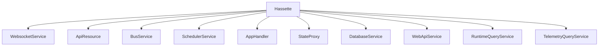
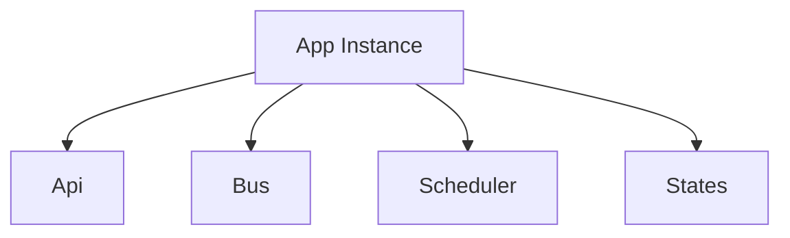
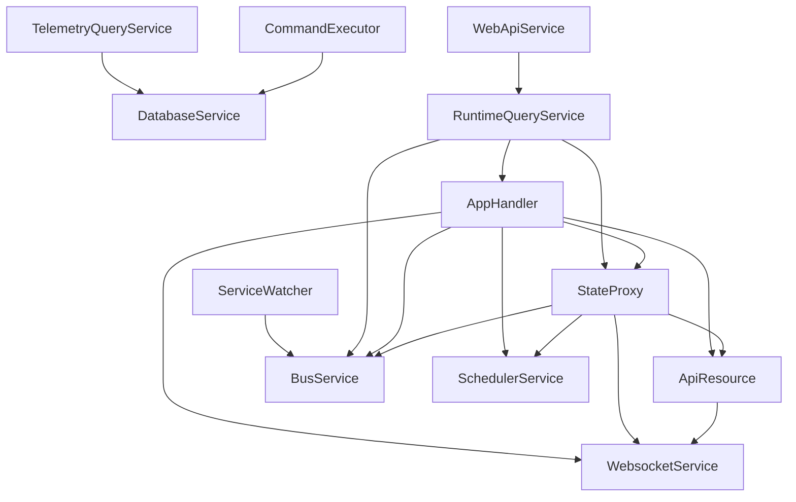

# Architecture

Hassette has a lot of moving parts, but at its core it’s simple: everything revolves around **apps**, **events**, and **resources**.

- **Apps** are what you write. They respond to events and manipulate resources.
- **Events** describe what happened—state changes, service calls, lifecycle transitions, or scheduled triggers.
- **Resources** are everything else: API clients, the event bus, the scheduler, etc.

## Hassette Architecture

At runtime, the `Hassette` class is the entry point. It receives a `HassetteConfig` instance that defines where to find Home Assistant, your apps, and related configuration.

Each app you write receives four lightweight handles — these are the objects you call in your automation code:

- [`Api`](api/index.md) – call Home Assistant services, read entity states, and subscribe to WebSocket messages.
- [`Bus`](bus/index.md) – subscribe to state change events and service call events.
- [`Scheduler`](scheduler/index.md) – schedule one-off and recurring jobs.
- [`States`](states/index.md) – read the current state of any Home Assistant entity, instantly, from local memory.

??? note "Internal services"
    Hassette starts several infrastructure services to support your apps. These are not user-facing and do not appear in your app code, but they may appear in debug logs:

    - `WebsocketService` – maintains the WebSocket connection and dispatches events.
    - `ApiResource` – typed interface to Home Assistant's REST and WebSocket APIs.
    - `BusService` – routes events from the socket to subscribed apps.
    - `SchedulerService` – runs scheduled jobs.
    - `AppHandler` – discovers, loads, and initializes your apps. Configured via [Application Configuration](configuration/applications.md).
    - `StateProxy` – tracks state changes and provides a consistent view of Home Assistant states.
    - `DatabaseService` – persistent telemetry storage, configurable via `db_*` fields in [global settings](configuration/global.md).
    - `WebApiService` – serves the REST API, healthcheck, and web UI.
    - `RuntimeQueryService` – provides live runtime data (events, logs, metrics) to the web UI.
    - `TelemetryQueryService` – serves historical telemetry (invocations, executions, errors) from the database.
    - `EventStreamService` – event delivery pipeline.
    - `ServiceWatcher` – monitors and restarts failed services.
    - `FileWatcherService` – detects code changes for hot reload.
    - `SessionManager` – tracks session lifecycle.
    - `CommandExecutor` – dispatches app management commands.

### Diagrams

These diagrams illustrate the architecture and relationships between the main components. Diagrams 1–2 show what Hassette is made of internally; diagram 3 shows the four handles your app code calls directly.

#### 1) High-level flow


```mermaid
graph LR
    HA[Home Assistant] <--> H[Hassette]
    H --> APPS[Your Apps]
    APPS --> H
```

#### 2) Core services inside Hassette


```mermaid
graph TB
    H[Hassette]
    H --> WS[WebsocketService]
    H --> API[ApiResource]
    H --> BUS[BusService]
    H --> SCHED[SchedulerService]
    H --> APPS[AppHandler]
    H --> STATE[StateProxy]
    H --> DB[DatabaseService]
    H --> WEB[WebApiService]
    H --> RTQ[RuntimeQueryService]
    H --> TQ[TelemetryQueryService]
```

#### 3) What each app gets (lightweight handles)


```mermaid
graph TB
    APP[App Instance]
    APP --> API[Api]
    APP --> BUS[Bus]
    APP --> SCHED[Scheduler]
    APP --> STATES[States]
```

Learn more about writing apps in the [apps](apps/index.md) section.

## Service Dependency Graph

Every internal Hassette service declares which other services it needs to be ready before it can initialize. This declaration drives both startup ordering and shutdown ordering — automatically, without any explicit sequencing code in the services themselves.

### How `depends_on` works

Each service class carries a `depends_on` ClassVar that lists the resource types it depends on:

```python
from typing import ClassVar
from hassette.resources.base import Resource, Service
from hassette.core.database_service import DatabaseService


class CommandExecutor(Service):
    depends_on: ClassVar[list[type[Resource]]] = [DatabaseService]
```

At startup, Hassette validates the full dependency graph and computes a topological initialization order. When a service initializes, it automatically waits for every service in its `depends_on` list to become ready before any of its own lifecycle hooks (`on_initialize`, etc.) run. You do not need to call `wait_for_ready()` yourself — the framework handles it.

`depends_on` is scoped to Hassette's direct children — the top-level services registered with the `Hassette` instance. It is not used for child resources inside a service.

!!! note "Coordinator gate vs. service dependency"
    `Hassette.ready_event` is a separate mechanism from `depends_on`. It signals that the coordinator is ready to begin starting services, but does not guarantee that every service has finished starting. Services like `BusService`, `SchedulerService`, and `FileWatcherService` wait on it before processing user-visible work. Do not confuse this coordinator gate with `depends_on`, which expresses readiness ordering between individual services.

### Initialization and shutdown order

Both startup and shutdown use **wave-based ordering**. The dependency graph is partitioned into levels: level 0 has services with no dependencies, level 1 has services that depend only on level 0, and so on. Each wave starts (or shuts down) concurrently via `asyncio.gather`, but waves execute sequentially — so all dependencies are guaranteed ready before their dependents begin.

Shutdown proceeds in reverse wave order. Services that depend on others shut down first; services depended upon (like `DatabaseService`) shut down last. For example, `AppHandler` shuts down before `StateProxy`, and `StateProxy` shuts down before `WebsocketService`.

### Cycle detection

Hassette validates the dependency graph at construction time. If a cycle exists — for example, service A declares `depends_on = [B]` and B declares `depends_on = [A]` — startup raises a `ValueError` with the full cycle path before any service starts:

```
ValueError: Cycle detected: CommandExecutor → DatabaseService → CommandExecutor
```

Fix cycles by restructuring the dependency so one service no longer needs the other to be ready first.

### Framework dependency graph

The built-in services have the following declared dependencies:


```mermaid
graph TD
    DB[DatabaseService]
    WS[WebsocketService]
    CMD[CommandExecutor]
    API[ApiResource]
    BUS[BusService]
    SCHED[SchedulerService]
    SP[StateProxy]
    AH[AppHandler]
    RQS[RuntimeQueryService]
    TQS[TelemetryQueryService]
    WEB[WebApiService]
    SW[ServiceWatcher]

    CMD --> DB
    API --> WS
    SP --> WS
    SP --> API
    SP --> BUS
    SP --> SCHED
    AH --> WS
    AH --> API
    AH --> BUS
    AH --> SCHED
    AH --> SP
    RQS --> BUS
    RQS --> SP
    RQS --> AH
    TQS --> DB
    WEB --> RQS
    SW --> BUS
```

An arrow from A to B means "A depends on B" — B must be ready before A initializes.

`DatabaseService`, `WebsocketService`, `BusService`, and `SchedulerService` have no declared dependencies and initialize first. `WebApiService` is the deepest node in the graph (via `RuntimeQueryService` → `AppHandler` → `StateProxy`).

!!! note "EventStreamService"
    `EventStreamService` has a constructor-time dependency: it passes a receive stream to `BusService` at Hassette construction time, before any service initializes. This structural ordering is enforced by child registration order rather than `depends_on`, which only expresses runtime readiness dependencies.

## See Also

- [Apps](apps/index.md) – how apps fit into the overall architecture.
- [Bus](bus/index.md) – subscribing to and handling events.
- [Scheduler](scheduler/index.md) – scheduling jobs and intervals.
- [API](api/index.md) – interacting with Home Assistant.
- [States](states/index.md) – working with state models.
- [Configuration](configuration/index.md) – Hassette and app configuration.
- [Web UI](../web-ui/index.md) – browser-based monitoring and management.
- [API Reference](../../reference/) – full auto-generated reference for all public modules.

??? note "Advanced Topics — read these after you're comfortable with the basics"
    Once you've written a few automations, these topics give you more control:

    - [Dependency Injection](bus/dependency-injection.md) – automatic event data extraction and type conversion.
    - [Type Registry](../advanced/type-registry.md) – automatic value type conversion system.
    - [State Registry](../advanced/state-registry.md) – domain to state model mapping.
    - [Custom States](../advanced/custom-states.md) – defining your own state classes.
