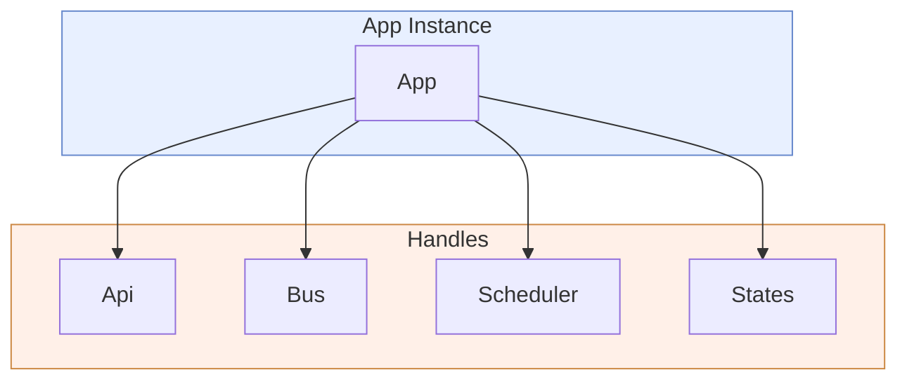

# Architecture

Hassette connects Home Assistant to the automations app authors write. It receives events over a WebSocket and routes them through an event bus to subscribed handlers. Each app gets typed access to the Home Assistant API, entity states, and a scheduler.

Three concepts underpin everything: apps, events, and resources.

- Apps run the automation logic. Each app subscribes to events, schedules tasks, and calls Home Assistant services.
- Events describe what happened: a state change, a service call, a scheduled trigger, or a lifecycle transition.
- Resources are the objects apps use to act: the bus, the scheduler, the API client, and the state cache.

## Per-App Handles

Every [`App`](apps/index.md) instance carries four handles. These are the objects automation code calls directly.

- [`Api`](api/index.md) calls Home Assistant services, reads and writes entity states, and sends WebSocket commands.
- [`Bus`](bus/index.md) delivers Home Assistant events (state changes, service calls, component loads) to subscribed handlers.
- [`Scheduler`](scheduler/index.md) runs functions at a specified time, after a delay, or on a recurring interval.
- [`States`](states/index.md) returns the current state of any Home Assistant entity from a local in-memory cache.

Each handle is scoped to the app instance. Listeners registered on one app's `Bus` do not fire for another app. Jobs scheduled on one app's `Scheduler` cancel independently of all others.

```mermaid
flowchart TD
    subgraph app["App Instance"]
        APP["App"]
    end

    subgraph handles["Handles"]
        direction LR
        API[Api]
        BUS[Bus]
        SCHED[Scheduler]
        STATES[States]
    end

    APP --> API & BUS & SCHED & STATES

    style app fill:#e8f0ff,stroke:#6688cc
    style handles fill:#fff0e8,stroke:#cc8844
```

## Topics

- [Apps](apps/index.md): the `App` base class, lifecycle hooks, and [`AppConfig`][hassette.app.app_config.AppConfig].
- [Bus](bus/index.md): subscribing to events, filtering, handler options.
- [Scheduler](scheduler/index.md): triggers, job groups, jitter.
- [API](api/index.md): service calls, state reads, WebSocket commands.
- [States](states/index.md): state models, domain access, type conversion.
- [Configuration](configuration/index.md): Hassette and app configuration.
- [Web UI](../web-ui/index.md): browser-based monitoring and management.
- [System Internals](internals/lifecycle.md): service lifecycle, startup sequence, resource hierarchy.
- [API Reference](../../reference/index.md): auto-generated reference for all public modules.

??? note "Advanced Topics"
    - [Dependency Injection](bus/dependency-injection.md): automatic event data extraction and type conversion.
    - [State Conversion](states/conversion.md): domain-to-class mapping and value type conversion.
    - [Custom States](states/custom-states.md): defining custom state classes for non-standard entity types.
