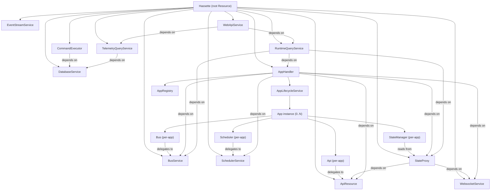
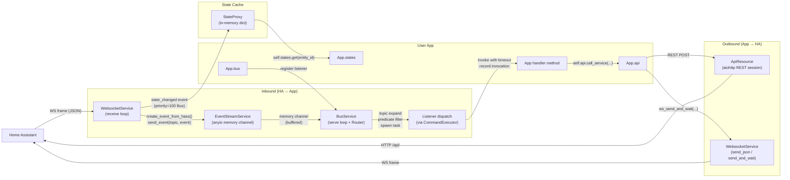
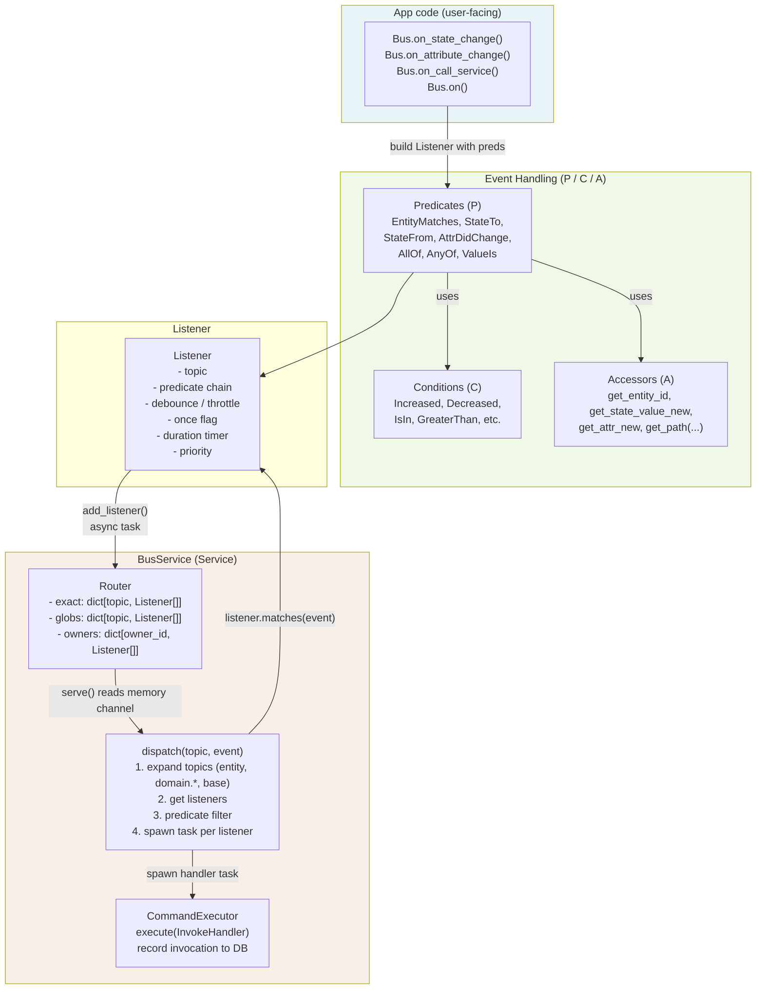
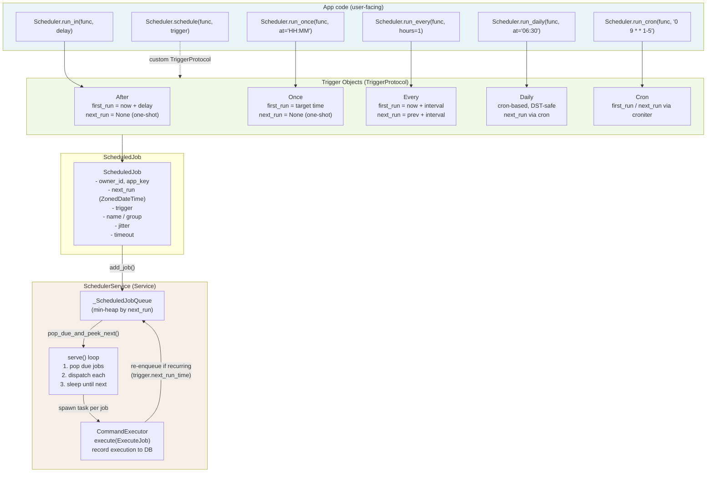
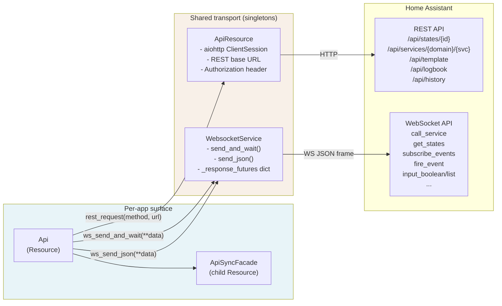
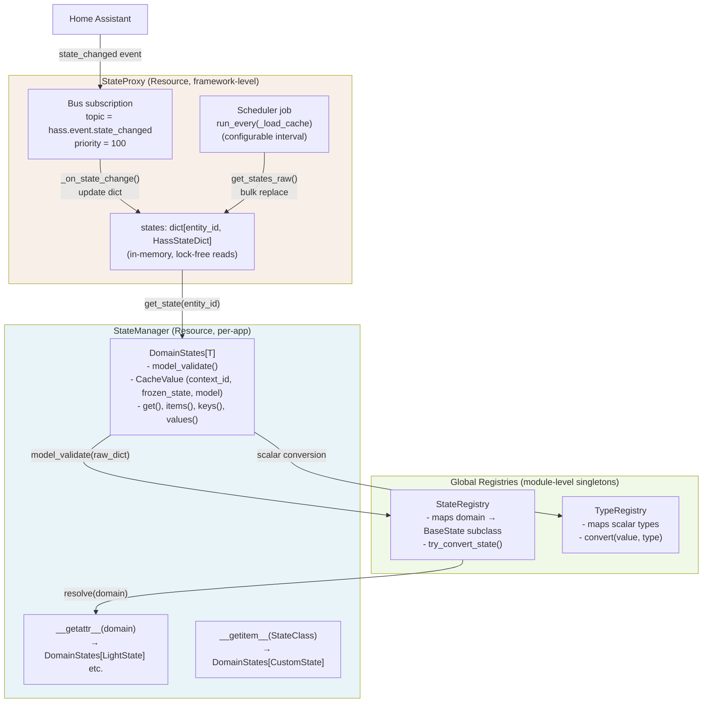
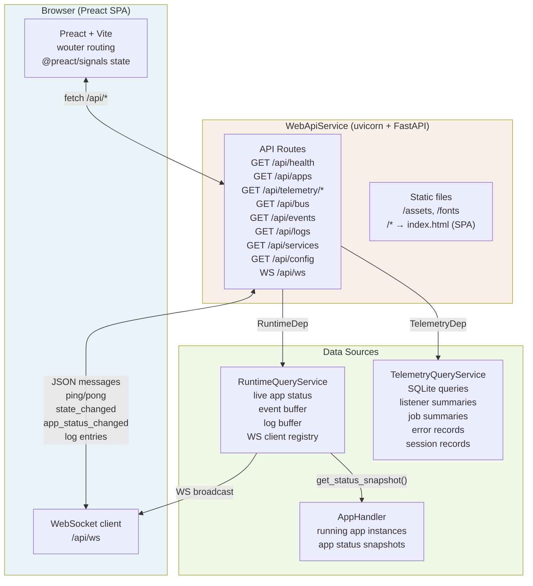
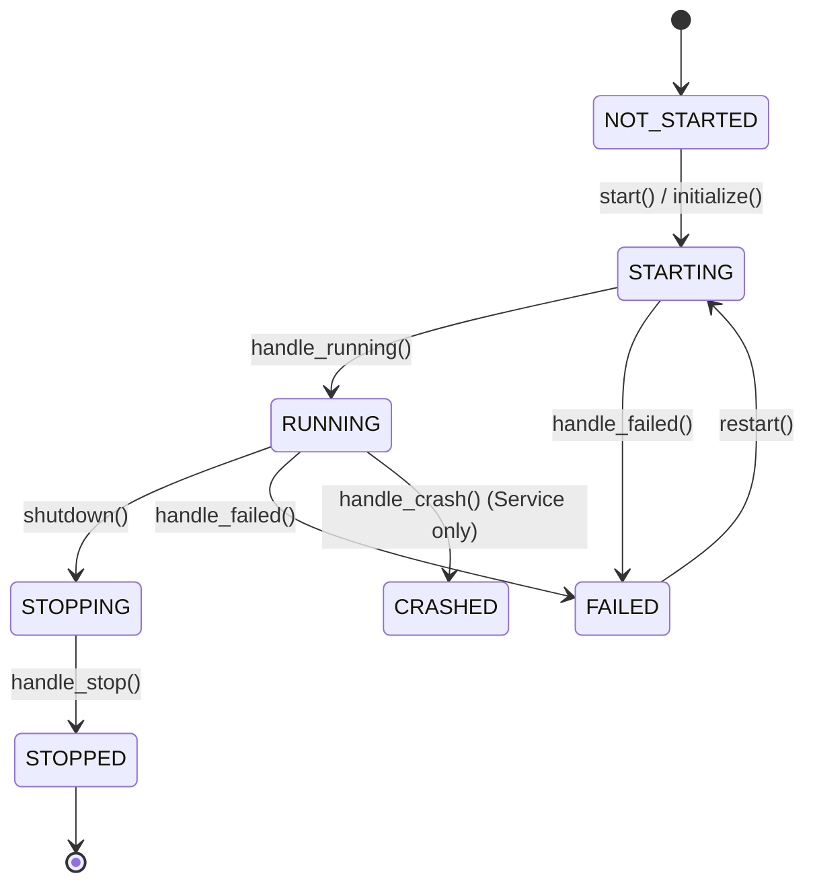
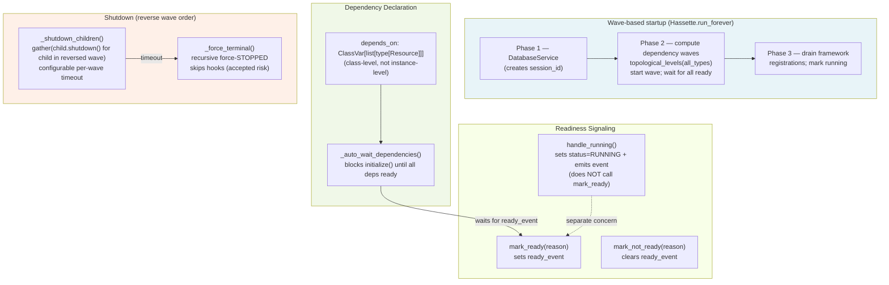

# Hassette Architecture Overview

Hassette is an async-first Python framework for building Home Assistant automations. It connects to Home Assistant over WebSocket, routes incoming events through a typed pub/sub bus, dispatches them to user-defined App classes, and provides a web UI for monitoring the running system. This document describes how the major components relate, how data and events flow, and how the App lifecycle works.

---

## 1. Component Ownership and Relationships

The `Hassette` class is the root of a tree. Every component is either a direct child of `Hassette` or a child of one of its children. Ownership of components is tracked through the `Resource` parent/child hierarchy, and each resource's telemetry identity — app key, source tier, index — flows from its parent at construction time.

The App sits inside `AppHandler`'s lifecycle management. Each App instance owns its own `Bus`, `Scheduler`, `Api`, and `StateManager`. Those per-app instances delegate to framework-level services (`BusService`, `SchedulerService`, `ApiResource`, `StateProxy`) that are children of the root `Hassette` instance.



**Why it matters.** The per-app `Bus`, `Scheduler`, `Api`, and `StateManager` are thin resource wrappers — they do not own the infrastructure. When an app shuts down, its Bus removes its listeners from `BusService`, its Scheduler removes its jobs from `SchedulerService`, and so on. The shared infrastructure services continue running for other apps.

---

## 2. Event and Data Flow

Events originate in Home Assistant and reach user handlers through a pipeline of four stages: WebSocket receive → memory channel → BusService dispatch → listener invocation.

Outbound calls from apps back to Home Assistant go through the `Api` resource, which calls `ApiResource` for REST requests and `WebsocketService` for WebSocket sends.



**Key behaviors.** The `EventStreamService` owns the anyio memory channel. `WebsocketService` writes to the send end; `BusService.serve()` reads from the receive end. This decouples the WS receive loop from handler dispatch. `StateProxy` subscribes to state-changed events with `priority=100`, so its cache is always updated before any user handler sees the event. The `CommandExecutor` records every invocation to SQLite for the telemetry web UI.

**Failure modes.**

| Stage | Observable failure |
|---|---|
| WS disconnects | `RetryableConnectionClosedError` → tenacity retry with exponential backoff (max 5 attempts); `HASSETTE_EVENT_WEBSOCKET_DISCONNECTED` event emitted |
| Auth failure | `InvalidAuthError` → no retry; process exits |
| Memory channel full | Backpressure on `send_event()` callers (send blocks until space) |
| Handler timeout | `TimeoutError` logged via `CommandExecutor`; invocation record persisted as timed-out |
| DB write failure | `CommandExecutor` retries up to 3 times, then drops with counter increment; drop counters exposed on `Hassette.get_drop_counters()` |

---

## 3. App Lifecycle

An App's lifecycle has five phases. The framework manages all transitions; user code only implements the hooks.

```mermaid
sequenceDiagram
    accTitle: App Lifecycle Sequence
    accDescr: The sequence of phases from app manifest loading through shutdown

    participant Config as HassetteConfig
    participant Handler as AppHandler / AppLifecycleService
    participant App as App instance
    participant Bus as App.bus
    participant Sched as App.scheduler
    participant HA as Home Assistant

    Note over Config: startup_tasks() validates manifests
    Config->>Handler: app_manifests (keyed by app_key)

    Note over Handler: depends_on gate clears (WS, API, Bus, Scheduler, StateProxy ready)
    Handler->>App: instantiate(app_config, index)
    App->>Bus: add_child(Bus)
    App->>Sched: add_child(Scheduler)

    Note over App: initialize() runs hooks in order
    App->>App: before_initialize()
    App->>App: on_initialize() -- user registers listeners / schedules jobs
    Bus->>Bus: mark_ready()
    Sched->>Sched: mark_ready()
    App->>App: after_initialize()
    App->>App: handle_running() -- RUNNING status + event

    Note over App: on_ready() not a hook; RUNNING status is the signal
    App->>HA: api.call_service(), api.get_state(), etc.

    Note over App: shutdown path (signal or config reload)
    App->>App: before_shutdown()
    App->>App: on_shutdown() -- user releases resources
    Bus->>Bus: remove_all_listeners()
    Sched->>Sched: remove_all_jobs()
    App->>App: after_shutdown()
    App->>App: handle_stop() -- STOPPED status + event
```

**Notes on each phase.**

- `on_initialize` is the primary hook. Apps register bus listeners and schedule jobs here. The framework guarantees that `WebsocketService`, `ApiResource`, `BusService`, `SchedulerService`, and `StateProxy` are all ready before `on_initialize` is called on any app (via `AppHandler.depends_on`).
- `handle_running()` sets status to `RUNNING` and emits a `HASSETTE_EVENT_APP_STATE_CHANGED` event. Other apps can subscribe to this to sequence dependent start-up.
- On shutdown, `Bus.on_shutdown()` removes all listeners owned by that app, and `Scheduler.on_shutdown()` removes all jobs. The parent app's `cleanup()` then cancels its `TaskBucket`.
- In dev mode (`dev_mode=True`), `AppHandler` subscribes to `FileWatcherService` events. When a source file changes, `AppLifecycleService` diffs the `ChangeSet` and hot-reloads only the affected app keys.

---

## 4. Bus — Event Routing and Filtering

The `Bus` resource is a per-owner subscription surface. It translates method calls like `on_state_change()` into `Listener` objects and registers them with the shared `BusService`. The `BusService` owns a `Router` that indexes listeners by exact topic and by glob pattern, and dispatches events to all matching, predicate-passing listeners.



**Key behaviors.**

- Topic expansion for `state_changed` events produces three routes in specificity order: `hass.event.state_changed.light.office` → `hass.event.state_changed.light.*` → `hass.event.state_changed`. A listener registered on a more-specific topic wins deduplication if it matches.
- Glob patterns (`*`) in entity IDs are stored in the `globs` bucket and matched via `fnmatch`.
- Listeners with `debounce=N` buffer the event and only call the handler if no new event arrives within N seconds. `throttle=N` calls the handler immediately but suppresses subsequent calls for N seconds.
- `duration=N` listeners start a `DurationTimer` when the predicate first matches. The handler fires only if the predicate still matches after N seconds (verified at fire time against the current state in `StateProxy`).
- `once=True` listeners register their DB row before their route is added, to prevent orphan rows if they fire before DB registration completes.
- **Failure modes**: a handler that raises an exception is logged and an error record written to SQLite. Per-listener and per-app error handlers can be registered. Handler timeout is configurable per-listener and globally.

---

## 5. Scheduler — Trigger Types and Job Management

The `Scheduler` resource is a per-owner job registration surface. It translates trigger objects into `ScheduledJob` entries and adds them to the shared `SchedulerService`. The service runs a min-heap loop (`_ScheduledJobQueue`) that wakes when the next job is due, then dispatches the job through `CommandExecutor`.



**Key behaviors.**

- `Daily` uses a cron-based trigger internally to ensure DST-correct, wall-clock-anchored scheduling. A 24-hour interval trigger would drift across DST transitions.
- `jitter` adds random offset at enqueue time to spread concurrent job starts.
- Job groups (`group=`) allow bulk cancellation via `scheduler.cancel_group("morning")`. The `_on_job_removed` callback keeps `_jobs_by_group` in sync when `SchedulerService` auto-exhausts a one-shot job.
- Named jobs (`name=`) support deduplication via `if_exists="skip"` — useful for apps that re-register jobs on reconnect.
- **Failure modes**: a job that raises is logged, an error record written to SQLite, and the app-level / per-job error handler called if registered. Timeout is enforced per-job (configurable) and globally.

---

## 6. Api — REST and WebSocket Interface

The `Api` resource is a per-app user-facing surface. It delegates all transport to the shared `ApiResource` (REST) and `WebsocketService` (WebSocket) singletons that are children of the root `Hassette`. The `ApiSyncFacade` child provides synchronous wrappers for `AppSync` apps.



**Transport decision rule.** `get_state()` for a single entity uses REST (`GET /api/states/{entity_id}`). `get_states()` (bulk) uses WebSocket (`get_states` command). Service calls that do not need a response use `ws_send_json` (fire-and-forget); calls with `return_response=True` use `ws_send_and_wait` which creates an `asyncio.Future` keyed by message ID and resolves it from the receive loop.

**Authentication.** The long-lived access token is read from `HassetteConfig.token` at startup. `WebsocketService.authenticate()` sends it in the `auth` handshake. `ApiResource` injects it as a `Bearer` header on every REST request.

**Failure modes.**

| Failure | Observable behavior |
|---|---|
| `send_and_wait` timeout | `FailedMessageError` raised to caller |
| HA returns `success: false` | `FailedMessageError` with `.code` from HA error envelope |
| Entity not found (REST 404) | `EntityNotFoundError` |
| WS disconnected during wait | `RetryableConnectionClosedError` |
| aiohttp errors | retried via tenacity (up to 3 attempts, exponential jitter) |

---

## 7. StateManager and StateProxy

`StateProxy` is a framework-level service that maintains an in-memory dictionary of every entity state received from HA. `StateManager` is a thin per-app typed access layer that delegates reads to `StateProxy` and applies type conversion via `StateRegistry`.



**Key behaviors.**

- `StateProxy` uses `priority=100` on its bus subscription so its cache is always updated before any user handler sees the same event.
- Read access is lock-free: CPython's dict assignment is atomic, and the proxy replaces whole objects rather than mutating them.
- `DomainStates` caches validated Pydantic models keyed by `context_id` (a UUID HA attaches to each state). If the context ID matches the cached copy, the validated model is returned without re-validating.
- On WebSocket disconnect, `StateProxy` clears the cache and marks itself not-ready. On reconnect, it calls `get_states_raw()` to rebuild the cache before marking ready again.
- `StateManager.__getattr__` provides IDE-friendly `self.states.light` access for known domains. `self.states[CustomStateClass]` bypasses the registry for custom domain types.

---

## 8. Web/UI Layer

The web layer is an opt-in FastAPI application. `WebApiService` starts a uvicorn server on a configurable host/port. The frontend is a Preact SPA served as static files from `web/static/spa/`. The server exposes two kinds of data: live in-memory state (via `RuntimeQueryService`) and historical telemetry (via `TelemetryQueryService`).



**Key behaviors.**

- `RuntimeQueryService` subscribes to `HASSETTE_EVENT_APP_STATE_CHANGED`, `HASSETTE_EVENT_WEBSOCKET_CONNECTED/DISCONNECTED`, and `HASS_EVENT_STATE_CHANGED` events. It maintains a configurable-size ring buffer of recent events and a set of connected WebSocket client queues.
- When the frontend connects via WebSocket, `RuntimeQueryService` registers a `asyncio.Queue` for it. Incoming bus events are fan-out broadcast to all registered queues, with a drop counter for slow clients.
- The SPA is served via a catch-all route: known static extensions return 404; all other paths return `index.html` for client-side routing.
- `WebApiService` does not start if `config.run_web_api` is False. The service remains alive but blocked on `shutdown_event.wait()`, preserving the dependency graph without actually binding a port.
- OpenAPI schema is at `/api/openapi.json`. Frontend types are generated from this schema via `openapi-typescript`.

---

## 9. Resource/Service Base — Lifecycle, Priority, and Readiness

Every component in the framework extends `Resource` or `Service`. `Resource` is for components that initialize synchronously (their `initialize()` returns only after their hooks and children complete). `Service` is for components with a long-running background loop (`serve()`). The `LifecycleMixin` provides the `ready_event`, `shutdown_event`, and status transition machinery shared by both.





**Why `handle_running()` does not call `mark_ready()`.** These are separate concerns. `handle_running()` sets status to `RUNNING` and emits a service status event so other components can observe the lifecycle state. `mark_ready()` sets the `ready_event` which unblocks `_auto_wait_dependencies()` waiters. A resource must call `mark_ready()` explicitly (typically at the end of `on_initialize()`). A service calls `mark_ready()` inside `serve()` once it is actually processing.

**`FinalMeta`.** A custom metaclass enforces that subclasses cannot override methods marked `@final`. This prevents accidental breakage of the initialization/shutdown contracts. The `FinalMeta.LOADED_CLASSES` set makes the check idempotent across multiple import paths.

**Wave shutdown.** `Hassette._shutdown_children()` iterates the `_init_waves` list in reverse. Services that depend on others shut down before their dependencies. Within a wave, all shutdowns are `gather()`ed concurrently. A per-wave timeout triggers `_force_terminal()` on any non-compliant child.

---

## Information Requested

All structural elements described above were confirmed from source code. No `TBD` items remain. The following contextual details were not exercised in the code read and could be confirmed if needed:

1. The exact list of REST routes and their response models (beyond what is visible in `web/app.py` router imports) — not needed for this architectural overview but relevant for API contract documentation.
2. Whether `AppSync` apps share the same dependency-graph guarantees as async `App` classes — the code shows `AppSync` wraps hooks via `task_bucket.run_in_thread`, but the guarantees around `depends_on` for apps (currently unsupported, issue #581) apply to both.
3. The Alembic migration schema version and table layout — relevant for the telemetry subsystem but not for the structural overview.
