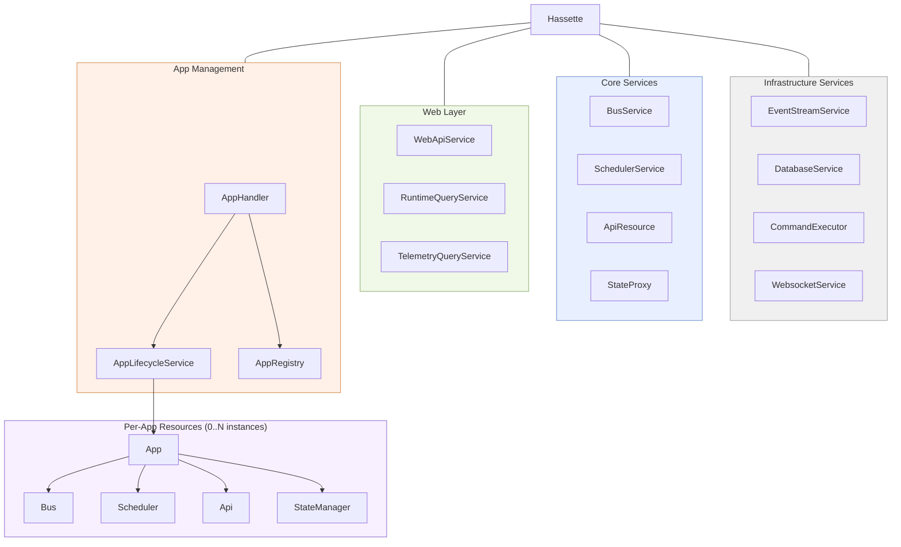
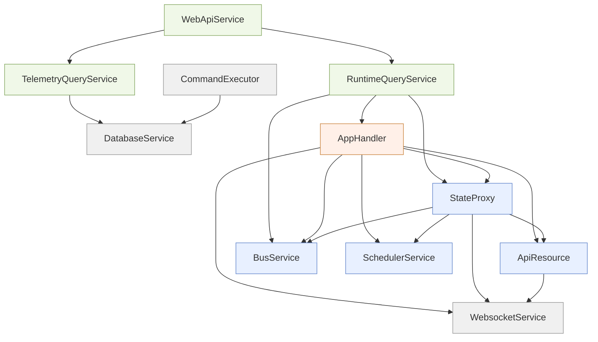
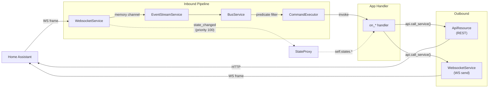
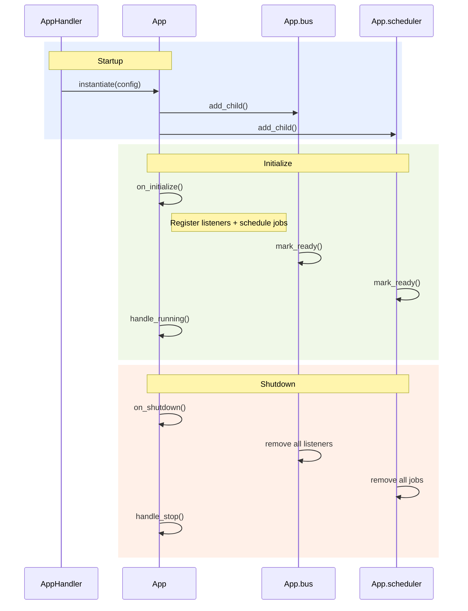
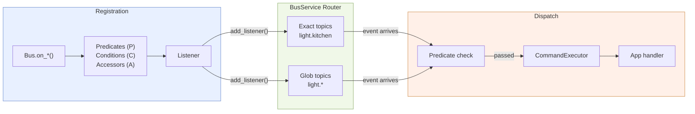
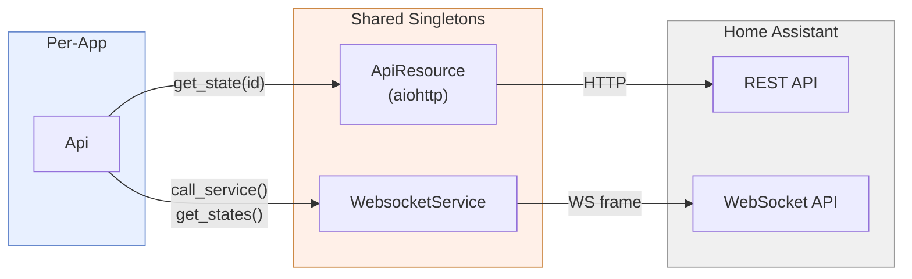
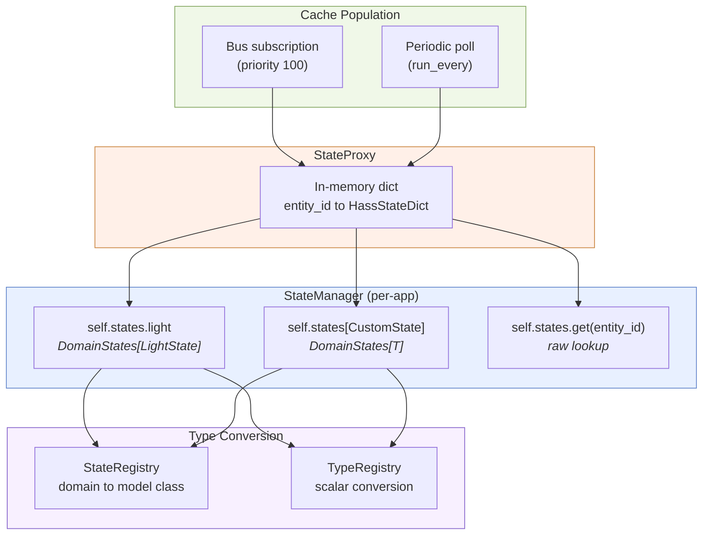
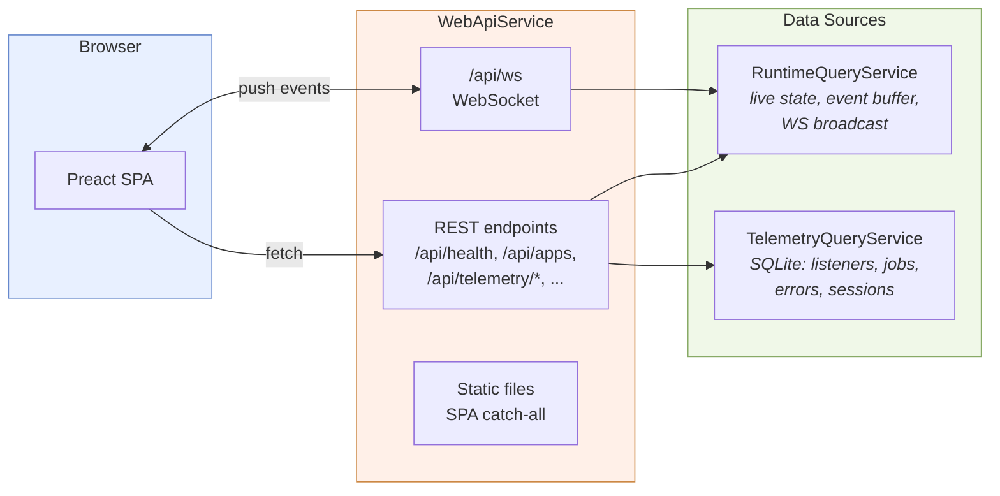
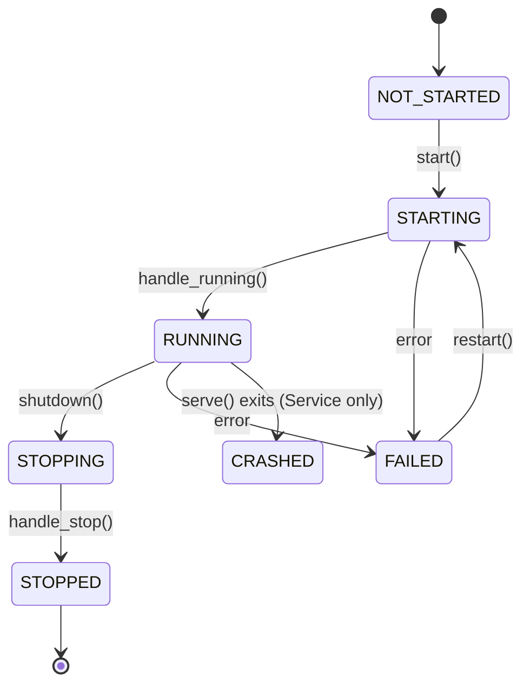

---
hide:
  - toc
---

# Hassette Architecture Overview

Hassette is an async-first Python framework for building Home Assistant automations. It connects to Home Assistant over WebSocket, routes incoming events through a typed pub/sub bus, dispatches them to user-defined App classes, and provides a web UI for monitoring the running system.

---

## 1. Component Ownership

Every component is a `Resource` in a parent/child tree rooted at the `Hassette` instance. Apps get four lightweight handles (`Bus`, `Scheduler`, `Api`, `StateManager`) that delegate to shared framework services.

Per-app handles are thin wrappers. When an app shuts down, its `Bus` removes its listeners from `BusService`, its `Scheduler` removes its jobs from `SchedulerService`, and so on. The shared services continue running for other apps.

---

## 2. Service Dependencies

Services declare `depends_on` at the class level. The framework computes wave-based startup order from these declarations. An arrow from A to B means "A waits for B to be ready."

`DatabaseService`, `WebsocketService`, `BusService`, and `SchedulerService` have no dependencies and start in wave 0. `WebApiService` is the deepest node (via `RuntimeQueryService` and `AppHandler`).

---

## 3. Event and Data Flow

Events flow from Home Assistant through a four-stage inbound pipeline. Outbound calls go through the `Api` handle back to HA via REST or WebSocket.

`StateProxy` subscribes to state_changed events at priority 100, so its cache is always updated before any user handler sees the event. The `CommandExecutor` records every invocation to SQLite for the telemetry UI.

| Failure | Behavior |
|---|---|
| WS disconnect | Exponential backoff retry (max 5 attempts) |
| Auth failure | Process exits, no retry |
| Handler timeout | Logged, invocation recorded as timed-out |
| DB write failure | 3 retries, then dropped with counter increment |

---

## 4. App Lifecycle

The framework manages all state transitions. User code implements `on_initialize` (register listeners and jobs) and `on_shutdown` (release resources). The other hooks (`before_*`, `after_*`) are available but rarely needed.

- All framework services (`WebsocketService`, `BusService`, `SchedulerService`, `StateProxy`) are guaranteed ready before any app's `on_initialize` runs — enforced by `AppHandler.depends_on`.
- `handle_running()` emits `HASSETTE_EVENT_APP_STATE_CHANGED`, which other apps can subscribe to for sequenced startup.
- In dev mode, `FileWatcherService` triggers hot-reload of only the affected app keys.

---

## 5. Bus Internals

The `Bus` handle translates `on_*()` calls into `Listener` objects, which the shared `BusService` indexes by topic for fast dispatch.

**Topic expansion.** A `state_changed` event for `light.office` produces three topics in specificity order: `hass.event.state_changed.light.office`, `hass.event.state_changed.light.*`, `hass.event.state_changed`.

**Listener behaviors:**

| Option | Effect |
|---|---|
| `debounce=N` | Buffer events, fire only if quiet for N seconds |
| `throttle=N` | Fire immediately, suppress for N seconds |
| `duration=N` | Fire only if predicate still matches after N seconds |
| `once=True` | Auto-remove after first invocation |
| `priority=N` | Lower values dispatch first (StateProxy uses 100) |

---

## 6. Scheduler Internals

The `Scheduler` handle wraps convenience methods around five trigger types. All jobs end up in a shared min-heap inside `SchedulerService`.

```mermaid
flowchart LR
    accTitle: Scheduler Job Pipeline
    accDescr: From convenience methods through triggers to the dispatch loop

    subgraph api["Scheduler API"]
        methods["run_in() / run_once()<br/>run_every() / run_daily()<br/>run_cron() / schedule()"]
    end

    subgraph triggers["Triggers"]
        After["After<br/><i>one-shot delay</i>"]
        Once["Once<br/><i>one-shot at time</i>"]
        Every["Every<br/><i>recurring interval</i>"]
        Daily["Daily<br/><i>DST-safe cron</i>"]
        Cron["Cron<br/><i>croniter expression</i>"]
    end

    subgraph engine["SchedulerService"]
        heap["Min-heap<br/>by next_run"]
        loop["serve() loop"]
        exec["CommandExecutor"]
    end

    methods --> triggers
    triggers -- "ScheduledJob" --> heap
    heap -- "pop due" --> loop
    loop --> exec
    exec -. "re-enqueue<br/>if recurring" .-> heap

    style api fill:#e8f0ff,stroke:#6688cc
    style triggers fill:#f0f8e8,stroke:#88aa66
    style engine fill:#fff0e8,stroke:#cc8844
```

- `Daily` uses cron internally for DST-safe wall-clock scheduling. A naive 24-hour interval would drift across DST transitions.
- `jitter` adds random offset at enqueue time to spread concurrent starts.
- Job groups (`group=`) enable bulk cancellation. Named jobs (`name=`) support deduplication via `if_exists="skip"`.

---

## 7. Api Internals

The per-app `Api` handle delegates all transport to shared singletons. Single-entity reads use REST; bulk reads and service calls use WebSocket.

| Method | Transport | Pattern |
|---|---|---|
| `get_state(entity_id)` | REST | `GET /api/states/{id}` |
| `get_states()` | WebSocket | `get_states` command |
| `call_service()` | WebSocket | fire-and-forget or `send_and_wait` |
| `fire_event()` | WebSocket | fire-and-forget |

Auth: long-lived access token from `HassetteConfig.token`. Injected as `Bearer` header (REST) and `auth` handshake (WebSocket).

---

## 8. StateManager and StateProxy

`StateProxy` maintains an in-memory cache of all entity states. `StateManager` provides typed per-app access with Pydantic model validation and caching.

- Read access is lock-free — CPython dict assignment is atomic; the proxy replaces whole objects rather than mutating.
- `DomainStates` caches validated Pydantic models keyed by `context_id` (a UUID from HA). Same context ID = return cached model without re-validating.
- On disconnect, `StateProxy` clears the cache and marks itself not-ready. On reconnect, it bulk-reloads via `get_states_raw()`.

---

## 9. Web/UI Layer

The web layer is opt-in. `WebApiService` starts a uvicorn/FastAPI server. The frontend is a Preact SPA. Two data source services provide live and historical data.

- `RuntimeQueryService` subscribes to bus events and fan-out broadcasts to all connected WebSocket clients via `asyncio.Queue` per client.
- The SPA catch-all returns `index.html` for all non-asset paths, enabling client-side routing.
- When `config.run_web_api` is False, the service blocks on `shutdown_event.wait()` without binding a port, preserving the dependency graph.

---

## 10. Resource Lifecycle State Machine

Every component extends `Resource` (synchronous init) or `Service` (long-running `serve()` loop). The `LifecycleMixin` provides status transitions and readiness signaling.

**Readiness vs. running.** These are separate concerns:

- `handle_running()` sets status to RUNNING and emits an event — other components can observe lifecycle state
- `mark_ready()` sets the `ready_event` that unblocks `depends_on` waiters — a Resource calls this at the end of `on_initialize()`; a Service calls it inside `serve()` once actually processing

**Wave startup.** Dependencies are computed into topological levels. Each wave starts concurrently via `gather()`, but waves run sequentially — all dependencies are guaranteed ready before dependents begin. Shutdown proceeds in reverse wave order. A per-wave timeout triggers `_force_terminal()` on non-compliant children.
