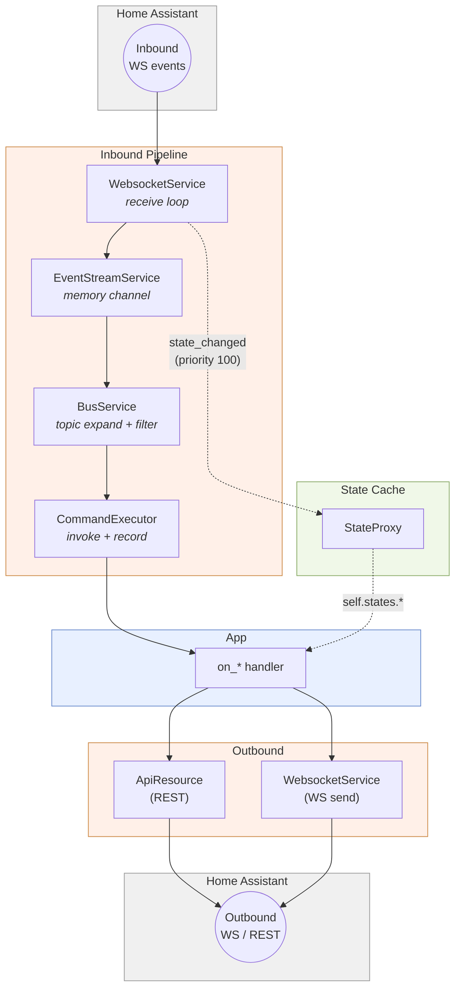
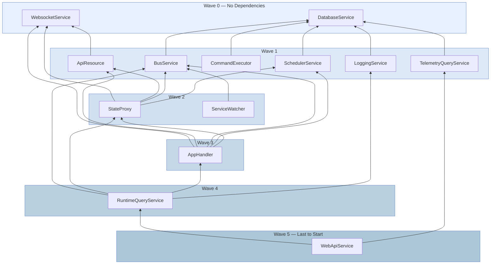
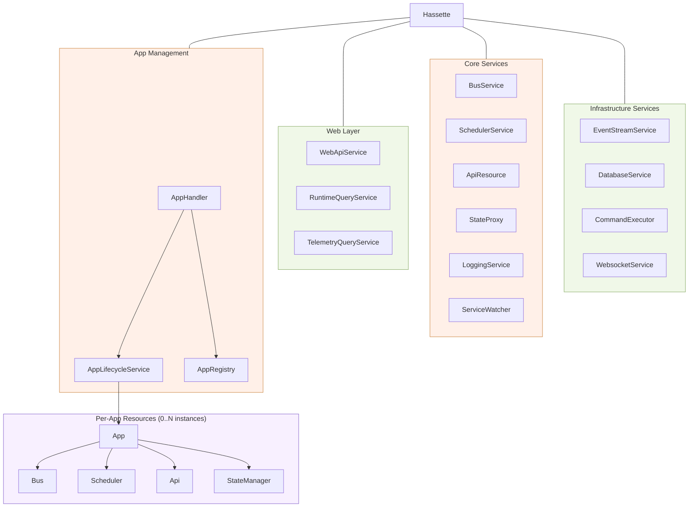

# Architecture & Data Flow

This section covers Hassette's internal architecture for contributors and advanced users. App authors do not need this section to build automations.

Three pages make up the internals section:

- **Architecture & Data Flow** (this page): event pipeline, service dependencies, component ownership
- [Lifecycle & Supervision](lifecycle.md): state machines, readiness signaling, `ServiceWatcher` restart logic
- [Per-Service Internals](service-details.md): bus routing, scheduler dispatch, database schema, state cache, web layer

## Event Pipeline

An event travels through four stages before reaching a handler.

`WebsocketService` receives raw frames from Home Assistant over a persistent WebSocket connection. It forwards each event to `EventStreamService`, which owns an anyio memory channel that decouples reception from processing. `BusService` reads from that channel and expands each event into a set of topics ordered by specificity. It then filters the topics against registered listeners. `CommandExecutor` invokes the matching handler and writes an execution record to SQLite.



`StateProxy` holds a priority-100 subscription to `state_changed` events. Its cache updates before any app handler sees the event. `self.states.*` always reflects the current state at handler invocation time.

Outbound calls go through the per-app `Api` handle. Single-entity reads use `ApiResource` over REST. Service calls and bulk state reads use `WebsocketService` over WebSocket.

### Failure behavior

| Failure | Behavior |
|---|---|
| WS disconnect | `WebsocketService` retries with exponential jitter. `ServiceWatcher` restarts the service if `serve()` fails, within the TRANSIENT budget (5 restarts / 300 s). |
| Auth failure | `InvalidAuthError` is a `FatalError` subclass. The `Service` base class catches it, calls `handle_crash()`, and `ServiceWatcher` triggers an immediate shutdown. |
| Handler timeout | Logged; invocation recorded as timed-out. |
| DB write failure | `CommandExecutor` retries up to 3 times, then drops the record with a counter increment. |

## Service Dependencies

### `depends_on` ClassVar

Services declare startup dependencies as a class-level `ClassVar`. The framework reads these declarations at construction time and computes a topological startup order.

```python
--8<-- "pages/core-concepts/snippets/index_depends_on.py"
```

`depends_on` scoping is intentional: only direct children of the `Hassette` root participate. Per-app resources (`Bus`, `Scheduler`, `Api`, `StateManager`) are not services and do not declare `depends_on`.

### Wave-Based Ordering

The dependency graph partitions into topological levels. All services in a wave start concurrently. The framework waits for every service in a wave to signal readiness before advancing. Shutdown runs in reverse wave order.

A `ValueError` with the full cycle path raises at construction time if the dependency graph contains a cycle.

### Framework Dependency Graph



Shutdown proceeds in reverse wave order. `WebApiService` stops first. `DatabaseService` and `WebsocketService` stop last.

## Component Ownership

Every component is a `Resource` in a parent/child tree rooted at the `Hassette` instance. Apps receive four lightweight handles (`Bus`, `Scheduler`, `Api`, `StateManager`) that delegate to shared framework services.



Per-app handles are thin wrappers around the shared services. When an app shuts down, its `Bus` removes listeners from `BusService` and its `Scheduler` removes jobs from `SchedulerService`. Each handle cleans up its own registrations. The shared services continue running for other apps.

## EventStreamService: Constructor-Time Dependency

`EventStreamService` has no `depends_on` because its streams are created synchronously in `__init__`, before the lifecycle begins. The `Hassette` root registers `EventStreamService` before `BusService`, ensuring the receive stream exists when `BusService` is constructed. This ordering is structural, not declared through `depends_on`.
