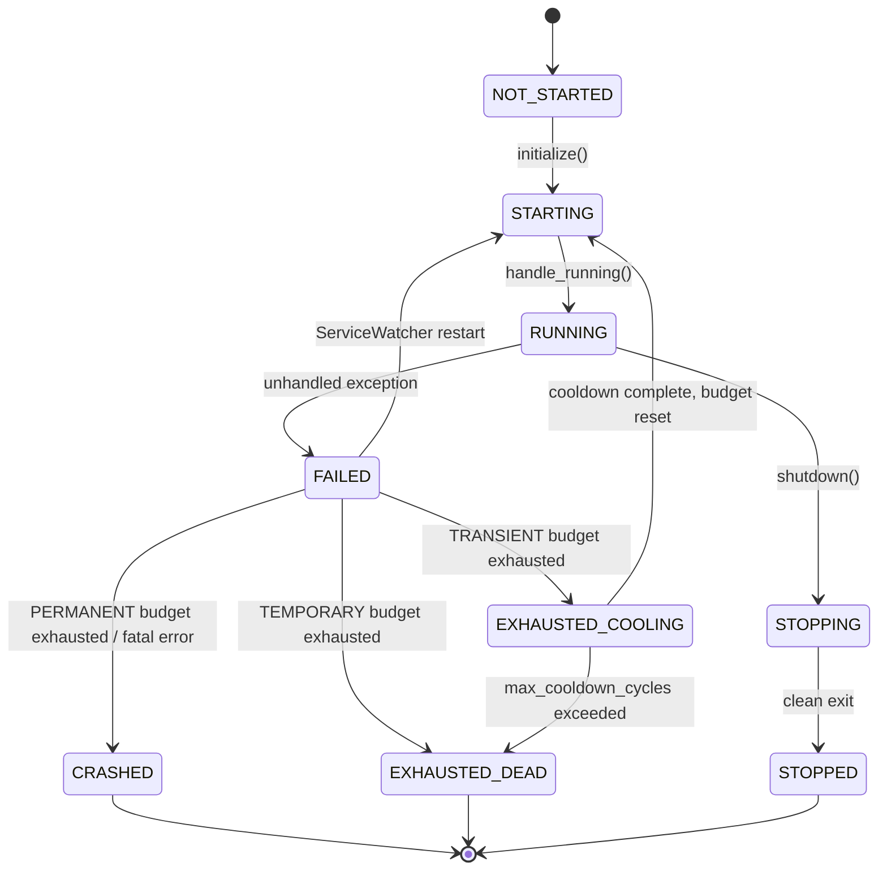

# Resource Lifecycle & Supervision

A [`Resource`][hassette.resources.base.Resource] is any component with a managed lifecycle — Hassette initializes and shuts it down in dependency order. A [`Service`][hassette.resources.service.Service] is a long-running background Resource. Unlike plain resources that initialize once, services can be restarted if they fail. Each service declares a restart policy that controls backoff timing, budget limits, and recovery-failure behavior. This page covers the supervision model, the [service state machine](#resource-state-machine), and readiness signaling.

## What Happens When a Service Fails

When a `Service` raises an unhandled exception, Hassette transitions it to `FAILED` and emits a service status event. [`ServiceWatcher`][hassette.core.service_watcher.ServiceWatcher] — an internal supervisor component with no user-facing API — receives that event and consults the service's `restart_spec` (a policy object declaring retry behavior) to decide what comes next.

The outcome depends on three things: the exception type, how many restarts have already occurred within the current time window, and the service's `restart_type`. Most failures result in an exponential backoff delay followed by a fresh `initialize()` call. Structural failures that no retry will fix skip the backoff and either enter a long cooldown period or shut the system down entirely.

`ServiceWatcher` tracks restarts in a sliding-window `RestartBudget` keyed per service. Each failed restart records a timestamp. Attempts that fall outside the budget window expire automatically. The budget resets after a successful recovery. A service that runs stably for five minutes after a failure starts fresh.

## Restart Types

[`RestartType`][hassette.types.enums.RestartType] controls what `ServiceWatcher` does when the restart budget is exhausted.

**`PERMANENT`** means the service cannot be absent. When the budget runs out, `ServiceWatcher` transitions the service to `CRASHED` and calls `hassette.shutdown()`. [`BusService`][hassette.core.bus_service.BusService] and [`SchedulerService`][hassette.core.scheduler_service.SchedulerService] — the shared services behind every app's `self.bus` and `self.scheduler` — use this type. Without them, no automations can run.

**`TRANSIENT`** means the service can tolerate a long outage. When the budget runs out, the service enters `EXHAUSTED_COOLING`, waits for `cooldown_seconds`, resets the budget, and retries. If `max_cooldown_cycles` is set to a non-zero value, the service moves to `EXHAUSTED_DEAD` after that many failed cooldown cycles. [`WebsocketService`][hassette.core.websocket_service.WebsocketService], [`DatabaseService`][hassette.core.database_service.DatabaseService], and [`WebApiService`][hassette.core.web_api_service.WebApiService] use this type.

**`TEMPORARY`** means the service is optional. When the budget runs out, the service transitions to `EXHAUSTED_DEAD` and stops permanently. Hassette continues running without it. `FileWatcherService` and `WebUiWatcherService` use this type. Losing live-reload capability does not impair automation execution.

### Per-Service Restart Specs

| Service | `restart_type` | `budget_intensity` | `budget_period_seconds` | Notes |
|---|---|---|---|---|
| `BusService` | `PERMANENT` | 2 | 30 | Core event dispatch |
| `SchedulerService` | `PERMANENT` | 2 | 30 | Core job execution |
| `WebsocketService` | `TRANSIENT` | 5 | 300 | `startup_timeout_seconds=60` |
| `DatabaseService` | `TRANSIENT` | 3 | 120 | `fatal_error_names=("SchemaVersionError",)` |
| `WebApiService` | `TRANSIENT` | 3 | 60 | HTTP API and UI |
| `FileWatcherService` | `TEMPORARY` | 3 | 60 | Config hot-reload |
| `WebUiWatcherService` | `TEMPORARY` | 3 | 60 | Web UI live-reload |

## Restart Budget

The budget uses a sliding window defined by two fields: `budget_intensity` (maximum restarts allowed) and `budget_period_seconds` (the window size in seconds). Timestamps older than `budget_period_seconds` are evicted before each check.

When `budget.is_exhausted()` returns `True`, `ServiceWatcher` calls `_handle_exhaustion()`. The budget resets on successful recovery. `record_restart()` is not called again until the service fails after being healthy.

Backoff between restart attempts uses exponential growth: `backoff_base_seconds * (backoff_multiplier ** (attempt - 1))`, capped at `backoff_max_seconds`. The defaults produce delays of 2 s, 4 s, 8 s, and so on up to 60 s.

## Error Routing

`ServiceWatcher` checks the exception type name before consulting the budget. Three routing layers apply, from least to most severe.

**Normal errors.** The exception name appears in neither `fatal_error_names` nor `non_retryable_error_names`. The restart proceeds through the budget check and backoff sequence.

**Non-retryable errors.** The exception name is in `non_retryable_error_names`. The restart is skipped entirely. `ServiceWatcher` calls `_handle_exhaustion()` directly, as if the budget were already spent. This applies to configuration errors that cannot self-correct.

**Fatal errors.** The exception name is in `fatal_error_names`, or the exception is a [`FatalError`][hassette.exceptions.FatalError] subclass. The service transitions immediately to `CRASHED` and `hassette.shutdown()` is called. `DatabaseService` uses this for [`SchemaVersionError`][hassette.exceptions.SchemaVersionError]. A schema version mismatch requires human intervention, so no retry is attempted.

## RestartSpec Reference

[`RestartSpec`][hassette.resources.restart.RestartSpec] is a frozen dataclass. Attach it to a `Service` subclass as a class variable named `restart_spec`.

```python
--8<-- "pages/core-concepts/snippets/internals_restart_spec.py"
```

| Field | Type | Default | Description |
|---|---|---|---|
| `restart_type` | `RestartType` | `TRANSIENT` | Governs behavior when the restart budget is exhausted. |
| `budget_intensity` | `int` | `5` | Maximum restarts allowed within `budget_period_seconds`. |
| `budget_period_seconds` | `float` | `300.0` | Sliding window size in seconds. |
| `backoff_base_seconds` | `float` | `2.0` | Starting delay for exponential backoff. |
| `backoff_multiplier` | `float` | `2.0` | Factor applied on each successive restart attempt. |
| `backoff_max_seconds` | `float` | `60.0` | Maximum backoff delay in seconds. |
| `startup_timeout_seconds` | `float` | `30.0` | How long `ServiceWatcher` waits for `mark_ready()` after a restart. |
| `cooldown_seconds` | `float` | `300.0` | Duration of the long-cooldown phase (`TRANSIENT` only). |
| `max_cooldown_cycles` | `int` | `0` | Maximum cooldown cycles before `EXHAUSTED_DEAD`. `0` means infinite. |
| `non_retryable_error_names` | `tuple[str, ...]` | `()` | Exception names that skip restart and go directly to exhaustion. |
| `fatal_error_names` | `tuple[str, ...]` | `()` | Exception names that trigger immediate shutdown. |

## Resource State Machine

Every [Resource][hassette.resources.base.Resource] and `Service` tracks its status as a [`ResourceStatus`][hassette.types.enums.ResourceStatus] value.



`NOT_STARTED` is the initial state. `STARTING` covers the period from `initialize()` entry through lifecycle hook execution. `RUNNING` is the normal operating state. For services, it persists for the lifetime of the `serve()` loop. `STOPPING` and `STOPPED` represent clean shutdown. `FAILED` is a transient state. `ServiceWatcher` acts on it immediately and moves the service forward. `CRASHED` and `EXHAUSTED_DEAD` are terminal states from which no recovery occurs. `EXHAUSTED_COOLING` is a waiting state. The service re-enters `STARTING` after the cooldown period completes.

## Readiness vs Running

`RUNNING` status and readiness are separate signals. `handle_running()` sets `status = ResourceStatus.RUNNING` and emits a status event. `mark_ready()` sets a readiness `asyncio.Event` that dependents wait on via `_auto_wait_dependencies()`.

A service enters `RUNNING` at the end of `initialize()`, after all lifecycle hooks complete. It signals readiness by calling `mark_ready()` at whatever internal point it is prepared to serve requests. `WebsocketService` calls `mark_ready()` after the first successful authentication with Home Assistant. `BusService` calls it after the internal event stream is open.

`depends_on` lists the resource types a service waits for before running its own `on_initialize()`. The wait is on readiness, not on `RUNNING` status. A dependent service does not proceed until all declared dependencies have called `mark_ready()`.

| Signal | Set by | Waited on by |
|---|---|---|
| `status = RUNNING` | `handle_running()` at end of `initialize()` | Nothing (informational only) |
| `ready_event` | `mark_ready()` at service-defined readiness point | Dependents via `depends_on` auto-wait |

## Wave Startup and Shutdown

Hassette starts services in dependency order. Services with no `depends_on` start first. Services that declare `depends_on` start after all their dependencies have signaled readiness. Services at the same dependency depth start concurrently.

Shutdown runs in reverse order. Services that depended on others stop first. A service in `STOPPING` waits for its children to reach terminal states before completing. `ServiceWatcher` itself depends on `BusService`. It shuts down after `BusService` stops accepting events, so no supervision messages are lost during teardown.

For the full dependency graph and startup wave diagram, see [Architecture & Data Flow](index.md).
