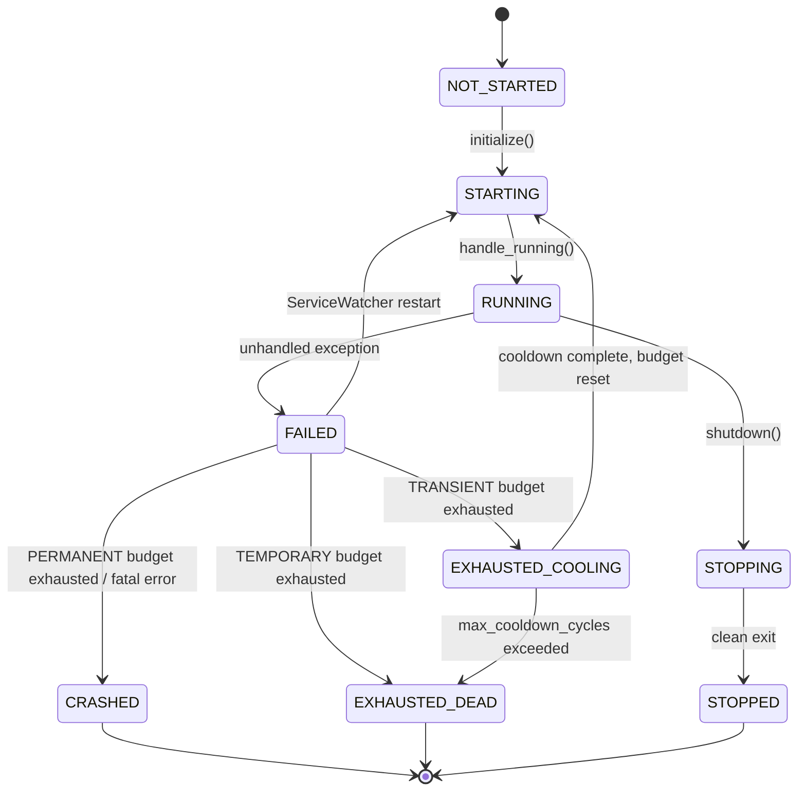

# Resource Lifecycle & Supervision

A [`Resource`][hassette.resources.base.Resource] is any component with a managed lifecycle — Hassette initializes and shuts it down in dependency order. A [`Service`][hassette.resources.service.Service] is a long-running background Resource. Unlike plain resources that initialize once, services can be restarted if they fail. Each service declares a restart policy that controls backoff timing, budget limits, and recovery-failure behavior. This page covers the supervision model, the [service state machine](#resource-state-machine), and readiness signaling.

## What Happens When a Service Fails

When a `Service` raises an unhandled exception, Hassette transitions it to `FAILED` and emits a service status event. [`ServiceWatcher`][hassette.core.service_watcher.ServiceWatcher] — an internal supervisor component with no user-facing API — receives that event and consults the service's `restart_spec` (a policy object declaring retry behavior) to decide what comes next.

The outcome depends on three things: the exception type, how many restarts have already occurred within the current time window, and the service's `restart_type`. Most failures result in an exponential backoff delay followed by a fresh `initialize()` call. Structural failures that no retry will fix skip the backoff and either enter a long cooldown period or shut the system down entirely.

`ServiceWatcher` tracks restarts in a sliding-window `RestartBudget` keyed per service. Each failed restart records a timestamp. Attempts that fall outside the budget window expire automatically. The budget resets after a successful recovery. A service that runs stably for five minutes after a failure starts fresh.

## Restart Types

[`RestartType`][hassette.types.enums.RestartType] controls what `ServiceWatcher` does when the restart budget is exhausted.

**`PERMANENT`** means the service cannot be absent. When the budget runs out, `ServiceWatcher` transitions the service to `CRASHED` and calls `hassette.shutdown()`. [`BusService`][hassette.core.bus_service.BusService] and [`SchedulerService`][hassette.core.scheduler_service.SchedulerService] — the shared services behind every app's `self.bus` and `self.scheduler` — use this type. Without them, no automations can run.

**`TRANSIENT`** means the service can tolerate a long outage. When the budget runs out, the service enters `EXHAUSTED_COOLING`, waits for `cooldown_seconds`, resets the budget, and retries. If `max_cooldown_cycles` is set to a non-zero value, the service moves to `EXHAUSTED_DEAD` after that many failed cooldown cycles. [`WebsocketService`][hassette.core.websocket_service.WebsocketService], [`DatabaseService`][hassette.core.database_service.DatabaseService], and [`WebApiService`][hassette.core.web_api_service.WebApiService] use this type.

**`TEMPORARY`** means the service is optional. When the budget runs out, the service transitions to `EXHAUSTED_DEAD` and stops permanently. Hassette continues running without it. `FileWatcherService` and `WebUiWatcherService` use this type. Losing live-reload capability does not impair automation execution.

### Per-Service Restart Specs

| Service | `restart_type` | `budget_intensity` | `budget_period_seconds` | Notes |
|---|---|---|---|---|
| `BusService` | `PERMANENT` | 2 | 30 | Core event dispatch |
| `SchedulerService` | `PERMANENT` | 2 | 30 | Core job execution |
| `WebsocketService` | `TRANSIENT` | 5 | 300 | `startup_timeout_seconds=60` |
| `DatabaseService` | `TRANSIENT` | 3 | 120 | `fatal_error_names=("SchemaVersionError",)` |
| `WebApiService` | `TRANSIENT` | 3 | 60 | HTTP API and UI |
| `FileWatcherService` | `TEMPORARY` | 3 | 60 | Config hot-reload |
| `WebUiWatcherService` | `TEMPORARY` | 3 | 60 | Web UI live-reload |

## Restart Budget

The budget uses a sliding window defined by two fields: `budget_intensity` (maximum restarts allowed) and `budget_period_seconds` (the window size in seconds). Timestamps older than `budget_period_seconds` are evicted before each check.

When `budget.is_exhausted()` returns `True`, `ServiceWatcher` calls `handle_exhaustion()`. The budget resets on successful recovery. `record_restart()` is not called again until the service fails after being healthy.

Backoff between restart attempts uses exponential growth: `backoff_base_seconds * (backoff_multiplier ** (attempt - 1))`, capped at `backoff_max_seconds`. The defaults produce delays of 2 s, 4 s, 8 s, and so on up to 60 s.

## Error Routing

`ServiceWatcher` checks the exception type name before consulting the budget. Three routing layers apply, from least to most severe.

**Normal errors.** The exception name appears in neither `fatal_error_names` nor `non_retryable_error_names`. The restart proceeds through the budget check and backoff sequence.

**Non-retryable errors.** The exception name is in `non_retryable_error_names`. The restart is skipped entirely. `ServiceWatcher` calls `handle_exhaustion()` directly, as if the budget were already spent. This applies to configuration errors that cannot self-correct.

**Fatal errors.** The exception name is in `fatal_error_names`. The service transitions immediately to `CRASHED` and `hassette.shutdown()` is called. `DatabaseService` uses this for [`SchemaVersionError`][hassette.exceptions.SchemaVersionError]. A schema version mismatch requires human intervention, so no retry is attempted. [`FatalError`][hassette.exceptions.FatalError] subclasses take a separate path: the service catches them itself in `_serve_wrapper()` and calls `handle_crash()` directly, going to `CRASHED` without ever emitting the `FAILED` event that this routing reads.

## RestartSpec Reference

[`RestartSpec`][hassette.resources.restart.RestartSpec] is a frozen dataclass. Attach it to a `Service` subclass as a class variable named `restart_spec`.

```python
--8<-- "pages/core-concepts/snippets/internals_restart_spec.py"
```

| Field | Type | Default | Description |
|---|---|---|---|
| `restart_type` | `RestartType` | `TRANSIENT` | Governs behavior when the restart budget is exhausted. |
| `budget_intensity` | `int` | `5` | Maximum restarts allowed within `budget_period_seconds`. |
| `budget_period_seconds` | `float` | `300.0` | Sliding window size in seconds. |
| `backoff_base_seconds` | `float` | `2.0` | Starting delay for exponential backoff. |
| `backoff_multiplier` | `float` | `2.0` | Factor applied on each successive restart attempt. |
| `backoff_max_seconds` | `float` | `60.0` | Maximum backoff delay in seconds. |
| `startup_timeout_seconds` | `float` | `30.0` | How long `ServiceWatcher` waits for `mark_ready()` after a restart. |
| `cooldown_seconds` | `float` | `300.0` | Duration of the long-cooldown phase (`TRANSIENT` only). |
| `max_cooldown_cycles` | `int` | `0` | Maximum cooldown cycles before `EXHAUSTED_DEAD`. `0` means infinite. |
| `non_retryable_error_names` | `tuple[str, ...]` | `()` | Exception names that skip restart and go directly to exhaustion. |
| `fatal_error_names` | `tuple[str, ...]` | `()` | Exception names that trigger immediate shutdown. |

## Resource State Machine

Every [Resource][hassette.resources.base.Resource] and `Service` tracks its status as a [`ResourceStatus`][hassette.types.enums.ResourceStatus] value.


```mermaid
stateDiagram-v2
    [*] --> NOT_STARTED
    NOT_STARTED --> STARTING : initialize()
    STARTING --> RUNNING : handle_running()
    RUNNING --> STOPPING : shutdown()
    RUNNING --> FAILED : unhandled exception
    STOPPING --> STOPPED : clean exit
    FAILED --> STARTING : ServiceWatcher restart
    FAILED --> EXHAUSTED_COOLING : TRANSIENT budget exhausted
    FAILED --> EXHAUSTED_DEAD : TEMPORARY budget exhausted
    FAILED --> CRASHED : PERMANENT budget exhausted / fatal error
    EXHAUSTED_COOLING --> STARTING : cooldown complete, budget reset
    EXHAUSTED_COOLING --> EXHAUSTED_DEAD : max_cooldown_cycles exceeded
    CRASHED --> [*]
    EXHAUSTED_DEAD --> [*]
    STOPPED --> [*]
```

`NOT_STARTED` is the initial state. `STARTING` covers the period from `initialize()` entry through lifecycle hook execution. `RUNNING` is the normal operating state. For services, it persists for the lifetime of the `serve()` loop. `STOPPING` and `STOPPED` represent clean shutdown. `FAILED` is a transient state. `ServiceWatcher` acts on it immediately and moves the service forward. `CRASHED` and `EXHAUSTED_DEAD` are terminal states from which no recovery occurs. `EXHAUSTED_COOLING` is a waiting state. The service re-enters `STARTING` after the cooldown period completes.

## Readiness vs Running

`RUNNING` status and readiness are separate signals. `handle_running()` sets `status = ResourceStatus.RUNNING` and emits a status event. `mark_ready()` sets a readiness `asyncio.Event` that dependents wait on via `_auto_wait_dependencies()`.

A service enters `RUNNING` when its `serve()` loop begins. `initialize()` returns while the service is still `STARTING`; the spawned `_serve_wrapper()` task calls `handle_running()` once `serve()` starts executing. A service signals readiness by calling `mark_ready()` at whatever internal point it is prepared to serve requests. `WebsocketService` calls `mark_ready()` after the first successful connection, authentication, and event subscription with Home Assistant. `BusService` calls it after the internal event stream is open.

`depends_on` lists the resource types a service waits for before running its own `on_initialize()`. The wait is on readiness, not on `RUNNING` status. A dependent service does not proceed until all declared dependencies have called `mark_ready()`.

| Signal | Set by | Waited on by |
|---|---|---|
| `status = RUNNING` | `handle_running()` when `serve()` begins | Nothing (informational only) |
| `ready_event` | `mark_ready()` at service-defined readiness point | Dependents via `depends_on` auto-wait |

## Wave Startup and Shutdown

Hassette starts services in dependency order. Services with no `depends_on` start first. Services that declare `depends_on` start after all their dependencies have signaled readiness. Services at the same dependency depth start concurrently.

Shutdown runs in reverse order. Services that depended on others stop first. A service in `STOPPING` waits for its children to reach terminal states before completing. `ServiceWatcher` itself depends on `BusService`. It shuts down after `BusService` stops accepting events, so no supervision messages are lost during teardown.

For the full dependency graph and startup wave diagram, see [Architecture & Data Flow](index.md).

## Teardown Safety and Restart Refusal

`STOPPED` describes lifecycle *phase*, not proof that a resource's work has actually stopped. A
shutdown hook can fail, a child can time out, a background task can ignore cancellation — and the
resource still reaches `STOPPED`, because `STOPPED` only means lifecycle orchestration finished
running. Restarting an object that reached `STOPPED` without that positive proof risks running old
and new work in the same process at once.

Every completed `shutdown()` call returns a [`TeardownReport`][hassette.resources.teardown.TeardownReport] — an
immutable record of what shutdown actually observed. A report carries zero or more
[`TeardownCause`][hassette.resources.teardown.TeardownCause] values (a failed hook, a timed-out child, tasks still
pending, and so on). Its `is_restart_safe` property derives directly from those causes:

```python
--8<-- "pages/core-concepts/snippets/internals_teardown_report.py"
```

`is_restart_safe` is `True` when every shutdown hook, cleanup step, tracked task, child resource,
and (for `Service`) the `serve()` task completed with no negative evidence. It's `False` when at
least one of those did not. There is no third state — a report can never claim restart-safe
while also carrying causes, because `is_restart_safe` is computed, not stored.

An exception raised outside the shutdown body itself — while observing a pending initializer or
requesting shutdown, for example — also counts as negative evidence. The coordinator records it
before re-raising, so the caller still gets a restart-unsafe report instead of a silently missing
one.

### Inspecting a report

Python callers read the report two ways:

- The **return value** of `await resource.shutdown()` — the exact report from that call.
- The **`teardown_report` property** — the current unconsumed report, or `None` if no shutdown
  attempt has completed yet (or a prior restart-safe report was already consumed by a new
  initialization). Prefer the return value when history matters; `teardown_report` only reflects
  the current state.

```python
--8<-- "pages/core-concepts/snippets/internals_teardown_report_inspect.py"
```

There is no WebSocket, REST, or dashboard surface for this report — it is a Python-only inspection
point for framework code and embedding hosts.

### Concurrent lifecycle calls join, they don't race

Each resource owns exactly one initialization task and one shutdown task at a time. Every caller —
`start()`'s spawned joiner, a direct `await resource.initialize()`, `restart()`, or a second
concurrent `shutdown()` call — joins that same task through `asyncio.shield()` instead of starting
a second attempt. Cancelling one caller's *wait* (for example, the caller's own task is cancelled)
does not cancel the underlying attempt; the shared task keeps running for every other joiner. A
repeated `shutdown()` call after the attempt has already completed returns the stored report
without rerunning any hooks.

If `initialize()` is called while a shutdown is in progress, it waits for that shutdown's outcome
before deciding whether a new attempt may start. If `shutdown()` is called while initialization is
still pending, it cancels and observes that initializer first, then runs shutdown hooks — a
resistant initializer that doesn't finish in time makes the resulting teardown restart-unsafe.

### Restart refusal

`restart()`, `start()`, and a direct `initialize()` call all check the stored report before doing
anything else. A report with `is_restart_safe` `True` authorizes exactly one new attempt and is
then cleared — normal restart behavior, backoff, and budgets are unaffected. A report with
`is_restart_safe` `False` raises
[`RestartRefusedError`][hassette.exceptions.RestartRefusedError], which carries the resource's name and the
full report, and no initialization work starts. There is no in-process way to clear a
restart-unsafe report on the same object — not through `restart()`, not through a test-reset helper.
Once shutdown fails to prove safety, that object is done recovering on its own.

`ServiceWatcher` treats `RestartRefusedError` as a fatal outcome rather than an ordinary restart
failure: it records a fatal reason, requests shutdown of the whole process directly (not only
through event delivery), and makes one best-effort attempt to emit a `CRASHED` event. It does not
retry, enter cooldown, or attempt another restart for that service.

!!! warning
    Restart refusal cannot stop a coroutine or thread that ignores cancellation — Python
    cancellation is cooperative. Refusal prevents the *same object* from starting a second
    incarnation in the *same process*; it does not, and cannot, guarantee that the process itself
    exits. Process replacement after refusal is the embedding host or supervisor's responsibility
    (systemd, Docker, or equivalent), not something Hassette enforces on its own.

### Lifecycle re-entry

A shutdown hook or initialization hook must not call `initialize()`, `start()`, `restart()`, or
`shutdown()` on the same resource — the hook is running *inside* the very coordinator or body task
those calls would try to join or cancel. Every lifecycle front door checks for this before doing
anything else and raises [`LifecycleReentryError`][hassette.exceptions.LifecycleReentryError] immediately. A
hook that cannot continue should raise or return; it cannot recursively drive its own owner's
lifecycle.
