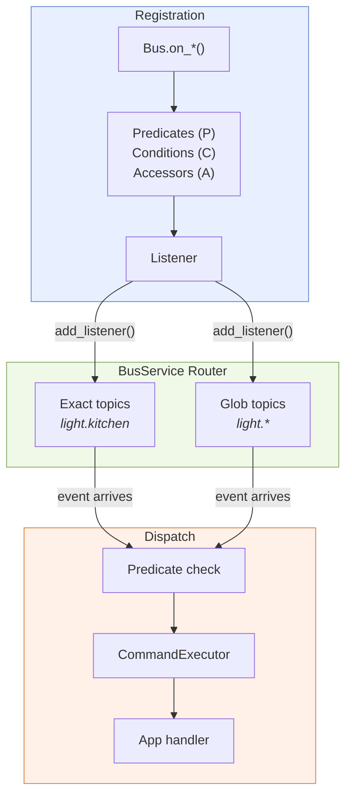
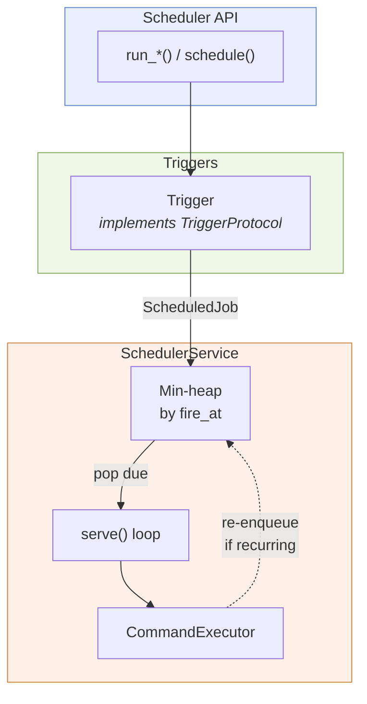
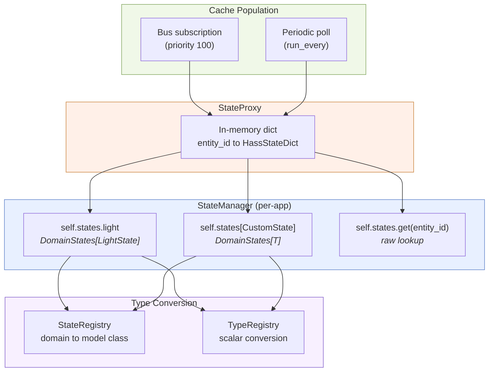
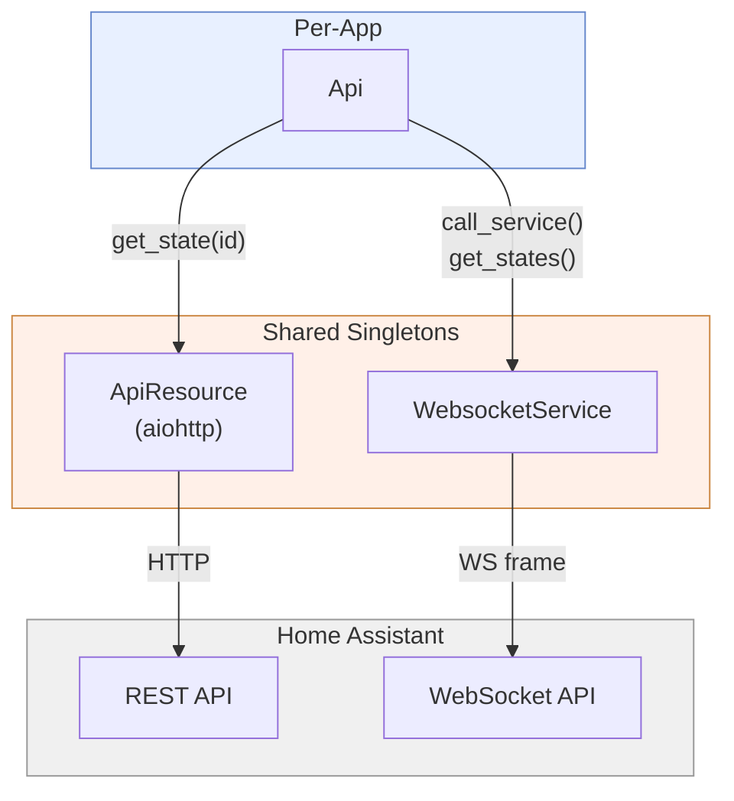
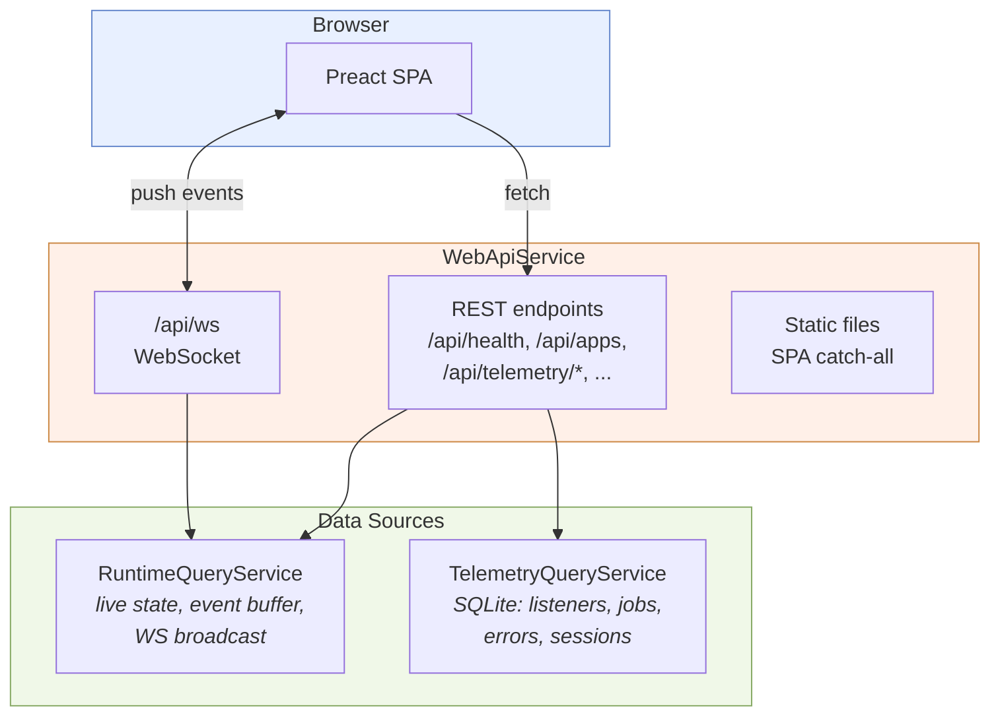

# System Internals: Per-Service Details

Each section follows the event pipeline from a Home Assistant WebSocket frame through to a recorded execution. A top-to-bottom pass traces a single inbound event through every service it touches.

## `Bus` Internals

Each app gets a [`Bus`][hassette.bus.bus.Bus] handle — a lightweight per-app object that delegates to the shared [`BusService`][hassette.core.bus_service.BusService] singleton. The `Bus` translates `on_*()` calls into [`Listener`][hassette.bus.listeners.Listener] objects. `BusService` indexes those listeners by topic and drives dispatch.

### Event Dispatch Pipeline

`BusService.dispatch()` runs these steps on every inbound event.

A `state_changed` event for `light.office` expands into three candidate topics in specificity order:

1. `hass.event.state_changed.light.office` (entity-exact)
2. `hass.event.state_changed.light.*` (domain-glob)
3. `hass.event.state_changed` (base topic)

Events with other `event_type` values expand to only the base topic.

`BusService` iterates the three topics in order and collects matching listeners from the `Router`. The router stores two separate indexes: one for exact topics, one for glob topics. A listener is collected at most once, deduplicated by `listener_id`.

Each collected listener runs `Listener.matches(event)`. Predicates registered via `P.*` and conditions registered via `C.*` are evaluated here. Listeners that fail the predicate are silently skipped.

Each passing listener spawns a [`TaskBucket`][hassette.task_bucket.task_bucket.TaskBucket] task that calls `CommandExecutor.execute()`. All matching listeners for a given event run in parallel.

### `Listener` Internal Structure

`Listener` composes four sub-structs:

| Sub-struct | Holds |
|---|---|
| [`ListenerIdentity`][hassette.bus.listeners.ListenerIdentity] | Ownership and telemetry fields (app key, name, topic, source location) |
| [`ListenerOptions`][hassette.bus.listeners.ListenerOptions] | Behavioral timing parameters (debounce, throttle, once, priority, immediate) |
| [`HandlerInvoker`][hassette.bus.listeners.HandlerInvoker] | Handler invocation, dispatch, and rate limiting |
| [`DurationConfig`][hassette.bus.listeners.DurationConfig] | Duration-hold configuration and timer lifecycle |

Registration is synchronous with the database. `sub.listener.db_id` is a valid integer immediately when the awaited `bus.on_*()` call returns.

### Rate Limiting

`HandlerInvoker` delegates to `RateLimiter` when `debounce` or `throttle` is set.

`RateLimiter.debounced_call()` cancels any pending debounce task before spawning a replacement. Each replacement captures the current event in its closure. Only the most recent event fires after the quiet window elapses. The previous task's closure is discarded entirely.

`RateLimiter.throttled_call()` records `time.monotonic()` on each call and drops the handler if fewer than `throttle` seconds have elapsed since the last invocation. The check-and-set is atomic under asyncio's single-threaded event loop.

### Listener Behavior Options

| Option | Effect |
|---|---|
| `debounce=N` | Events are buffered; the handler fires only after N seconds of quiet |
| `throttle=N` | The handler fires immediately, then further calls are suppressed for N seconds |
| `duration=N` | The handler fires only if the predicate still matches after N seconds |
| `once=True` | The listener auto-cancels after the first successful invocation |
| `priority=N` | Higher values dispatch first; [`StateProxy`][hassette.core.state_proxy.StateProxy] uses priority 100 |

## `Scheduler` Internals

[`Scheduler`][hassette.scheduler.scheduler.Scheduler] wraps convenience methods (`run_in`, `run_once`, `run_every`, `run_daily`, `run_cron`, `schedule`) around trigger objects. All jobs enter a shared min-heap inside [`SchedulerService`][hassette.core.scheduler_service.SchedulerService].

### Trigger Evaluation Loop

`SchedulerService.serve()` loops indefinitely. Each iteration:

1. Calls `_ScheduledJobQueue.pop_due_and_peek_next(now)`: pops all jobs whose dispatch time (`fire_at`) is at or before `now` and returns the next scheduled time.
2. Spawns a `TaskBucket` task for each due job via [`CommandExecutor`][hassette.core.command_executor.CommandExecutor].
3. Sleeps until the next job's `fire_at` time, clamped between `min_delay` and `max_delay`.

When no jobs are queued, the loop sleeps for `default_delay` seconds. The `kick()` method interrupts the sleep immediately. It fires when a new job is registered with an earlier run time than the current sleep target.

### Trigger-to-Job Translation

| Convenience method | Trigger object | Behavior |
|---|---|---|
| `run_in(fn, delay=N)` | [`After`][hassette.scheduler.triggers.After] | One-shot after N seconds |
| `run_once(fn, at=T)` | [`Once`][hassette.scheduler.triggers.Once] | One-shot at a specific time |
| `run_every(fn, seconds=N)` | [`Every`][hassette.scheduler.triggers.Every] | Recurring every N seconds |
| `run_daily(fn, at="HH:MM")` | [`Daily`][hassette.scheduler.triggers.Daily] | Wall-clock daily at HH:MM |
| `run_cron(fn, expression=E)` | [`Cron`][hassette.scheduler.triggers.Cron] | Croniter expression |
| `schedule(fn, trigger=T)` | Custom `T` | Implements [`TriggerProtocol`][hassette.types.types.TriggerProtocol] |

`Daily` uses `CronTrigger` internally rather than a 24-hour interval. A naive fixed interval would drift across DST transitions. `CronTrigger` computes `next_run` in the configured timezone and handles fall-back ambiguity by selecting the second (post-transition) occurrence.

### Missed-Job Handling

`SchedulerService` does not make up missed executions. A job whose dispatch time (`fire_at`) passed during a shutdown or restart fires once on the next `pop_due_and_peek_next` call, not multiple times for the skipped interval. `Every` triggers call `advance_past(now)` to advance `next_run` past the current time, so the job schedules forward from now rather than from its originally missed time.

### Jitter and Job Groups

`jitter=N` adds a random offset drawn from `[0, N]` seconds at enqueue time. Jobs in the same group share a `group=` label. `Scheduler.cancel_group(name)` cancels all jobs with that label. Named jobs (`name=`) support deduplication: `if_exists="skip"` leaves the existing job in place; `if_exists="replace"` cancels the existing job and re-registers.

## `StateManager` and `StateProxy`

`StateProxy` is a shared singleton maintaining an in-memory cache of all entity states. [`StateManager`][hassette.state_manager.state_manager.StateManager] is the per-app interface over it — the `self.states` handle — providing typed access with Pydantic model validation. App code never touches `StateProxy` directly.

### Cache Population

`StateProxy` declares `depends_on: [WebsocketService, ApiResource, BusService, SchedulerService]`. Once all four dependencies are ready, `on_initialize()` runs two setup steps.

First, `subscribe_to_events()` registers a bus subscription on `Topic.HASS_EVENT_STATE_CHANGED` at priority 100. Priority 100 means `StateProxy`'s handler updates the cache before any user handler sees the event. App handlers always observe current state.

Second, `load_cache()` bulk-fetches all entity states via `get_states_raw()` and populates the `states` dict. A periodic `run_every` job re-runs `load_cache()` at `state_proxy_poll_interval_seconds` intervals to recover from any missed events.

### Lock-Free Reads

`StateProxy.get_state()` reads from `self.states` without acquiring a lock. CPython dict reads are safe without locking because dict assignment replaces whole objects atomically. Writers use a `FairAsyncRLock` when updating the dict to prevent concurrent write corruption. Readers never contend with each other.

### Type Conversion and `context_id` Caching

[`DomainStates`][hassette.state_manager.state_manager.DomainStates] wraps a `StateProxy` and a model class. On each entity access, `DomainStates._validate_or_return_from_cache()` extracts the `context_id` from the raw state dict (a UUID from Home Assistant's event context). If the `context_id` matches the cached `CacheValue`, the previously validated Pydantic model is returned without re-running validation. A new `context_id` triggers a full validation pass and replaces the cached entry.

`StateManager.__getattr__` caches `DomainStates` instances by model class in `_domain_states_cache`. Accessing `self.states.light` multiple times returns the same `DomainStates` object.

### Disconnect and Reconnect

On WebSocket disconnect, `StateProxy` clears `self.states` and calls `mark_not_ready()`. State reads during this window raise [`ResourceNotReadyError`][hassette.exceptions.ResourceNotReadyError]. On reconnect, `load_cache()` bulk-reloads all states, then `subscribe_to_events()` re-registers the bus subscription. `mark_ready()` then unblocks any waiters.

## Api Internals

The per-app [Api][hassette.api.api.Api] handle delegates all network I/O to two shared singletons: [`ApiResource`][hassette.core.api_resource.ApiResource] (REST) and [`WebsocketService`][hassette.core.websocket_service.WebsocketService] (WebSocket).

### Transport Routing

| Method | Transport | Pattern |
|---|---|---|
| `get_state(entity_id)` | REST | `GET /api/states/{id}` |
| `get_state_raw(entity_id)` | REST | `GET /api/states/{id}` |
| `get_states()` | WebSocket | `get_states` command |
| `call_service()` | WebSocket | `call_service` command |
| `fire_event()` | WebSocket | `fire_event` command |
| `ws_send_and_wait()` | WebSocket | Raw message, blocks for result |
| `ws_send_json()` | WebSocket | Raw message, fire-and-forget |
| `rest_request()` | REST | Raw `aiohttp` request |

`Api.rest_request()` and `Api.ws_send_and_wait()` are escape hatches for HA API surface not covered by the typed methods.

### Authentication

`HassetteConfig.token` holds a long-lived access token. `ApiResource` injects it as a `Bearer` header on every REST request. The WebSocket auth handshake sends an `auth` frame immediately after connection. Auth failures raise [`InvalidAuthError`][hassette.exceptions.InvalidAuthError], a [`FatalError`][hassette.exceptions.FatalError] subclass. The system shuts down immediately rather than retrying.

### Connection Management

`ApiResource` holds a single `aiohttp.ClientSession`. `WebsocketService` manages the WebSocket connection with tenacity retry logic (default 5 attempts with exponential jitter, configurable via `connect_retry_max_attempts`). On reconnect, `StateProxy` bulk-reloads state and re-registers its subscription. Per-app `Api` instances share the same underlying connections. There is no per-app connection pool.

## Database Internals

[`DatabaseService`][hassette.core.database_service.DatabaseService] stores all telemetry in a local SQLite file. Schema management uses SQLite's native `PRAGMA user_version` with numbered `.sql` migration files.

### Schema

The database has five tables:

| Table | Purpose |
|---|---|
| `sessions` | One row per Hassette process run; tracks start/stop time and error info |
| `listeners` | One row per registered bus listener; natural key `(app_key, instance_index, name, topic)` |
| `scheduled_jobs` | One row per registered scheduler job; natural key `(app_key, instance_index, job_name)` |
| `executions` | One row per handler invocation or job execution; unified with `kind` discriminator |
| `log_records` | Captured log lines with `execution_id` linkage |

`executions` stores one row per handler invocation or job execution. The `kind` column holds `'handler'` or `'job'`. `listener_id` and `job_id` are nullable foreign keys into `listeners` and `scheduled_jobs` respectively. A `CHECK` constraint enforces that exactly one is non-null per row: `CHECK ((listener_id IS NOT NULL) + (job_id IS NOT NULL) = 1)`.

Six views (`active_listeners`, `active_app_listeners`, `active_framework_listeners`, and their scheduled-job equivalents) pre-filter retired registrations.

### Migration System

The migration runner reads `PRAGMA user_version` from the on-disk database and applies each numbered `.sql` file in order. Every migration runs inside `BEGIN IMMEDIATE` / `COMMIT`, with `PRAGMA user_version = N` as the final statement. A crash mid-migration leaves the version at N-1; the next startup retries from that point.

On a fresh database (`user_version = 0`), the runner sets `auto_vacuum = INCREMENTAL` via a separate connection before any transaction. `PRAGMA auto_vacuum` cannot be changed inside `BEGIN IMMEDIATE`, so it must precede the first transaction.

`DatabaseService.handle_schema_version()` runs before migrations:

| On-disk version | Code action |
|---|---|
| Matches expected head | No action |
| Older than expected head | Log warning, delete database, allow migrations to recreate |
| `0` on existing file | Treat as unversioned legacy schema, delete and recreate |
| Newer than expected head | Raise [`SchemaVersionError`][hassette.exceptions.SchemaVersionError]; manual intervention required |

`SchemaVersionError` is declared in `DatabaseService.restart_spec.fatal_error_names`, so a version-ahead database stops the process immediately rather than retrying.

### Write Pipeline

`DatabaseService` serializes all writes through an `asyncio.Queue` drained by a single background `db_write_worker()` task. Callers submit a coroutine to `DatabaseService.submit()` or place a raw item via `enqueue()`. The worker processes items one at a time. Each item is a `(coroutine, future)` pair; when a future is present, the result or exception is delivered through it.

A dedicated read connection (`_read_db`) runs with `PRAGMA query_only = ON` and a 5-second busy timeout. Read queries never contend with the write worker.

### Synchronous Registration

`BusService` and `SchedulerService` declare `depends_on: [DatabaseService, SyncExecutorService]` (and `AppHandler` also declares `SyncExecutorService`). The database is ready before any listener or job registration runs, and the dedicated sync-handler executor outlives Bus, Scheduler, and the App lifecycle hooks so it is torn down only after them at shutdown. Each `bus.on_*()` call awaits the `DatabaseService.submit()` call inline, so `sub.listener.db_id` is a valid integer when the awaited registration returns. `Scheduler` methods behave identically.

### Retention

A background loop in `DatabaseService.serve()` runs retention cleanup every `_RETENTION_INTERVAL_SECONDS` seconds. `_RETENTION_TABLES` declares each managed table with its retention column. Each entry carries a `retention_days_getter` lambda that reads the configured value from `HassetteConfig`. A separate size-failsafe loop runs on startup and periodically. When the database exceeds a configured size threshold, it deletes old rows in batches and runs incremental vacuum.

## Web/UI Layer

[`WebApiService`][hassette.core.web_api_service.WebApiService] starts a uvicorn/FastAPI server. Two data source services provide live state and historical telemetry to the frontend.

### WebApiService

`WebApiService.serve()` calls `create_fastapi_app()` and passes the result to `uvicorn.Server`. The uvicorn instance uses `ws="websockets-sansio"` and `lifespan="off"`. On `CancelledError` during shutdown, the service calls `asyncio.shield(server.shutdown())` to give uvicorn a graceful exit window before propagating cancellation.

When `config.web_api.run` is `False`, `serve()` blocks on `shutdown_event.wait()` without binding a port. The dependency graph remains intact, and services that depend on `WebApiService` being ready still start normally.

### RuntimeQueryService

`RuntimeQueryService` subscribes to bus events on initialization and maintains a bounded in-memory event buffer. On each WebSocket-push-worthy event (state changes, app status changes, execution completions), `buffer_and_broadcast()` appends to the buffer and fans out to all registered WebSocket clients.

Each connected client gets its own `asyncio.Queue` of bounded size (`_WS_CLIENT_QUEUE_MAX`). A slow client that exhausts its queue causes its frames to be dropped with a rate-limited log line. Clients register via `register_ws_client()` and deregister via `unregister_ws_client()`.

### TelemetryQueryService

`TelemetryQueryService` serves all historical data: listener registrations, job registrations, execution records, log lines, and session history. Queries run against `DatabaseService.read_db` (the dedicated read connection) to avoid contending with the write worker.

### SPA Routing

`create_fastapi_app()` mounts `/assets` and `/fonts` via `StaticFiles` for the built SPA output. A `spa_catch_all` handler covers all remaining paths: it serves root-level static files directly, returns 404 for API paths and filenames matching `_STATIC_EXTENSIONS`, and returns `index.html` for everything else. This enables client-side routing inside the Preact SPA.
