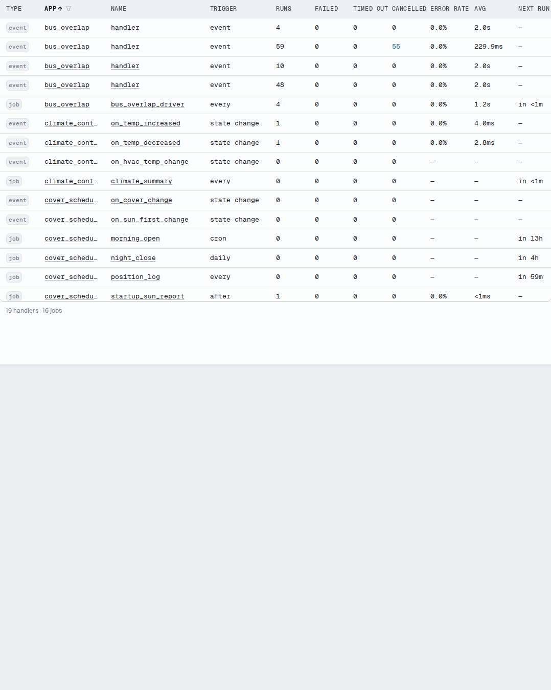

# Execution Modes

The `mode` parameter controls what happens when a recurring job's next tick
becomes due while a prior invocation is still running. Four modes are
available, matching the bus's execution modes.

```python
--8<-- "pages/core-concepts/scheduler/snippets/scheduler_execution_modes.py:mode_parameter_basic"
```

`mode=` is accepted by `schedule()` and all seven convenience methods:
`run_in`, `run_once`, `run_every`, `run_minutely`, `run_hourly`,
`run_daily`, and `run_cron`.

## On-Grid Firing

Recurring jobs reschedule the next occurrence at dispatch time — before the
current invocation runs. This means an overrunning job fires on its grid,
not interval-after-completion.

A job scheduled every 30 seconds that takes 45 seconds fires at T+0, T+30
(held by the mode), T+60, T+90 — not T+0, T+45, T+75. A job that
completes within its interval fires at identical times to before.

The mode governs what happens when that next-tick entry becomes due while
the current run is still in flight.

## The Four Modes

### `single` — drop while running (app default)

`single` is the default for app jobs. When the next tick becomes due while
the prior invocation is still running, the scheduler drops the re-fire.
The running invocation continues uninterrupted.

```python
--8<-- "pages/core-concepts/scheduler/snippets/scheduler_execution_modes.py:single_implicit"
```

The dropped re-fire is logged at DEBUG. No WARNING is emitted — this is
expected behavior, not an error.

`single` is the right choice for jobs that mutate shared state, call a
slow service, or hold a resource. One invocation at a time prevents
duplicate side effects.

### `restart` — cancel and replace

`restart` cancels the running invocation when the next tick becomes due,
then starts a fresh one.

```python
--8<-- "pages/core-concepts/scheduler/snippets/scheduler_execution_modes.py:restart"
```

The cancelled invocation receives `CancelledError` at its next `await`.
Making jobs cancellation-safe is the author's responsibility — the
framework cancels the task, but cleanup logic inside the job must be
idiomatic Python (`try/finally` or `contextlib.suppress`).

`restart` is the right choice for "latest wins" patterns: a report
refresh where only the most recent run matters, or a cache reload where
a stale in-flight run should give way to a fresher one.

!!! warning "Cancelled invocations have side effects"
    A job cancelled mid-run may have already mutated state or called a
    service. The framework provides no automatic rollback. Jobs that
    mutate state mid-run need cancellation handling (`try/finally` or
    `contextlib.suppress`). `single` or `queued` avoid partial execution
    entirely.

### `queued` — serialize in arrival order

`queued` runs every tick, one at a time, in the order ticks arrived.
Ticks that become due while an invocation is running are held and
dispatched sequentially after the current invocation completes.

```python
--8<-- "pages/core-concepts/scheduler/snippets/scheduler_execution_modes.py:queued"
```

The queue holds at most 10 pending ticks. When the queue is full, the
newest tick is dropped and logged at DEBUG. Already-queued ticks are
unaffected. This cap prevents unbounded memory growth when a slow job
falls behind a fast schedule.

`queued` is the right choice when every tick must be processed and order
matters: sequential audit runs, command dispatch, or anything where
skipping an execution would leave the system in an incorrect state.

### `parallel` — concurrent (framework default)

`parallel` imposes no overlap guard. Multiple invocations of the same job
run concurrently. This is the framework default for internal jobs.

```python
--8<-- "pages/core-concepts/scheduler/snippets/scheduler_execution_modes.py:parallel"
```

`parallel` is the right choice for stateless, idempotent work where each
invocation manages its own isolated resources.

## Default Mode: Tier-Aware

The default mode depends on the *tier* — who registered the job. App
jobs and framework-internal jobs get different defaults.

Framework-internal jobs are the scheduler entries Hassette registers for
itself — not through `self.scheduler.*` in an app — to run its own
services.

| Registration tier | Default mode | Why |
|---|---|---|
| App job (`self.scheduler.*`) | `single` | Prevents a job from running twice at once in user automations |
| Framework-internal job | `parallel` | Preserves concurrent behavior required by the framework |

An explicit `mode=` always overrides the tier default.

## One-Shot Jobs

`mode=` is accepted on one-shot schedules (`run_in` and `run_once`) for
API uniformity. It has no overlap effect — a one-shot fires once and is
removed, so no overlap is possible.

```python
--8<-- "pages/core-concepts/scheduler/snippets/scheduler_execution_modes.py:one_shot_mode"
```

The value passed is stored on the job and appears in the jobs API
response, but it never triggers guard logic.

## Observability

### Suppressed and dropped counts

Each job with a non-`parallel` mode tracks two live counters:

- **Suppressed** — ticks dropped by `single` while the job was running.
- **Dropped** — ticks discarded by `queued` when the queue was at its
  cap.

These counts appear in the [monitoring UI's Jobs view](../../web-ui/index.md)
when non-zero, alongside the job's mode. They are live-only diagnostics
— held in memory, reset to zero when the process restarts, never
persisted to the database.

A non-zero suppressed count on a `single` job indicates ticks arrive
faster than the job completes. If that represents lost work, consider
`queued`. If it represents expected deduplication, `single` is correct.

### Cancelled counts

`restart` cancels the running invocation on every re-fire, so a busy
`restart` job accumulates cancelled executions. Cancelled is a persisted
execution status, not a live counter — the telemetry database records each
one, and the monitoring UI surfaces a cancelled count separate from
failures.

A `restart` job working as designed shows a high cancelled count and a 100%
success rate. Cancellation is the intended outcome, so it never counts
against the success rate. The cancelled column appears in the Handlers table
for both jobs and event handlers.



### Stall detection

A job that holds its execution-mode guard — any mode except `parallel` —
longer than 60 seconds without completing emits a WARNING. This is the
only WARNING the execution mode feature generates. Suppressed and dropped
ticks always log at DEBUG.

The per-job `timeout` still applies and ultimately releases the guard
when it fires. The stall WARNING is an early signal, independent of the
timeout.

### Mode in the monitoring UI

The mode is persisted for each job and displayed in the
[monitoring UI's Jobs view](../../web-ui/index.md). The mode appears
alongside the job's next run time, suppressed count, and dropped count.

Run `hassette job` on a running instance to see each job's mode from
the command line. The live suppressed and dropped counts are not in the
default table — use `hassette job --json` to read them alongside every
other field.

## See Also

- [Scheduling Methods](methods.md): full parameter reference, including
  `name`, `group`, `jitter`, `timeout`, and `if_exists`
- [Job Management](management.md): cancellation, groups, error handling,
  and the [`ScheduledJob`][hassette.scheduler.classes.ScheduledJob] object
- [Triggers](triggers.md): built-in trigger types and writing custom
  triggers
- [Bus Execution Modes](../bus/execution-modes.md): the same four modes
  on event handlers
