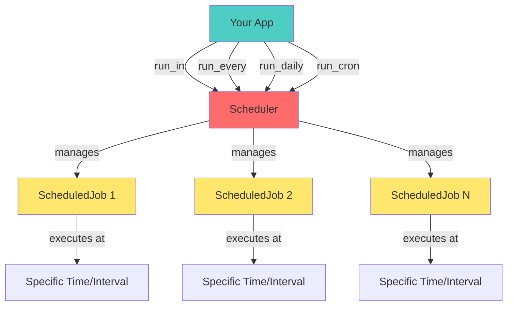

# Scheduler

You can schedule any method or function, async or sync, to run at specific times or intervals using the built-in scheduler. The
scheduler will ensure your callable runs asynchronously in Hassette's event loop, even if it's a synchronous function. There is
no required signature for scheduled callables; you can provide parameters using the `args` and `kwargs` arguments to the scheduling helpers.

The scheduler is created at app instantiation and is available as `self.scheduler`. There are multiple helper methods to schedule jobs, described below.
These return a `ScheduledJob` instance you can keep to inspect or manage the job later. To cancel a job, call its `cancel()` method.



!!! note
    The cron helper uses `croniter` under the hood, so you can use any cron syntax it supports for the parameters. This will likely be updated in the future
    to expose more `croniter` features. The interval helpers use `whenever` under the hood. All scheduling is done using `whenever`s `ZonedDateTime`.
    This will likely need to be updated in the future to something that won't break during DST transitions, but I hadn't thought of that yet when implementing this.

While schedule helpers will have different signatures, all will take the following optional parameters:

 - `start` - Provide details for when to first call the job.

    - If an `int` or `float`, this is a delay in seconds from now.
    - If a `ZonedDateTime`, this is the exact time to run.
    - If a `TimeDelta`, this is added to the current time to get the first run time.
    - If `tuple[int, int]`, this is treated as `(hour, minute)` and added to the current time to get the first run time.
    - If `Time` (from `whenever`) or `time` (from stdlib), the hours and minutes are added to the current time to get the first run time.
    - If `None` (the default), the job is scheduled to run immediately and then according to its interval or cron schedule.

 - `name` - A name for the job, useful for logging and debugging.
 - `args` - Positional arguments to pass to your callable, keyword-only.
 - `kwargs` - Keyword arguments to pass to your callable, keyword-only.

!!! note
    The `kwargs` parameter is a single parameter that expects a dictionary. The helper methods do not accept variable keyword arguments (e.g. `**kwargs`),
    to avoid ambiguity with other parameters.

```python
--8<-- "pages/core-concepts/scheduler/basic_example.py:6:14"
```

## Scheduling helpers

Each helper returns a [`ScheduledJob`][hassette.scheduler.classes.ScheduledJob] you can keep to inspect
`next_run` or cancel it later.

Helper methods include the following:

 - `run_once`: Run once after a delay, does not accept any additional schedule parameters.
 - `run_in`: Run once after a delay, accepts `delay` (`TimeDelta` or seconds).
 - `run_every`: Run repeatedly at a fixed interval, accepts `interval` (`TimeDelta` or seconds).
 - `run_minutely`: Run repeatedly every N minutes, accepts `minutes` (int).
 - `run_hourly`: Run repeatedly every N hours, accepts `hours` (int), use `start` to set minute offset.
 - `run_daily`: Run repeatedly every N days at a specific time, accepts `days` (int), use `start` to set hour/minute offset.
 - `run_cron`: Run repeatedly on a cron schedule.
    - Accepts any of the following cron parameters: `second`, `minute`, `hour`, `day_of_month`, `month`, `day_of_week`.

## Worked examples

The snippet below demonstrates mixed synchronous/async jobs and custom start times.

```python
--8<-- "pages/core-concepts/scheduler/worked_examples.py"
```

## Managing jobs

You can keep the `ScheduledJob` returned from any helper to manage its lifecycle.

```python
--8<-- "pages/core-concepts/scheduler/managing_jobs_example.py:5:13"
```

Cancelling sets `job.cancelled` and the scheduler will remove it from the job list. For repeating jobs
`job.next_run` updates automatically after every run so you can monitor drift or display upcoming
runs in your UI.

## Best practices

* Name your jobs when you have multiples; the scheduler propagates the name into logs and reprs.
* Prefer async callables for I/O heavy work. Reserve synchronous jobs for fast operations.

## See Also

- [Core Concepts](../index.md) — back to the core concepts overview
- [Apps](../apps/index.md) — more on app anatomy, lifecycle, and capabilities
- [Bus](../bus/index.md) — more on subscribing to and handling events
- [API](../api/index.md) — more on interacting with Home Assistant's APIs
- [Configuration](../configuration/index.md) — Hassette and app configuration
