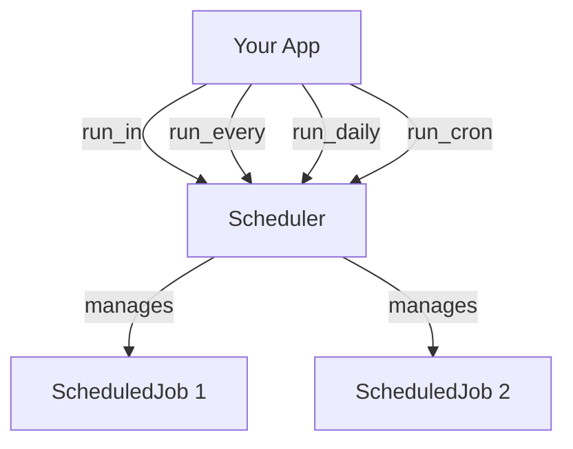

# Scheduler Overview

The built-in scheduler allows you to run functions at specific times or intervals. It ensures your code runs safely in Hassette's event loop, whether your functions are async or sync.

The scheduler is available as `self.scheduler` in every app.



## The `start` Parameter

Most scheduling methods accept an optional `start` parameter to control the first execution time. It is very flexible:

| Type | Behavior |
| ---- | -------- |
| `int` / `float` | Delay in **seconds** from now. |
| `ZonedDateTime` | Exact run time. |
| `Time` / `time` | Run at the next occurrence of this clock time (e.g. 08:00). |
| `tuple[int, int]` | Treated as `(hour, minute)` for the next occurrence. |
| `None` (Default) | Run "now" (relative to method logic). |

### Examples

```python
# Run every hour, starting 60 seconds from now
self.scheduler.run_hourly(self.task, start=60)

# Run daily, starting at 7:00 AM
self.scheduler.run_daily(self.task, start=(7, 0))

# Run once at a calculated future time
next_week = self.now().add(days=7)
self.scheduler.run_once(self.task, start=next_week)
```

## Next Steps

- **[Scheduling Methods](methods.md)**: Explore `run_in`, `run_every`, `run_cron`, and convenience helpers.
- **[Job Management](management.md)**: Learn how to name, track, and cancel jobs.
