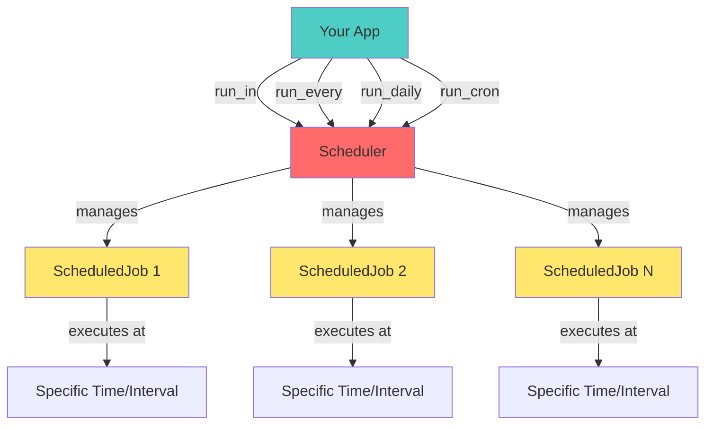

# Scheduler

You can schedule any method or function, async or sync, to run at specific times or intervals using the built-in scheduler. The
scheduler will ensure your callable runs asynchronously in Hassette's event loop, even if it's a synchronous function. There is
no required signature for scheduled callables; you can provide parameters using the `args` and `kwargs` arguments to the scheduling helpers.

The scheduler is created at app instantiation and is available as `self.scheduler`. There are multiple helper methods to schedule jobs, described below.
These return a `ScheduledJob` instance you can keep to inspect or manage the job later. To cancel a job, call its `cancel()` method.



!!! note
    The cron helper uses `croniter` under the hood, so you can use any cron syntax it supports for the parameters. This will likely be updated in the future
    to expose more `croniter` features. The interval helpers use `whenever` under the hood. All scheduling is done using `whenever`s `ZonedDateTime`.

While schedule helpers will have different signatures, all will take the following optional parameters:

**`start`** - Provide details for when to first call the job:

| Type                                        | Behavior                                                                                              |
| ------------------------------------------- | ----------------------------------------------------------------------------------------------------- |
| `int` or `float`                            | Delay in seconds from now                                                                             |
| `ZonedDateTime`                             | Exact time to run                                                                                     |
| `TimeDelta`                                 | Added to current time to get first run time                                                           |
| `tuple[int, int]`                           | Treated as `(hour, minute)` and added to current time                                                 |
| `Time` (from `whenever`) or `time` (stdlib) | Hours and minutes added to current time                                                               |
| `None` (default)                            | Apply the defined logic to the current time (e.g. `run_hourly` would run at current time + `n` hours) |

**Other parameters:**

- `name` - A name for the job, useful for logging and debugging.
- `args` - Positional arguments to pass to your callable, keyword-only.
- `kwargs` - Keyword arguments to pass to your callable, keyword-only.

!!! note
    The `kwargs` parameter is a single parameter that expects a dictionary. The helper methods do not accept variadic keyword arguments (e.g. `**kwargs`),
    to avoid ambiguity with other parameters.

```python
--8<-- "pages/core-concepts/scheduler/basic_example.py:6:14"
```

## Scheduling helpers

Each helper returns a [`ScheduledJob`][hassette.scheduler.classes.ScheduledJob] you can keep to inspect
`next_run` or cancel it later.

Helper methods include the following:

 - `run_once`: Run once at provided time, does not accept any additional schedule parameters.
 - `run_in`: Run once after a delay, accepts `delay` (`TimeDelta` or seconds).
 - `run_every`: Run repeatedly at a fixed interval, accepts `interval` (`TimeDelta` or seconds).
 - `run_minutely`: Run repeatedly every N minutes, accepts `minutes` (int).
 - `run_hourly`: Run repeatedly every N hours, accepts `hours` (int), use `start` to set minute offset.
 - `run_daily`: Run repeatedly every N days at a specific time, accepts `days` (int), use `start` to set hour/minute offset.
 - `run_cron`: Run repeatedly on a cron schedule.
    - Accepts any of the following cron parameters: `second`, `minute`, `hour`, `day_of_month`, `month`, `day_of_week`.

## Worked examples

The snippet below demonstrates mixed synchronous/async jobs and custom start times.

```python
--8<-- "pages/core-concepts/scheduler/worked_examples.py"
```

## Managing jobs

You can keep the `ScheduledJob` returned from any helper to manage its lifecycle.

```python
--8<-- "pages/core-concepts/scheduler/managing_jobs_example.py:5:13"
```

Cancelling sets `job.cancelled` and the scheduler will remove it from the job list. For repeating jobs
`job.next_run` updates automatically after every run so you can monitor drift or display upcoming
runs in your UI.

## Common Patterns

### Delayed Actions

Run something after a delay, often used for timeouts or "turn off after X":

```python
async def on_motion(self):
    await self.api.turn_on("light.hallway")
    # Turn off after 5 minutes of no motion
    self.scheduler.run_in(self.turn_off_hallway, delay=300)

async def turn_off_hallway(self):
    await self.api.turn_off("light.hallway")
```

### Periodic Tasks

Check or update something at regular intervals:

```python
async def on_initialize(self):
    # Check battery levels every hour
    self.scheduler.run_every(self.check_batteries, interval=3600)

async def check_batteries(self):
    states = await self.api.get_states()
    low_batteries = [s for s in states if s.attributes.get("battery_level", 100) < 20]
    if low_batteries:
        await self.notify(f"{len(low_batteries)} devices with low battery")
```

### Time-Based Automations

Run tasks at specific times of day:

```python
async def on_initialize(self):
    # Morning routine at 7 AM
    self.scheduler.run_daily(self.morning_routine, start=(7, 0))

    # Evening routine at 6:30 PM
    self.scheduler.run_daily(self.evening_routine, start=(18, 30))
```

### Cleanup on Shutdown

Remember to cancel jobs that shouldn't run after shutdown:

```python
async def on_initialize(self):
    self.cleanup_job = self.scheduler.run_every(self.cleanup, interval=3600)

async def on_shutdown(self):
    # Cancel the cleanup job explicitly if needed
    self.cleanup_job.cancel()
    # Note: Hassette auto-cancels all jobs, but you may want explicit control
```

## Understanding the `start` Parameter

The `start` parameter controls when a job first runs. Here are practical examples for each type:

**Delay from now (int/float):**

```python
# Run in 60 seconds, then every 5 minutes
self.scheduler.run_every(self.task, interval=300, start=60)
```

**Specific time (ZonedDateTime):**

```python

# Run at 3 PM today, then every hour
three_pm = self.now().replace(hour=15, minute=0, second=0)
self.scheduler.run_hourly(self.task, hours=1, start=three_pm)
```

**Offset from current time (tuple):**

```python
# Start at next hour boundary (+1 hour, +0 minutes from now), then run daily
self.scheduler.run_daily(self.task, start=(1, 0))
```

## Cron Expressions

The `run_cron` method accepts standard cron parameters. You can use these individually or combine them:

| Parameter      | Values         | Example                         |
| -------------- | -------------- | ------------------------------- |
| `second`       | 0-59           | `0` - top of the minute         |
| `minute`       | 0-59           | `30` - 30 minutes past the hour |
| `hour`         | 0-23           | `14` - 2 PM                     |
| `day_of_month` | 1-31           | `15` - 15th of the month        |
| `month`        | 1-12           | `6` - June                      |
| `day_of_week`  | 0-6 (Sunday=0) | `1` - Monday                    |

**Common cron examples:**

```python
# Every weekday at 9 AM
self.scheduler.run_cron(self.weekday_task, hour=9, minute=0, day_of_week="1-5")

# First day of every month at midnight
self.scheduler.run_cron(self.monthly_task, day_of_month=1, hour=0, minute=0)

# Every 15 minutes
self.scheduler.run_cron(self.quarter_hour_task, minute="*/15")

# Tuesday and Thursday at 2:30 PM
self.scheduler.run_cron(self.twice_weekly, hour=14, minute=30, day_of_week="2,4")

# Every 30 seconds
self.scheduler.run_cron(self.half_minute_task, second="*/30")
```

## Dynamic Scheduling

Schedule jobs based on runtime conditions or state:

```python
async def on_motion_detected(self, event):
    # Cancel any existing timeout
    if hasattr(self, 'timeout_job') and self.timeout_job:
        self.timeout_job.cancel()

    # Turn on light
    await self.api.turn_on("light.hallway")

    # Schedule new timeout - this resets on each motion
    self.timeout_job = self.scheduler.run_in(self.turn_off_light, delay=300)

async def schedule_based_on_sunset(self):
    from hassette.models import states

    # Get sunset time from Home Assistant
    sun = await self.api.get_state("sun.sun", states.SunState)
    sunset = sun.attributes.next_setting

    # Schedule something 30 minutes before sunset
    run_time = sunset.add(minutes=-30)
    self.scheduler.run_once(self.pre_sunset_task, start=run_time)
```

## Scheduling vs Event-Driven

Consider these approaches for common scenarios:

| Scenario                          | Better Approach              | Why                                 |
| --------------------------------- | ---------------------------- | ----------------------------------- |
| Turn off light after motion stops | Event-driven with `debounce` | More responsive, doesn't waste CPU  |
| Check if garage is open at night  | Scheduled (11 PM check)      | Specific time requirement           |
| Monitor temperature sensor        | Event-driven on state change | Real-time response                  |
| Daily backup at 2 AM              | Scheduled                    | Time-based by nature                |
| Turn on lights at sunset          | Scheduled (with sun entity)  | Time-based with dynamic calculation |

**Event-driven example** (better for motion):

```python
# This is more efficient than polling every second
self.bus.on_state_change(
    "binary_sensor.motion",
    handler=self.handle_motion,
    changed_to="off",
    debounce=300  # wait 5 minutes of no motion
)
```

**Scheduled example** (better for timed checks):

```python
# This makes sense because we want it at a specific time
self.scheduler.run_daily(self.check_garage, start=(23, 0))
```

## Troubleshooting

### Job Not Running

If your job isn't executing:

1. **Check the job was created**: Store and log the returned `ScheduledJob`

   ```python
   job = self.scheduler.run_daily(self.task, start=(8, 0))
   self.logger.info(f"Scheduled: {job.name} at {job.next_run}")
   ```

2. **Verify the `start` time is in the future**

   ```python
   # BAD: If it's already 3 PM, this won't run until tomorrow
   self.scheduler.run_once(self.task, start=(15, 0))

   # use self.now() to get now as a ZonedDateTime
   run_time = self.now().add(hours=1)
   self.scheduler.run_once(self.task, start=run_time)
   ```

3. **Check for exceptions in your callable**

   ```python
   async def my_task(self):
       try:
           # your code here
           await self.api.call_service(...)
       except Exception:
           self.logger.exception("Task failed")
   ```

### Job Running Too Often/Not Often Enough

- For `run_every`, ensure `interval` is in **seconds** (not minutes!)
- For cron jobs, test your expression with an online cron calculator
- Check `job.next_run` to see when the scheduler thinks it will execute next
- Remember that `run_minutely(minutes=5)` means "every 5 minutes", not "at minute 5"

### Job Not Canceling

Make sure you keep a reference to the job:

```python
# Store the job reference
self.my_job = self.scheduler.run_every(self.task, interval=60)

# Later, cancel it
self.my_job.cancel()
```

## Best practices

* Name your jobs when you have multiples; the scheduler propagates the name into logs and reprs.
* Prefer async callables for I/O heavy work. Reserve synchronous jobs for fast operations.
* Use event-driven approaches (bus subscriptions with debounce) instead of polling when possible.
* Store job references if you need to cancel them later.
* Log `job.next_run` during initialization to verify scheduling logic.

## See Also

- [Core Concepts](../index.md) — back to the core concepts overview
- [Apps](../apps/index.md) — more on app anatomy, lifecycle, and capabilities
- [Bus](../bus/index.md) — more on subscribing to and handling events
- [API](../api/index.md) — more on interacting with Home Assistant's APIs
- [Configuration](../configuration/index.md) — Hassette and app configuration
