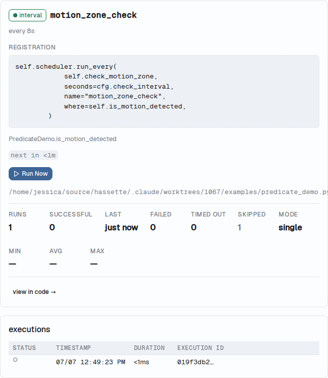

# Scheduler

The scheduler runs functions after a delay, at a specific time, or on a repeating interval. `self.scheduler` is available on every [App](../apps/index.md) instance. Hassette creates it at startup and runs all jobs in the async event loop. Sync callables are wrapped automatically.

!!! warning "All scheduling methods must be awaited"
    Every `run_*`, `schedule()`, and `add_job()` call returns a coroutine. Without `await`, the job is never scheduled and no error is raised. A forgotten `await` produces a [`HassetteForgottenAwaitWarning`][hassette.exceptions.HassetteForgottenAwaitWarning] naming the offending app when the coroutine is GC'd (subject to [configuration](../../troubleshooting.md#forgotten-await)). Pyright's `reportUnusedCoroutine` catches this at edit time — see [Enabling Pyright](../../troubleshooting.md#enabling-pyright).

## How It Works

All scheduling methods delegate to `schedule(func, trigger)`. `schedule` pairs a callable with a trigger object — a value like `After(seconds=5)` or `Daily(at="07:00")` that describes the schedule. Sync callables (plain `def`) are wrapped in a thread pool automatically, so blocking I/O is safe without extra setup.

Each call returns a [`ScheduledJob`][hassette.scheduler.classes.ScheduledJob] handle. The handle cancels the job, inspects its next fire time, or checks whether it has already run. [Job Management](management.md) covers the full handle API.

## Common Patterns

### Run after a delay

`run_in` schedules a one-shot job that fires after a fixed number of seconds.

```python
--8<-- "pages/core-concepts/scheduler/snippets/scheduler_run_in.py"
```

The `delay` parameter accepts seconds as a `float`. The job fires once and does not repeat.

### Run on a repeating interval

`run_every` schedules a job that fires repeatedly on a fixed interval.

```python
--8<-- "pages/core-concepts/scheduler/snippets/scheduler_run_every.py"
```

`seconds`, `minutes`, and `hours` are all accepted. The scheduler is drift-resistant. Each run fires relative to the previous scheduled time, not the previous actual time.

### Run daily at a fixed time

`run_daily` schedules a job that fires once per day at a wall-clock time.

```python
--8<-- "pages/core-concepts/scheduler/snippets/scheduler_run_daily.py"
```

The `at` parameter accepts `"HH:MM"` strings. Without `at=`, the job fires at midnight local time. `run_daily` is DST-safe — it fires at the local wall-clock time regardless of clock changes.

??? note "Synchronous usage (AppSync only)"
    [`AppSync`][hassette.app.app.AppSync] is an alternative base class for automations that must call blocking libraries. Its lifecycle hooks run in a worker thread outside the async event loop. `self.scheduler.sync` exposes a [`SchedulerSyncFacade`][hassette.scheduler.sync.SchedulerSyncFacade] that mirrors all scheduling methods as blocking calls. The [Apps](../apps/index.md) page covers the `AppSync` pattern.

`name=` identifies each job in logs and the [monitoring UI](../../web-ui/index.md). It must be unique within the app instance — duplicates raise `ValueError`. See [Scheduling Methods](methods.md) for details.

## Conditional Execution

`where=` accepts a predicate — a callable returning `bool` — checked right before the handler runs. When the predicate returns `False`, the handler doesn't run. The job body needs no guard clause of its own.

```python
--8<-- "pages/core-concepts/scheduler/snippets/scheduler_where_state_check.py:where_state"
```

A predicate with no [`ScheduledJob`][hassette.scheduler.classes.ScheduledJob] annotation takes zero arguments (the common case). A predicate with a positional parameter annotated as `ScheduledJob` receives the job instance, for access to `job.args` and `job.kwargs`. Recurring jobs keep their schedule regardless of the outcome. Only a one-shot job (`run_in`, `run_once`) is consumed when skipped. Register a new one-shot job to retry a skipped execution.

A skipped run still shows up in telemetry, with a `skipped` status and no error. The [monitoring UI](../../web-ui/index.md) distinguishes "didn't run because the condition wasn't met" from "ran and failed."



See [Scheduling Methods](methods.md#conditional-execution-with-where) for the full parameter reference, including predicate arity rules and exception handling.

## Verify It's Working

Run `hassette job` to see all scheduled jobs for your running instance, where `<key>` is the app identifier from [`hassette.toml`](../configuration/index.md) (e.g., `delay_app`). Run `hassette log --app <key> --since 5m` to see job execution output.

## Next Steps

- [Scheduling Methods](methods.md): full method reference, cron expressions, and per-job options including `group`, `jitter`, and `if_exists`
- [Triggers](triggers.md): built-in trigger types, `TriggerProtocol`, and writing custom triggers
- [Job Management](management.md): cancelling, grouping, error handling, and the [`ScheduledJob`][hassette.scheduler.classes.ScheduledJob] object
- [Execution Modes](execution-modes.md): controlling overlap behavior for recurring jobs — `single`, `restart`, `queued`, `parallel`
