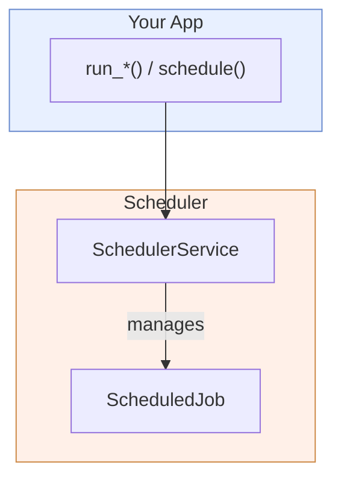

# Scheduler Overview

The scheduler lets you run functions at specific times, after a delay, or on a repeating interval. It is available as `self.scheduler` in every app and runs all jobs safely inside Hassette's async event loop. Scheduled handlers can be async or sync — the scheduler wraps sync callables automatically.

Every scheduling method is backed by a **trigger object** that encapsulates when and how often a job fires. The convenience methods (`run_in`, `run_once`, `run_every`, `run_daily`, `run_cron`) create the appropriate trigger for you. For advanced use cases, pass a trigger directly to `schedule()`.


```mermaid
flowchart TD
    subgraph app["Your App"]
        methods["run_*() / schedule()"]
    end

    subgraph framework["Scheduler"]
        SCHED["SchedulerService"]
        JOB["ScheduledJob"]
        SCHED -- "manages" --> JOB
    end

    methods --> SCHED

    style app fill:#e8f0ff,stroke:#6688cc
    style framework fill:#fff0e8,stroke:#cc8844
```

## Trigger Types

All triggers live in `hassette.scheduler.triggers` and are importable from `hassette.scheduler`:

| Trigger | Description | One-shot? |
|---------|-------------|-----------|
| `After(seconds=N)` | Fixed delay from now | Yes |
| `Once(at="HH:MM")` | Specific wall-clock time | Yes |
| `Every(seconds=N)` | Fixed interval, drift-resistant | No |
| `Daily(at="HH:MM")` | Once per day, DST-safe (cron-backed) | No |
| `Cron("expr")` | Arbitrary cron expression (5- or 6-field) | No |

### Examples

```python
--8<-- "pages/core-concepts/scheduler/snippets/scheduler_start_examples.py:start_examples"
```

## Next Steps

- **[Scheduling Methods](methods.md)**: Explore `run_in`, `run_every`, `run_cron`, `schedule()`, and convenience helpers.
- **[Job Management](management.md)**: Learn how to name, track, cancel, and group jobs.
