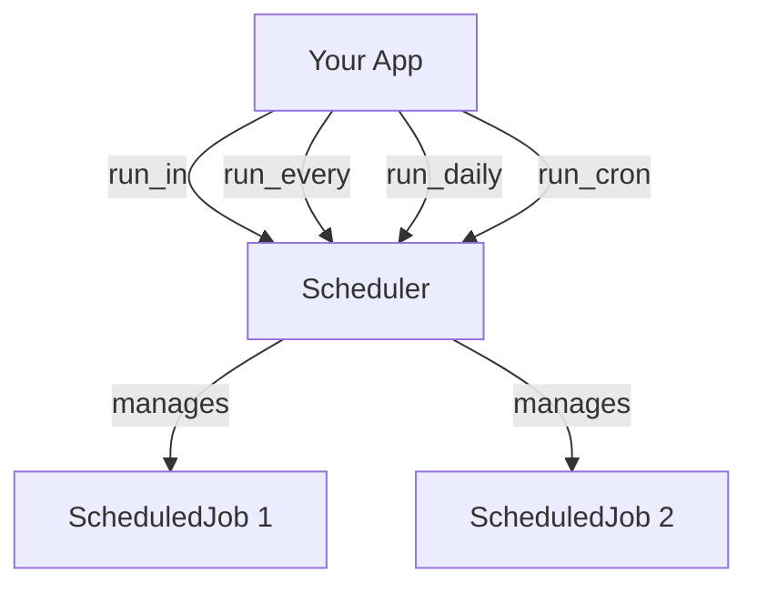

# Scheduler Overview

The built-in scheduler allows you to run functions at specific times or intervals. It ensures your code runs safely in Hassette's event loop, whether your functions are async or sync.

The scheduler is available as `self.scheduler` in every app.

!!! tip "Interval-based vs. wall-clock scheduling"
    `run_daily`, `run_hourly`, and `run_minutely` are **interval-based**: they fire at the configured `start` time, then repeat every N units from that point. They do not re-anchor to wall-clock boundaries after a restart — if Hassette restarts after the start time has passed, the job fires immediately, then resumes its normal cadence. For strict wall-clock scheduling ("every day at exactly 7:00 AM, skip if missed"), use [`run_cron`](methods.md#run_cron) instead.


```mermaid
graph TB
    APP[Your App] --> |run_in| SCHED[Scheduler]
    APP --> |run_every| SCHED
    APP --> |run_daily| SCHED
    APP --> |run_cron| SCHED

    SCHED --> |manages| JOB1[ScheduledJob 1]
    SCHED --> |manages| JOB2[ScheduledJob 2]
```

## The `start` Parameter

Most scheduling methods accept an optional `start` parameter to control the first execution time. It is very flexible:

| Type | Behavior |
| ---- | -------- |
| `int` / `float` | Delay in **seconds** from now. |
| `ZonedDateTime` | Exact run time. |
| `Time` / `time` | Run at the next occurrence of this clock time (e.g. 08:00). |
| `tuple[int, int]` | Treated as `(hour, minute)` for the next occurrence. |
| `None` (Default) | Run "now" (relative to method logic). |

### Examples

```python
--8<-- "pages/core-concepts/scheduler/snippets/scheduler_start_examples.py:start_examples"
```

## Next Steps

- **[Scheduling Methods](methods.md)**: Explore `run_in`, `run_every`, `run_cron`, and convenience helpers.
- **[Job Management](management.md)**: Learn how to name, track, and cancel jobs.
