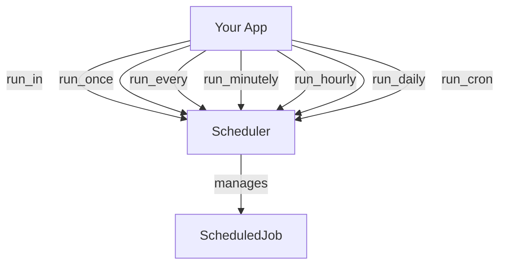

# Scheduler Overview

The scheduler lets you run functions at specific times, after a delay, or on a repeating interval. It is available as `self.scheduler` in every app and runs all jobs safely inside Hassette's async event loop. Scheduled handlers can be async or sync — the scheduler wraps sync callables automatically.

!!! tip "Interval-based vs. wall-clock scheduling"
    `run_daily`, `run_hourly`, and `run_minutely` are **interval-based**: they fire at the configured `start` time, then repeat every N units from that point. They do not re-anchor to wall-clock boundaries after a restart — if Hassette restarts after the start time has passed, the job fires immediately, then resumes its normal cadence. For strict wall-clock scheduling ("every day at exactly 7:00 AM, skip if missed"), use [`run_cron`](methods.md#run_cron) instead.


```mermaid
graph TB
    APP[Your App] --> |run_in| SCHED[Scheduler]
    APP --> |run_once| SCHED
    APP --> |run_every| SCHED
    APP --> |run_minutely| SCHED
    APP --> |run_hourly| SCHED
    APP --> |run_daily| SCHED
    APP --> |run_cron| SCHED

    SCHED --> |manages| JOB[ScheduledJob]
```

## The `start` Parameter

Most scheduling methods accept an optional `start` parameter to control the first execution time. It is very flexible:

| Type | Behavior |
| ---- | -------- |
| `int` / `float` | Delay in **seconds** from now. |
| `TimeDelta` | Offset added to the current time. |
| `ZonedDateTime` | Exact run time. |
| `Time` / `time` | Run at the next occurrence of this clock time (e.g. 08:00). |
| `tuple[int, int]` | Treated as `(hour, minute)` for the next occurrence. |
| `None` (Default) | Behavior varies by method: `run_in` uses its `delay` argument; `run_every`, `run_daily`, `run_hourly`, and `run_minutely` schedule the first run at now + their interval; `run_once` does **not** accept `None` and raises `ValueError`. |

### Examples

```python
--8<-- "pages/core-concepts/scheduler/snippets/scheduler_start_examples.py:start_examples"
```

## Next Steps

- **[Scheduling Methods](methods.md)**: Explore `run_in`, `run_every`, `run_cron`, and convenience helpers.
- **[Job Management](management.md)**: Learn how to name, track, and cancel jobs.
