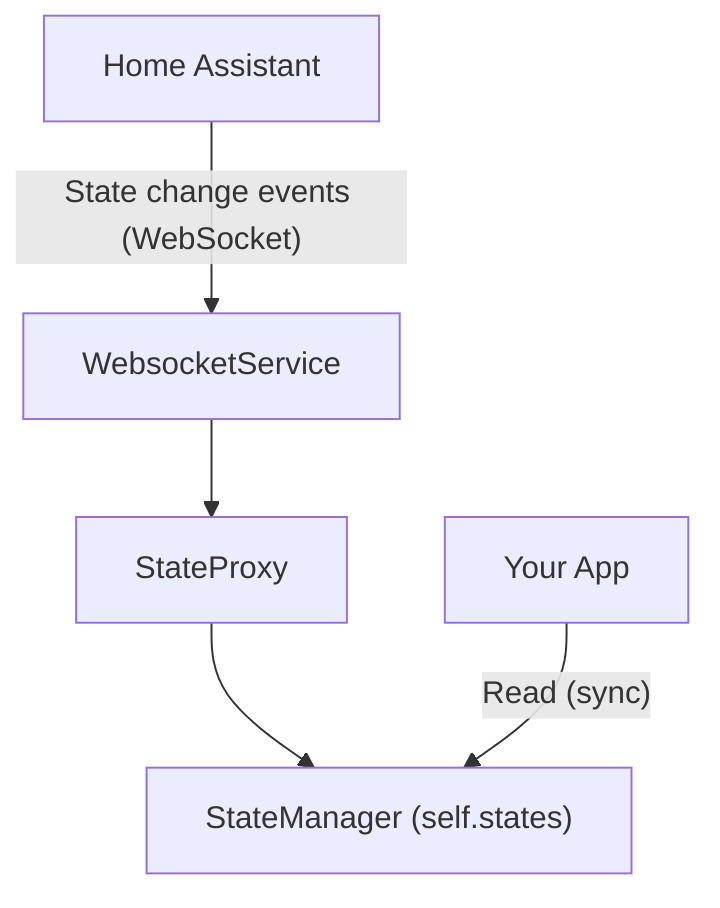

# States

Hassette maintains a local, real-time cache of all Home Assistant states. This is available as an instance of [StateManager][hassette.state_manager.state_manager.StateManager], accessible via `self.states` in your apps


## Diagram



## Using the StateManager

Whenever possible you should use `self.states` over making API calls to read entity states. This provides:

- **Speed**: Instant access from local memory.
- **Simplicity**: Synchronous access without `await`.
- **Efficiency**: No network overhead or rate limiting concerns.
- **Consistency**: Event-driven updates ensure your app sees the latest state changes.
    - The StateManager event handler is prioritized over app event handlers to ensure you always have a consistent view of the latest states.

### Domain Access

The easiest way to access states is via domain properties.

```python
--8<-- "pages/core-concepts/states/snippets/states_domain_access.py"
```

Notice how you do not need to use the domain in the entity ID - since you're already accessing the domain via `self.states.sensor`, you only need to provide the entity name.

### Generic Access

For domains that don't have a dedicated helper, or for dynamic access, provide the state class to the `self.states` dictionary-like interface:

```python
--8<-- "pages/core-concepts/states/snippets/states_generic_access.py"
```

### Iteration

You can iterate over domains to find entities.

```python
--8<-- "pages/core-concepts/states/snippets/states_iteration.py"
```
