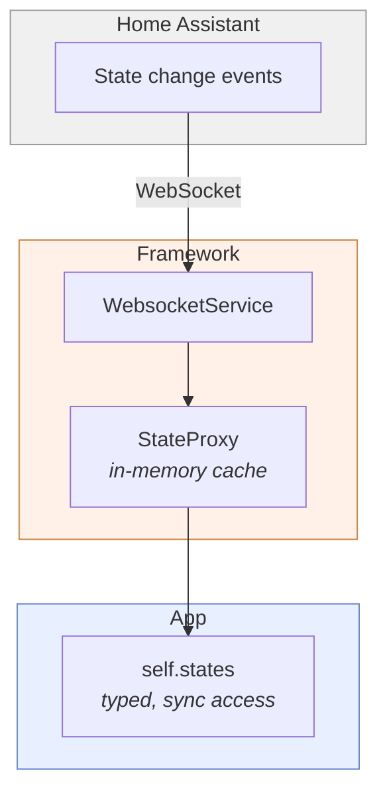

# States

The `StateManager` keeps a real-time, in-memory copy of all Home Assistant entity states. `self.states` provides synchronous, typed access with no `await` and no API calls.


```mermaid
flowchart TD
    subgraph ha["Home Assistant"]
        HA["State change events"]
    end

    subgraph framework["Framework"]
        WS["WebsocketService"]
        SP["StateProxy<br/><i>in-memory cache</i>"]
        WS --> SP
    end

    subgraph app["App"]
        SM["self.states<br/><i>typed, sync access</i>"]
    end

    HA -- "WebSocket" --> WS
    SP --> SM

    style ha fill:#f0f0f0,stroke:#999
    style framework fill:#fff0e8,stroke:#cc8844
    style app fill:#e8f0ff,stroke:#6688cc
```

## Reading State

### Domain Access

`self.states.light`, `self.states.sensor`, and similar domain properties return a `DomainStates` collection, a typed view of every entity in that domain.

```python
--8<-- "pages/core-concepts/states/snippets/states_domain_access.py"
```

The short entity name omits the domain prefix. `self.states.light.get("kitchen")` and `self.states.light.get("light.kitchen")` resolve to the same entity.

`.get()` returns `None` for missing entities. Bracket access raises `KeyError`.

### Direct Entity Access

`self.states.get(entity_id)` accepts a full entity ID and resolves to the most specific registered type. `LightState` for `light.*`, `SensorState` for `sensor.*`, `BaseState` for anything unregistered.

```python
--8<-- "pages/core-concepts/states/snippets/states_direct_access.py"
```

### Generic Access

`self.states[CustomState]` returns a `DomainStates` collection typed to a custom state class. This pattern covers custom integrations and third-party add-ons whose domain has no built-in class.

```python
--8<-- "pages/core-concepts/states/snippets/states_generic_access.py"
```

Custom state class definition and registration are covered in [Custom States](custom-states.md).

## What a State Object Contains

Every state object is a `BaseState` subclass. The following fields and properties are available on all of them.

**`value`** is the entity's current state, typed for the domain. `SwitchState.value` is `bool | None`, `SensorState.value` is `str | None`, `SelectState.value` is `str | None`. When HA reports `"unknown"` or `"unavailable"`, `value` is `None`. `is_unknown` and `is_unavailable` identify which case applies.

**`attributes`** is a typed `AttributesBase` subclass with domain-specific fields. `LightState.attributes.brightness` is an integer. `ClimateState.attributes.current_temperature` is a float. Pyright knows the types.

**`is_unknown`** and **`is_unavailable`** are `True` when HA reports the entity as `"unknown"` or `"unavailable"`, respectively. Both flags are `False` for normal states.

**`is_group`** is `True` when the entity is a group. The `entity_id` attribute on the entity holds a list of member entity IDs.

**`extras`** and **`extra(key, default=None)`** access untyped state fields not declared on the `BaseState` model. Typed attributes cover the common cases; these handle the rest.

**`last_changed`**, **`last_updated`**, **`last_reported`** are `ZonedDateTime | None` timestamps from HA. `last_changed` updates only when the state string changes. `last_updated` updates when state or attributes change. `last_reported` updates on every write.

**`entity_id`** and **`domain`** hold the full entity ID (`"light.kitchen"`) and its domain (`"light"`).

### Attribute Helpers

`AttributesBase` exposes two helpers for attributes not declared on the typed model.

`attributes.extras` returns a `dict[str, Any]` of undeclared fields. `attributes.extra(key, default=None)` fetches a single undeclared field with a fallback.

`attributes.has_feature(flag)` tests a bit in `supported_features`. Each domain defines its own `IntFlag` enum for feature constants. `LightEntityFeature` has `EFFECT`, `FLASH`, and `TRANSITION`.

## Built-in State Types

Hassette auto-generates typed state classes for 55 Home Assistant domains from HA core source. All classes are available from the `states` module:

```python
--8<-- "pages/core-concepts/snippets/states_import.py"
```

Three common examples:

- **`states.LightState`** has `value: bool | None`, `attributes.brightness: int | None`, `attributes.color_temp_kelvin: int | None`
- **`states.SensorState`** has `value: str | None`, `attributes.unit_of_measurement: str | None`, `attributes.device_class: str | None`
- **`states.BinarySensorState`** has `value: bool | None`, `attributes.device_class: str | None`

The API reference lists all 55 classes with their full attribute signatures. Domains not covered there are handled by [Custom States](custom-states.md).

??? info "Full domain-to-class table"
    | Domain | Class |
    |---|---|
    | `ai_task` | `AiTaskState` |
    | `air_quality` | `AirQualityState` |
    | `alarm_control_panel` | `AlarmControlPanelState` |
    | `assist_satellite` | `AssistSatelliteState` |
    | `automation` | `AutomationState` |
    | `binary_sensor` | `BinarySensorState` |
    | `button` | `ButtonState` |
    | `calendar` | `CalendarState` |
    | `camera` | `CameraState` |
    | `climate` | `ClimateState` |
    | `conversation` | `ConversationState` |
    | `counter` | `CounterState` |
    | `cover` | `CoverState` |
    | `date` | `DateState` |
    | `datetime` | `DateTimeState` |
    | `device_tracker` | `DeviceTrackerState` |
    | `event` | `EventState` |
    | `fan` | `FanState` |
    | `geo_location` | `GeoLocationState` |
    | `humidifier` | `HumidifierState` |
    | `image` | `ImageState` |
    | `image_processing` | `ImageProcessingState` |
    | `input_boolean` | `InputBooleanState` |
    | `input_button` | `InputButtonState` |
    | `input_datetime` | `InputDatetimeState` |
    | `input_number` | `InputNumberState` |
    | `input_select` | `InputSelectState` |
    | `input_text` | `InputTextState` |
    | `lawn_mower` | `LawnMowerState` |
    | `light` | `LightState` |
    | `lock` | `LockState` |
    | `media_player` | `MediaPlayerState` |
    | `notify` | `NotifyState` |
    | `number` | `NumberState` |
    | `person` | `PersonState` |
    | `remote` | `RemoteState` |
    | `scene` | `SceneState` |
    | `script` | `ScriptState` |
    | `select` | `SelectState` |
    | `sensor` | `SensorState` |
    | `siren` | `SirenState` |
    | `stt` | `SttState` |
    | `sun` | `SunState` |
    | `switch` | `SwitchState` |
    | `text` | `TextState` |
    | `time` | `TimeState` |
    | `timer` | `TimerState` |
    | `todo` | `TodoState` |
    | `tts` | `TtsState` |
    | `update` | `UpdateState` |
    | `vacuum` | `VacuumState` |
    | `valve` | `ValveState` |
    | `water_heater` | `WaterHeaterState` |
    | `weather` | `WeatherState` |
    | `zone` | `ZoneState` |

    The API reference is the canonical source. This table may lag behind new HA releases.

## Iterating Over States

`DomainStates` supports direct iteration over `(entity_id, state)` pairs.

```python
--8<-- "pages/core-concepts/states/snippets/states_iteration.py"
```

Additional collection methods:

| Method | Returns | Notes |
|---|---|---|
| `for entity_id, state in self.states.light` | `(str, StateT)` pairs | Lazy; same as `.items()` |
| `.items()` | Iterator of `(entity_id, StateT)` | Lazy |
| `.keys()` | `list[str]` | Eager |
| `.iterkeys()` | Iterator of `str` | Lazy |
| `.values()` | `list[StateT]` | Eager |
| `.itervalues()` | Iterator of `StateT` | Lazy |
| `.to_dict()` | `dict[str, StateT]` | Eager |
| `"kitchen" in self.states.light` | `bool` | Containment check |
| `len(self.states.light)` | `int` | Count of entities in domain |

??? note "Lazy vs. eager"
    `.items()`, `.iterkeys()`, and `.itervalues()` are lazy. They validate entities on demand and avoid touching the entire domain up front. `.keys()`, `.values()`, and `.to_dict()` are eager and walk every entity immediately. Lazy iteration performs better for large domains like `sensor`.

## Good to Know

**Startup.** The cache is populated at startup via a full API fetch before `on_initialize` runs. Apps can read current state immediately.

**Staleness.** WebSocket `state_changed` events keep the cache current. A periodic background poll (default every 30 seconds) guards against missed events. The `StateManager` event handler runs before app handlers, so handlers always see the latest state.

**Reconnection.** During a HA reconnect the cache is temporarily cleared. The `StateProxy` marks itself not ready and retries reads automatically.

**Missing entities.** `.get()` returns `None` for absent entities. Bracket access raises `KeyError`. `.get()` with a `None` check is the safe path when entity presence is uncertain.

## See Also

- [Subscribing to State Changes](../bus/index.md): react to state transitions as they happen
- [Custom States](custom-states.md): define typed models for custom integrations
- [API - Entities & States](../api/entities.md): retrieve states via the REST/WebSocket API
- [Bus](../bus/index.md): the event system that delivers state changes to handlers
- [App Cache](../cache/index.md): persist data locally across restarts
