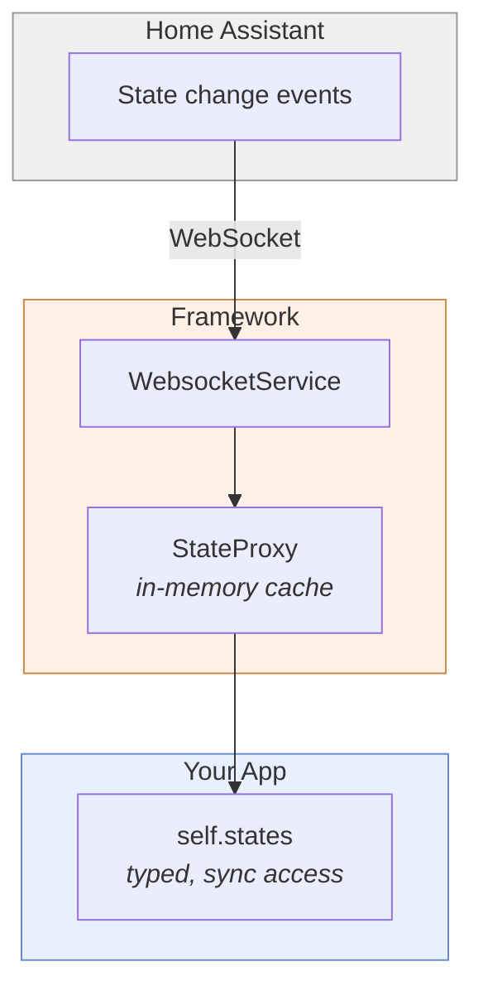

# States

Hassette maintains a local, real-time cache of all Home Assistant states. This is available as an instance of [StateManager][hassette.state_manager.state_manager.StateManager], accessible via `self.states` in your apps


## Diagram


```mermaid
flowchart TD
    subgraph ha["Home Assistant"]
        HA["State change events"]
    end

    subgraph framework["Framework"]
        WS["WebsocketService"]
        SP["StateProxy<br/><i>in-memory cache</i>"]
        WS --> SP
    end

    subgraph app["Your App"]
        SM["self.states<br/><i>typed, sync access</i>"]
    end

    HA -- "WebSocket" --> WS
    SP --> SM

    style ha fill:#f0f0f0,stroke:#999
    style framework fill:#fff0e8,stroke:#cc8844
    style app fill:#e8f0ff,stroke:#6688cc
```

## Using the StateManager

Whenever possible you should use `self.states` over making API calls to read entity states. This provides:

- **Speed**: Instant access from local memory.
- **Simplicity**: Synchronous access without `await`.
- **Efficiency**: No network overhead or rate limiting concerns.
- **Consistency**: Event-driven updates ensure your app sees the latest state changes.
    - The StateManager event handler is prioritized over app event handlers to ensure you always have a consistent view of the latest states.

### Domain Access

The easiest way to access states is via domain properties.

```python
--8<-- "pages/core-concepts/states/snippets/states_domain_access.py"
```

Notice how you do not need to use the domain in the entity ID - since you're already accessing the domain via `self.states.sensor`, you only need to provide the entity name.

!!! note "Bracket access raises `KeyError` for missing entities"
    `self.states.light["bedroom"]` raises `KeyError` — not `EntityNotFoundError` — if the entity does not exist. Use `.get("bedroom")` for safe access that returns `None` when the entity is absent.

### Direct Entity Access

Use `self.states.get(entity_id)` when you have a full entity ID and don't need to specify the domain or state class. It automatically resolves to the correct domain-specific type (e.g., `LightState` for `light.*`), or falls back to `BaseState` for unregistered domains.

```python
--8<-- "pages/core-concepts/states/snippets/states_direct_access.py"
```

### Generic Access

For domains that don't have a dedicated helper, or for dynamic access, provide the state class to the `self.states` dictionary-like interface:

```python
--8<-- "pages/core-concepts/states/snippets/states_generic_access.py"
```

### Iteration

You can iterate over domains to find entities.

```python
--8<-- "pages/core-concepts/states/snippets/states_iteration.py"
```

## DomainStates Collection Interface

Every domain accessor (e.g., `self.states.light`) returns a `DomainStates` object. Beyond iteration, it supports the following operations:

| Operation | Example | Notes |
|---|---|---|
| Bracket access | `self.states.light["bedroom"]` | Raises `KeyError` if absent |
| Safe access | `self.states.light.get("bedroom")` | Returns `None` if absent |
| Containment | `"bedroom" in self.states.light` | |
| Length | `len(self.states.light)` | Number of entities in domain |
| Iteration (items) | `for entity_id, state in self.states.light` | Lazy; same as `.items()` |
| `.items()` | `self.states.light.items()` | Iterator of `(entity_id, state)` pairs |
| `.keys()` | `self.states.light.keys()` | Eager list of entity IDs |
| `.iterkeys()` | `self.states.light.iterkeys()` | Lazy iterator of entity IDs |
| `.values()` | `self.states.light.values()` | Eager list of states |
| `.itervalues()` | `self.states.light.itervalues()` | Lazy iterator of states |
| `.to_dict()` | `self.states.light.to_dict()` | Eager `dict[entity_id, state]` |

!!! tip "Prefer lazy iteration for large domains"
    `.items()`, `.iterkeys()`, and `.itervalues()` are lazy and avoid validating every entity up front. `.keys()`, `.values()`, and `.to_dict()` are eager — they walk the entire domain immediately.

## Built-in State Types

Hassette ships typed state classes for every standard Home Assistant domain. Import them from `hassette.models.states` (or via the `states` alias imported from `hassette`):

```python
from hassette import states

# e.g. states.LightState, states.SunState, states.BinarySensorState
```

??? info "Full list of built-in state classes"
    | Domain | Class |
    |---|---|
    | `ai_task` | `AiTaskState` |
    | `air_quality` | `AirQualityState` |
    | `alarm_control_panel` | `AlarmControlPanelState` |
    | `assist_satellite` | `AssistSatelliteState` |
    | `automation` | `AutomationState` |
    | `binary_sensor` | `BinarySensorState` |
    | `button` | `ButtonState` |
    | `calendar` | `CalendarState` |
    | `camera` | `CameraState` |
    | `climate` | `ClimateState` |
    | `conversation` | `ConversationState` |
    | `counter` | `CounterState` |
    | `cover` | `CoverState` |
    | `date` | `DateState` |
    | `datetime` | `DateTimeState` |
    | `device_tracker` | `DeviceTrackerState` |
    | `event` | `EventState` |
    | `fan` | `FanState` |
    | `humidifier` | `HumidifierState` |
    | `image_processing` | `ImageProcessingState` |
    | `input_boolean` | `InputBooleanState` |
    | `input_button` | `InputButtonState` |
    | `input_datetime` | `InputDatetimeState` |
    | `input_number` | `InputNumberState` |
    | `input_select` | `InputSelectState` |
    | `input_text` | `InputTextState` |
    | `light` | `LightState` |
    | `lock` | `LockState` |
    | `media_player` | `MediaPlayerState` |
    | `notify` | `NotifyState` |
    | `number` | `NumberState` |
    | `person` | `PersonState` |
    | `remote` | `RemoteState` |
    | `scene` | `SceneState` |
    | `script` | `ScriptState` |
    | `select` | `SelectState` |
    | `sensor` | `SensorState` |
    | `siren` | `SirenState` |
    | `stt` | `SttState` |
    | `sun` | `SunState` |
    | `switch` | `SwitchState` |
    | `text` | `TextState` |
    | `time` | `TimeState` |
    | `timer` | `TimerState` |
    | `todo` | `TodoState` |
    | `tts` | `TtsState` |
    | `update` | `UpdateState` |
    | `vacuum` | `VacuumState` |
    | `valve` | `ValveState` |
    | `water_heater` | `WaterHeaterState` |
    | `weather` | `WeatherState` |
    | `zone` | `ZoneState` |

    For domains not in this list (custom integrations, third-party add-ons), see [Custom State Classes](../../advanced/custom-states.md).

## Good to Know

!!! note "Startup and staleness"
    The cache is populated once at startup via a full API fetch, then kept current by WebSocket `state_changed` events — so states are available as soon as your app's `on_ready` hook runs. A periodic background poll (default every 30 seconds) guards against any events that were missed. During a HA reconnect the cache is temporarily cleared; the StateProxy marks itself not-ready and retries reads automatically, so your code does not need to handle this case.

!!! note "Missing entities"
    `self.states.light.get("bedroom")` returns `None` when the entity is absent. `self.states.light["bedroom"]` raises `KeyError`. If you are not certain an entity exists, prefer `.get()` and check the result before use.

## See Also

- [API - Entities & States](../api/entities.md) - Retrieve states via API
- [Bus](../bus/index.md) - Subscribe to state change events
- [App Cache](../cache/index.md) - Cache data locally across restarts
- [Custom States](../../advanced/custom-states.md) - Define custom state models
