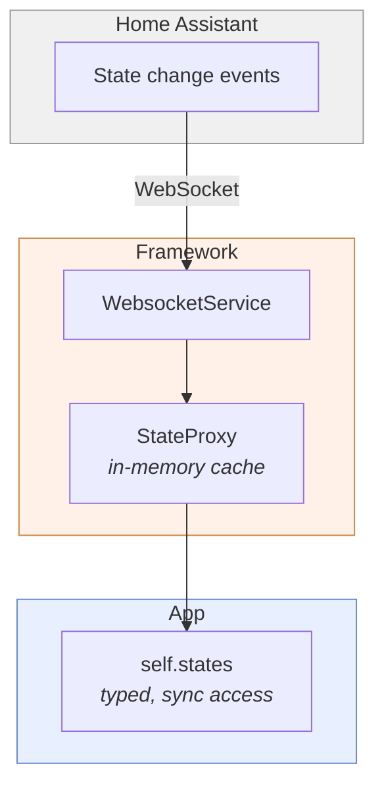

# States

The [`StateManager`][hassette.state_manager.state_manager.StateManager] keeps a real-time, in-memory copy of all Home Assistant entity states. `self.states` is a `StateManager` instance available on every [`App`](../apps/index.md) — it provides synchronous, typed access with no `await` and no API calls.

<div style="text-align: center">


```mermaid
flowchart TD
    subgraph ha["Home Assistant"]
        HA["State change events"]
    end

    subgraph framework["Framework"]
        WS["WebsocketService"]
        SP["StateProxy<br/><i>in-memory cache</i>"]
        WS --> SP
    end

    subgraph app["App"]
        SM["self.states<br/><i>typed, sync access</i>"]
    end

    HA -- "WebSocket" --> WS
    SP --> SM

    style ha fill:#f0f0f0,stroke:#999
    style framework fill:#fff0e8,stroke:#cc8844
    style app fill:#e8f0ff,stroke:#6688cc
```

</div>

## Reading State

### Domain Access

`self.states.light`, `self.states.sensor`, and similar domain properties return a [`DomainStates`][hassette.state_manager.state_manager.DomainStates] collection — a dict-like view keyed by entity name, typed to that domain's state class.

```python
--8<-- "pages/core-concepts/states/snippets/states_domain_access.py"
```

The short entity name omits the domain prefix. `self.states.light.get("kitchen")` and `self.states.light.get("light.kitchen")` resolve to the same entity.

`.get()` returns `None` for missing entities. Bracket access raises `KeyError`.

### Direct Entity Access

`self.states.get(entity_id)` accepts a full entity ID and resolves to the most specific built-in type for that domain. [`LightState`][hassette.models.states.light.LightState] for `light.*`, [`SensorState`][hassette.models.states.sensor.SensorState] for `sensor.*`, `BaseState` for any domain without a built-in class.

```python
--8<-- "pages/core-concepts/states/snippets/states_direct_access.py"
```

### Generic Access

`self.states[CustomState]` returns a `DomainStates` collection typed to a custom state class. This pattern covers custom integrations and third-party add-ons whose domain has no built-in class.

```python
--8<-- "pages/core-concepts/states/snippets/states_generic_access.py"
```

Custom state class definition and registration are covered in [Custom States](custom-states.md).

## What a State Object Contains

Every state object is a [`BaseState`][hassette.models.states.base.BaseState] subclass. The following fields and properties are available on all of them.

**`value`** is the entity's current state, typed for the domain. `SwitchState.value` is `bool | None`, `SensorState.value` is `str | None`, `SelectState.value` is `str | None`. When HA reports `"unknown"` or `"unavailable"`, `value` is `None`. `is_unknown` and `is_unavailable` identify which case applies.

**`attributes`** is a typed [`AttributesBase`][hassette.models.states.base.AttributesBase] subclass with domain-specific fields. `LightState.attributes.brightness` is an integer. `ClimateState.attributes.current_temperature` is a float. Pyright knows the types.

**`is_unknown`** and **`is_unavailable`** are `True` when HA reports the entity as `"unknown"` or `"unavailable"`, respectively. Both flags are `False` for normal states.

**`is_group`** is `True` when the entity is a group. For group entities, the `entity_id` attribute holds a list of member entity IDs rather than the group's own ID.

**`extras`** and **`extra(key, default=None)`** access untyped state fields not declared on the `BaseState` model. Typed attributes cover the common cases; these handle the rest.

**`last_changed`**, **`last_updated`**, **`last_reported`** are `ZonedDateTime | None` timestamps from HA. `ZonedDateTime` is from the [`whenever`](https://whenever.readthedocs.io/) library, which Hassette uses for all date/time operations — it behaves like a timezone-aware `datetime` and converts via `.to_stdlib()` when a library requires it. `last_changed` updates only when the state string changes. `last_updated` updates when state or attributes change. `last_reported` updates on every write.

**`entity_id`** and **`domain`** hold the full entity ID (`"light.kitchen"`) and its domain (`"light"`).

### Attribute Helpers

`AttributesBase` exposes two helpers for attributes not declared on the typed model.

`attributes.extras` returns a `dict[str, Any]` of undeclared fields. `attributes.extra(key, default=None)` fetches a single undeclared field with a fallback.

`attributes.has_feature(flag)` tests a bit in `supported_features`. Each domain defines its own `IntFlag` enum for feature constants. `LightEntityFeature` has `EFFECT`, `FLASH`, and `TRANSITION`.

## Built-in State Types

Hassette auto-generates typed state classes for 55 Home Assistant domains from HA core source. All classes are available from the `states` module:

```python
--8<-- "pages/core-concepts/snippets/states_import.py"
```

Three common examples:

- **`states.LightState`** has `value: bool | None`, `attributes.brightness: int | None`, `attributes.color_temp_kelvin: int | None`
- **`states.SensorState`** has `value: str | None`, `attributes.unit_of_measurement: str | None`, `attributes.device_class: str | None`
- **`states.BinarySensorState`** has `value: bool | None`, `attributes.device_class: str | None`

The API reference lists all 55 classes with their full attribute signatures. Domains not covered there are handled by [Custom States](custom-states.md).

## Iterating Over States

`DomainStates` supports direct iteration over `(entity_id, state)` pairs — `for entity_id, state in self.states.sensor` yields tuples, unlike a plain `dict` which yields keys. `.keys()`, `.values()`, `.to_dict()`, containment checks (`"kitchen" in self.states.light`), and `len()` also work.

```python
--8<-- "pages/core-concepts/states/snippets/states_iteration.py"
```

`.items()`, `.iterkeys()`, and `.itervalues()` are lazy — they parse raw HA state dicts into typed objects on demand. `.keys()`, `.values()`, and `.to_dict()` are eager and parse all entities up front. Lazy iteration performs better for large domains like `sensor`.

## Good to Know

**Startup.** The cache is populated at startup via a full API fetch before `on_initialize` runs. Apps can read current state immediately.

**Staleness.** WebSocket `state_changed` events keep the cache current. A periodic background poll (default every 30 seconds) guards against missed events. The `StateManager` event handler runs before app handlers, so handlers always see the latest state.

**Reconnection.** During a HA reconnect the cache is temporarily cleared — `self.states.get()` returns `None` for all entities until the cache is repopulated from a fresh API fetch.

**Missing entities.** `.get()` returns `None` for absent entities. Bracket access raises `KeyError`. `.get()` with a `None` check is the safe path when entity presence is uncertain.

## See Also

- [Subscription Methods](../bus/methods.md): `on_state_change`, `on_attribute_change`, and their parameters
- [Custom States](custom-states.md): define typed models for custom integrations
- [State Conversion](conversion.md): how raw HA dicts become typed Python objects
- [API Methods](../api/methods.md): retrieve states via the REST/WebSocket API
- [App Cache](../cache/index.md): persist data locally across restarts
