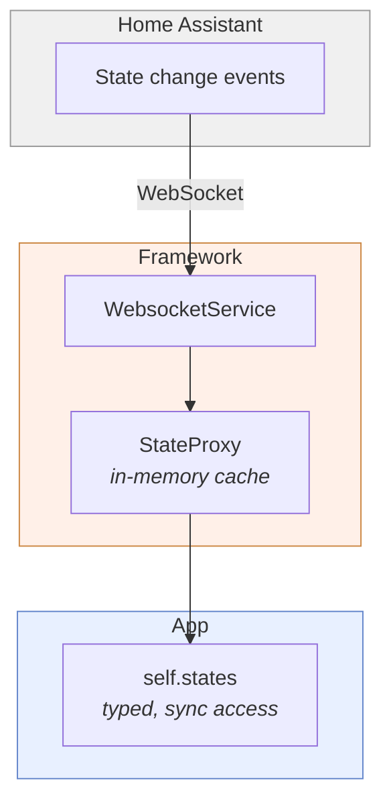

# States

The [`StateManager`][hassette.state_manager.state_manager.StateManager] keeps a real-time, in-memory copy of all Home Assistant entity states. `self.states` is a `StateManager` instance available on every [`App`](../apps/index.md) — it provides synchronous, typed access with no `await` and no API calls.

<div style="text-align: center">


```mermaid
flowchart TD
    subgraph ha["Home Assistant"]
        HA["State change events"]
    end

    subgraph framework["Framework"]
        WS["WebsocketService"]
        SP["StateProxy<br/><i>in-memory cache</i>"]
        WS --> SP
    end

    subgraph app["App"]
        SM["self.states<br/><i>typed, sync access</i>"]
    end

    HA -- "WebSocket" --> WS
    SP --> SM

    style ha fill:#f0f0f0,stroke:#999
    style framework fill:#fff0e8,stroke:#cc8844
    style app fill:#e8f0ff,stroke:#6688cc
```

</div>

## Reading State

### Domain Access

`self.states.light`, `self.states.sensor`, and similar domain properties return a [`DomainStates`][hassette.state_manager.state_manager.DomainStates] collection — a dict-like view keyed by entity name, typed to that domain's state class.

```python
--8<-- "pages/core-concepts/states/snippets/states_domain_access.py"
```

The short entity name omits the domain prefix. `self.states.light.get("kitchen")` and `self.states.light.get("light.kitchen")` resolve to the same entity.

`.get()` returns `None` for missing entities. Bracket access raises `KeyError`.

A *conversion* turns the raw state dict HA returns into a typed state object. When a conversion fails, behavior depends on the access style. The third row uses direct access, covered in [Direct Entity Access](#direct-entity-access) below.

| Access style | Missing entity | Conversion failure |
|---|---|---|
| `self.states.light["kitchen"]` | raises `KeyError` | raises `UnableToConvertStateError` |
| `self.states.light.get("kitchen")` | returns `None` | raises `UnableToConvertStateError` |
| `self.states.get("light.kitchen")` | returns `None` | returns `None` |

`UnableToConvertStateError` (from `hassette.exceptions`) carries `entity_id` and `state_class` fields. They identify which entity and target type failed. The error signals a shape mismatch between the HA state dict and the domain model — for example, an `int` attribute arriving as a string that cannot be coerced.

Domain iteration (`for entity_id, state in self.states.light.items()`) skips un-convertible entities and logs the error. Valid entities still flow through the iterator.

### Direct Entity Access

`self.states.get(entity_id)` accepts a full entity ID and resolves to the most specific built-in type for that domain. [`LightState`][hassette.models.states.light.LightState] for `light.*`, [`SensorState`][hassette.models.states.sensor.SensorState] for `sensor.*`, `BaseState` for any domain without a built-in class.

```python
--8<-- "pages/core-concepts/states/snippets/states_direct_access.py"
```

### Generic Access

`self.states[CustomState]` returns a `DomainStates` collection typed to a custom state class. This pattern covers custom integrations and third-party add-ons whose domain has no built-in class.

```python
--8<-- "pages/core-concepts/states/snippets/states_generic_access.py"
```

Custom state class definition and registration are covered in [Custom States](custom-states.md).

## What a State Object Contains

Every state object is a [`BaseState`][hassette.models.states.base.BaseState] subclass. The following fields and properties are available on all of them.

**`value`** is the entity's current state, typed for the domain. `SwitchState.value` is `bool | None`, `SensorState.value` is `str | None`, `SelectState.value` is `str | None`. When HA reports `"unknown"` or `"unavailable"`, `value` is `None`. `is_unknown` and `is_unavailable` identify which case applies.

!!! warning "`value` is typed Python, not the raw HA string"
    Home Assistant stores `"on"`/`"off"` strings; [state conversion](conversion.md) turns them into `True`/`False` for toggle domains like `light`, `switch`, and `binary_sensor`. `state.value == "on"` is always `False` — compare against `True` instead. Code ported from AppDaemon or HA templates that compares against `"on"` silently never matches. The `changed_to=`/`changed_from=` filters on [`on_state_change()`](../bus/methods.md#on_state_changeentity_id) are the exception: they compare raw HA strings.

**`attributes`** is a typed [`AttributesBase`][hassette.models.states.base.AttributesBase] subclass with domain-specific fields. `LightState.attributes.brightness` is an integer. `ClimateState.attributes.current_temperature` is a float. Pyright knows the types.

**`is_unknown`** and **`is_unavailable`** are `True` when HA reports the entity as `"unknown"` or `"unavailable"`, respectively. Both flags are `False` for normal states.

**`is_group`** is `True` when the entity is a group. For group entities, the `entity_id` attribute holds a list of member entity IDs rather than the group's own ID.

**`extras`** and **`extra(key, default=None)`** access untyped state fields not declared on the `BaseState` model. Typed attributes cover the common cases; these handle the rest.

**`last_changed`**, **`last_updated`**, **`last_reported`** are `ZonedDateTime | None` timestamps from HA. `ZonedDateTime` is from the [`whenever`](https://whenever.readthedocs.io/) library, which Hassette uses for all date/time operations — it behaves like a timezone-aware `datetime` and converts via `.to_stdlib()` when a library requires it. `last_changed` updates only when the state string changes. `last_updated` updates when state or attributes change. `last_reported` updates on every write.

**`time_since_last_change`**, **`time_since_last_update`**, **`time_since_last_report`** return `TimeDelta | None` — the elapsed time since each corresponding timestamp, or `None` when the timestamp itself is absent. Useful for checks like "has this entity been in its current state for more than 10 minutes?" without manual arithmetic.

**`entity_id`** and **`domain`** hold the full entity ID (`"light.kitchen"`) and its domain (`"light"`).

**`context`** holds the HA event context that produced this state: `context.id`, `context.parent_id`, and `context.user_id`. It traces which automation or user triggered the change.

### Attribute Helpers

`AttributesBase` exposes two helpers for attributes not declared on the typed model.

`attributes.extras` returns a `dict[str, Any]` of undeclared fields. `attributes.extra(key, default=None)` fetches a single undeclared field with a fallback.

`attributes.has_feature(flag)` tests a bit in `supported_features`. Each domain defines its own `IntFlag` enum for feature constants. `LightEntityFeature` has `EFFECT`, `FLASH`, and `TRANSITION`.

## Built-in State Types

Hassette auto-generates typed state classes for 55 Home Assistant domains from HA core source. All classes are available from the `states` module:

```python
--8<-- "pages/core-concepts/snippets/states_import.py"
```

Three common examples:

- **`states.LightState`** has `value: bool | None`, `attributes.brightness: int | None`, `attributes.color_temp_kelvin: int | None`
- **`states.SensorState`** has `value: str | None`, `attributes.unit_of_measurement: str | None`, `attributes.device_class: SensorDeviceClass | None`
- **`states.BinarySensorState`** has `value: bool | None`, `attributes.device_class: BinarySensorDeviceClass | None`

The API reference lists all 55 classes with their full attribute signatures. Domains not covered there are handled by [Custom States](custom-states.md).

## Sensor Value Shapes

`SensorState.value` is `str | None`, because the `sensor` domain covers every kind of sensor Home Assistant supports — a door lock's battery percentage and a smart meter's next-reset timestamp are both `sensor.*` entities. Home Assistant metadata can classify a sensor into one of four value shapes: numeric, enum, timestamp, or date. Sensors without sufficient metadata remain `UNKNOWN`. Four state classes narrow `value` to match:

| Class | `value` type | Matches |
|---|---|---|
| `NumericSensorState` | `float \| None` | `device_class` outside the non-numeric set, or Home Assistant's `state_class`/unit metadata implying a number |
| `EnumSensorState` | `str \| None` | `device_class: enum` |
| `TimestampSensorState` | `ZonedDateTime \| None` | `device_class: timestamp` or `device_class: uptime` |
| `DateSensorState` | `Date \| None` | `device_class: date` |

`uptime` classifies as the timestamp shape — Home Assistant renders both through the same code path, differing only by a drift-normalization step that leaves the value's type unchanged, so there is no separate uptime class.

Two paths reach a narrowed shape. Dependency injection names the class directly — `D` (`hassette.dependencies`) tells Hassette what to extract from the event; `D.StateNew[T]` means "give me the new state, converted to `T`" (see [Dependency Injection](../bus/dependency-injection.md)):

```python
--8<-- "pages/core-concepts/states/snippets/sensor_shapes.py:annotation"
```

`new.value` is `float | None` here — arithmetic type-checks with a `None` guard, no cast required. `self.states.numeric_sensor` reaches the same shape by iteration:

```python
--8<-- "pages/core-concepts/states/snippets/sensor_shapes.py:accessor"
```

### Views, Not Domains

Every other built-in state class corresponds 1:1 with a Home Assistant domain — `self.states.light` is *the* way to reach `LightState`. The four sensor-shape accessors break that pattern: they are filtered views (projections) over the same underlying `sensor` states, not new domains and not a partition of them. The same entity appears twice — once under `self.states.sensor` as a `SensorState` with `value: str | None`, and again under `self.states.numeric_sensor` as a `NumericSensorState` with `value: float | None` — two typed lenses on one piece of state, not two different entities.

| | Domain accessor (`self.states.light`) | Shape view (`self.states.numeric_sensor`) |
|---|---|---|
| Totality | Every entity in the domain | Only entities whose metadata matches the shape |
| `value` type | The domain's one declared type | Narrowed to the shape (`float`, `str`, `ZonedDateTime`, `Date`) |
| Membership | Fixed — determined by `entity_id`'s domain prefix | Computed per access from `device_class`, `state_class`, and `unit_of_measurement` |
| Failure on `[]` | `KeyError` (entity not found) | `KeyError` (not found) **or** `EntityNotInViewError` (entity exists but isn't a shape match — see [Lookup Semantics](#lookup-semantics) below) |

Membership is computed from metadata every time it's checked, not cached across state changes — a shape view is dynamic where a domain accessor is total. If a sensor's `device_class` changes at runtime (edited in the HA UI, for example), the next access reflects the new classification immediately.

### Membership and the Recall Gap

A sensor belongs to a narrowed view only when its metadata matches the shape **and** its current value converts to the shape's type — both conditions, checked identically everywhere the view is read (`len()`, `in`, iteration, and direct lookup all agree). A numeric-looking sensor holding a value that fails to parse as a number is excluded from `numeric_sensor` in every one of those places, not just some.

The classifier that decides membership ports Home Assistant's own numeric-detection rule rather than checking `device_class` against a fixed set — roughly half of real sensors carry no `device_class` at all, and a naive device-class-only rule would drop a large share of genuinely numeric ones. Even so, a sensor with *no* metadata whatsoever — no `device_class`, no `state_class`, no `unit_of_measurement` — gives the classifier nothing to work with and is excluded from all four narrowed views. This is a known, accepted gap, not a bug: **`self.states.sensor` still contains every sensor**, metadata or not, and is the escape hatch whenever a narrowed view comes up empty for an entity that should logically be there.

```python
--8<-- "pages/core-concepts/states/snippets/sensor_shapes.py:escape-hatch"
```

### Lookup Semantics

`.get()` and `[]` diverge on a narrowed accessor the same way they do everywhere else in `DomainStates`, with one addition: a non-member entity is a distinct case from a missing one.

```python
--8<-- "pages/core-concepts/states/snippets/sensor_shapes.py:lookup"
```

`.get()` returns `None` for an entity that exists but isn't a shape-view member — `EntityNotInViewError` subclasses `KeyError`, and `Mapping.get()` is implemented by catching `KeyError`. Direct `[]` access raises `EntityNotInViewError` instead, naming the entity, its actual `device_class`, and the shape the accessor expected. Iteration skips non-members silently; a conversion failure — metadata matches the shape but the value fails to parse — is additionally logged at `debug`.

!!! note "`self.states[NumericSensorState]` is unsupported"
    The four shape classes deliberately don't declare their own `domain` — doing so would register them in place of `SensorState` process-wide. That means generic indexing (`self.states[NumericSensorState]`) raises `NoDomainAnnotationError` rather than working. The supported path is the dedicated accessor (`self.states.numeric_sensor`); the error message names it.

## Iterating Over States

`DomainStates` implements `collections.abc.Mapping` — `for entity_id in self.states.sensor` yields entity ID strings, matching Python's `dict` convention. `.items()` yields `(entity_id, state)` pairs. `.keys()`, `.values()`, and `.items()` return re-iterable views that support `len()` and `in`. Containment checks (`"kitchen" in self.states.light`) and `len()` also work.

```python
--8<-- "pages/core-concepts/states/snippets/states_iteration.py"
```

`.keys()`, `.values()`, and `.items()` views are lazy per iteration — each `for` loop parses raw HA state dicts into typed objects on demand. `.to_dict()` is the one eager method, parsing all entities up front. Lazy iteration performs better for large domains like `sensor`.

`StateManager` itself is also iterable: `self.states.items()` yields `(key, DomainStates)` pairs for every registered state class, and `MyState in self.states` checks whether a class is registered. Useful for diagnostics and generic helpers that sweep all domains.

## Presence

Presence is one of the most common conditions in home automation. `StateManager` answers it directly, reading the `person` domain from the local cache — synchronous, no `await`, no API call.

```python
--8<-- "pages/core-concepts/states/snippets/states_presence.py"
```

Three quantifiers cover the household, and `is_home` covers one entity:

- **`anybody_home()`** — `True` if at least one tracked person is home.
- **`everybody_home()`** — `True` if every tracked person is home. `False` when no presence entities are tracked.
- **`nobody_home()`** — `True` if no tracked person is home. The inverse of `anybody_home()`.
- **`is_home(entity)`** — `True` if a single `person.*` or `device_tracker.*` entity is home. Takes a full entity ID.

The quantifiers read the `person` domain, falling back to `device_tracker` only when no `person` entities are configured. `person` entities aggregate a real person's devices, so they answer "is this person home?" more reliably than a single device tracker.

`"home"` is the Home Assistant state both domains report when an entity is in the home zone; anything else (`"not_home"`, a named zone like `"Work"`) counts as away.

## Good to Know

**Startup.** The cache is populated at startup via a full API fetch before `on_initialize` runs. Apps can read current state immediately.

**Staleness.** WebSocket `state_changed` events keep the cache current. A periodic background poll (default every 30 seconds) guards against missed events. The `StateManager` event handler runs before app handlers, so handlers always see the latest state.

**Reconnection.** During a HA disconnect the cache is retained — `self.states.get()` returns the last known (stale) values while Hassette reconnects. Once the reconnect completes, a fresh API fetch replaces the cache atomically.

**Missing entities.** `.get()` returns `None` for absent entities. Bracket access raises `KeyError`. `.get()` with a `None` check is the safe path when entity presence is uncertain.

## See Also

- [Subscription Methods](../bus/methods.md): `on_state_change`, `on_attribute_change`, and their parameters
- [Custom States](custom-states.md): define typed models for custom integrations
- [State Conversion](conversion.md): how raw HA dicts become typed Python objects
- [API Methods](../api/methods.md): retrieve states via the REST/WebSocket API
- [App Cache](../cache/index.md): persist data locally across restarts
